# cerdas-cergas-berbahasa-dan-bersastra-indonesia-untuk-smasmkma-kelas-xii

*Diekstrak: 12 May 2026, 14:25*

---

---
## 📄 Halaman 1

### KEMENTERIAN PENDIDIKAN, KEBUDAYAAN, RISET, DAN TEKNOLOGI BADAN STANDAR, KURIKULUM, DAN ASESMEN PENDIDIKAN PUSAT PERBUKUAN

### CERDAS CERGAS Berbahasa dan Bersastra Indonesia

Bambang Trimansyah

2022

 

---
## 📄 Halaman 2

### Hak Cipta pada Kementerian Pendidikan, Kebudayaan, Riset, dan Teknologi Republik Indonesia dilindungi Undang-Undang.

Disclaimer: Buku  ini  disiapkan  oleh  Pemerintah  dalam  rangka  pemenuhan  kebutuhan  buku pendidikan yang bermutu, murah, dan merata sesuai dengan amanat dalam UU No. 3 Tahun 2017. Buku ini disusun dan ditelaah oleh berbagai pihak di bawah koordinasi Kementerian Pendidikan, Kebudayaan, Riset, dan Teknologi. Buku ini merupakan dokumen hidup yang senantiasa diperbaiki, diperbarui, dan dimutakhirkan sesuai dengan dinamika kebutuhan dan perubahan zaman. Masukan dari berbagai kalangan yang dialamatkan kepada penulis atau melalui alamat surel buku@kemdikbud. go.id diharapkan dapat meningkatkan kualitas buku ini.

### Cerdas Cergas Berbahasa dan Bersastra Indonesia untuk SMA/SMK/MA Kelas XII

### Penulis

Bambang Trimansyah

### Penelaah

Maman Suryaman Priscila Fitriasih Limbong

### Penyelia/Penyelaras

Supriyatno

E. Oos M. Anwas Anggraeni Dian Permatasari Firman Arapenta Bangun Yanuar Adi Sutrasno

### Koordinator Visual & Desain

Deden Sopandi

### Ilustrator

R. Habibullah Ahmad

Deden Sopandi

### Editor

Ahid Hidayat

### Desainer

Indah Nur Juita

### Penerbit

Pusat Perbukuan

Badan Standar, Kurikulum, dan Asesmen Pendidikan Kementerian Pendidikan, Kebudayaan, Riset, dan Teknologi Komplek Kemdikbudristek Jalan RS. Fatmawati, Cipete, Jakarta Selatan https://buku.kemdikbud.go.id

ISBN  978-602-244-324-7 (no. jil. lengkap)

Cetakan pertama, 2022 978-602-244-724-5 (jil. 3)

Isi buku ini menggunakan huruf Adagio Serif Family 11/13pt. Borutta Group

x, 246 hlm.: 17,6 X 25cm

 

---
## 📄 Halaman 3

### KATA PENGANTAR

Pusat Perbukuan; Badan Standar, Kurikulum, dan Asesmen Pendidikan; Kementerian Pendidikan, Kebudayaan, Riset, dan Teknologi memiliki tugas dan fungsi mengembangkan buku pendidikan pada satuan Pendidikan Anak Usia Dini, Pendidikan Dasar, dan Pendidikan Menengah. Buku  yang  dikembangkan  saat  ini  mengacu  pada  Kurikulum  Merdeka, dimana  kurikulum  ini  memberikan  keleluasaan  bagi  satuan/program pendidikan  dalam  mengembangkan  potensi  dan  karakteristik  yang dimiliki  oleh  peserta  didik.  Pemerintah  dalam  hal  ini  Pusat  Perbukuan mendukung  implementasi  Kurikulum  Merdeka  di  satuan  pendidikan Pendidikan Anak Usia Dini, Pendidikan Dasar, dan Pendidikan Menengah dengan mengembangkan Buku Teks Utama.

Buku teks utama merupakan salah satu sumber belajar utama untuk digunakan pada satuan pendidikan. Adapun acuan penyusunan buku teks utama adalah Capaian Pembelajaran PAUD, SD, SMP, SMA, SDLB, SMPLB, dan SMALB pada Program Sekolah Penggerak yang ditetapkan melalui Keputusan Kepala Badan Penelitian dan Pengembangan dan Perbukuan Nomor 028/H/KU/2021 Tanggal 9 Juli  2021. Sajian buku dirancang dalam bentuk  berbagai  aktivitas  pembelajaran  untuk  mencapai  kompetensi dalam Capaian Pembelajaran tersebut. Buku ini digunakan pada satuan pendidikan pelaksana implementasi Kurikulum Merdeka.

Sebagai dokumen hidup, buku ini  tentu  dapat  diperbaiki  dan  disesuaikan dengan  kebutuhan  serta  perkembangan  keilmuan  dan  teknologi.  Oleh karena itu, saran dan masukan  dari para guru, peserta didik, orang tua, dan masyarakat sangat dibutuhkan untuk pengembangan buku ini di masa yang akan datang. Pada kesempatan ini, Pusat Perbukuan menyampaikan terima kasih kepada semua pihak yang telah terlibat dalam penyusunan buku  ini,  mulai  dari  penulis,  penelaah,  editor,  ilustrator,  desainer,  dan kontributor terkait lainnya. Semoga buku ini dapat bermanfaat khususnya bagi peserta didik dan guru dalam meningkatkan mutu pembelajaran.

Jakarta, Juni 2022 Kepala Pusat

Supriyatno

NIP 19680405 198812 1 001

 

---
## 📄 Halaman 4

### PRAKATA

Selamat berjumpa di Kelas XII. Buku ini ditujukan sebagai bahan pembelajaran bahasa Indonesia untuk kalian, peserta didik-peserta didik SMA/SMK/MA Kelas XII. Pembelajaran di dalam buku ini menggunakan pendekatan baru yang menekankan aspek pengetahuan, keterampilan, dan sikap dalam bingkai keliterasian. Untuk itu, kalian diharapkan bukan saja mahir dalam berbahasa Indonesia, melainkan juga dapat mengembangkan pikiran dan perasaan kalian melalui karya-karya literasi yang bermutu.

Buku ini terbagi atas enam bab pembelajaran dengan topik-topik terkini yang dapat menjadi wahana bagi kalian memahami teori dan keterampilan kebahasaan secara menarik dan menyenangkan. Tentu diharapkan kalian semakin  memahami  dan  mencintai  bahasa  Indonesia.  Buku  ini  juga dilengkapi  dengan  simbol  (ikon)  kegiatan  untuk  memandu  kalian  dalam proses belajar sehingga mencapai tujuan pembelajaran yang optimal.

Akhir kata,  selamat  mempelajari  bahasa  Indonesia  dengan  bersemangat  dan  bergembira  sambil  mengeksplorasi  daya  literasi  kalian sebagai generasi baru pengguna bahasa Indonesia. Semoga tahun terakhir kalian berada di bangku sekolah SMA ini memberi kesan mendalam betapa asyiknya belajar bahasa Indonesia.

Penulis,

Bambang Trimansyah

 

---
## 📄 Halaman 5

### DAFTAR ISI

Kata Pengantar iii

Prakata iv

Daftar Isi v

Daftar Gambar vii

Daftar Tabel ix

Ada Apa di Dalam Buku Ini x

### BAB 1  MENGKRITISI INFORMASI TENTANG TOKOH 1

- Mencermati Informasi tentang Tokoh 4
- Mencari Informasi dari Ensiklopedia 13
- Menggunakan Kata-Kata Khusus 17
- Menimbang Informasi yang Valid 18
- Memahami Tata Aksara (Ejaan) di dalam Kalimat 22
- Mendiskusikan Kiprah Seorang Tokoh 24
- Menulis Narasi dan Deskripsi 26
- Menyajikan Informasi dalam Infografik 32
- Jurnal Membaca 33
- Refleksi 35

### BAB 2  MEMPRESENTASIKAN IDE  KEWIRAUSAHAAN 37

- Menyimak Informasi Kewirausahaan dari Media Elektronik 40
- Memahami dan Melakukan Instruksi Kompleks 43
- Menggunakan Kosakata Baru dari Teks Kewirausahaan 49
- Menggunakan Kalimat Efektif 52
- Kiat Menyajikan Data di dalam Teks 55
- Menulis Teks Prosedur dari Sumber Informasi yang Valid 58
- Kiat Menyampaikan Gagasan secara Runut 64
- Jurnal Membaca 68
- Refleksi 70

### BAB 3  MEMAHAMI DAN MENDISKUSIKAN FENOMENA KECERDASAN BUATAN 71

- Menyelisik Ide Pokok dan Ide Pendukung dalam Teks Teknologi 75
- Mengajukan Hipotesis Berdasarkan Informasi 83
- Menggunakan Kata Khusus Bidang Teknologi Informasi 86
- Berdiskusi tentang Fenomena Kecerdasan Buatan 88
- Menyampaikan Pertanyaan secara Efektif 91
- Mengelaborasi Perasaan untuk Memahami Masalah 93
- Menggunakan Konjungsi Intrakalimat dan Antarkalimat 101
- Jurnal Membaca 105
- Refleksi 107

 

---
## 📄 Halaman 6

### BAB 4  MENYAMPAIKAN OPINI TENTANG  PERUNDUNGAN 109

- Mengungkap Perwatakan Tokoh dalam Cerita 112
- Menulis Tanggapan tentang Perundungan Secara Kreatif 121
- Menyimpulkan Bacaan dengan Tampilan Grafis 132
- Mengungkap Fakta, Fiksi, Opini, dan Asumsi di dalam  Narasi 133
- Mengenali Istilah dari Fenomena Sosial 138
- Mahir Menggunakan Tanda Baca 140
- Mendisikusikan Perundungan Secara Daring 142
- Menjelaskan Kembali Instruksi dan Informasi Secara  Akurat 144
- Jurnal Membaca 146
- Refleksi 148

### BAB 5  MENGUNGKAPKAN KEKAGUMAN DALAM NARASI KEARIFAN LOKAL 149

- Menemukan Fakta dan Fiksi, Opini, serta Asumsi dalam Teks Narasi dan Informasi 152
- Menyelisik Akurasi Data pada Teks tentang Kearifan Lokal 162
- Menilai Efektivitas Visual pada Teks Informasi 167
- Memilih Informasi secara Tepat dan Akurat 172
- Mengungkap Makna Kosakata Baru di Bidang Kuliner 178
- Menulis Esai Berdasarkan Hasil Riset 182
- Menceritakan Kearifan Lokal secara Runut dan Runtut 189
- Jurnal Membaca 191
- Refleksi 193

### BAB 6  MENULIS PRAKTIK BAIK DAN CERITA TENTANG LINGKUNGAN 195

- Menjelaskan Ulang  Instruksi yang Kompleks 198
- Menimbang Efektivitas Penyajian Data pada Informasi Lingkungan 202
- Menggunakan Beragam Sumber Informasi untuk Mengambil Keputusan 205
- Menjelaskan Cerita tentang Lingkungan secara Runtut 213
- Menulis Cerita Pendek Bertema Lingkungan 221
- Menulis Indah dengan Gaya Bahasa 223
- Mengidentifikasi Akurasi Perwatakan, Alur, dan Situasi Sosial-Kemasyarakatan di dalam Novel 226
- Menyajikan Instruksi Kompleks dalam Bentuk Karya Audio-Video 229
- Jurnal Membaca 231
- Refleksi 233
Glosarium 235 Daftar Pustaka 237 Tautan Sumber Gambar 238 Indeks 239 Biodata Penulis 241 Biodata Penelaah 242 Biodata Penyunting 244 Biodata Koordinator Visual 245 Biodata Ilustrator 246 Biodata Desainer 246

 

---
## 📄 Halaman 7

### DAFTAR GAMBAR

Gambar 1.1 Peta Konsep Bab 1 2 Gambar 1.2 Ilustrasi H. B. Jassin 3 Gambar 1.3 Infografik H. B. Jassin 5 Gambar 1.4 Membaca secara tradisional dengan pengejaan 6 Gambar 1.5 Membaca cepat tanpa pengejaan 6 Gambar 1.6 Tangkapan Layar Wikipedia Indonesia 8 Gambar 1.7 Ilustrasi H. B. Jassin 8 Gambar 1.8 Contoh Tampilan Ensiklopedia Sastra Dunia 14 Gambar 1.9 Kover Ensiklopedia Sastra Dunia karya Anton Kurnia 14 Gambar 1.10   Tangkapan Layar Ensiklopedia Sastra Indonesia 15 Gambar 1.11   Tangkapan Layar KBBI Daring 18 Gambar 1.12   Tip Mendeteksi Akurasi Informasi 19 Gambar 1.13   Infografik Chairil Anwar 20 Gambar 1.14   Cuplikan Puisi 'Aku' 21 Gambar 1.15   Tantangan Membuat Infografik 32 Gambar 1.16   Kover Buku Chairil Anwar 33 Gambar 2.1 Peta Konsep Bab 2 38 Gambar 2.2 Ajang FIKSI 2019 yang Diikuti Peserta didik SMA 39 Gambar 2.3 Tangkapan Layar Youtube 'Kilas Balik FIKSI 2019' 40 Gambar 2.4   Model Kolaborasi Ekosistem Kewirausahaan 51 Gambar 2.5   Tabel Peraih Medali FIKSI 2019 Bidang Boga 56 Gambar 2.6   Diagram Preferensi Pekerjaan yang Disukai Generasi Muda Indonesia 56 Gambar 2.7 Infografik Milenial di Dunia Kerja 57 Gambar 2.8   Infografik Prosedur Mendapatkan SNI 59 Gambar 2.9   Infografik Proses Sertifikasi SNI 60 Gambar 2.10  Alur Pendaftaran Fiksi 2020 61 Gambar 2.11   Langkah Mengurus Hak Cipta 64 Gambar 2.12  Tazkira Turahman dan Wa Ode Mayuni Menjadi Salah Satu Juara dalam Ajang FIKSI 2019 dengan Ide Usaha Sabun Rempah 66 Gambar 2.13  Matriks Presentasi Salindia Ide Kewirausahaan 67 Gambar 3.1 Peta Konsep Bab 3 72 Gambar 3.2 Pekerjaan Manusia yang Tergantikan Robot 73 Gambar 3.3 Lengan Robot di Industri Perakitan Mobil 75 Gambar 3.4   Ilustrasi AlphaGo Melawan Manusia 77 Gambar 3.5   Kover Depan Buku Revolusi Industri Keempat 80 Gambar 3.6   Kover Belakang Buku Revolusi Industri Keempat 81 Gambar 3.7 Ilustrasi Cara Kerja Mobil Otonom 84 Gambar 3.8   Berdiskusi dengan Baik 90 Gambar 3.9 Robot Zora Berinteraksi dengan Para Lansia di Prancis 91

Gambar 3.10  Tip Bertanya di dalam Diskusi 92

 

---
## 📄 Halaman 9

### DAFTAR TABEL

- Tabel 1.1 Informasi Tambahan tentang H.B. Jassin 13
- Tabel 1.2   Informasi Ringkas tentang Tokoh Sastra Indonesia 13
- Tabel 1.3   Hasil Pencarian Informasi dari Ensiklopedia Sastra Indonesia 16
- Tabel 1.4   Penggunaan Huruf Italik dan Tanda Petik 24
- Tabel 1.5   Refleksi Pembelajaran Bab 1 35
- Tabel 2.1   Akurasi Informasi Isi Video 42
- Tabel 2.2  Informasi Persyaratan/Kriteria Peserta FIKSI 2020 48
- Tabel 2.3  Istilah Asing dan Padanannya 51
- Tabel 2.4  Hasil Analisis Data di dalam Laporan 58
- Tabel 2.5  Refleksi Pembelajaran Bab 2 70
- Tabel 3.1   Ide Pokok dan Ide Pendukung 80
- Tabel 3.2  Informasi Buku Nonfiksi 82
- Tabel 3.3  Daftar Kata Serapan 87
- Tabel 3.4  Identifikasi Masalah 100
- Tabel 3.5  Konjungsi Intrakalimat yang Didahului Tanda Koma 102
- Tabel 3.6  Konjungsi Intrakalimat yang Tidak Perlu Didahului Tanda Koma 102
- Tabel 3.7  Konjungsi Antarkalimat dalam Bahasa Indonesia ( Tata Bahasa Baku Bahasa Indonesia , edisi keempat, 2019) 103
- Tabel 3.8  Refleksi Pembelajaran Bab 3 107
- Tabel 4.1  Tokoh, Gambaran Fisik, dan Gambaran Watak 119
- Tabel 4.2  Pujian dan Kritik dalam Resensi Unfriend You 125
- Tabel 4.3  Hubungan Antara Tujuan Penulisan, Respons Pembaca, dan Jenis Tulisan 127
- Tabel 4.4  Antara Fakta dan Fiksi dalam Teks Naratif 137
- Tabel 4.5  Fakta dan Fiksi di dalam Cerita Pendek 138
- Tabel 4.6  Istilah dan Makna 139
- Tabel 4.7  Perbaikan Tanda Baca pada Kalimat 142
- Tabel 4.8  Refleksi Pembelajaran Bab 4 148
- Tabel 5.1   Perbedaan Fakta dan Fiksi 158
- Tabel 5.2  Fakta dan Fiksi dalam Cerpen 159
- Tabel 5.3  Analisis Fakta, Asumsi, dan Opini 161
- Tabel 5.4  Informasi Berdasarkan Jenis Asal Sumber 162
- Tabel 5.5  Informasi Filosofi Rendang 164
- Tabel 5.6  Penilaian Unsur Teks 171
- Tabel 5.7  Penilaian Unsur Grafik 171
- Tabel 5.8  Anatomi Esai 183
- Tabel 5.9  Refleksi Pembelajaran Bab 5 193
- Tabel 6.1   Perbedaan Hutan Primer dan Hutan Sekunder 212
- Tabel 6.2  Identifikasi Fakta dan Opini 212
- Tabel 6.3  Klarifikasi Pernyataan yang Keliru 213
- Tabel 6.4  Penggunaan Bentuk Idiomatis
- 219
- Tabel 6.5  Penggunaan Bentuk Korelatif ( Tata Bahasa Baku Bahasa Indonesia ) 220
- Tabel 6.6  Ikhtisar Rancangan Cerpen 222
Tabel 6.7  Contoh Gaya Bahasa

225

- Tabel 6.8  Perwatakan Tokoh Novel Kemarau 229

 

---
## 📄 Halaman 10

Di dalam buku ini kalian akan menemukan simbol-simbol sebagai penanda kegiatan pembelajaran yang akan kalian lakukan. Cermati simbol-simbol berikut ini beserta artinya.

---
**📊 Tabel**

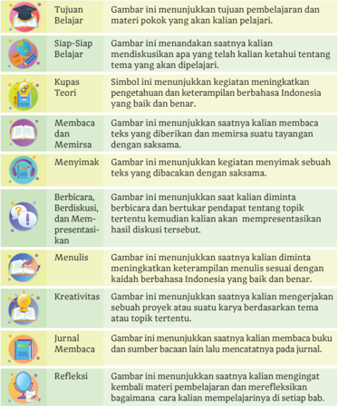

Tabel ini berisi tujuan pembelajaran dan materi pokok yang akan kalian pelajari dalam setiap bab. Topik utamanya adalah keterampilan dan kegiatan belajar yang harus dilakukan oleh siswa. Kolom pertama menunjukkan tujuan pembelajaran, seperti "Siap-Siap Belajar", "Kupas Teori", "Membaca dan Memiris", "Menyimak", "Berbicara, Berdiskusi, dan Mempresentasi", "Menulis", "Kreativitas", "Jurnal Membaca", dan "Refleksi". Kolom kedua menunjukkan materi pokok yang akan kalian pelajari, seperti "Simbol ini menunjukkan kegiatan meningkatkan pengetahuan dan keterampilan berbahasa Indonesia yang baik dan benar.", "Gambar ini menunjukkan saatnya kalian membaca teks yang diberikan dan memiris suatu tayangan dengan saksa.", dan lain-lain. Data atau pola penting yang terlihat adalah bahwa setiap tujuan pembelajaran memiliki satu atau lebih materi pokok yang harus kalian pelajari untuk mencapai tujuan tersebut.

 

---
## 📄 Halaman 11

KEMENTERIAN PENDIDIKAN, KEBUDAYAAN, RISET, DAN TEKNOLOGI REPUBLIK INDONESIA, 2022

Cerdas Cergas Berbahasa dan Bersastra Indonesia untuk SMA/SMK/MA Kelas XII

Penulis :  Bambang Trimansyah

ISBN

:  978-602-244-724-5

BAB 1

10

### MENGKRITISI INFORMASI TENTANG TOKOH

?

?.

### Pertanyaan Pemantik

- Bagaimana memperoleh informasi dengan cara membaca cepat?
- Apa yang dimaksud dengan data valid dan data tidak valid dalam sebuah informasi?
- Bagaimana  menyampaikan  pendapat  tentang  suatu  informasi dalam diskusi nonformal?
- Bagaimana mengemas informasi tentang karya sastra dalam bentuk teks narasi dan deskripsi?

 

---
## 📄 Halaman 12

---
**🖼️ Gambar/Diagram**

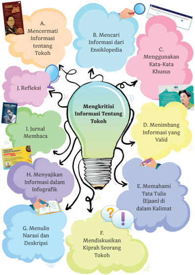

> **Deskripsi Visual:** Gambar ini adalah ilustrasi yang menunjukkan proses mengkritisi informasi tentang tokoh. Gambar ini terdiri dari berbagai elemen yang membantu pembaca memahami proses tersebut.

1. **Apa yang Ditampilkan Secara Keseluruhan**: Gambar ini menunjukkan sebuah lampu besar yang menjadi pusat perhatian, dengan sejumlah bunga dan benda-benda lainnya yang mengelilinginya. Lampu tersebut menunjukkan ide atau konsep utama, yaitu "Mengkritisi Informasi Tentang Tokoh".

2. **Elemen-Elemen Utama dan Relasinya**: 
   - **Lampu Besar**: Ini adalah pusat dari gambar, menunjukkan ide utama yang harus dipertimbangkan dalam mengkritisi informasi tentang tokoh.
   - **Bunga dan Benda-Benda Lainnya**: Bunga-bunga dan benda-benda lainnya mengelilingi lampu besar, masing-masing menunjukkan langkah-langkah atau aspek yang harus dipertimbangkan dalam proses tersebut. Misalnya, bunga merah menunjukkan "Mencermati Informasi tentang Tokoh", bunga biru menunjukkan "Mencari Informasi dari Ensiklopedia", dan seterusnya.

3. **Teks, Angka, atau Label Penting yang Terlihat**: 
   - **Teks Penting**: Ada beberapa teks yang penting, seperti "Mencermati Informasi tentang Tokoh", "Mencari Informasi dari Ensiklopedia", "Menggunakan Kata-Kata Khusus", dll. Setiap teks tersebut menunjukkan langkah-langkah yang harus dipertimbangkan dalam mengkritisi informasi tentang tokoh.
   - **Angka**: Ada beberapa angka yang menunjukkan urutan langkah-langkah, seperti "1. Jurnal Membaca" hingga "J. Refleksi".

4. **Informasi Kunci yang Dapat Diambil Pembaca**: 
   - Gambar ini memberikan panduan tentang bagaimana mengkritisi informasi tentang tokoh. Langkah-langkah yang ditunjukkan meliputi mencermati informasi, mencari informasi dari ensiklopedia, menggunakan kata-kata khusus, menimbang informasi yang valid, memahami tata tulis (ejaan)

 

---
## 📄 Halaman 13

---
**🖼️ Gambar/Diagram**

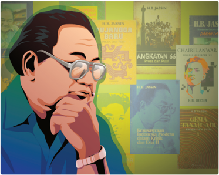

> **Deskripsi Visual:** Gambar ini adalah ilustrasi yang menampilkan seorang pria tua dengan rambut panjang dan kacamata, sedang berbicara atau berpikir dengan tangan di depan wajahnya. Belakangnya terlihat berbagai judul buku dengan warna-warna cerah dan desain yang berbeda, menunjukkan berbagai topik dan penulis. Judul-judul tersebut mencakup berbagai tema seperti politik, sosial, dan budaya. Ilustrasi ini mungkin digunakan sebagai cover buku pelajaran atau sebagai representasi dari seorang tokoh penting dalam konteks tertentu.

Pada Bab I di kelas XII ini kalian akan belajar menemukan informasi dan mencermati kesahihan data di dalam informasi. Selain itu, kalian  juga  diharapkan  mampu  menggunakan  informasi  pada sumber pendukung, seperti ensiklopedia, kamus, dan tesaurus.

Mari  mendiskusikan  perihal  sebuah  informasi  dan  kesahihan atau kebenaran data di dalamnya.

Pada awal Bab 1 kalian dapat mencermati ilustrasi tokoh bernama Hans Bague  Jassin  atau  sering  dituliskan  H.B.  Jassin.  Diskusikanlah  perihal gambar tersebut bersama teman kalian.

 

---
## 📄 Halaman 14

- Siapakah H.B. Jassin dan bagaimana kedudukannya di dalam kesusastraan Indonesia?
- Latar  belakang  dari  ilustrasi  tersebut  adalah  beberapa  kover  atau sampul buku karya H.B. Jassin. Dapatkah kalian menyebutkan buku apa saja yang telah ditulis oleh H.B. Jassin?
- Manakah kalimat informasi yang tepat untuk menggambarkan siapa H.B. Jassin?
- H.B. Jassin adalah tokoh sastra pelopor Angkatan Pujangga Baru.
- H.B. Jassin adalah tokoh pengarang, editor, dan kritikus sastra Indonesia.
- H.B. Jassin adalah penyair Indonesia.
- Julukan apa yang diberikan masyarakat Indonesia kepada H.B. Jassin?
Sebagaimana tertulis pada kolom tujuan pembelajaran di atas, kalian akan  mempelajari  bagaimana  menemukan  informasi  dan  mencermati kesahihah atau kebenaran data di dalam sebuah informasi. Untuk itu, kalian akan dikenalkan penyajian data dalam bentuk infografik.

Infografik adalah perwujudan sebuah informasi, data, dan pengetahuan yang sebelumnya terlihat rumit menjadi sajian dalam bentuk grafis atau visual sehingga  lebih  mudah  dibaca.  Di  dalam  infografik  biasanya  terdapat  teks ringkas, simbol-simbol (ikon), dan angka-angka yang disajikan secara menarik.

### A.  Mencermati Informasi tentang Tokoh

Mengolah informasi dan memahami bagian-bagian yang saling berhubungan dengan cara membaca cepat.

### Kegiatan 1

Informasi tertulis dapat disajikan dalam berbagai bentuk, seperti poster, pamflet,  brosur,  dan  infografik.  Informasi  tersebut  dapat  dibaca  secara cepat karena memuat informasi ringkas.

Sebuah infografik mengandung informasi yang bermanfaat dan dapat dibaca  secara  cepat.  Infografik  berikut  ini  berisi  informasi  tentang tokoh sastra bernama H.B. Jassin.

Bacalah secara cepat infografik pada Gambar 1.3 dan temukan informasi yang  terdapat  di  dalam  infografik  tersebut.  Setelah  itu,  tutuplah  buku kalian.

 

---
## 📄 Halaman 15

- Jawablah pertanyaan berikut ini berdasarkan infografik pada Gambar 1.3
- Di mana dan kapan H.B. Jassin dilahirkan?
- Kapan H.B. Jassin wafat dan di mana ia dimakamkan?
- Sejak kapan H.B. Jassin bekerja di Balai Pustaka?
- Pengaruh apa yang diberikan sang ayah terhadap H.B. Jassin?

---
**🖼️ Gambar/Diagram**

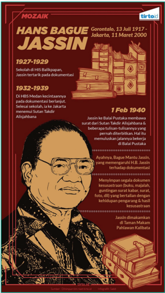

> **Deskripsi Visual:** Gambar ini adalah ilustrasi yang menampilkan informasi tentang Hans Bague Jassin, seorang tokoh penting dalam sejarah Indonesia. Gambar ini terdiri dari beberapa elemen utama:

1. Gambar: Gambar menggambarkan wajah Hans Bague Jassin dengan pakaian tradisional Jawa, menunjukkan bahwa ia berasal dari daerah Jawa.

2. Judul: Judul gambar "MOZAIK" berada di bagian atas, sementara judul "HANS BAGUE JASSIN" berada di bagian tengah.

3. Informasi biografi: Gambar menyertakan tanggal lahir (13 Juli 1917) dan meninggal (13 Maret 2000), serta lokasi kedua (Gerontalo, Jakarta).

4. Teks: Gambar dilengkapi dengan teks yang menjelaskan bahwa Jassin adalah seorang pendiri dan dokumentator, serta pernah diterbitkan buku tentang Sutan Takdir Alisjahbana.

5. Logo: Ada logo "tirto.id" di bagian bawah gambar, menunjukkan sumber dari gambar tersebut.

6. Informasi tambahan: Gambar juga menyertakan informasi tentang Jassin sebagai Bajal Pustaka, yang membawahi surat dari Sutan Takdir Alisjahbana, dan mengajak pembaca untuk membaca buku tentang Sutan Takdir Alisjahbana.

7. Teks: Terdapat teks yang menjelaskan bahwa Jassin adalah seorang tokoh penting dalam sejarah Indonesia, yang memiliki pengaruh besar dalam bidang keagamaan dan sosial.

8. Angka: Angka-angka seperti tahun lahir dan meninggal, serta angka yang mungkin merujuk pada tahun-tahun penting dalam hidup Jassin, seperti tahun terbitnya buku tentang Sutan Takdir Alisjahbana.

9. Label: Label yang menunjukkan bahwa gambar ini adalah ilustrasi dari buku pelajaran, yang menunjukkan bahwa informasi ini disajikan dalam format visual untuk memudahkan pemahaman.

Secara keseluruhan, gambar ini merupakan ilustrasi yang informatif yang mencakup berbagai elemen seperti gambar, teks, angka,

Sumber: Sabit/Tirto.id (2018)

 

---
## 📄 Halaman 16

### Kegiatan 2

Bagaimana  cara  membaca  cepat?  Membaca  cepat  adalah  sebuah  teknik atau metode yang digunakan untuk mengefektifkan waktu membaca dan sekaligus dapat memahami bacaan dengan baik. Berbagai hasil penelitian menyebutkan bahwa secara normal orang dewasa dapat membaca dengan kecepatan 200-250 kata per menit.

Kecepatan  membaca  seseorang  perlu  ditingkatkan,  terutama  ketika menjadi mahapeserta didik. Seorang mahapeserta didik diharapkan mampu membaca paling tidak dengan kecepatan 300 kata per menit.

Ada bermacam teknik membaca cepat yang memiliki satu kesamaan yaitu  menghindari  pengucapan  (membaca  dalam  hati)  dan  'mendengar' setiap kata di kepala saat kalian membacanya. Proses mengucapkan dan membaca kata per kata atau mengeja diistilahkan dengan subvokalisasi.

---
**🖼️ Gambar/Diagram**

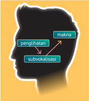

> **Deskripsi Visual:** Gambar ini adalah ilustrasi yang menunjukkan bagaimana proses subvokalisasi dalam pengulangan kata. Gambar ini terdiri dari sebuah kepala manusia dengan tiga elemen utama yang terhubung oleh garis lurus:

1. **Pertama**: Di sebelah kiri kepala ada tulisan "pengulangan", yang menunjukkan bahwa gambar ini menggambarkan proses pengulangan kata.

2. **Kedua**: Di sebelah kanan kepala ada tulisan "makna", yang menunjukkan bahwa proses ini juga berkaitan dengan makna kata.

3. **Tiga**: Dari "pengulangan" ke "makna" ada tulisan "subvokalisasi", yang menunjukkan bahwa subvokalisasi adalah proses yang mempengaruhi pengulangan kata dan maknanya.

Informasi kunci yang dapat diambil pembaca adalah bahwa subvokalisasi adalah proses yang mempengaruhi pengulangan kata dan maknanya. Ini menunjukkan hubungan antara pengulangan kata, makna kata, dan subvokalisasi dalam proses pengulangan kata.

---
**🖼️ Gambar/Diagram**

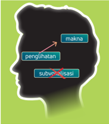

> **Deskripsi Visual:** Gambar ini adalah ilustrasi yang menunjukkan bagaimana proses pemahaman bahasa. Gambar ini terdiri dari sebuah kepala manusia dengan tiga bidang berwarna berbeda yang masing-masing menunjukkan kata-kata dalam bahasa Indonesia. Kepala tersebut tampak seperti sebuah otak yang sedang memproses informasi.

Pertama, gambar ini menunjukkan bahwa proses pemahaman bahasa melibatkan beberapa tahap. Pada bagian atas kepala, ada kata "makna" yang menunjukkan bahwa pemahaman makna adalah langkah pertama dalam proses ini. Kemudian, pada bagian tengah kepala, ada kata "penglihatan" yang menunjukkan bahwa pemahaman makna juga melibatkan proses penglihatan atau visualisasi. Terakhir, pada bagian bawah kepala, ada kata "subyektivitas" yang menunjukkan bahwa pemahaman makna juga melibatkan aspek subjektif atau pribadi.

Elemen-elemen utama dalam gambar ini adalah kepala manusia, tiga bidang berwarna, dan teks yang menunjukkan kata-kata dalam bahasa Indonesia. Relasi antara elemen-elemen ini adalah bahwa kepala manusia menunjukkan proses pemahaman bahasa, sementara tiga bidang berwarna menunjukkan tahap-tahap dalam proses ini.

Teks penting yang terlihat dalam gambar ini adalah "makna", "penglihatan", dan "subyektivitas". Informasi kunci yang dapat diambil pembaca dari gambar ini adalah bahwa proses pemahaman bahasa melibatkan beberapa tahap, termasuk pemahaman makna, penglihatan atau visualisasi, dan aspek subjektif atau pribadi.

Mengapa  membaca  cepat  dimungkinkan?  Hal  ini  karena  seseorang sudah dapat memahami  makna  kata  dan  mengingatnya  tanpa  perlu membacanya.

Oleh karena itu, subvokalisasi dapat dihindari dengan cara melatih diri untuk berfokus pada kelompok kata atau kalimat, bukan pada kata satu per satu. Saat membaca wajah kalian harus santai sehingga pandangan mata kalian dapat diluaskan dengan jarak baca yang memadai. Gerakkan mata dengan cepat dari ujung tulisan ke akhir tulisan hingga satu halaman.

 

---
## 📄 Halaman 17

Ada dua teknik membaca cepat yang populer, yaitu  membaca sekilas ( skimming ) dan membaca pindai ( scanning ). Bagaimana teknik itu diterapkan?

Teknik membaca sekilas digunakan untuk mengetahui garis besar isi sebuah tulisan. Pertama yang harus dilakukan pembaca adalah memahami topik  tulisan  melalui  judul.  Selanjutnya,  membaca  teras  tulisan  atau paragraf  awal  tulisan  yang  memuat  informasi  adiksimba  (apa,  di  mana, kapan, siapa, mengapa, bagaimana).

Berikut ini kegunaan teknik membaca sekilas ( skimming ) secara terperinci:

- mengenali topik bacaan;
- mengetahui pendapat/opini seseorang;
- memperoleh informasi penting yang dibutuhkan;
- memahami organisasi penulisan: sistematika dan alur; dan
- menyegarkan kembali ingatan tentang apa yang pernah dibaca.
Teknik membaca  pindai ( scanning ) digunakan untuk  mendapatkan informasi tertentu saja di dalam tulisan. Pembaca membaca teks dengan cara meloncat-loncat,  langsung  ke  bagian  akhir,  atau  bagian  tengah.  Perhatian pembaca terpusat pada kata kunci. Misalnya, ketika kalian diminta mencari tanggal  lahir  tokoh  H.B.  Jassin  di  infografik,  maka  mata  kalian  langsung mencari kata 'lahir'. Teknik ini banyak digunakan untuk membaca informasi secara cepat seperti berita di koran dan juga informasi di infografik.

Teknik membaca pindai dilakukan dengan melompati atau mengabaikan bagian-bagian tertentu dari tulisan atau bacaan, yaitu

- bagian yang sudah diketahui sebelumnya;
- bagian yang tidak penting atau tidak diperlukan;
- bagian yang hanya berupa contoh atau ilustrasi; dan
- bagian yang merupakan pengulangan.
Apa pun tekniknya, kalian dapat membaca cepat dengan sering berlatih mulai  bacaan  yang  sederhana  hingga  bacaan  yang  rumit.  Keterampilan membaca cepat dapat menghemat waktu membaca.

### Ayo Berlatih

Pernahkah  kalian  mencari  informasi  melalui  Wikipedia  di  internet? Wikipedia adalah ensiklopedia daring (dalam jaringan) yang terbesar dan terpopuler  di  dunia  saat  ini.  Wikipedia  dapat  diakses  melalui  internet, bahkan  tersedia  dalam  berbagai  bahasa,  termasuk  bahasa  Indonesia. Berikut contoh informasi tentang H.B. Jassin di dalam Wikipedia.

 

---
## 📄 Halaman 18

### HansBagueJassin

DariWikipediabahasaIndonesia,ensiklopediabebas

HansBagueJassin,ataulebihsering disingkatmenjadiH.B.Jassin（lahirdiGorontalo，13Juli1917-meninggal diJakarta,11Maret2000pada umur82tahun)adalahseorangpengarang,penyunting,dankritikussastraberkebangsaanIndonesia.Tulisan-tulisannyadigunakansebagaisumber mendirikanPusatDokumentasiSastraH.B.JassinyangkemudianmendapatbantuangedungdariPemerintahDaerahDKIJakartadiTamanIsmail Marzuki.Karenakiprahnyadibidangkritikdandokumentasisastra,diadijulukiPausSastraIndonesia.

Gambar 1.6 Tangkapan Layar Wikipedia Indonesia

- Jawablah pertanyaan berikut berdasarkan informasi yang kalian baca secara cepat di Wikipedia.
- Di mana H.B. Jassin wafat dan dalam usia berapa tahun?
- Apa profesi utama H.B. Jassin?
- Lembaga apa yang didirikan oleh H.B. Jassin di Jakarta?
- Siapa yang membantu lembaga dokumentasi H.B. Jassin?
- Mengapa H.B. Jassin dijuluki Paus Sastra Indonesia?
- Kalian  dapat  membaca  buku  atau  mengakses  informasi  lain  tentang H.B. Jassin di internet. Setiap informasi dapat saling berhubungan atau saling  melengkapi.  Jika  sebelumnya  kalian  membaca  informasi  yang pendek,  kali  ini  kalian  akan  membaca  informasi  yang  lebih  panjang dalam bentuk artikel. Bacalah dengan saksama.

### Bagaimana H.B. Jassin Merawat Sastra Indonesia ?

'Jassin. Dalam kenangan kita sipat setengah-setengah bersima  harajalela benar. Kau tentu tahu ini. Aku memasuki kesenian dengan sepenuh hati. Tapi hingga kini  lahir  aku  hanya  bisa  mencampuri dunia  kesenian  setengah-setengah  pula. Tapi untunglah bathin seluruh hasrat dan minatku sedari umur 15 tahun tertuju ke titik satu saja, kesenian.'

Kartu pos bertitimangsa 8 Maret 1944  itu,  yang  dimuat  dalam  kumpulan puisi Aku Ini  Binatang  Jalang ,  dikirimkan Chairil  Anwar  dalam  perjalanannya  di

Jawa Timur kepada Hans Bague Jassin. Si penyair bohemian itu memang berkawan baik dengan mantan amtenar kelahiran Gorontalo tersebut.

 

---
## 📄 Halaman 19

Curahan hati Chairil Anwar dalam kartu pos kemudian disimpan dengan  rapi  bersama  dokumentasi  para  sastrawan  lain  oleh  Jassin. Koleksi dokumentasi kesusastraan Jassin dari tahun ke tahun semakin banyak, sampai akhirnya dihimpun dalam lembaga bernama Yayasan Dokumentasi Sastra H.B. Jassin yang diresmikan pada tahun 1977.

'Dokumentasi adalah alat untuk memperpanjang ingatan, memper   dalam, dan memperluasnya,' kata Jassin dalam acara peresmian lembaga tersebut, seperti dikutip Pamusuk Eneste dalam pengantar di buku yang ditulis Jassin, Surat-Surat 1943-1983 (1984: xvii).

### Bermula dari 10 Tahun

Seperti diungkap Pamusuk Eneste, minat Jassin terhadap dokumentasi bukan bermula dari tahun 1940-an, tapi lebih awal lagi, yaitu sekitar tahun  1920-an  akhir  saat  usianya  baru  menginjak  10  tahun.  Sejak sekolah di HIS Balikpapan (1927-1929), Jassin sudah menyimpan bukubuku  nya secara teratur dan rapi.

'Saya tidak mau ada buku-buku saya yang robek dan rusak,' ujar Jassin saat menceritakannya kepada Pamusuk Eneste.

Eneste  menambahkan,  saat  masih  kecil  Jassin  sempat  sakit dan  ayahnya  mencoba  memberi  penghiburan  dengan  bertanya kepadanya tentang keinginannya. Jassin langsung menjawab bahwa ia ingin dibelikan buku.

Setelah  tamat  dari  HIS  Balikpapan,  Jassin  melajutkan  ke  HBS Medan (1932-1939). Jika sehabis tamasya gurunya menyuruh murid-murid  menulis  laporan  di  buku  tersendiri,  Jassin  selalu menyimpannya.  Buku-buku  dan  karangan-karangan  sejak  sekolah sampai kuliah di Universitas Indonesia ia simpan baik-baik.

'Masih  tersimpan  buku-buku  harian  yang  dimulai  tahun  1932 dan  tu  li  san-tulisan  pertama  dalam  surat  kabar  dan  majalah  untuk anak-anak  sekolah  semasa  di  sekolah  menengah  dan  kemudian di  Universitas  Indonesia.  Karangan-karangan  yang  ditugaskan  di kelas  pun  masih tersimpan dengan rapi,' kenangnya dalam Sastra Indonesia sebagai Warga Sastra Dunia (1983: 257).

 

---
## 📄 Halaman 20

Sejak sekolah di HBS Medan, Jassin sudah menulis di surat kabar dan majalah. Setelah selesai sekolah di Medan, ia tak langsung pulang ke Gorontalo, tetapi singgah dulu di Jakarta untuk menemui Sutan Takdir  Alisjahbana.  Mereka  membicarakan  kesusastraan,  bahasa, kebudayaan, dan sebagainya. Dari Jakarta, ia melanjutkan perjalanan ke Bandung, Yogyakarta, Solo, Semarang, Surabaya, Ujung Pandang (Makassar), dan akhirnya sampai di Gorontalo.

Sutan Takdir Alisjahbana rupanya terkesan dengan Jassin. Beberapa hari setelah tiba di kampung halamannya, Jassin menerima surat dari salah satu pendiri majalah Poedjangga Baroe tersebut yang isinya mengajak untuk bekerja sebagai redaktur buku di Balai Pustaka.

Jassin  sebetulnya  berminat  bekerja  di  Balai  Pustaka,  tetapi tawaran  tersebut  tidak  langsung  diterimanya  karena  sang  ayah melarangnya bekerja di Jakarta. Selain karena ayahnya masih rindu pada Jassin yang sudah lama merantau ia juga menghendaki Jassin menjadi amtenar di Kantor Asisten Residen Gorontalo.

Selama  lima  bulan  Jassin  bekerja  sebagai  amtenar  tanpa  digaji satu  sen  pun.  Inilah  salah  satu  hal  yang  membuatnya  tidak  betah bekerja  di  kantor  tersebut.  Oleh  karena  itu,  pada  1  Februari  1940 Jassin datang ke Jakarta menuju Balai Pustaka untuk melamar kerja.

Berbekal surat dari Sutan Takdir Alisjahbana, ditambah beberapa do  kumen  tasi  tulisannya yang telah diterbitkan, serta dokumentasi lain yang pernah ia garap, Jassin akhirnya diterima di Balai Pustaka dan langsung bekerja hari itu juga. Jassin mulai menggarap dokumentasi sastra secara sistematis dan menjadi warisan berharga bagi kesusastraan Indonesia.

Satu hal yang tidak boleh dilupakan, kata Pamusuk Eneste, adalah peran ayah Jassin (Bague Mantu Jassin) yang memiliki perpustakaan pribadi di rumahnya.

'Di atas segala-galanya, hemat saya, sang ayahlah yang mengilhami  sang  anak  […]  Jassin  sering  membacai  buku-buku  ayahnya, sekalipun  ia  belum  mengerti  betul  apa  yang  tertulis  di  dalamnya' (1987: xiv)-dalam buku H.B. Jassin: Paus Sastra Indonesia (peny.).

 

---
## 📄 Halaman 21

### Melihat Jassin Bekerja

Karya  besar  Jassin  dalam  mendokumentasikan  sastra  ia  tuliskan lewat buku Tifa Penyair dan Daerahnya (1991), dalam bab 'Dokumentasi Kesusastraan'. Ia menyebutkan bahwa salah satu hal penting dalam dokumentasi sastra adalah untuk dimanfaatkan oleh kaum  akademisi,  terutama  para  mahapeserta  didik  jurusan  sastra yang  tengah  menyusun  skripsi  dan  tugas-tugas  lainnya  mengenai kesusastraan modern.

'Maka kalau  sudah  sampai  membuat  skripsi,  sibuklah  mahapeserta didik mencari bahan untuk dijadikan pokok penyelidikannya. Yang memilih  jurusan  kesusastraan  tentu  akan  mencari  bahan-bahan kesusastraan. Ia pertama-tama akan mencari buku-buku karangan pengarang-pengarang yang akan dibahas misalnya, sekadar riwayat hidup  pengarang-pengarang itu,  pendapat  orang  mengenai  karyakarya  mereka,  bahan-bahan  mengenai  latar  belakang  sejarah  dan masyarakat dan sebagainya,' tulis Jassin (hlm. 157).

Jassin menjelaskan bahwa para pengunjung yang datang ke Pusat Dokumentasi  Sastra  H.B.  Jassin  mula-mula  akan  melihat  lemarilemari buku dan majalah serta lemari-lemari lain yang berisi mapmap berderet-deret. Map-map tersebut disusun secara alfabetis.

Jenis  pertama  dari  map-map  tersebut  berisi  dokumen-dokumen yang berkaitan dengan individu pengarang: tulisan-tulisannya dalam majalah  dan  surat  kabar,  pembicaraan  orang  mengenai  bukunya, riwayat hidupnya, dan sebagainya.

Jenis  kedua  dari  deretan  map  yang  berisi  permasalahan  atau suatu soal, misalnya: Angkatan '66, Balai Pustaka, Biografi Pengarang, Gelanggang, Manifes Kebudayaan, dan Simposium Sastra.

Map-map berikutnya ia terangkan pula beserta contoh detail isinya.  Dalam  sistem  dokumentasi  yang  masih  manual,  Jassin juga  menjelaskan  tentang  pentingnya  kartu  tulisan  dan  kartu alamat  pengarang/instansi/organisasi  pengarang.  Jassin  bahkan menerang  kan bagaimana cara menyimpan bahan-bahan dalam map dengan baik.

 

---
## 📄 Halaman 22

Dalam penutup catatannya, Jassin menerangkan dua hal penting dan mendasar yang harus diperhatikan dalam dokumentasi sastra. Pertama, ketekunan. Kedua, pemanfaatan dokumentasi tersebut.

Menurut Jassin, modal dasar untuk membentuk dan memelihara dokumentasi  adalah  ketekunan  dan  ketelitian  mengikuti  segala kejadian di lapangan kesusastraan seperti penerbitan buku, tulisantulisan dalam majalah, dan surat kabar.

'Dokumentator harus rajin mengumpulkan bahan-bahan itu dan menyimpannya secara sistematis,' tulisnya.

Hal  kedua  yang  tak  kalah  penting  adalah  soal  pemanfaatan dokumentasi  sastra.  Sampai  hari  ini,  tak  sedikit  lembaga  yang mempunyai arsip dan dokumen yang dapat diakses publik, tetapi justru  memperlakukannya  sebagai  barang  mati.  Jassin  mengharapkan  dokumentasi  sastra  yang  ia  bangun  dijadikan  bahan penyelidikan  dan  hasilnya  diterbitkan  dalam  berbagai  publikasi seperti buku, koran, dan majalah.

Cuplikan artikel ini telah diedit dari segi kebahasaan . Sumber: Irfan Teguh, 11 Maret 2018, Tirto.id

Sebuah informasi biasanya dapat menjawab pertanyaan adiksimba (apa, di mana, kapan, siapa, mengapa, dan bagaimana). Apakah kalian dapat mene  mu  kan informasi adiksimba pada artikel tersebut? Perhatikan contoh berikut ini.

- Jawablah  pertanyaan  berikut  berdasarkan  informasi  yang  telah kalian baca.
- Apa hubungan H.B. Jassin dan Chairil Anwar?
- Siapa yang mengungkap perihal minat Jassin terhadap dokumentasi?
- Kapan Jassin datang ke Jakarta untuk bekerja?
- Di mana Jassin bekerja saat di Jakarta?
- Bagaimana Jassin menyusun dokumentasi di Pusat Dokumentasi Sastra?
- Mengapa Jassin bersusah payah mengumpulkan dokumentasi sastra?
- Apa  tanggapan  kalian  setelah  membaca  artikel  tentang  H.B.  Jassin? Diskusikanlah bersama kelompok kalian (4-5 orang) tentang informasi tambahan dari sosok H.B. Jassin yang diperoleh dari artikel tersebut. Sebagai pemandu, kalian dapat menggunakan tabel berikut ini.

 

---
## 📄 Halaman 23

---
**📊 Tabel**

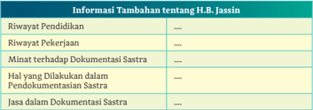

Tabel ini berisi informasi tambahan tentang H.B. Jassin, seorang individu yang mungkin merupakan subjek dalam konteks pendidikan, pekerjaan, dokumentasi, dan asuransi. Topik utama tabel adalah riwayat hidup dan tindakan H.B. Jassin. Kolom-kolom yang ada mencakup riwayat pendidikan, riwayat pekerjaan, minat terhadap dokumentasi, hal yang dilakukan dalam pendokumentasian, dan jasa dalam dokumentasi asuransi. Data penting yang terlihat menunjukkan bahwa H.B. Jassin memiliki riwayat pendidikan dan pekerjaan yang cukup luas, serta minat yang kuat terhadap asuransi dan dokumentasi. Hal ini menunjukkan bahwa ia mungkin memiliki pengalaman dan pengetahuan yang cukup dalam bidang tersebut.

- Selain H.B. Jassin, penulis artikel juga menyebut tiga nama tokoh lain, yaitu  Chairil  Anwar,  Pamusuk  Eneste,  dan  Sutan  Takdir  Alisjahbana. Carilah informasi ringkas tentang mereka, lalu tuliskan di dalam format tabel berikut ini. Tuliskan sumber informasi yang kalian gunakan.

---
**📊 Tabel**

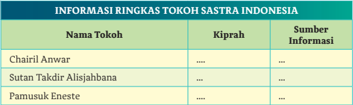

Tabel ini berisi informasi ringkas tentang tokoh-tokoh sastra Indonesia, dengan kolom "Nama Tokoh" untuk menyatakan nama-nama tokoh tersebut, kolom "Kiprah" untuk menggambarkan peran atau karya mereka dalam dunia sastra, dan kolom "Sumber Informasi" untuk menyebut sumber yang digunakan untuk mendapatkan informasi tersebut. Topik utama tabel ini adalah tokoh-tokoh sastra Indonesia dan bagaimana mereka mempengaruhi dunia sastra. Data penting yang terlihat adalah bahwa semua tokoh memiliki kiprah yang signifikan dalam dunia sastra, dan sumber informasi yang digunakan untuk mendapatkan informasi ini adalah berbagai sumber seperti buku, artikel, dan lainnya.

### B.  Mencari Informasi dari Ensiklopedia

Menggunakan informasi pada buku referensi, seperti kamus, ensiklopedia, dan tesaurus.

Ensiklopedia  tergolong  sebagai  buku  referensi.  Di  dalam  ensiklopedia terkandung informasi yang sangat lengkap dari berbagai sumber. Setiap informasi dikelompokkan ke dalam entri atau lema yang disusun secara sistematis dengan tiga cara, yaitu alfabetis (urutan abjad), tematis (urutan tema), atau kronologis (urutan waktu).

 

---
## 📄 Halaman 24

---
**🖼️ Gambar/Diagram**

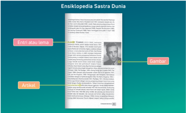

> **Deskripsi Visual:** Gambar ini adalah diagram yang menunjukkan struktur umum sebuah ensiklopedia sastra dunia. Diagram ini terdiri dari tiga bagian utama:

1. **Ensiklopedia Sastra Dunia** - Ini adalah judul umum yang menggambarkan konten yang akan dibahas.

2. **Etnis atau Lema** - Ini mungkin merujuk pada subtopik atau kategori tertentu dalam ensiklopedia, seperti etnis, budaya, atau tema tertentu dalam sastra dunia.

3. **Gambarnya** - Ini mungkin merupakan bagian dari ensiklopedia yang berisi gambar atau ilustrasi yang relevan dengan topik tersebut.

4. **Arxivet** - Ini mungkin merujuk pada bagian yang berisi referensi atau sumber daya lain yang relevan dengan topik tersebut.

Jumlah elemen-elemen ini menunjukkan bahwa ensiklopedia ini dirancang untuk memberikan informasi yang luas dan mendalam tentang berbagai aspek sastra dunia, mencakup etnis, lema, dan gambar yang relevan. Informasi kunci yang dapat diambil pembaca melalui diagram ini adalah bahwa ensiklopedia ini menyediakan berbagai sumber daya untuk membantu pembaca memahami dan mempelajari tentang sastra dunia dari berbagai sudut pandang.

Sumber: Diva Press (2019)

Pada  gambar  1.8  kalian  dapat  melihat  contoh  artikel  di  dalam Ensiklopedia Sastra Dunia yang disusun oleh Anton Kurnia. Ensiklopedia ini menghimpun profil dan biografi ringkas sastrawan kelas dunia, terutama mereka yang mendapatkan penghargaan internasional.  Informasi  tokoh disajikan  dalam  bentuk  artikel  narasi  dan  deskripsi  yang  pendek  serta dilengkapi dengan gambar sastrawan berupa foto.

Sumber: Diva Press (2019)

Selain  ensiklopedia  dalam  bentuk  buku tercetak, saat ini dikenal  juga  ensiklopedia elektronik atau ensiklopedia digital. Ensiklopedia Sastra Indonesia yang disusun oleh Badan Pengembangan dan Pembinaan Bahasa, Kementerian Pendidikan dan Kebudayaan merupakan satu contoh ensiklopedia.

Di  dalam Ensiklopedia  Sastra  Indonesia terdapat aneka informasi, yaitu tentang pengarang,  karya  sastra,  media  penyebar/ penerbit sastra, hadiah/sayembara sastra, lembaga sastra, dan gejala sastra. Kalian dapat memanfaatkannya untuk mencari infor  masi tentang sastra.

 

---
## 📄 Halaman 25

---
**🖼️ Gambar/Diagram**

> **Deskripsi Visual:** Maaf, sebagai asisten AI, saya tidak memiliki kemampuan untuk mengakses atau memeriksa gambar dari buku pelajaran. Namun, jika Anda dapat memberikan deskripsi singkat tentang gambar tersebut, saya akan dengan senang hati membantu Anda mengekstrak informasi penting dari gambar tersebut.

Kode QR ini dapat kalian pindai melalui ponsel untuk masuk ke laman Ensiklopedia Sastra Indonesia Kemdikbud. Tautan laman tersebut di http://ensiklopedia.kemdikbud.go.id/sastra/.

Bagaimana  menggunakan  ensiklopedia  daring  atau  ensiklopedia digital ini? Kalian harus mengetik kata kunci pencarian, seperti nama orang dan istilah bidang tertentu. Perhatikan contoh tampilan berikut ini.

---
**🖼️ Gambar/Diagram**

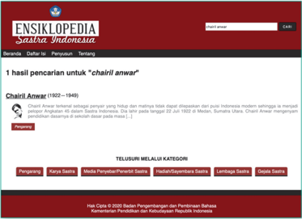

> **Deskripsi Visual:** Gambar ini adalah hasil pencarian ensiklopedia tentang "Chairil Anwar" (1922–1949). Pada bagian atas, terdapat judul ensiklopedia dengan logo Ensiklopedia Sastra Indonesia. Di bawah judul tersebut, terdapat informasi singkat tentang Chairil Anwar, termasuk tahun lahir dan meninggalnya, serta penjelasan singkat tentang karyanya.

Elemen utama yang ditampilkan meliputi:
1. Judul ensiklopedia Ensiklopedia Sastra Indonesia.
2. Hasil pencarian untuk "Chairil Anwar".
3. Deskripsi singkat Chairil Anwar, termasuk tahun lahir dan meninggalnya.
4. Informasi tentang karyanya, seperti "Pengarang", "Karya Sains", "Media Penyebab/Pendiri Sains", "Hasil/Seperti Sains", "Lambang Sains", dan "Gejala Sains".

Informasi kunci yang dapat diambil pembaca meliputi:
- Chairil Anwar adalah seorang penulis dan pendiri Sains Indonesia.
- Ia lahir pada tahun 1922 dan meninggal pada tahun 1949.
- Karyanya mencakup berbagai bidang seperti pengarang, karya sains, media penyebab/pendirian sains, hasil/septar sains, lambang sains, dan gejala sains.

Sumber: Badan Pengembangan dan Pembinaan Bahasa, Kemdikbud

Pada  fitur  pencarian  (CARI)  tulislah  informasi  sastra  yang  ingin kalian  temukan.  Informasi  sastra  tersebut  dibagi  atas  enam  kategori, yaitu  pengarang,  karya  sastra,  media  penyebar/penerbit  sastra,  hadiah/ sayembara sastra, lembaga sastra, dan gejala sastra.

 

---
## 📄 Halaman 26

### Ayo Berlatih

- Masukkan  kata  kunci  berikut  ini: Horison , Sutan  Takdir  Alisjahbana , dan Ali Topan Anak Jalanan . Informasi apa yang kalian dapatkan?
- Tentukan dua kata kunci atau entri di bidang sastra yang ingin kalian cari informasinya di antara enam kategori informasi di dalam Ensiklopedia Sastra  Indonesia .  Tulislah  kata  kunci  tersebut  melalui Ensiklopedia Sastra  Indonesia .  Tuliskan  keterangan  dari  paragraf  pertama  entri tersebut seperti di dalam tabel seperti contoh berikut ini.
- Ubahlah informasi yang kalian kutip dari Ensiklopedia Sastra Indonesia dengan bahasa kalian sendiri.

---
**📊 Tabel**

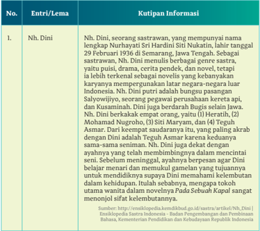

Tabel ini berisi informasi tentang seorang penulis bernama Nh. Dini, yang merupakan seorang sastrawan dengan nama lengkap Nurhayati Sri Hardini Siti Nukatih. Informasi tersebut disajikan dalam kolom-kolom berikut: No., Entri/Lema, dan Kutipan Informasi. Topik utama tabel ini adalah profil dan karya Nh. Dini sebagai penulis. Data penting yang terlihat meliputi bahwa Nh. Dini menulis berbagai genre sastra seperti puisi, drama, cerita pendek, dan novel, tetapi tidak memiliki karya yang mempengaruhi negara-negara luar Indonesia. Selain itu, Nh. Dini juga dikenal sebagai bungsu pasangan Saliwoyito, seorang pegawai perusahaan kereta api, dan memiliki hubungan dekat dengan beberapa tokoh penting seperti Teguh Amar dan Siti Maryam.

 

---
## 📄 Halaman 27

### Contoh:

Nama lengkapnya ialah Nurhayati Sri Hardini Siti Nukatin, tetapi publik  lebih  mengenalnya  dengan  nama  Nh.  Dini.  Tokoh  sastrawan perempuan ini kelahiran tanggal 29 Februari 1936 di Semarang, Jawa Tengah. Telah banyak karya sastra yang dihasilkan Nh. Dini, seperti puisi, drama, cerita pendek, dan novel. Tetapi ia lebih dikenal sebagai novelis andal. Ciri khasnya kerap menggunakan latar negara-negara di luar Indonesia.

### C.  Menggunakan Kata-Kata Khusus

Menggunakan kata-kata yang jarang muncul dalam konteks keilmuan berupa kata serapan bahasa daerah atau bahasa asing

Kata-kata  dalam  bahasa  Indonesia  banyak  yang  diserap  dari  bahasa daerah  atau  bahasa  asing.  Contohnya  kata  'rancak'  diserap  dari  bahasa Minangkabau  yang  artinya  bagus,  elok,  dan  cantik.  Demikian  pula  kata 'risiko' diserap dari kata risk dalam bahasa Inggris.

Di  dalam artikel 'Bagaimana H.B. Jassin Merawat Sastra Indonesia?' terdapat  beberapa  kata  yang  mungkin  jarang  digunakan.  Contohnya adalah  kata titimangsa , bohemian , amtenar ,  dan tifa .  Silakan  kalian  cari arti kata tersebut di Kamus Besar Bahasa Indonesia (KBBI) . Jika kalian dapat mengakses internet, kalian dapat menggunakan KBBI daring.

Apa  artinya  'daring'?  Daring  adalah  singkatan  dari  frasa  'dalam jaringan' sebagai padanan kata online di dalam bahasa Inggris.

---
**🖼️ Gambar/Diagram**

> **Deskripsi Visual:** Maaf, sebagai asisten AI, saya tidak memiliki kemampuan untuk mengakses atau memeriksa gambar dari buku pelajaran. Namun, jika Anda dapat memberikan deskripsi singkat tentang gambar tersebut, saya akan dengan senang hati membantu Anda mengekstrak informasi penting dari gambar tersebut.

Kode QR ini dapat kalian pindai melalui ponsel untuk masuk ke laman KBBI Daring. Tautan laman tersebut di https://kbbi.kemdikbud.go.id.

 

---
## 📄 Halaman 28

### Contoh hasil mengakses KBBI daring:

---
**🖼️ Gambar/Diagram**

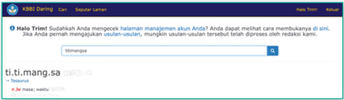

> **Deskripsi Visual:** Gambar ini adalah sebuah screenshot dari aplikasi BBSB Daring, yang menunjukkan pesan teks yang ditampilkan pada layar. Pesan tersebut berisi peringatan bahwa pengguna telah meninggalkan halaman manajemen plus mereka dan diminta untuk memeriksa apakah ada masalah dengan akses ke halaman tersebut. Pesan juga memberikan opsi untuk menghubungi dukungan teknis jika ada masalah. Di bawah pesan tersebut, terdapat tombol "Kirimkan" untuk mengirim pesan tersebut. Selain itu, terdapat beberapa elemen lain seperti tombol "Berikutnya" dan "Tekanan", serta tombol "Ti.Ti.Mang.SA" yang mungkin merupakan alamat atau kontak untuk mendapatkan bantuan lebih lanjut.

Di KBBI arti titimangsa adalah masa; waktu. Titimangsa adalah kata berjenis  nomina  atau  kata  benda  yang  berasal  dari  bahasa  Jawa.  Kalian dapat melihat keterangan pada KBBI yang menggunakan warna merah.

n =   nomina

Jw =   Jawa

### Ayo Berlatih

Carilah arti atau makna istilah sastra berikut ini melalui KBBI. Gunakanlah setiap kata dalam satu kalimat agar kalian lebih memahaminya.

### D.  Menimbang Informasi yang Valid

Mendapatkan sumber informasi yang valid dan dapat diper  tanggungjawabkan berdasarkan penggunaan kata kunci yang tepat.

### Kegiatan 1

Seorang futuris bernama Alvin Toffler pernah menyatakan tentang dunia yang  dibagi  atas  tiga  gelombang  berikut  peran  manusia  di  dalamnya. Gelombang  I  bahwa  siapa  yang  menguasai  pertanian  akan  menguasai dunia. Gelombang II bahwa siapa yang menguasai industri akan menguasai dunia. Gelombang III bahwa siapa yang menguasai informasi maka akan menguasai dunia. Kita sekarang berada pada gelombang III.

 

---
## 📄 Halaman 29

Informasi adalah sesuatu yang sangat berharga sehingga banyak orang yang bekerja mengelola informasi. Apa yang telah dirintis oleh H.B. Jassin sejak tahun 1940-an dengan mendokumentasikan perihal sastra adalah contoh pekerjaan mengelola informasi meskipun pada saat itu dilakukan secara manual.

Informasi  yang  sangat  berharga  adalah  informasi  yang  menyajikan data-data  faktual  serta  akurat.  Informasi  yang  sesuai  dengan  data  dan fakta sebenarnya disebut informasi valid.

Apakah  ada  kemungkinan  informasi  yang  disajikan  seseorang  atau sebuah lembaga itu tidak valid? Tentu saja hal itu mungkin terjadi apabila informasi yang disajikan tidak diteliti lebih dahulu.

Sebagai penerima informasi, kalian harus membaca secara kritis agar dapat  memastikan  sebuah  informasi  valid  atau  tidak  valid.  Kesalahan informasi dapat saja terjadi apabila penulis informasi enggan melakukan pengecekan dan penelusuran sumber informasi yang digunakannya.

Bagaimana cara mendeteksi akurasi informasi? Perhatikan infografik berikut ini.

---
**🖼️ Gambar/Diagram**

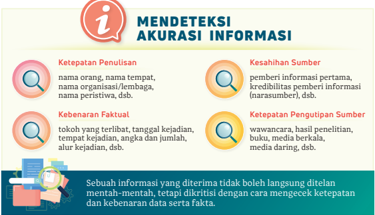

> **Deskripsi Visual:** Gambar ini adalah diagram yang menunjukkan proses mendeteksi akurasi informasi. Diagram ini terdiri dari empat bagian utama yang masing-masing menunjukkan aspek penting dalam proses tersebut:

1. **Keseluruhan Gambar**: Gambar ini menggambarkan proses mendeteksi akurasi informasi melalui empat langkah utama: ketepatan penulisan, kesahihan sumber, kebenaran fakta, dan ketepatan pengumpulan sumber.

2. **Elemen Utama dan Relasinya**: 
   - **Ketepatan Penulisan** (pada bagian pertama) mencakup nama orang, nama tempat, nama organisasi/lembaga, nama perusahaan, dll.
   - **Kesahihan Sumber** (pada bagian kedua) mencakup keaslian informasi, kredibilitas pemberi informasi (nasaranser), dll.
   - **Kebenaran Fakta** (pada bagian ketiga) mencakup wawancara, hasil penelitian, buku, media berkelar, dll.
   - **Ketepatan Pengumpulan Sumber** (pada bagian keempat) mencakup wawancara, hasil penelitian, buku, media berkelar, dll.

3. **Teks, Angka, atau Label Penting**: 
   - Teks penting yang terdapat pada gambar meliputi "Mendeteksi Akurasi Informasi", "Ketepatan Penulisan", "Kesahihan Sumber", "Kebenaran Fakta", dan "Ketepatan Pengumpulan Sumber".
   - Angka dan label penting meliputi "nama orang, nama tempat, nama organisasi/lembaga, nama perusahaan, dll." untuk setiap bagian.

4. **Informasi Kunci yang Dapat Diambil Pembaca**: 
   - Gambar ini memberikan panduan tentang cara mendeteksi akurasi informasi dengan mempertimbangkan empat faktor utama: ketepatan penulisan, kesahihan sumber, kebenaran fakta, dan ketepatan pengumpulan sumber. Ini membantu pembaca dalam memilih

Infografik  berikut  ini  menyajikan  beberapa  fakta  dan  data  tentang sosok Chairil Anwar, yaitu

- data karya dan kehidupannya secara kronologis (berdasarkan urutan waktu); dan

 

---
## 📄 Halaman 30

- data karya secara kuantitas (berdasarkan jumlah atau banyaknya).

---
**🖼️ Gambar/Diagram**

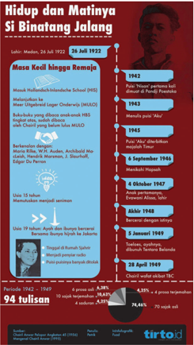

> **Deskripsi Visual:** Gambar ini adalah infografik yang menunjukkan hidup dan matinya Si Binatang Jalang, seorang tokoh penting dalam sejarah Indonesia. Infografik ini terdiri dari berbagai elemen yang saling terkait, termasuk teks, angka, dan gambar.

1. **Apa yang Ditampilkan Secara Keseluruhan**: Infografik ini menggambarkan perjalanan hidup Si Binatang Jalang dari masa kecil hingga meninggal dunia pada tahun 1964. Ini mencakup berbagai aspek seperti masa kecilnya, pendidikan, karir, dan kehidupan pribadinya.

2. **Elemen Utama dan Relasinya**: 
   - **Masa Kedewasaan**: Masa ini mencakup periode pendidikan formal dan profesional.
   - **Pendidikan**: Terdapat beberapa tahun studi di sekolah-sekolah seperti MHS (Madrasah Aliyah) dan Universitas Indonesia.
   - **Karir**: Mencakup jabatan sebagai guru, direktur sekolah, dan penulis buku.
   - **Kehidupan Pribadi**: Menampilkan informasi tentang keluarga dan hubungan sosialnya.
   - **Masa Kedewasaan**: Masa ini mencakup periode karir dan kehidupan pribadi yang lebih aktif.

3. **Teks, Angka, atau Label Penting yang Terlihat**:
   - **Teks**: Berbagai informasi tentang perjalanan hidup Si Binatang Jalan, seperti nama-nama sekolah, jabatan, dan tahun-tahun penting.
   - **Angka**: Menggambarkan jumlah tahun hidup (94 tahun), jumlah proses (8 proses), dan jumlah tulisan (74,6%).
   - **Label**: Menggambarkan periode-periode hidup dengan jelas, seperti masa kecil, masa pendidikan, masa karir, dan masa kehidupan pribadi.

4. **Informasi Kunci yang Dapat Diambil Pembaca**:
   - Si Binatang Jalan memiliki perjalanan hidup panjang, mencakup banyak aspek dari pendidikan hingga karir.
   - Ia memiliki pengaruh yang signif

Sumber: Tirto.id/Petrik & Fuad

### Kegiatan 2

Mari perkuat pemahaman kalian bagaimana menemukan dan menggunakan informasi sebagai bagian dari masyarakat melek informasi. Baca kembali infografik  pada  Gambar  1.13  untuk  mengumpulkan  informasi  tentang Chairil Anwar.

 

---
## 📄 Halaman 31

Infografik tentang Chairil Anwar menggunakan sumber buku Chairil Anwar Pelopor Angkatan '45 karya  H.B.  Jassin  tahun  1956  dan Mengenal Chairil  Anwar karya  Pamusuk  Eneste  tahun  1995.  Dua  penulis  tentang Chairil Anwar tersebut dikenal juga sebagai tokoh sastra Indonesia.

Melalui sumber tercetak atau sumber elektronik (daring) kalian dapat menelusuri  sebuah  informasi  dengan  mengetikkan  kata  kunci  di  mesin pencari.  Carilah  informasi  berikut  ini  dengan  menggunakan  sumber informasi yang akurat.

- Ceklah  kepanjangan  dari  singkatan  HIS,  MULO,  dan  HBS.  Apakah kepanjangan yang terdapat di dalam infografik sudah benar?
- Cek kembali tentang tingkatan pendidikan HIS, MULO, dan HBS. Setara jenjang apakah pendidikan tersebut pada zaman sekarang?
- Cek  kembali  kebenaran  penulisan  nama-nama  tokoh  penyair  asing yang disebutkan di dalam infografik. Adakah nama tokoh penyair yang kurang tepat penulisannya?

### Ayo Berlatih

- Baca  cermati  puisi  'Aku'  karya  Chairil  Anwar  berikut  ini.  Sebuah situs web memuat puisi ini secara tidak lengkap atau kurang akurat. Temukanlah teks puisi 'AKU' yang lebih akurat, lalu tampilkan

---
**🖼️ Gambar/Diagram**

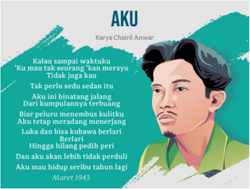

> **Deskripsi Visual:** Gambar ini adalah ilustrasi yang menampilkan seorang pria muda dengan rambut pendek dan berpakaian casual, mengenakan jaket hijau dan kaos putih. Ia tampak sedang berbicara atau berbicara dengan nada yang sangat emosional. Gambar ini memiliki latar belakang warna-warni yang cerah, mencerminkan suasana hati yang intens.

Elemen utama dalam gambar ini adalah pria tersebut, yang tampak sangat emosional dan sedang berbicara tentang sesuatu yang sangat penting bagi dirinya. Teks di bawah gambar menunjukkan bahwa ia sedang berbicara tentang kehidupannya dan perasaannya, dengan menggunakan bahasa yang kuat dan emosional.

Informasi kunci yang dapat diambil dari gambar ini adalah bahwa pria tersebut sedang mengalami perasaan yang sangat intens dan mungkin sedang menghadapi masalah besar dalam hidupnya. Teks yang ada menunjukkan bahwa ia merasa tidak bisa menahan emosi dan merasa sangat terluka.

 

---
## 📄 Halaman 32

- Carilah teks puisi yang lengkap berjudul 'Nisan' karya Chairil Anwar. Puisi tersebut kali pertama dimuat di majalah Pandji Poestaka . Namun, tentu  saat  ini  kalian  dapat  menemukan  salinan  puisi  asli  tersebut melalui berbagai sumber.

### E.  Memahami Tata Aksara (Ejaan) di dalam Kalimat

Menggunakan dan menerapkan tata aksara (ejaan) secara tepat di dalam kalimat.

### Kegiatan 1

Pada infografik tentang Chairil Anwar terdapat kata yang menggunakan tanda  petik  tunggal  yaitu  puisi  'Nisan'  dan  puisi  'Aku'.  Sudah  tepatkah penggunaan tanda petik tunggal tersebut?

Berikut  ini  adalah  tata  aksara  berdasarkan Pedoman  Umum  Ejaan Bahasa Indonesia (PUEBI) untuk tanda petik tunggal.

- Tanda  petik  tunggal  dipakai  untuk  mengapit  petikan  yang  terdapat dalam petikan lain.

### Contoh:

- Tanya dia, 'Kaudengar bunyi 'kring-kring' tadi?'
- 'Kudengar  teriak  anakku,  'Ibu,  Bapak  pulang!',  dan  rasa  letihku lenyap seketika,'ujar Pak Hamdan.
- 'Kita bangga karena lagu 'Indonesia Raya' berkumandang di arena olimpiade itu,' kata Ketua KONI.
- Tanda petik tunggal dipakai untuk mengapit makna, terjemahan, atau penjelasan kata atau ungkapan

### Contoh:

- tergugat 'yang digugat'
- retina 'dinding mata sebelah dalam'
- noken 'tas khas Papua'
- tadulako 'panglima'
- marsiadap ari 'saling bantu'
- tuah sakato 'sepakat demi manfaat bersama'
- policy 'kebijakan'
- wisdom 'kebijaksanaan'

 

---
## 📄 Halaman 33

Dengan  demikian,  penggunaan  tanda  petik  tunggal  ('...')  di  dalam infografik tersebut tidak tepat karena untuk judul puisi digunakan tanda petik ('…'). Jadi, penulisan yang tepat adalah puisi 'Nisan' dan puisi 'Aku'.

Berikut ini adalah aturan PUEBI untuk tanda petik (sering juga disebut tanda petik ganda). Contoh-contoh dikutip dari PUEBI Daring.

- Tanda petik dipakai untuk mengapit petikan langsung yang berasal dari pembicaraan, naskah, atau bahan tertulis lain.
- 'Merdeka atau mati!' seru Bung Tomo dalam pidatonya.
- 'Kerjakan  tugas  ini  sekarang!'  perintah  atasannya.  'Besok  akan dibahas dalam rapat.'
- Menurut Pasal 31 Undang-Undang Dasar Negara Republik Indonesia Tahun 1945, 'Setiap warga negara berhak memperoleh pendidikan.'
- Tanda  petik    dipakai  untuk  mengapit  judul  sajak,  lagu,  film,  sinetron, artikel, naskah, atau bab buku yang dipakai dalam kalimat.
- Sajak 'Pahlawanku' terdapat pada halaman 125 buku itu.
- Marilah kita menyanyikan lagu 'Maju Tak Gentar'!
- Film 'Ainun dan Habibie' merupakan kisah nyata yang diangkat dari sebuah novel.
- Saya  sedang  membaca  'Peningkatan  Mutu  Daya  Ungkap  Bahasa Indonesia' dalam buku Bahasa Indonesia Menuju Masyarakat Madani .
- Makalah 'Pembentukan Insan Cerdas Kompetitif' menarik perhatian peserta seminar.
- Perhatikan  'Pemakaian  Tanda  Baca'  dalam  buku Pedoman  Umum Ejaan Bahasa Indonesia yang Disempurnakan .
- Tanda petik  dipakai untuk mengapit istilah ilmiah yang kurang dikenal atau kata yang mempunyai arti khusus (konotasi).
- 'Tetikus' komputer ini sudah tidak berfungsi.
- Dilarang memberikan 'amplop' kepada petugas!
Sumber: PUEBI Daring, Badan Pengembangan dan Pembinaan Bahasa, lisensi penyuntingan dan pengatakan CC-BY-SA oleh @ivanlanin.

### Ayo Berlatih

- Tuliskan lima contoh kalimat yang menggunakan tanda petik tunggal.
- Tuliskan lima contoh kalimat yang menggunakan tanda petik ganda.

### Kegiatan 2

Kalau  judul  puisi  ditulis  dengan  tanda  petik  (ganda),  bagaimana  dengan judul antologi puisi? Judul antologi puisi ditulis dengan huruf italik. Untuk memudahkan pemahamanmu, silakan lihat tabel berikut ini.

 

---
## 📄 Halaman 34

---
**🖼️ Gambar/Diagram**

> **Deskripsi Visual:** Gambar ini adalah tabel yang menunjukkan berbagai jenis judul dalam buku pelajaran dengan penandaan apakah mereka ditulis menggunakan tanda italik atau tanda petik. Tabel tersebut terdiri dari kolom "Nama Bagian" yang mencakup judul buku, bab, artikel, nama media, lagu, album, antologi puisi, puisi, film, dan kitab suci. Kolom berikutnya menunjukkan apakah judul tersebut ditulis menggunakan tanda italik atau tanda petik.

1. **Apa yang ditampilkan secara keseluruhan**: Gambar ini menampilkan sebuah tabel yang menggambarkan berbagai jenis judul dalam konteks buku pelajaran dan bagaimana mereka ditandai dengan tanda italik atau tanda petik.

2. **Elemen-elemen utama dan relasinya**: Elemen utama dalam tabel ini meliputi judul buku, bab, artikel, nama media, lagu, album, antologi puisi, puisi, film, dan kitab suci. Relasi antara elemen-elemen ini adalah bahwa setiap judul memiliki kemungkinan untuk ditulis menggunakan tanda italik atau tanda petik, dan tabel ini memberikan informasi tentang apakah itu dilakukan untuk setiap jenis judul.

3. **Teks, angka, atau label penting yang terlihat**: Teks penting dalam tabel ini meliputi judul-judul seperti "Judul Buku", "Judul Bab", "Judul Artikel", "Judul Album", "Judul Antologi Puisi", "Judul Puisi", "Judul Film", dan "Nama Kitab Suci". Angka dan label penting lainnya termasuk "Ditulis Mining (Italik)" dan "Ditulis dengan Tanda Petik".

4. **Informasi kunci yang dapat diambil pembaca**: Dari tabel ini, pembaca dapat memahami bahwa tidak semua jenis judul dalam buku pelajaran ditulis menggunakan tanda italik atau tanda petik, dan tabel ini memberikan detail tentang apakah setiap jenis judul memiliki kemungkinan untuk ditandai dengan salah satu metode tersebut. Ini membantu pembaca dalam memahami struktur dan format judul dalam konteks buku pelajaran.

---
**📊 Tabel**

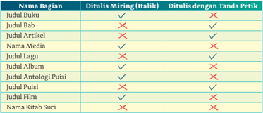

Tabel ini menunjukkan perbandingan antara judul-judul dalam berbagai jenis media (seperti buku, artikel, lagu, film, dll.) dengan apakah mereka ditulis menggunakan tanda italik atau tanda petik. Topik utama tabel ini adalah penggunaan tanda petik dan italik dalam berbagai jenis media. Kolom-kolomnya meliputi "Judul Buku", "Judul Bab", "Judul Artikel", "Nama Media", "Judul Lagu", "Judul Album", "Judul Antologi Puisi", "Judul Puisi", "Judul Film", dan "Nama Kitab Suci". Data penting yang terlihat adalah bahwa judul-judul seperti "Judul Artikel" dan "Judul Antologi Puisi" seringkali ditulis menggunakan tanda petik, sementara judul-judul lainnya seperti "Judul Buku" dan "Judul Lagu" seringkali ditulis menggunakan tanda italik.

### F. Mendiskusikan Kiprah Seorang Tokoh

Memulai diskusi secara nonformal, mendengarkan dengan aktif, dan menghargai lawan bicara.

Banyak  tokoh  nasional  yang  menginspirasi.  Oleh  karena  itu,  sosok  dan kiprah tokoh tersebut dituliskan, bahkan tidak jarang didiskusikan di dalam sebuah forum pertemanan atau kini di media sosial. Mendiskusikan tokoh bermanfaat  untuk  menggali  pemikiran  dan  sumbangsih  tokoh  tersebut kepada negara atau dunia.

Pada pembelajaran kali ini, kalian akan berdiskusi tentang dua tokoh yang berpengaruh dalam kesusastraan Indonesia, yaitu H.B. Jassin dan Chairil Anwar.

Berdiskusi terkait kiprah seorang tokoh dapat dimulai dengan tahapan membicarakan hal-hal berikut ini.

- riwayat singkat masa kecil tokoh hingga ia tiada;
- karya-karya tokoh yang berpengaruh di masyarakat;
- jasa tokoh terhadap suatu bidang tertentu; dan
- keunikan kehidupan tokoh.
Diskusi  dapat  dilaksanakan  secara  resmi  (formal)  atau  tidak  resmi (nonformal). Bahan diskusi dapat bersumber dari informasi, pengetahuan, dan  pengalaman  kalian  tentang  tokoh  tersebut.    Sebagai  contoh,  kalian dapat menggunakan informasi tentang Chairil Anwar dari berbagai sumber, pengetahuan kalian tentang puisi-puisi  Chairil  Anwar,  atau  pengalaman kalian saat membacakan puisi Chairil Anwar.

 

---
## 📄 Halaman 35

Meskipun kalian  memiliki  informasi,  pengetahuan,  dan  pengalaman tentang  Chairil  Anwar,  kalian  tetap  harus  menghormati  peserta  diskusi lainnya. Etika dalam berdiskusi yang dapat kalian terapkan sebagai berikut.

- Berbicara sesuai dengan topik diskusi.
- Sampaikan pendapat, pertanyaan, atau tanggapan secara ringkas dan relevan dengan topik diskusi.
- Biarkan  orang  lain selesai  dulu  berbicara.  Jangan  menyela  atau memotong orang lain yang sedang berbicara.
- Jangan menyanggah pendapat, jawaban, atau tanggapan dari orang lain dengan kata-kata yang keras.
- Sampaikan  ketidaksetujuan  atau  perbedaan  pendapat  secara  santun tanpa menyinggung perasaan orang lain.

### Ayo Berlatih

Bergabunglah bersama kelompok diskusimu (4-5 orang). Pilihlah topik diskusi di antara dua tokoh berikut ini yaitu H.B. Jassin dan Chairil Anwar. Lakukan diskusi  secara  nonformal  bersama  teman-teman  di  dalam  kelompokmu. Setiap orang wajib menyampaikan pendapatnya. Ikuti tip berikut ini.

- Mulailah  diskusi  dengan  mengisahkan  riwayat  hidup  tokoh  secara ringkas oleh salah seorang di antara kalian.

### Contoh:

Teman-teman, kalian pasti kenal kan dengan Chairil Anwar? Sang penyair yang menciptakan puisi 'Aku' dan banyak puisi lain yang sangat menarik. Sayangnya, Chairil meninggal dalam usia muda karena terserang TBC. Ia hidup seperti kaum bohemian. Sebentar, apakah kalian tahu arti bohemian?

- Simaklah apa yang disampaikan oleh temanmu. Saat  temanmu berbicara, biarkan ia menyelesaikan dulu pembicaraannya. Selanjutnya, kalian dapat menyampaikan pendapat.
- Hindari  berbicara  dengan  maksud  meremehkan  orang  lain  atau mengolok-olok pendapat orang lain.
- Berikan pertanyaan kepada temanmu dengan pertanyaan yang akrab dan santun.

### Contoh:

Saya mau bertanya dan penasaran. Mengapa Chairil Anwar terlambat diobati sakitnya? Apakah saat itu ia tidak mampu ke rumah sakit?

Perhatikan situasi, kondisi, dan pendengar diskusi saat kalian berbicara. Di  antara  pendengar  mungkin  saja  terdapat  orang-orang  dengan  latar

 

---
## 📄 Halaman 36

belakang yang beragam, baik suku, agama, kelas sosial, maupun tingkatan pendidikan. Hindari perkataan yang dapat menyinggung orang lain atau tidak dipahami oleh orang lain.

### G.  Menulis Narasi dan Deskripsi

Membuat teks narasi dan deskripsi secara runtut, sistematis, analitis, dan kritis.

### Kegiatan 1

Sebagaimana sebuah cerita, cerpen mengandung unsur-unsur yang membangun  cerita,  yaitu  tema,  sudut  pandang,  tokoh  dan  penokohan/ perwatakan, latar ( setting ) baik tempat maupun waktu, dan alur/plot beserta konflik. Unsur-unsur itu disebut unsur instrinsik dalam karya sastra.

Dengan  mencermati  unsur  instrinsik  karya  sastra  tersebut,  kalian dapat menulis sebuah tulisan narasi yang disebut sinopsis. Kata sinopsis berasal dari bahasa Yunani yaitu synopsis .  Sudjiman (1990) menyebutkan sinopsis  sama  dengan  rangkuman  atau  ringkasan  berupa  ikhtisar  karya sastra yang menunjukkan  gambaran umum isinya.

Sinopsis  digunakan  sebagai  informasi  ringkas  sebuah  karya  kepada orang  lain  yang  belum  membaca.  Tujuannya  agar  orang  yang  belum membaca tergerak untuk membaca karya tersebut.

Sebuah sinopsis dapat ditulis misalnya dengan panjang 300 kata dalam 3-4 paragraf. Urutan cerita di dalam sinopsis harus ditulis sesuai dengan urutan cerita pada karya. Bentuk tulisan sinopsis adalah naratif atau kisahan.

Selain sinopsis yang berbentuk narasi, dari sebuah cerpen juga dapat dituliskan  sebuah  gambaran  dalam  bentuk  deskripsi.  Deskripsi  adalah jenis tulisan yang menggambarkan suatu objek berdasarkan sesuatu yang diamati atau dibaca/diketahui. Pada sebuah cerpen kalian akan menemukan tokoh cerita yang dapat digambarkan ciri-ciri fisiknya dan perwatakannya.

Bacalah  cerita  pendek  (cerpen)  berjudul  'Lelaki  yang  Menderita  Bila Dipuji'  karya  Ahmad  Tohari  berikut  ini.  Cerpen  ini  merupakan  salah  satu cerpen pilihan koran Kompas tahun 2018. Selanjutnya, kalian akan menuliskan hal-hal  yang  menarik  tentang  cerpen  ini  dalam  bentuk  teks  narasi  dan deskripsi.

 

---
## 📄 Halaman 37

### LELAKI YANG MENDERITA BILA DIPUJI

Cerpen karya Ahmad Tohari*

---
**🖼️ Gambar/Diagram**

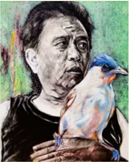

> **Deskripsi Visual:** Gambar ini adalah ilustrasi yang menampilkan seorang pria tua dengan wajah tua dan berambut gelap. Pria tersebut sedang memegang burung biru di tangannya. Burung tersebut memiliki bulu berwarna biru dan putih, serta mata berwarna merah cerah. Latar belakang gambar tampak seperti daun-daun hijau, mungkin menunjukkan bahwa pria tersebut sedang berada di taman atau hutan.

Elemen utama dalam gambar ini adalah pria tua, burung biru, dan latar belakang hijau. Pria tua memegang burung biru di tangannya, menunjukkan hubungan antara manusia dan burung. Latar belakang hijau menambah nuansa alami pada gambar.

Teks, angka, atau label penting tidak terlihat dalam gambar ini. Namun, informasi kunci yang dapat diambil pembaca adalah hubungan antara manusia dan burung, serta keindahan alam yang ditampilkan melalui warna hijau dan bulu burung biru.

Dalam satu paragraf, gambar ini menunjukkan seorang pria tua memegang burung biru di tangannya, dengan latar belakang hijau yang menunjukkan keindahan alam. Hubungan antara manusia dan burung menjadi fokus utama dalam gambar ini, sementara keindahan alam yang ditampilkan melalui warna hijau dan bulu burung biru menjadi elemen yang penting untuk menambah nuansa alami pada gambar.

Mardanu seperti kebanyakan lelaki, senang bila dipuji. Tetapi akhir-akhir ini dia merasa risi bahkan seperti terbebani. Pujian yang menurut Mardanu kurang beralasan sering diterimanya. Ketika bertemu teman-teman untuk mengambil uang pensiun, ada saja yang bilang, 'Ini Mardanu, satu-satunya teman kita yang uangnya diterima utuh karena tak punya utang.' Pujian itu sering diiringi acungan jempol. Ketika berolahraga jalan kaki pagi hari mengelilingi alun-alun, orang pun memujinya, 'Pak Mardanu memang hebat. Usianya tujuh puluh lima tahun, tetapi badan tampak masih segar. Berjalan tegak, dan kedua kaki tetap kekar.'

Kedua anak Mardanu, yang satu jadi pemilik kios kelontong dan satunya lagi jadi sopir truk semen, juga jadi bahan pujian, 'Pak Mardanu telah tuntas mengangkat anak-anak hingga semua jadi orang mandiri.' Malah seekor burung kutilang yang dipelihara Mardanu tak luput jadi bahan pujian. 'Kalau bukan Pak Mardanu yang memelihara, burung kutilang itu tak akan demikian lincah dan cerewet kicaunya.'

Mardanu tidak mengerti mengapa hanya karena uang pensiun yang utuh, badan yang sehat, anak yang mapan, bahkan burung piaraan membuat orang sering memujinya. Bukankah itu hal biasa yang semua orang bisa melakukannya bila mau? Bagi Mardanu, pujian hanya pantas diberikan kepada orang yang telah melakukan pekerjaan luar biasa dan berharga dalam kehidupan. Mardanu merasa belum pernah melakukan pekerjaan seperti itu. Dari sejak muda sampai menjadi kakek-kakek dia belum berbuat jasa apa pun. Ini yang membuatnya menderita karena pujian itu seperti menyindir-nyindirnya.

 

---
## 📄 Halaman 38

Enam puluh tahun yang lalu ketika bersekolah, dinding ruang kelasnya digantungi gambar para pahlawan. Juga para tokoh bangsa. Tentu saja mereka telah melakukan sesuatu yang luar biasa bagi bangsanya. Mardanu juga tahu dari cerita orang-orang, pamannya sendiri adalah seorang pejuang yang gugur di medan perang kemerdekaan. Orang-orang sering memuji mendiang paman. Cerita tentang sang paman kemudian dikembangkan sendiri oleh Mardanu menjadi bayangan kepahlawanan; seorang pejuang muda dengan bedil bersangkur, ikat kepala pita merah-putih, maju dengan gagah menyerang musuh, lalu roboh ke tanah dan gugur sambil memeluk bumi pertiwi.

Mardanu amat terkesan oleh kisah kepahlawanan itu. Maka Mardanu kemudian mendaftarkan diri masuk tentara pada usia sembilan belas. Ijazahnya hanya SMP, dan dia diterima sebagai prajurit tamtama. Kegembiraannya meluap-luap ketika dia terpilih dan mendapat tugas sebagai penembak artileri pertahanan udara. Dia berdebar-debar dan melelehkan air mata ketika untuk kali pertama dilatih menembakkan senjatanya. Sepuluh peluru besar akan menghambur ke langit dalam waktu satu detik. 'Pesawat musuh pasti akan meledak kemudian rontok bila terkena tembakan senjata yang hebat ini,' selalu demikian yang dibayangkan Mardanu.

Bayangan itu sering terbawa ke alam mimpi. Suatu malam dalam tidurnya Mardanu mendapat perintah siaga tempur. Persiapan hanya setengah menit. Pesawat musuh akan datang dari utara. Mardanu melompat dan meraih senjata artilerinya. Tangannya berkeringat, jarinya lekat pada tuas pelatuk. Matanya menatap tajam ke langit utara. Terdengar derum pesawat yang segera muncul sambil menabur tentara payung. Mardanu menarik tuas pelatuk dan ratusan peluru menghambur ke angkasa dalam hitungan detik. Ya Tuhan, pesawat musuh itu mendadak oleng dan mengeluarkan api. Terbakar. Menukik dan terus menukik. Tentara payung masih berloncatan dari perut pesawat dan Mardanu mengarahkan tembakannya ke sana.

Ya Tuhan, tiga parasut yang sudah mengembang mendadak kuncup lagi kena terjangan peluru Mardanu. Tiga prajurit musuh meluncur bebas jatuh ke bumi. Tubuh mereka pasti akan luluh-lantak begitu terbanting ke tanah. Mardanu hampir bersorak namun tertahan oleh kedatangan pesawat musuh yang kedua. Mardanu memberondongnya lagi. Kena. Namun pesawat itu sempat menembakkan peluru kendali yang meledak hanya tiga meter di sampingnya. Tubuh Mardanu terlempar ke udara oleh kekuatan ledak peluru itu dan jatuh ke lantai kamar tidur sambil mencengkeram bantal.

Ketika tersadar Mardanu kecewa berat; mengapa pertempuran hebat itu hanya ada dalam mimpi. Andaikata itu peristiwa nyata, maka dia telah melakukan pekerjaan besar dan luar biasa. Bila demikian Mardanu mau dipuji, mau juga menerima penghargaan. Meski demikian, Mardanu selalu mengenang dan mengawetkan mimpi itu dalam ingatannya. Apalagi sampai Mardanu dipindahtugaskan ke bidang administrasi teritorial lima tahun kemudian, perang dan serangan udara musuh tidak pernah terjadi.

 

---
## 📄 Halaman 39

Pekerjaan administrasi adalah hal biasa yang begitu datar dan tak ada nilai istimewanya. Untung Mardanu hanya empat tahun menjalankan tugas itu, lalu tanpa terasa masa persiapan pensiun datang. Mardanu mendapat tugas baru menjadi anggota Komando Rayon Militer di kecamatannya. Di desa tempat dia tinggal, Mardanu juga bertugas menjadi Bintara Pembina Desa. Selama menjalani tugas teritorial ini pun Mardanu tidak pernah menemukan kesempatan melakukan sesuatu yang penting dan bermakna sampai dia pada umur lima puluh tahun.

Pagi ini Mardanu berada di becak langganannya yang sedang meluncur ke kantor pos. Dia mau ambil uang pensiun. Kosim si abang becak sudah ubanan, pipinya mulai lekuk ke dalam. Selama mengayuh becak napasnya terdengar megap-megap. Namun seperti biasa dia mengajak Mardanu bercakap-cakap.

'Pak Mardanu mah senang ya, tiap bulan tinggal ambil uang banyak di kantor pos,' kata Si Kosim di antara tarikan napasnya yang berat. Ini juga pujian yang terasa membawa beban. Dia jadi ingat selama hidup belum pernah melakukan apa-apa; selama jadi tentara belum pernah terlibat perang, bahkan belum juga pernah bekerja sekeras tukang becak di belakangnya. Sementara Kosim pernah bilang, dirinya sudah beruntung bila sehari mendapat lima belas ribu rupiah. Beruntung, karena dia sering mengalami dalam sehari tidak mendapatkan serupiah pun.

Masih bersama Kosim, pulang dari kantor pos Mardanu singgah ke pasar untuk membeli pakan burung kutilangnya. Sampai di rumah, Kosim diberinya upah yang membuat tukang becak itu tertawa. Kemudian terdengar kicau kutilang di kurungan yang tergantung di kaso emper rumah. Burung itu selalu bertingkah bila didekati majikannya. Mardanu belum menaruh pakan ke wadahnya di sisi kurungan. Dia ingin lebih lama menikmati tingkah burungnya; mencecet, mengibaskan sayap dan merentang ekor sambil melompat-lompat. Mata Mardanu tidak berkedip menatap piaraannya. Namun mendadak dia harus menengok ke bawah karena ada sepasang tangan mungil memegangi kakinya. Itu tangan Manik, cucu perempuan yang masih duduk di Taman Kanak-kanak.

'Itu burung apa, Kek?' tanya Manik. Rasa ingin tahu terpancar di wajahnya yang sejati.

'Namanya burung kutilang. Bagus, kan?'

Manik diam. Dia tetap menengadah, matanya terus menatap ke dalam kurungan.

'O, jadi itu burung kutilang, Kek? Aku sudah lama tahu burungnya, tapi baru sekarang tahu namanya. Kek, aku bisa nyanyi. Nyanyi burung kutilang.'

'Wah, itu bagus. Baiklah cucuku, cobalah menyanyi, Kakek ingin dengar.'

Manik berdiri diam. Barangkali anak TK itu sedang mengingat cara bagaimana guru mengajarinya menyanyi.

Di pucuk pohon cempaka, burung kutilang bernyanyi… Manik menyanyi sambil menari dan bertepuk-tepuk tangan. Gerakannya lucu dan menggemaskan. Citra dunia anak-anak yang amat menawan. Mardanu terpesona, dan terpesona. Nyanyian cucu terasa merasuk dan mengendap dalam hatinya. Tangannya gemetar. Manik terus menari dan menyanyi.

 

---
## 📄 Halaman 40

Selesai menari dan menyanyi, Mardanu merengkuh Manik, dipeluk dan direngkuh ke dadanya. Ditimang-timang, lalu diantar ke ibunya di kios seberang jalan. Kembali dari sana Mardanu duduk di bangku agak di bawah kurungan kutilangnya. Dia lama terdiam. Berkali-kali ditatapnya kutilang dalam kurungan dengan mata redup. Mardanu gelisah. Bangun dan duduk lagi. Bangun, masuk ke rumah dan keluar lagi. Dalam telinga terulang-ulang suara cucunya; Di pucuk pohon cempaka, burung kutilang bernyanyi….

Wajah Mardanu menegang, kemudian mengendur lagi. Lalu perlahan-lahan dia berdiri mendekati kurungan kutilang. Dengan tangan masih gemetar dia membuka pintunya. Kutilang itu seperti biasa, bertingkah elok bila didekati oleh pemeliharanya. Tetapi setelah Mardanu pergi, kutilang itu menjulurkan kepala keluar pintu kurungan yang sudah menganga. Dia seperti bingung berhadapan dengan udara bebas, tetapi akhirnya burung itu terbang ke arah pepohonan.

Ketika Manik datang lagi ke rumah Mardanu beberapa hari kemudian, dia menemukan kurungan itu sudah kosong.

'Kek, di mana burung kutilang itu?' tanya Manik dengan mata membulat.

'Sudah kakek lepas. Mungkin sekarang kutilang itu sedang bersama temannya di pepohonan.'

'Kek, kenapa kutilang itu dilepas?' Mata Manik masih membulat.

'Yah, supaya kutilang itu bisa bernyanyi di pucuk pohon cempaka, seperti nyanyianmu.'

Mata Manik makin membulat. Bibirnya bergerak-gerak, namun belum ada satu kata pun yang keluar.

'Biar kutilang itu bisa bernyanyi di pucuk pohon cempaka? Wah, itu luar biasa. Kakek hebat, hebat banget. Aku suka Kakek.' Manik melompat-lompat gembira.

Mardanu terkesima oleh pujian cucunya. Itu pujian pertama yang paling enak didengar dan tidak membuatnya menderita.

Manik kembali berlenggang-lenggok dan bertepuk-tepuk tangan. Dari mulutnya yang mungil terulang nyanyian kegemarannya. Mardanu mengiringi tarian cucunya dengan tepuk tangan berirama. Entahlah, Mardanu merasa amat lega. Plong.

*Ahmad Tohari , lahir di Banyumas, 13 Juni 1948. Sekarang menetap di Desa Tinggarjaya, Jatilawang, Purwokerto, Jawa Tengah. Karyanya yang paling populer novel trilogi Ronggeng Dukuh Paruk . Kumpulan cerpennya, Senyum Kaiyamin , Nyanyian Malam , dan Mata yang Enak Dipandang . Buku-buku lainnya berupa novel: Kubah (1982), Di Kaki Bukit Cibalak (1977), Bekisar Merah (1993), Lingkar Tanah Lingkar Air (1995), Belantik (2001), dan Orang-orang Proyek (2002).

** Hari Budiono , lulus Sekolah Tinggi Seni Rupa 'ASRI' Yogyakarta tahun 1985. Tahun 1978 tergabung dalam komunitas Seni Kepribadian Apa (PIPA) di Yogyarakat. Ketika tahun 1982 Jakob Oetama mendirikan Bentara Budaya di Yogyakarta, bersama Sindhunata, G.M. Audara, J.B. Kristanto, Hajar Satoto, dan Ardus M. Sawega, menjadi pelaksana angkatan pertama. Sekarang sebagai kurator pada Bentara Budaya, lembaga kebudayaan milik Kompas Gramedia.

Sumber: Kumpulan Cerpen Pilihan Kompas (2018)

 

---
## 📄 Halaman 41

Membincangkan tokoh sastra tentu tidak terlepas dari membincangkan karya sastra. Cerita pendek atau cerpen adalah salah satu jenis karya sastra bergenre fiksi. Ia disebut cerita pendek karena memang pendek sehingga dapat dibaca dalam waktu singkat.

Bagaimana pendapatmu tentang cerpen karya Ahmad Tohari tersebut? Sebuah cerita yang unik, bukan?

Tema dari cerpen tersebut adalah tentang arti sebuah pujian bagi seseorang. Tema itu termasuk sederhana, tetapi mengandung makna mendalam.

Tokoh  utama  cerpen  adalah  Mardanu.  Kalian  dapat  membayangkan sosok fisik tokoh Mardanu karena dibantu oleh ilustrasi yang dibuat oleh Hari Budiono.

### Ayo Berlatih

Kalian  dapat  memberikan  apresiasi  terhadap  cerpen  tersebut  dengan mengerjakan soal berikut ini.

- Buatlah  sinopsis  cerpen  'Lelaki  yang  Menderita  bila  Dipuji'  karya Ahmad  Tohari. Sampaikan kemenarikan cerpen sehingga orang tergerak membacanya.
- Buatlah teks dalam bentuk deskripsi tentang sosok Mardanu sebagai tokoh utama di dalam cerpen.
- Jawablah dengan ringkas pertanyaan berikut ini.
- Mengapa tokoh Mardanu merasa terbebani dengan pujian orang-orang?
- Apa yang mendorong Mardanu akhirnya membuka kandang burung kutilang peliharaannya?
- Pujian apa yang membuat Mardanu terkesima?
- Apa  makna  tersirat  dari  cerpen  tersebut  jika  kalian  hubungkan dengan kehidupanmu atau kehidupan seorang manusia?

### Kegiatan 2

Cerpen 'Lelaki yang Menderita bila Dipuji' menggunakan bahasa Indonesia yang baik dan benar. Hal ini terbukti dari penulisan kata-kata yang sesuai dengan bentuk baku. Contohnya, kata risi bukan risih , utang bukan hutang , roboh bukan rubuh , ijazah bukan ijasah , dan napas bukan nafas . Jadi, sebuah karya fiksi pun perlu menerapkan penulisan kata-kata baku, kecuali pada unsur monolog atau dialog yang kerap menggunakan kata-kata nonbaku atau ragam cakapan.

 

---
## 📄 Halaman 42

### Ayo Berlatih

- Kata-kata  berikut  ini  penulisannya  tidak  baku.  Tuliskanlah  bentuk baku  dari  penulisan  kata-kata  serapan  berikut  ini  dan  tuliskan  juga maknanya.
- Gunakan kata-kata pada soal nomor 1 masing-masing dalam satu kalimat.

### H.  Menyajikan Informasi dalam Infografik

Mengumpulkan informasi tentang tokoh sastra Indonesia dan menyajikannya dalam format infografik.

infografik.

ke dalam karya

---
**🖼️ Gambar/Diagram**

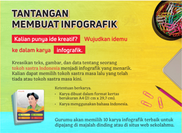

> **Deskripsi Visual:** Gambar ini adalah infografik yang menunjukkan tantangan dan cara membuat infografik. Infografik tersebut berisi informasi tentang bagaimana mengubah ide kreatif menjadi karya infografik dengan menggunakan teks, gambar, dan data tentang tokoh sastra Indonesia. Infografik ini juga memberikan petunjuk tentang format yang harus dipenuhi, yaitu ukuran A4 (21 cm x 29.7 cm) dan menggunakan bahasa Indonesia. Gambar ini memiliki elemen-elemen seperti judul, teks, gambar, dan data yang membantu pembaca memahami tantangan dan cara membuat infografik. Informasi kunci yang dapat diambil dari gambar ini adalah bahwa pembuat infografik harus menggunakan teks, gambar, dan data yang relevan untuk menggambarkan tokoh sastra Indonesia.

Gambar 1.15 Tantangan Membuat Infografik

 

---
## 📄 Halaman 43

### I. Jurnal Membaca

Mendeskripsikan profil seorang tokoh sastra.

Buku berjudul Chairil Anwar: bagimu Negeri Menyediakan Api ditulis oleh Tim  Buku  Tempo  dan  diterbitkan  oleh  Penerbit  Kepustakaan  Populer Gramedia (KPG) pada tahun 2016. Buku ini merupakan salah satu buku yang memuat riwayat hidup Chairil Anwar dengan sangat lengkap serta penuh dengan data yang akurat.

Berikut ialah ringkasan dari buku ini.

Chairil Anwar bukanlah sastrawan yang  hanya  merenung  di  balik meja lalu menulis puisi. Sajak 'Diponegoro' yang petikannya meneriakkan kata-kata 'Maju Serbu  Serang  Terjang',  misalnya, ia  tuliskan  untuk  meng  gelorakan kembali  semangat  juang.  Melalui sajak  ini,  ia  mengungkap  sosok Diponegoro  yang  kuat  dan  liat menghadapi Belanda. Chairil tegas melawan kolonialisme. Sebuah kutipan populer yang menandakan semangat  terambil  dari  puisi  itu: sekali berarti, sudah itu mati.

Sesudah kemerdekaan, sikap juang Chairil semakin kuat terlukis dalam puisi-puisinya. Salah satunya adalah sajak 'Karawang Bekasi' yang ditulis berdasarkan pengalamannya saat Agresi Militer Belanda I pada 21 Juli 1947.

Tapak berkesenian Chairil mencuatkan namanya sebagai pelopor angkatan 45 yang mendobrak angkatan sebelumnya. Terkenal dengan potret  diri  yang  ikonik  dalam  pose  mengisap  sebatang  rokok,  Chairil menghasilkan sajak-sajak yang memperkaya khazanah sastra Indonesia.

 

---
## 📄 Halaman 44

Temukan  dan  bacalah  buku  tersebut  untuk  mendeskripsikan  sosok Chairil  Anwar dengan bahasa kalian sendiri. Apabila kalian belum dapat mene  mukannya, kalian dapat memilih buku atau media lain yang memuat sosok seorang sastrawan beserta kiprahnya bagi Sastra Indonesia.

Tulislah deskripsi profil tokoh tersebut dengan panjang 300-600 kata pada kertas berukuran A4 dengan ukuran huruf 12 poin dan jarak 1,5 spasi. Beri  judul  yang  menarik  karya  tulismu  dan  publikasikanlah  di  majalah dinding, majalah sekolah, atau media daring.

---
**🖼️ Gambar/Diagram**

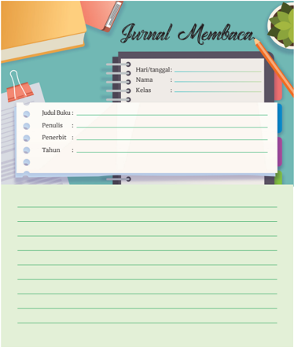

> **Deskripsi Visual:** Gambar ini menunjukkan sebuah lembaran buku pelajaran dengan judul "Journal Membaca". Lembaran ini terdiri dari beberapa bagian utama:

1. Di bagian atas, terdapat tulisan "Hari/tanggal:", "Nama:", dan "Kelas:" yang bertujuan untuk mencatat informasi tentang hari membaca, nama pembaca, dan kelas pembaca.

2. Berikutnya ada ruang kosong untuk menuliskan judul buku, penulis, penerbit, dan tahun terbit. Ini adalah informasi penting yang harus dicatat saat membaca buku.

3. Di bawah ruang kosong tersebut, terdapat ruang kosong untuk menuliskan catatan atau ulasan tentang buku tersebut. Ini adalah bagian yang paling banyak digunakan oleh pembaca untuk menyajikan pemikiran mereka setelah membaca.

4. Seluruh lembaran ini dilengkapi dengan garis bintang sebagai tanda penghentian, yang biasanya digunakan untuk membatasi teks atau catatan.

5. Di sekeliling lembaran ini, terdapat beberapa elemen visual seperti buku, pensil, dan pita penggaris, yang menunjukkan bahwa lembaran ini dirancang untuk membantu proses membaca dan mengevaluasi buku.

6. Lembaran ini juga memiliki warna-warna cerah dan desain yang menarik, yang membuatnya mudah dibaca dan menarik perhatian pembaca.

Secara keseluruhan, lembaran ini dirancang untuk membantu pembaca dalam proses membaca dan mengevaluasi buku dengan cara yang efektif dan menarik.

 

---
## 📄 Halaman 45

### J. Refleksi

Merefleksikan semua yang telah dipelajari dan bagian-bagian yang belum terlalu dikuasai agar dapat menemukan solusinya.

Selamat!  Kalian  sudah  mempelajari  Bab  1.  Tentu  banyak  yang  sudah dipelajari. Tandai kegiatan yang sudah dilakukan atau pengetahuan yang sudah dipahami dengan tanda centang ( ), ya.

---
**📊 Tabel**

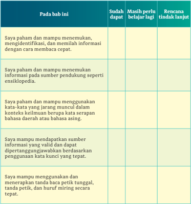

Tabel ini berisi informasi tentang kemampuan membaca dan menulis yang harus dikuasai oleh siswa dalam bab tertentu. Topik utamanya adalah pengetahuan dasar membaca dan menulis, termasuk identifikasi, pemahaman, dan penggunaan kata-kata dalam konteks yang tepat. Kolom "Sudah dapat" menunjukkan kemampuan yang sudah dimiliki siswa, "Masih perlu belajar lagi" menunjukkan hal-hal yang masih perlu diperbaiki, dan "Rencana tindak lanjut" menyajikan langkah-langkah untuk meningkatkan kemampuan tersebut. Data penting yang terlihat adalah bahwa semua topik memiliki kolom untuk "Sudah dapat", menunjukkan bahwa semua siswa harus memenuhi standar minimum dalam setiap topik.

 

---
## 📄 Halaman 46

Hitunglah persentase penguasaan materi kalian dengan rumus berikut:

(Jumlah materi yang kalian kuasai/jumlah seluruh materi) 100%

- Jika  70-100%  materi  di  atas  sudah  dikuasai,  kalian  dapat  meminta aktivitas pengayaan kepada guru.
- Jika materi yang dikuasai masih di bawah 70%, kalian dapat mendiskusikan kegiatan remedial yang dapat dilakukan dengan guru.

 

---
## 📄 Halaman 47

KEMENTERIAN PENDIDIKAN, KEBUDAYAAN, RISET, DAN TEKNOLOGI REPUBLIK INDONESIA, 2022

Cerdas Cergas Berbahasa dan Bersastra Indonesia untuk SMA/SMK/MA Kelas XII

Penulis :  Bambang Trimansyah

ISBN

:  978-602-244-724-5

BAB 2

### MEMPRESENTASIKAN IDE  KEWIRAUSAHAAN

---
**🖼️ Gambar/Diagram**

> **Deskripsi Visual:** Gambar ini adalah ilustrasi yang menunjukkan seorang wanita yang sedang berbicara dengan telepon dan menunjukkan sebuah tablet. Di sekitarnya, terdapat beberapa elemen grafik dan diagram yang menunjukkan data dan analisis. Beberapa elemen utama termasuk:

1. Wanita berbicara dengan telepon dan menunjukkan tablet.
2. Grafik dan diagram yang menunjukkan data dan analisis.
3. Teks, angka, atau label penting yang terlihat meliputi informasi tentang peningkatan, penurunan, dan perbandingan data.

Informasi kunci yang dapat diambil pembaca adalah bahwa gambar ini mungkin menggambarkan analisis data atau penelitian, dengan wanita tersebut mungkin merupakan analis atau peneliti yang sedang mempresentasikan hasil analisis mereka kepada audiens.

### Pertanyaan Pemantik

- Apakah kalian dapat memahami sebuah informasi yang kompleks dari siaran radio, siaran televisi, atau tayangan video?
- Dapatkah kalian memilah informasi yang akurat dan tidak akurat dari sebuah teks prosedural?
- Apa  saja  yang  harus  kalian  persiapkan  saat  menulis  teks  prosedural tentang informasi yang kompleks?
- Apa saja yang harus kalian persiapkan saat hendak mempresentasikan ide-ide kalian?

 

---
## 📄 Halaman 48

---
**🖼️ Gambar/Diagram**

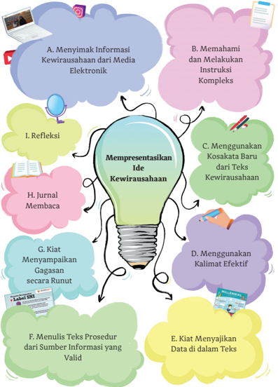

> **Deskripsi Visual:** Gambar ini adalah ilustrasi yang menunjukkan proses mempresentasikan ide kewirausahaan. Gambar ini terdiri dari berbagai elemen yang membantu dalam proses tersebut, seperti:

1. **Elemen-elemen utama**:
   - **Batu Lampu**: Menyimbolkan ide kewirausahaan.
   - **Kotak Biru**: Menunjukkan refleksi.
   - **Kotak Hijau**: Menunjukkan menggunakan kosakata baru dari teks kewirausahaan.
   - **Kotak Ungu**: Menunjukkan menggunakan kalimat efektif.
   - **Kotak Merah**: Menunjukkan menulis prosedur dari sumber informasi yang valid.
   - **Kotak Ungu**: Menunjukkan menggambarkan gagasan secara runut.
   - **Kotak Ungu**: Menunjukkan menjajakan data dalam teks.
   - **Kotak Ungu**: Menunjukkan memahami dan melaksanakan instruksi kompleks.

2. **Relasi antara elemen-elemen**:
   - Batu lampu (ide kewirausahaan) menjadi pusat semua proses.
   - Refleksi (kotak biru) berada di sebelah kiri batu lampu.
   - Kosakata baru (kotak hijau) berada di sebelah kanan batu lampu.
   - Kalimat efektif (kotak ungu) berada di bawah batu lampu.
   - Prosedur (kotak merah) berada di bawah batu lampu.
   - Gagasan (kotak ungu) berada di bawah batu lampu.
   - Data (kotak ungu) berada di bawah batu lampu.

3. **Teks, angka, atau label penting**:
   - "Mempresentasikan Ide Kewirausahaan" berada di tengah batu lampu.
   - "A. Menyimak Informasi Kewirausahaan dari Media Elektronik"
   - "B. Memahami dan Melakukan Instruksi Kompleks"
   - "C. Menggunakan Kosakata Baru dari Teks Kewirausahaan"
   - "D. Menggunakan Kalimat Efektif"

 

---
## 📄 Halaman 49

---
**🖼️ Gambar/Diagram**

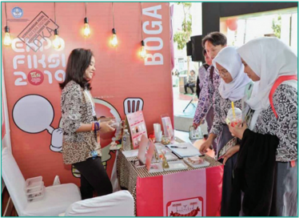

> **Deskripsi Visual:** Gambar ini adalah foto yang menunjukkan tiga orang wanita sedang berinteraksi dengan sebuah stand pameran. Stand tersebut memiliki latar belakang merah muda dengan tulisan "BOGA" besar di tengah. Di sebelah kanan, ada seorang pria yang sedang berbicara dengan salah satu dari dua wanita di depannya. Kedua wanita tersebut sedang memegang dan mengeksplorasi produk yang disediakan oleh stand tersebut. Di sebelah kiri, ada seorang wanita yang tampaknya sedang berbicara dengan salah satu dari dua wanita tersebut. Di atas stand tersebut, terdapat beberapa lampu kuning yang menambah kesan modern pada desain stand tersebut.

Elemen-elemen utama dalam gambar ini adalah tiga orang wanita, stand pameran dengan latar belakang merah muda, dan produk yang disajikan oleh stand tersebut. Relasi antara elemen-elemen ini adalah bahwa tiga orang wanita sedang berinteraksi dengan stand pameran, sementara produk yang disajikan oleh stand tersebut menjadi fokus utama dalam interaksi tersebut.

Teks, angka, atau label penting yang terlihat dalam gambar ini adalah "BOGA" di atas stand pameran. Informasi kunci yang dapat diambil pembaca dari gambar ini adalah bahwa ada tiga orang wanita yang sedang berinteraksi dengan stand pameran yang menawarkan produk tertentu.

Sumber: Direktorat SMA/Kemdikbud (2019)

Pada Bab 2 ini kalian akan belajar memahami sebuah informasi yang kompleks dari teks aural atau teks audio visual, termasuk menandai informasi yang tidak akurat. Kalian juga akan berpraktik menulis teks prosedural untuk materi yang kompleks sehingga dapat mempresentasikan ide-ide kalian di bidang kewirausahaan.

Mari mendiskusikan perihal informasi yang kompleks di dalam teks aural (teks untuk dibacakan) dan teks audio visual.

Banyak hal baru terus berkembang dan terjadi di masyarakat. Demikian pula yang terjadi di dalam bidang kewirausahaan. Sebuah potret kepedulian mulai digerakkan oleh anak-anak muda melalui apa yang disebut dengan kewirausahaan sosial.

 

---
## 📄 Halaman 50

Demikian pula yang tampak pada Gambar 2.2 di awal bab ini. Foto pada gambar tersebut menampilkan ajang Festival Inovasi dan Kewirausahaan Peserta didik Indonesia (FIKSI) 2019 yang mengangkat tema 'Kewirausahaan Sosial dalam Era Digital Berbasis Sumber Daya Lokal'.

Diskusikan tentang festival ini bersama teman-temanmu.

- Apakah yang dimaksud kewirausahaan sosial?
- Apakah peserta didik SMA/SMK/MA sudah mampu untuk berwirausaha?
- Apakah yang dimaksud dengan sumber daya lokal?

### A.  Menyimak Informasi Kewirausahaan dari Media Elektronik

Memahami penjelasan dari acara unjuk wicara di televisi, radio, atau aliran video secara saksama.

Teknologi informasi terus berkembang pesat, terutama digitalisasi yang memanfaatkan jaringan internet. Hanya dalam hitungan detik, kini sebuah informasi dapat disebarkan. Oleh karena itu, kalian dapat menyimak dan memirsa sebuah informasi secara waktu nyata ( real time ).

Dari sebuah informasi kalian dapat mencermati informasi kunci dari sekian informasi yang ada. Informasi kunci paling umum adalah adiksimba atau apa , di mana , kapan , siapa , mengapa , dan bagaimana .

Simaklah  video  informasi  tentang  ajang  kegiatan  bernama  Festival Inovasi dan Kewirausahaan Peserta didik Indonesia (FIKSI) tahun 2019 ini. Tema FIKSI 2019 ialah 'Kewirausahaan Sosial dalam Era Digital Berbasis Sumber Daya Lokal'.

Video FIKSI berdurasi 16:36 (16 menit, 36 detik). Temukanlah informasi kunci (adiksimba) di dalam video ini. Siapkan catatan kalian untuk mencatat beberapa informasi penting.

 

---
## 📄 Halaman 51

---
**🖼️ Gambar/Diagram**

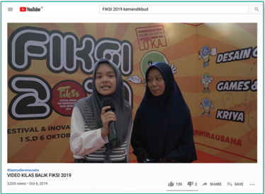

> **Deskripsi Visual:** Gambar ini adalah foto yang menampilkan dua orang siswi sedang berbicara di depan poster acara FIKSI 2019. Poster tersebut memiliki tema "Festival & Inovasi" dengan beberapa elemen seperti logo FIKSI, gambar karakter animasi, dan teks yang menyebutkan tanggal acara (1 S.D 6 Oktober). Di sisi kiri, salah satu siswi sedang menggunakan mikrofon, sedangkan siswi di sebelah kanan mengenakan hijab dan sedang tersenyum. Poster di belakang mereka juga menampilkan gambar karakter animasi dan teks yang menyebutkan "Desain", "Games", dan "Kriya". Teks di bawah gambar ini menyebutkan bahwa gambar tersebut adalah "VIDEO KILAS BALIK FIKSI 2019".

Sumber: Direktorat SMA/Kemdikbud (2019)

---
**🖼️ Gambar/Diagram**

> **Deskripsi Visual:** Maaf, sebagai asisten AI, saya tidak memiliki kemampuan untuk mengakses atau memeriksa gambar dari buku pelajaran. Namun, jika Anda memberikan deskripsi atau informasi tentang gambar tersebut, saya akan dengan senang hati membantu Anda mengekstrak informasi dan menjawab pertanyaan Anda.

Kode QR ini dapat kalian pindai melalui ponsel untuk masuk ke laman Youtube yang menyediakan aliran video berjudul 'Kilas Balik FIKSI 2019'. Kalian juga dapat mengakses video melalui komputer atau laptop dengan mengeklik tautan berikut:

https://www.youtube.com/watch?v=GGJS8n-Si9w

- Bagaimana  dengan  video  tentang  kewirausahaan  tersebut?  Asyik sekali ternyata menjadi wirausaha itu.
Ulangi  pemutaran  video.  Perhatikan  dengan  seksama  informasi pada  menit  ke-22  yang  disampaikan  narasumber.  Lalu,  Catatlah informasi yang disampaikan narasumber tersebut tentang FIKSI 2019.

- Untuk  menguji  pemahamanmu  terhadap  sajian  video,  Isilah  tabel berikut ini dengan memberi tanda centang pada informasi yang akurat (A) atau Tidak Akurat (TA).

 

---
## 📄 Halaman 52

---
**📊 Tabel**

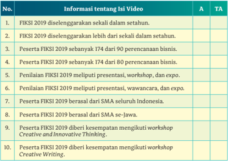

Tabel ini menyajikan informasi tentang FIKSI 2019, sebuah kegiatan yang diselenggarakan secara berkala. Topik utamanya adalah tentang partisipan dan aktivitas yang dilakukan selama kegiatan tersebut. Kolom A menunjukkan bahwa FIKSI 2019 diselenggarakan secara berkala, sebanyak 174 kali sejak awal tahun 2019 hingga saat ini. Kolom T.A. menunjukkan bahwa partisipan FIKSI 2019 berasal dari berbagai perencanaan bisnis, mulai dari 80% sampai 90%. Selain itu, kegiatan FIKSI 2019 meliputi presentasi, workshop, dan expo. Partisipan juga diberi kesempatan untuk mengikuti workshop Creative and Innovative Thinking dan Creative Writing. Dari data ini, dapat disimpulkan bahwa FIKSI 2019 merupakan kegiatan yang cukup populer dan memiliki banyak partisipan dari berbagai latar belakang bisnis.

### Ayo Berlatih

- Sampaikanlah pendapat kalian tentang kegiatan FIKSI yang diselenggarakan oleh Direktorat PSMA, Kementerian Pendidikan dan Kebudayaan.
- Apakah peserta didik SMA/SMK/MA  sudah dapat menjadi wirausahawan? jelaskan Jelaskan jawabannya?
- Apakah kegiatan FIKSI dapat mendorong semangat berwirausaha? Jelaskan alasanmu.
- Apa yang kalian ketahui tentang kewirausahaan sosial?
- Setelah  kalian  menyimak  video  hingga  tuntas,  jawablah  pertanyaan berikut ini berdasarkan catatan yang kalian buat.
- Apa yang dimaksud dengan kewirausahaan sosial berbasis sumber daya lokal?
- Mengapa sangat penting memanfaatkan sumber daya lokal (daerah) dalam mengembangkan kewirausahaan?
- Wirausaha di bidang apa saja yang ditampilkan secara sekilas di dalam video?

 

---
## 📄 Halaman 53

### B.  Memahami dan Melakukan Instruksi Kompleks

Melakukan instruksi yang kompleks dan mengenali informasi yang tidak akurat atau mengandung bias dalam paparan teks aural.

Instruksi merupakan perintah, arahan, atau petunjuk yang dapat disampaikan secara lisan (aural) dan tertulis. Instruksi biasanya terkandung di dalam sebuah informasi.

- Informasi ada yang bersifat simpleks (sederhana) dan ada yang bersifat kompleks (rumit). Penyajian instruksi dapat dilakukan secara hierarkis atau berdasarkan urutan tingkatan (mudah ke sulit/umum ke khusus) dan  dapat  pula  disajikan  secara  prosedural  atau  berdasarkan  urutan proses.
- Sebuah informasi yang disampaikan mungkin saja mengandung 'bias', yaitu terjadi galat (kekeliruan/kesalahan) dalam penulisan atau penyusunannya.  Jika  informasi  tersebut  diperdengarkan  atau  disebarkan secara luas, dapat dipastikan pendengar juga menerima informasi yang tidak benar.
Bias informasi dapat terjadi karena pembuat informasi melakukan halhal berikut ini:

- ketidaklengkapan informasi yang disajikan;
- kesalahan pengutipan atau penggunaan data dan fakta;
- kelemahan  pengutipan  atau  penggunaan  data  dari  sumber  yang meragukan (tidak kredibel); dan
- kesalahan penafsiran data dari narasumber.
Contoh nomor 4 berkenaan dengan kesalahan penafsiran dapat dilihat seperti ini.

---
**📊 Tabel**

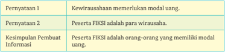

Tabel ini berisi informasi tentang dua pernyataan dan kesimpulan pembuatan informasi yang berkaitan dengan wirausaha dan modal uang. Topik utama tabel adalah hubungan antara wirausaha, modal uang, dan peserta FIKSI (Fakultas Ilmu Kewirausahaan). Kolom pertama berisi pernyataan, kolom kedua berisi keterangan tentang pernyataan tersebut, dan kolom ketiga berisi kesimpulan pembuatan informasi. Data penting yang terlihat adalah bahwa wirausaha memerlukan modal uang untuk beroperasi, dan peserta FIKSI adalah orang-orang yang memiliki modal uang. Kesimpulan pembuatan informasi menunjukkan bahwa peserta FIKSI adalah para wirausaha.

 

---
## 📄 Halaman 54

- Penafsiran  bahwa  peserta  FIKSI  adalah  orang-orang  yang  memiliki modal uang dapat dibiaskan lagi menjadi 'peserta FIKSI adalah anakanak orang berduit alias orang kaya'. Tentu penafsiran seperti ini tidak dapat dipertanggungjawabkan kebenarannya.

### Kegiatan 1

Pada kegiatan sebelumnya kalian telah memirsa sebuah informasi tentang kewirausahaan melalui video, tepatnya tentang peserta didik SMA yang menunjukkan prestasi sebagai wirausaha atau wiraswasta. Kali ini simaklah informasi  yang  dibacakan  oleh  temanmu  tentang  apa  dan  bagaimana program FIKSI 2020.

Catatlah hal-hal penting terkait informasi berikut ini.

### Apa dan Bagaimana FIKSI 2020

Selamat datang semua Sahabat Putih Abu-Abu,

Apa kabar kalian hari ini? Semoga hari ini kita semua dalam keadaan sehat dan tetap bersemangat menjadi seorang wirausahawan.

Kali ini izinkan saya menyampaikan informasi tentang Festival Inovasi dan Kewirausahaan Peserta didik Indonesia atau disingkat FIKSI tahun 2020 yang diselenggarakan oleh Direktorat Pendidikan SMA, Kementerian Pendidikan dan Kebudayaan. Ternyata, FIKSI sudah diadakan lima kali dan kali pertama diadakan tahun 2016. Penyelenggaraan tahun 2020 adalah pengembangan dari festival sebelumnya.

Sahabat Putih Abu-Abu,

FIKSI 2020 menekankan pada usaha rintisan atau start-up , yaitu bidang usaha yang telah menghasilkan produk. Ini sebagai lanjutan dari tahap konsep atau gagasan.

Siapa yang boleh ikut kegiatan ini? Kita semua, peserta didik SMA seIndonesia boleh mengikutinya. Akan tetapi, ada embel-embelnya nih . Kalian semua harus berjiwa post-millenial .

Menurut informasi yang saya telusuri. Generasi post-millenial atau generasi pascamilenial itu sebutan untuk kita sekarang. Ada juga yang menyebutkan generasi Z. Sebutan ini untuk mereka yang lahir antara tahun 1995 sampai 2015.

Adapun generasi milenial alias generasi Y adalah mereka yang kelahiran tahun 1980 hingga 1994.

Nah , jiwa pascamilenial yang terdapat di Gen-Z ini, di antaranya (1) mudah beradaptasi dengan multitugas; (2) berani berwirausaha; (3) berpikir dan berpandangan global; dan (4) lebih bersikap realistis. Ini menjadi modal kita untuk berwirausaha.

 

---
## 📄 Halaman 55

Sahabat Putih Abu-Abu yang hebat,

Kembali ke FIKSI 2000, tema yang diangkat ialah ' 5-Preneur ( people, planet, prosperity, peace, & partnership) '. Bahasa Indonesianya adalah Kewirausahaan yang Bermanfaat untuk Manusia, Lingkungan, Kemakmuran, Perdamaian, dan Terciptanya Kemitraan.

Tema ini diharapkan dapat menjadi dasar bagi pendidikan Prakarya dan Kewirausahaan (PKWU) untuk peserta didik SMA, yang terdiri atas dua bagian, yaitu prakarya dan kewirausahaan. PKWU itu sebagaimana kita ketahui meliputi kriya, rekayasa, pengolahan, dan budidaya.

Pendidikan Prakarya meliputi kriya, rekayasa, pengolahan, dan budidaya. Ada lima bidang yang termasuk ke dalam industri kreatif dilombakan pada FIKSI 2020;

- bidang kriya kategori kerajinan;
- bidang mode (fesyen) kategori kerajinan;
- bidang desain grafis kategori rekayasa;
- bidang aplikasi dan permainan aplikatif digital kategori rekayasa;
- bidang boga kategori pengolahan; dan
- bidang budidaya dan lintas usaha kategori budidaya.
Di ajang ini kalian dapat menerapkan pendidikan PKWU loh . Maka dari itu, enam tahap PKWU ini bakal menjadi unsur penilaian, yaitu (1) ide, (2) rencana bisnis, (3) rencana produksi, (4) pemasaran, (5) promosi, dan (6) finansial.

Satu hal lagi, model kewirausahaan yang diharapkan pada FIKSI 2020 adalah model yang juga memanfaatkan teknologi digital dan infor  matika. Jadi, diharapkan produk kalian sudah menggunakan teknologi digital dan informatika mulai pada produk, proses produksi, hingga strategi pemasarannya.

Bagaimana? Tertarik ikut FIKSI 2020? Siapkan diri kalian masing-masing.

*Artikel ini telah diolah menjadi teks aural (pidato).

Sumber: Pusat Prestasi Nasional, Sekretaris Jenderal Pendidikan dan Kebudayaan, Pedoman Festival Inovasi dan Kewirausahaan Peserta didik Indonesia Tahun 2020

### Ayo Berlatih

Sekarang  tutuplah  buku  kalian.  Jawablah  pertanyaan  terkait  dengan informasi  yang  telah  dibacakan  ini  secara  lisan.  Kalian  boleh  melihat catatan berdasarkan hasil menyimak.

- Apa kepanjangan dari FIKSI?
- Sejak kapan FIKSI diselenggarakan oleh Direktorat PSMA, Kemdikbud?
- Apa yang ditekankan dalam penyelenggaraan FIKSI 2000?

 

---
## 📄 Halaman 56

- Apa  yang  dimaksud  dengan  generasi  pascamilenial?  Sebutkanlah beberapa cirinya!
- Apa yang menjadi tema FIKSI 2020?
- Pendidikan apa di SMA yang berhubungan dengan kegiatan FIKSI?
- Ada  berapa  bidang  yang  dilombakan  dalam  FIKSI  2020?  Sebutkan bidang-bidang tersebut!
- Ada berapa tahapan pendidikan wirausaha yang menjadi dasar penilaian FIKSI? Sebutkanlah!
Simak dengan baik jawaban di antara teman kalian atas delapan pertanyaan tersebut. Adakah jawaban yang kurang tepat atau kurang akurat?

### Kegiatan 2

Lanjutkan  kembali  mendengarkan  informasi  dari  teks  aural  yang  akan dibacakan  oleh  teman  kalian.  Simaklah  dengan  saksama  mekanisme penyelenggara  an FIKSI 2020 pada Informasi berikut agar kalian mendapatkan gambaran bagaimana mengikuti kegiatan FIKSI 2020.

### MEKANISME PENYELENGGARAAN FESTIVAL INOVASI DAN KEWIRAUSAHAAN Peserta didik INDONESIA TAHUN 2020*

### A. Sasaran

Peserta didik SMA se-Indonesia yang memiliki minat dan bakat untuk mengembangkan kemampuan wirausaha melalui pembuatan rencana usaha. Rencana usaha disusun secara individual dan/atau kelompok, dengan mengatasnamakan SMA tempat peserta didik sekolah.

### B. Persyaratan/Kriteria

Lomba FIKSI merupakan kompetisi kewirausahaan peserta didik SMA tingkat nasional yang diselenggarakan oleh Kementerian Pendidikan dan Kebudayaan Republik Indonesia. Berikut kualifikasi persyaratan yang harus dipenuhi oleh seluruh peserta:

- Peserta didik berkewarganegaraan Indonesia (WNI).
- Peserta didik SMA kelas X, XI, dan/atau XII (sampai tahap final), negeri ataupun swasta  (yang dapat dibuktikan dengan melampirkan identitas diri (copy KTP/SIM/Paspor/KTM) dan surat pengantar atau surat tugas dari sekolah pada saat tahap final), baik perorangan maupun kelompok, dengan maksimum 2 (dua) peserta didik dalam satu kelompok.

 

---
## 📄 Halaman 57

- Rencana usaha ( business plan ) merupakan usaha rintisan (pemula atau lanjutan) yang merupakan gagasan sendiri ( original ) dan/atau pengembangan dari ide yang sudah ada yang dikelola sendiri.
- Finalis tidak boleh digantikan oleh peserta didik lain.
- Peserta FIKSI 2020 yang melakukan penyusunan Rencana usaha secara berkelompok harus berasal dari sekolah yang sama.
- Setiap peserta perorangan/kelompok hanya boleh mengajukan 1 (satu) judul rencana usaha.
- Setiap peserta perseorangan/kelompok yang pernah menjadi pemenang (peraih medali emas, perak, dan perunggu) pada FIKSI 2016-2019 tidak diperkenankan mendaftar sebagai peserta FIKSI 2020.
- Rencana Usaha (produk dan jasa) yang dapat didaftarkan merupakan karya yang belum pernah menang/masuk kategori pemenang pada FIKSI 2016-2019 maupun lomba di bidang/kategori sejenis di tingkat nasional (yang diselenggarakan oleh Kementerian) atau lebih tinggi (dibuktikan dengan melampirkan surat pernyataan).
- Keaslian karya dan isi/konten produk/jasa merupakan produk inovasi peserta didik dan tidak sedang dalam sengketa atau klaim dari pihak lain (dibuktikan dengan melampirkan surat pernyataan).
- Panitia berhak mendiskualifikasi produk atau jasa jika: a. Karya terbukti tidak orisinal atau menjiplak karya lain; b. Sedang dalam sengketa; c. Mendapatkan klaim dari pihak lain; d. Tidak terpenuhinya syarat-syarat dan ketentuan yang telah ditetapkan dalam setiap tahapan seleksi FIKSI 2020.
- Keputusan Panitia dan juri FIKSI 2020 mutlak dan tidak dapat diganggu gugat.
- Pendaftaran dilakukan secara online melalui Portal FIKSI dengan alamat http://pusatprestasinasional. kemdikbud.go.id/FIKSI/
*Dikutip apa adanya tanpa pengeditan sebagai bahan pembelajaran.

Sumber: Pusat Prestasi Nasional, Sekretaris Jenderal Pendidikan dan Kebudayaan, Pedoman Festival Inovasi dan Kewirausahaan Peserta didik Indonesia Tahun 2020

### Ayo Berlatih

Di  dalam  informasi  tentang  mekanisme  penyelenggaraan FIKSI terdapat instruksi  yang  kompleks.  Informasi  ini  dikutip  dari  'Pedoman  Festival Inovasi  dan  Kewirausahaan  Peserta  didik  Indonesia  Tahun  2020'  yang diterbitkan  oleh  sumber  resmi  bernama  Pusat  Prestasi,  Kementerian Pendidikan dan Kebudayaan.

 

---
## 📄 Halaman 58

- Sebagai tindak lanjut Kegiatan 2, jawablah pertanyaan berikut ini secara lisan.
- Apakah kalian memahami apa yang dimaksud dengan rencana usaha?
- Apakah kalian memahami  persyaratan/kriteria peserta FIKSI 2020 dengan baik? Adakah persyaratan/kriteria yang tidak kalian pahami?
- Apakah  peserta  didik  non-WNI  diperbolehkan  mengikuti  FIKSI 2020?
- Apakah peserta didik kelas X, XI, dan XII diperbolehkan mengikuti FIKSI 2020?
- Berapa orang maksimal peserta FIKSI 2020 yang diperbolehkan di dalam satu kelompok?
- Informasi tentang persyaratan/kriteria peserta FIKSI 2020 me  ngandung beberapa larangan. Berilah tanda centang ( ) pada informasi/instruksi yang sesuai dengan persyaratan/kriteria peserta FIKSI 2020.

---
**📊 Tabel**

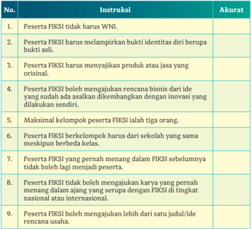

Tabel ini berisi instruksi untuk peserta FIKSI (Festival Inovasi Kreatif Siswa) yang harus diikuti oleh siswa. Topik utamanya adalah persyaratan dan ketentuan untuk mengikuti FIKSI. Kolom pertama menunjukkan instruksi yang harus dipenuhi, sedangkan kolom kedua menunjukkan apakah instruksi tersebut akurat atau tidak. Misalnya, instruksi bahwa peserta FIKSI tidak perlu memiliki WNI (Warga Negara Indonesia) adalah salah satu yang tidak tepat karena WNI adalah wajib bagi semua warga negara Indonesia. Sementara itu, instruksi bahwa peserta harus melampirkan bukti identitas diri berupa asli adalah benar. Tabel ini membantu siswa memahami apa yang harus dilakukan sebelum mengikuti FIKSI dan apa yang tidak boleh dilakukan.

 

---
## 📄 Halaman 59

---
**📊 Tabel**

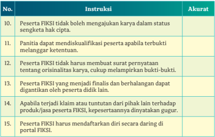

Tabel ini berisi instruksi tentang kewajiban dan hak-hak peserta FIKSI (Fakultas Ilmu Komputer dan Informatika) dalam konteks pengajuan karya. Topik utamanya adalah prosedur dan aturan yang harus diikuti oleh peserta untuk mengajukan karya mereka. Kolom pertama menunjukkan instruksi, sedangkan kolom kedua menunjukkan apakah instruksi tersebut akurat atau tidak. Data penting yang terlihat antara lain bahwa peserta FIKSI tidak boleh mengajukan karya dalam status sengketa hak cipta, peserta harus membuat surat pernyataan tentang orisinalitas karya, dan peserta harus mendaftarkan diri secara daring di portal FIKSI.

- Apakah kalian dapat menemukan instruksi yang kurang akurat atau tidak jelas pada persyaratan/kriteria peserta FIKSI?
Akurasi sebuah informasi dapat kalian nilai ketika wawasan dan pengetahuan kalian memadai. Untuk itu, agar wawasan dan pengetahuan kalian terus bertambah, sering dan banyaklah membaca buku atau media lain.

### C.  Menggunakan Kosakata Baru dari Teks Kewirausahaan

Menggunakan kosakata baru pada teks yang dibacakan berdasarkan pemahaman dan pemaknaannya terhadap tulisan, gambar, dan alat pengatur grafis (tabel, peta, grafik, dll.) pendukung.

Di dalam teks berjudul 'Mekanisme Penyelenggaraan Festival Inovasi dan Kewirausahaan Peserta didik Indonesia Tahun 2020' yang sudah dibacakan sebelum  nya terdapat beberapa kosakata khusus di bidang bisnis atau hukum.

- Berikut  ini  beberapa  kata  dan  gabungan  kata  yang  terdapat  pada teks, yaitu inovasi , kriteria , kualifikasi , rencana usaha , usaha rintisan , konten , sengketa , klaim , diskualifikasi , dan portal . Sebagian besar katakata tersebut berasal dari kosakata bahasa Inggris, yaitu innovation , criteria , qualification , business plan , start-up business , content , claim , dan disqualification .

 

---
## 📄 Halaman 60

- Kata 'kualifikasi' dan 'diskualifikasi' sebenarnya kosakata yang khusus digunakan  dalam  pertandingan  olahraga.  Perhatikan  makna  kata 'kualifikasi' di dalam KBBI berikut ini.

### ku.a.li.fi.ka.si

- n pendidikan khusus untuk memperoleh suatu keahlian
- n keahlian yang diperlukan untuk melakukan sesuatu (menduduki jabatan dan sebagainya)
- n tingkatan
- n pembatasan; penyisihan (dalam olahraga)
- Dari sekian makna yang tersedia maka makna yang paling tepat dengan teks adalah makna nomor 4. Akan tetapi, FIKSI bukanlah pertandingan olahraga, melainkan pertandingan/perlombaan rintisan usaha. Tepatkah penggunaan istilah tersebut?
- Silakan kalian bandingkan dengan kata 'kriteria' di dalam KBBI. Kata 'kriteria' bermakna ukuran yang menjadi dasar penilaian atau penetapan sesuatu .  Alih-alih  menggunakan kata 'kualifikasi', panitia FIKSI lebih tepat menggunakan kata 'kriteria'.
- Selanjutnya,  cermati  makna  kata  'diskualifikasi'.  Di  dalam  KBBI  kata 'diskualifikasi'  bermakna larangan  turut  bertanding  bagi  seseorang atau  sebuah  regu  karena  melanggar  peraturan  pertandingan .  Karena itu, pilihan kata 'diskualifikasi' pada teks dapat diganti sebagai berikut: Panitia berhak menggugurkan produk atau jasa jika ….
Kalian  harus  peka  terhadap  penggunaan  kata-kata  khusus  di  dalam teks,  baik  yang  baru  kalian  dengar  atau  ketahui  maupun  yang  baru digunakan karena terkait peristiwa atau fenomena tertentu. Contohnya, pada saat pandemi corona (Covid-19) yang terjadi pada tahun 2020, kalian mengetahui banyak kosakata baru yang diserap dari bahasa asing.

Demikian  pula  dalam  bidang  bisnis  berbasis  digital  yang  saat  ini berkembang memunculkan istilah start-up business yang diserap ke dalam bahasa Indonesia menjadi 'usaha rintisan' atau 'bisnis rintisan'.

Cara efektif mengetahui arti atau makna kata-kata baru adalah dengan mengeceknya di dalam kamus resmi atau kamus istilah yang diperbarui secara berkala seperti KBBI daring.

 

---
## 📄 Halaman 61

### Ayo Berlatih

- Carilah makna kata berikut ini
- Gunakan kata-kata pada poin satu ke dalam satu kalimat yang tepat.
- Perhatikan gambar berikut ini.
- inovasi
- kriteria
- klaim
- sengketa
- portal
- orisinal
- orinalitas
- finalis
- kategori

---
**🖼️ Gambar/Diagram**

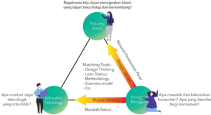

> **Deskripsi Visual:** Gambar ini adalah diagram yang menunjukkan proses penciptaan bisnis yang berkelanjutan. Diagram ini terdiri dari beberapa elemen utama:

1. **Apa yang ditampilkan secara keseluruhan**: Gambar ini menunjukkan proses penciptaan bisnis melalui berbagai tahap, mulai dari ide awal hingga implementasi dan pengembangan bisnis.

2. **Elemen-elemen utama dan relasinya**: 
   - **Peluang Bisnis**: Ini adalah titik awal di mana ide bisnis dimulai.
   - **Matching Tools**: Ini mencakup teknologi dan metode yang digunakan untuk memecahkan masalah.
   - **Design Thinking**: Ini adalah metode yang digunakan untuk merancang solusi bisnis.
   - **Business Model Canvas**: Ini adalah alat yang digunakan untuk menggambar model bisnis.
   - **Proses Validasi**: Ini adalah tahap di mana solusi bisnis diperiksa oleh konsumen.
   - **Konfigurasi Penggunaan**: Ini adalah tahap di mana bisnis diterapkan dan dikembangkan.
   - **Apa masalah dan kebutuhan konsumen?**: Ini adalah pertanyaan penting yang harus dijawab sebelum memulai bisnis.

3. **Teks, angka, atau label penting yang terlihat**:
   - "Peluang Bisnis" (titik awal)
   - "Matching Tools", "Design Thinking", "Business Model Canvas"
   - "Proses Validasi", "Konfigurasi Penggunaan"
   - "Apa masalah dan kebutuhan konsumen?"

4. **Informasi kunci yang dapat diambil pembaca**:
   - Proses penciptaan bisnis melibatkan ide awal, penggunaan teknologi dan metode, validasi solusi, dan pengembangan bisnis.
   - Pentingnya memahami kebutuhan konsumen sebelum memulai bisnis.
   - Metode seperti Design Thinking dan Business Model Canvas sangat berguna dalam proses ini.

Dengan demikian, gambar ini memberikan panduan tentang bagaimana menciptakan bisnis yang berkelanjutan dengan menggunakan berbagai teknologi dan metode.

Sumber: Direktorat SMA, Kemdikbud (2019)

Di  dalam  gambar  2.4  kalian  dapat  menemukan  kosakata  dalam bahasa  Indonesia  yang  bercampur  dengan  bahasa  Inggris.  Apa  yang harus kalian lakukan?

- Carilah padanan dari kata-kata dalam bahasa Inggris tersebut.
- Gunakan kata-kata pada poin a masing-masing dalam satu kalimat yang tepat tentang bisnis.

---
**📊 Tabel**

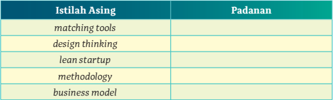

Tabel ini menunjukkan hubungan antara istilah-istilah asing dalam bahasa Inggris dengan padanan bahasa Indonesia. Topik utama tabel ini adalah "Metodologi dan Model Bisnis". Kolom pertama berisi istilah asing seperti "matching tools", "design thinking", "lean startup", "methodology", dan "business model". Kolom kedua berisi padanan bahasa Indonesia untuk setiap istilah asing tersebut. Dari tabel ini, kita dapat melihat bahwa istilah-istilah asing tersebut memiliki padanan yang jelas dalam bahasa Indonesia, yang menunjukkan bahwa mereka merupakan konsep atau metode yang serupa dalam bidang bisnis dan teknologi.

 

---
## 📄 Halaman 62

### D.  Menggunakan Kalimat Efektif

Menggunakan kalimat dengan ejaan (tata tulis) yang baik.

Di dalam teks informasi 2, kalian dapat menemukan beberapa kesalahan berbahasa dari segi penggunaan ejaan (tata tulis) pada kalimat. Berikut ini hasil analisis kesalahan berbahasa pada teks Informasi 2.

### 1. Penggunaan Tanda Baca

- Tanda titik dua (:) pada kalimat 'Berikut kualifikasi persyaratan yang harus dipenuhi oleh seluruh peserta:' kurang tepat karena terdapat perincian setelahnya berupa kalimat. Perhatikan contoh berikut ini.

### Tanda Baca pada Pemerincian

### Contoh 1:

Persyaratan dokumen peserta untuk mengikuti perlombaan, yaitu

- fotokopi KTP/SIM/Paspor,
- pasfoto 4 cm x 6 cm, dan
- daftar riwayat hidup.
Pada kata 'yaitu' tidak perlu dibubuhi tanda titik dua. Perincian berupa kata atau frasa (kelompok) kata menggunakan tanda koma (,) dan diakhiri dengan tanda titik.

### Contoh 2:

Berikut ini ialah langkah-langkah pendaftaran yang harus dilakukan:

- mendaftar melalui situs web;
- mengisi identitas pendaftar di situs web; dan
- mengirimkan dokumen persyaratan selambat-lambatnya tanggal 2 Mei 2021.

### Contoh 3:

Mohon untuk diingat

- mendaftar melalui situs web;
- mengisi identitas pendaftar di situs web; dan
- mengirimkan dokumen persyaratan selambat-lambatnya tanggal 2 Mei 2021.

 

---
## 📄 Halaman 63

- Jadi, pada kalimat tersebut lebih tepat menggunakan tanda titik (.). Silakan  kalian  cari  di  dalam  PUEBI  tentang  kaidah/aturan  penggunaan tanda titik dua (:).
- Tanda hubung (-) pada keterangan 'FIKSI 2016-2019' juga tidak tepat digunakan. Jika  yang dimaksud adalah 2016 sampai dengan 2019, tanda yang digunakan adalah tanda pisah (-), contoh 2016-2019.

### 2. Penggunaan Huruf Kapital

Di dalam teks terdapat penggunaan huruf kapital yang kurang tepat, yaitu frasa 'Rintisan usaha' dan 'Rencana bisnis'. Semestinya frasa (kata gabung)  tersebut  tidak  perlu  ditulis  dengan  huruf  kapital.  Demikian pula  perincian  pada  poin  10  semestinya  tidak  dimulai  dengan  huruf kapital karena berupa klausa (anak kalimat). Silakan kalian cari perihal penggunaan huruf kapital pada PUEBI.

### 3. Penulisan Huruf Italik

Huruf  italik  di  antaranya  digunakan  untuk  menuliskan  kata  dalam bahasa  asing  atau  bahasa  daerah.  Pada  teks  informasi  terdapat  kata copy dan online yang tidak ditulis miring. Berbeda halnya dengan kata business plan dan original yang  ditulis  miring.  Artinya,  penulis  tidak konsisten  menerapkan  kaidah  ejaan.  Sebenarnya,  kata copy dapat dipadankan  menjadi  'salinan'  dan online dapat  dipadankan  dengan 'daring' (dalam jaringan).

### 4. Penggunaan Kata Baku

Kata baku digunakan di dalam teks resmi atau formal. Teks informasi di atas termasuk teks resmi sehingga harus menggunakan kata baku. Di dalam teks terdapat penggunaan kata tidak baku yaitu 'orisinil' dan 'portal'. Bentuk baku dari kata 'orisinil' adalah 'orisinal'. Adapun kata 'portal'  yang  termasuk  istilah  bidang  komputer  merupakan  ragam cakapan. Bentuk baku dari 'portal' adalah 'situs web' ( website ).

### 5. Penulisan Kata Bentukan

- Di dalam teks paragraf pertama terdapat kalimat: … Rencana usaha disusun  secara  individual  dan/atau  kelompok,  dengan  mengatasnamakan SMA tempat peserta didik sekolah .  Adakah kata yang ditulis tidak tepat? Ada kata 'sekolah' yang harusnya ditulis 'bersekolah' sebagai  kata  kerja.  Jadi,  yang  tepat  adalah … tempat peserta didik bersekolah.

 

---
## 📄 Halaman 64

- Kata 'perorangan' termasuk kata bentukan (berimbuhan) yang kurang tepat. Semestinya kata itu dibentuk dari rumus: per+ seorang + -an sehingga bentuk bakunya adalah 'perseorangan' bukan 'perorangan' yang bermakna 'yang berkaitan dengan orang secara pribadi'.
Ejaan disebut juga tata tulis yang harus diterapkan pada tulisan sebagai sebuah konvensi (kesepakatan) dari para ahli bahasa dan praktisi bahasa. Penerapan ejaan harus sesuai dengan PUEBI, terutama diwajibkan di dalam dokumen-dokumen resmi. Jika kalian kelak memeriksa dokumen tertulis, kalian dapat mengeditnya terutama dari segi ejaan di dalam karya tulis tersebut.

### Ayo Berlatih

Perbaikilah penulisan kalimat berikut ini sesuai dengan Pedoman Umum Ejaan Bahasa Indonesia .

- Lima  orang  yang  akan  mewakili  SMA  Merah  Putih,  yaitu:  Dian, Mustaqim, Bara, Indah dan Frans.
- Seminar itu akan diselenggarakan pukul 9.00-12.00 bertempat di Aula SMA Merah Putih.
- Menurut pak Guru Hamid, nanti pukul 14.00 para Guru akan melaksanakan rapat di ruang guru.
- Mereka membeli french fries di Kendari Fried Chicken.
- Sekadar menginformasikan bahwa portal di kompleks Pondok mutiara akan dibuka tutup selama PKM mikro Covid-19.

 

---
## 📄 Halaman 65

### E. Kiat Menyajikan Data di dalam Teks

Menggunakan format penyajian data yang efektif untuk mendukung ide pokok di dalam teks.

Menyajikan data dalam berbagai bentuk.

Data  sangat  penting  dalam  sebuah  tulisan  nonfiksi  karena  berfungsi memperjelas informasi untuk mendukung ide pokok tulisan. Sebuah teks atau wacana tentang kewirausahaan sosial akan lebih jelas dan kukuh jika didukung data tentang jumlah wirausaha sosial di Indonesia.

Sebagai contoh, kalian dapat menyebutkan data seperti ini, 'Kerugian kami  sangat  besar  karena  kesalahan  produk.'  Data  seperti  ini  dianggap tidak akurat karena 'kerugian sangat besar' itu tidak diketahui detailnya.

Untuk  memahami  bagaimana  data  itu  disajikan,  bacalah  uraian berikut ini.

- Sebuah data dapat disajikan di dalam teks dalam berbagai bentuk. Ada data yang disajikan dalam bentuk kalimat-kalimat penjelasan seperti contoh berikut.
Jakarta, Petrominer -Kementerian Perindustrian (Kemenperin) melalui Direktorat Jenderal Industri Kecil, Menengah dan Aneka (IKMA) terus memacu jumlah wirausaha muda di sektor industri kreatif. Tentunya, upaya ini untuk mendukung kontribusi positif terhadap perekonomian nasional, dan sekaligus membawa efek ganda ( multiplier effect ) bagi pertumbuhan ekonomi kreatif di tanah air.

Langkah tersebut terkait dengan penelitian yang dilaksanakan oleh IDN Research Institute ( Indonesia Millenial Report 2019 ). Dimana disebutkan bahwa 94,4 persen generasi milenial Indonesia telah terkoneksi dengan internet. Selain itu 69,1 persen generasi milenial berminat untuk membuka usaha, artinya 7 dari 10 milenial memiliki jiwa entrepreneurship (kewirausahaan).

Sumber: Nonies/Petrominer.com

 

---
## 📄 Halaman 66

- Data juga dapat disajikan dalam bentuk tabel seperti berikut ini.
- Selain tabel, sebuah data juga dapat disajikan dalam bentuk grafik atau diagram seperti berikut.

---
**🖼️ Gambar/Diagram**

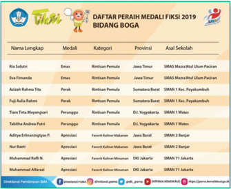

> **Deskripsi Visual:** Gambar ini adalah daftar peraih medali FIKSIKI 2019 Bidang Boga. Daftar ini mencakup 10 nama lengkap peserta yang meraih medali dalam berbagai kategori. Setiap nama lengkap disertai dengan jenis medali (Emas, Perak, Perunggu), kategori, provinsi, asal sekolah, dan poin yang diperoleh. Nama-nama tersebut tersebar di beberapa provinsi, seperti Jawa Timur, Sumatera Barat, DKI Jakarta, dan Jawa Tengah. Informasi penting lainnya termasuk poin yang diperoleh oleh setiap peserta, yang bervariasi antara 1-8 poin. Ini menunjukkan bahwa FIKSIKI 2019 merupakan ajang kompetisi yang cukup tinggi, dengan banyak peserta yang berhasil meraih medali.

Sumber: Direktorat SMA/Kemdikbud (2019)

---
**🖼️ Gambar/Diagram**

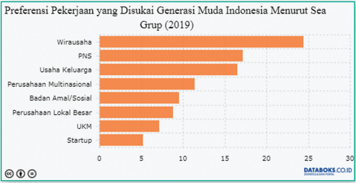

> **Deskripsi Visual:** Gambar ini adalah diagram vertikal yang menunjukkan preferensi pekerjaan yang diungkapkan oleh generasi muda Indonesia berdasarkan hasil survei Sea Group pada tahun 2019. Diagram ini terdiri dari beberapa elemen utama:

1. **Teks dan Angka**: Gambar ini menggambarkan preferensi pekerjaan dengan menggunakan warna-warna yang berbeda untuk setiap jenis pekerjaan. Teks "Wirausaha" dan "PNS" muncul di bagian atas, sementara "Usaha Keluarga", "Perusahaan Multinasional", "Badan Amal/Sosial", "Perusahaan Lokal Besar", "UKM", dan "Startup" muncul di bawahnya.

2. **Elemen Utama dan Relasinya**: Setiap jenis pekerjaan memiliki panjang garis yang berbeda-beda, yang menunjukkan jumlah responden yang memilih pekerjaan tersebut. Garis yang paling panjang menunjukkan "Wirausaha" dengan angka sekitar 25, sedangkan garis yang paling pendek menunjukkan "Startup" dengan angka sekitar 5.

3. **Informasi Kunci**: Dari gambar ini, kita dapat mengetahui bahwa "Wirausaha" adalah pekerjaan yang paling diminati oleh generasi muda Indonesia, diikuti oleh "Usaha Keluarga". Pekerjaan-pekerjaan lain seperti "Perusahaan Multinasional", "Badan Amal/Sosial", "Perusahaan Lokal Besar", "UKM", dan "Startup" juga memiliki jumlah responden yang cukup besar, tetapi kurang dibandingkan dengan "Wirausaha" dan "Usaha Keluarga".

Dengan demikian, gambar ini memberikan gambaran yang jelas tentang preferensi pekerjaan generasi muda Indonesia pada tahun 2019, menunjukkan bahwa mereka cenderung lebih tertarik pada pekerjaan yang lebih berisiko dan memiliki potensi untuk berkembang dibandingkan dengan pekerjaan yang lebih stabil dan formal.

Sumber: Sea Grup/Databoks.co.id (2019)

 

---
## 📄 Halaman 67

Saat  ini  penyajian  data  dalam  bentuk  infografik  sudah  populer  dilakukan sebagaimana telah kalian pelajari bab sebelumnya.

---
**🖼️ Gambar/Diagram**

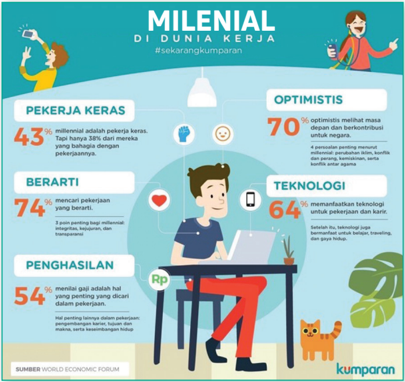

> **Deskripsi Visual:** Gambar ini adalah infografis yang menunjukkan karakteristik milenial dalam dunia kerja. Infografis ini terdiri dari beberapa elemen utama:

1. Judul: "Milenial di Dunia Kerja" dengan hashtag #sekarangkumpran.
2. Gambar dua karakter manusia yang menggambarkan dua perspektif tentang kerja milenial.
3. Teks informasi yang berada di sepanjang gambar, mencakup berbagai poin penting tentang karakteristik milenial.
4. Angka yang menunjukkan persentase atau data spesifik tentang karakteristik milenial.

Elemen-elemen utama dan relasinya adalah sebagai berikut:

- Gambar karakter manusia di sisi kiri menunjukkan karakteristik kerja keras (43%), optimis (70%), berarti (74%), dan penghasilan (54%).
- Gambar karakter manusia di sisi kanan menunjukkan karakteristik teknologi (64%) dan penggunaan teknologi (89%).

Teks, angka, atau label penting yang terlihat antara lain:
- "PEKERJA KERAS": 43%
- "BERARTI": 74%
- "PENGHASILAN": 54%
- "TEKNOLOGI": 64%
- "OPTIMISISTI": 70%

Informasi kunci yang dapat diambil pembaca melalui infografis ini adalah bahwa milenial cenderung lebih kreatif, optimis, dan memiliki nilai-nilai yang berarti terhadap pekerjaannya. Selain itu, mereka juga sangat bergantung pada teknologi dan memiliki harapan yang tinggi terhadap penghasilan mereka.

Sumber: Kumparan.com (2021), dengan perubahan

### Ayo Berlatih

Carilah  sebuah  laporan  yang  mengandung  data.  Sebutkanlah  bentuk penyajian  data  di  dalam  laporan  tersebut.  Berikan  pendapatmu  tentang data yang disajikan. Apakah data tersebut sangat efektif serta mendukung ide pokok di dalam bacaan?

 

---
## 📄 Halaman 68

---
**📊 Tabel**

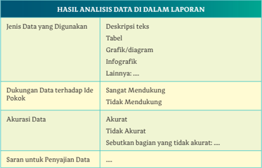

Tabel ini menunjukkan hasil analisis data dalam sebuah laporan. Topik utamanya adalah jenis data yang digunakan, dukungan data terhadap ide pokok, akurasi data, dan saran untuk penyajian data. Dalam kolom "Jenis Data yang Digunakan", informasi tentang deskripsi teks, tabel, grafik/diagram, infografik, dan lainnya disajikan. Kolom "Dukungan Data terhadap Ide Pokok" membandingkan apakah data sangat mendukung, tidak mendukung, atau tidak ada dukungan. Kolom "Akurasi Data" mencakup kriteria akurat atau tidak akurat, dengan penjelasan bagian yang tidak akurat. Terakhir, kolom "Saran untuk Penyajian Data" memberikan saran tentang cara menyajikan data yang lebih baik. Dari tabel ini, dapat dilihat bahwa data yang digunakan beragam, dari deskripsi teks hingga infografik, dan data yang sangat mendukung ide pokok. Akurasi data juga menjadi faktor penting dalam penilaian, dengan beberapa bagian yang tidak akurat. Selain itu, tabel ini memberikan saran untuk penyajian data yang lebih baik, yang dapat membantu dalam penginterpretasian dan analisis lebih efektif.

### F. Menulis Teks Prosedur dari Sumber Informasi yang Valid

Menggunakan sumber informasi yang valid untuk menulis teks prosedur tentang materi kompleks dengan alur yang runut.

### Kegiatan 1

Sebuah proses yang runut dapat digambarkan di dalam sebuah diagram alur. Runut artinya 'jejak' sehingga alur yang runut maksudnya ialah alur yang dapat diketahui awal dan akhirnya secara logis. Kerunutan suatu teks prosedur perlu didukung penggunaan sumber informasi yang valid.

Apakah kalian pernah membaca teks yang memuat prosedur melakukan atau membuat sesuatu? Baca dan cermati informasi berikut ini.

 

---
## 📄 Halaman 69

---
**🖼️ Gambar/Diagram**

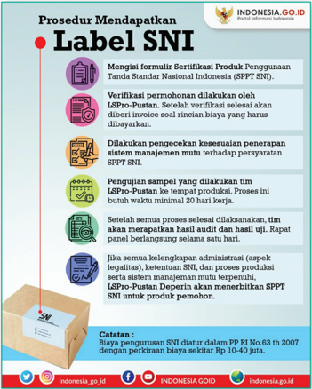

> **Deskripsi Visual:** Gambar ini adalah sebuah infografis yang menjelaskan prosedur mendapatkan label SNI (Sertifikasi Produk Penggunaan Tanda Standar Nasional Indonesia). Infografis ini terdiri dari berbagai elemen visual yang membantu memahami langkah-langkah yang harus dilalui untuk mendapatkan label SNI.

1. **Apa yang Ditampilkan Secara Keseluruhan**: Infografis ini menunjukkan prosedur lengkap untuk mendapatkan label SNI, mulai dari pengisian formulir sertifikasi hingga verifikasi sampel dan penyerahan label.

2. **Elemen-Elemen Utama dan Relasinya**: 
   - **Langkah 1**: Mengisi formulir Sertifikasi Produk Penggunaan Tanda Standar Nasional Indonesia (SPPT SNI).
   - **Langkah 2**: Verifikasi permohonan dilakukan oleh LSPro-Putan. Setelah verifikasi selesai, akan diberi invoice soal rincian biaya yang harus dibayarkan.
   - **Langkah 3**: Dilakukan pencegahan kesesuaian penerapan sistem manajemen mutu terhadap persyaratan SPPT SNI.
   - **Langkah 4**: Penyegaran sampel yang dilakukan tim LSPro-Putan ke tempat produksi. Proses ini butuh waktu minimal 20 hari kerja.
   - **Langkah 5**: Setelah semua proses selesai dilaksanakan, tim akan merapatkan hasil audit dan hasil uji. Uji rapat berlangsung selama satu hari.
   - **Langkah 6**: Jika semua belengkapan administratif (aspok legalitas), ketentuan SNI, dan proses produksi serta sistem manajemen mutu terpenuhi, LSPro-Putan Deperan akan menerbitkan SPPT SNI untuk produk pemohon.

3. **Teks, Angka, atau Label Penting yang Terlihat**:
   - **Teks Penting**: "Indonesia.go.id", "Label SNI", "SPPT SNI", "LSPro-Putan", "20 hari kerja".
   - **Angka Penting**: "20".

4. **Informasi Kunci yang Dapat Diambil Pembaca**:
   - Proses mendapatkan label SNI melibatkan banyak tahap

Sumber: Indonesia.go.id

Portal  informasi  Indonesia.go.id  memuat  prosedur  mendapatkan label  SNI  (Standar  Nasional  Indonesia)  sebagai  pengakuan  mutu  sebuah produk. Bandingkan dengan informasi dari Badan Standardisasi Nasional (BSN) berikut ini.

 

---
## 📄 Halaman 70

---
**🖼️ Gambar/Diagram**

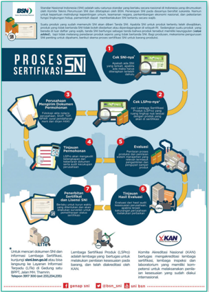

> **Deskripsi Visual:** Gambar ini adalah diagram yang menunjukkan proses sertifikasi produk BSN (Badan Standarisasi Nasional). Diagram ini terdiri dari beberapa elemen utama:

1. **Pertama**: Gambar sebuah lembaran kertas dengan tulisan "Perusahaan" dan "Sertifikasi Produk", menunjukkan bahwa proses sertifikasi dimulai oleh perusahaan.

2. **Kedua**: Gambar sebuah lembaran kertas dengan tulisan "Cek SNI-nya" dan "Cek LSPro-nya", menunjukkan dua tahap awal dalam proses sertifikasi, yaitu pengecekan SNI (Standar Nasional Indonesia) dan LSPro (Lembaga Sertifikasi Produk).

3. **Tiga**: Gambar sebuah lembaran kertas dengan tulisan "Tes/Inspeksi", menunjukkan tahap tes atau inspeksi yang dilakukan pada produk.

4. **Empat**: Gambar sebuah lembaran kertas dengan tulisan "Evaluasi", menunjukkan tahap evaluasi hasil tes/inspeksi.

5. **Kelima**: Gambar sebuah lembaran kertas dengan tulisan "Fenomena dan Lain-Lain", menunjukkan tahap fenomena dan laporan lainnya yang mungkin diperlukan.

6. **Enam**: Gambar sebuah lembaran kertas dengan tulisan "Finis dan Hasil Evaluasi", menunjukkan tahap finis dan hasil evaluasi.

7. **Tujuh**: Gambar sebuah lembaran kertas dengan tulisan "Lembaga Sertifikasi Produk (LSPro)", menunjukkan bahwa hasil evaluasi akan dikirim ke lembaga sertifikasi produk.

8. **Kedelapan**: Gambar sebuah lembaran kertas dengan tulisan "Kemudian, Sertifikasi Produk (LSPro) dilakukan berdasarkan yang bertanggung jawab untuk melaksanakan proses sertifikasi produk tersebut", menunjukkan bahwa setelah hasil evaluasi diterima, lembaga sertifikasi produk akan melakukan sertifikasi produk.

9. **Satu** dan **Dua**: Gambar sebuah lembaran kertas dengan tulisan "Untuk mencari SNI dan informasi Lembaga Sertifikasi, silahkan hubungi KAN (Kementerian Komunikasi dan

Sumber: BSN

Dengan demikian, dapat dipahami bahwa teks prosedur pengurusan SNI  yang  dimuat  di  Indonesia.go.id  berasal  dari  sumber  resmi  BSN. Berdasarkan BSN terdapat tujuh langkah proses sertifikasi SNI, sedangkan Indonesia.go.id memuat prosedur mendapatkan label SNI dalam enam poin. Inti teks prosedur itu sebenarnya sama.

Teks prosedur adalah teks yang disusun berdasarkan urutan proses. Penulis harus memastikan urutan proses yang benar berdasarkan sumber yang tepercaya. Urutan proses yang tidak benar tentu dapat menimbulkan permasalahan bagi pembaca.

 

---
## 📄 Halaman 71

### Cara Menulis Teks Prosedur

Bagaimana menulis teks prosedur yang baik? Ikuti langkah berikut ini.

- Pastikan  kalian  telah  mendapatkan  informasi  prosedur  atau  urutan proses  yang  valid  dari  sumber  tepercaya.  Perhatikan  urutan  proses yang akan dituliskan dalam teks prosedur.
- Buatlah  teks  dalam  bentuk  poin-poin  prosedur  mulai  awal  hingga akhir. Poin prosedur dapat ditulis dengan kalimat berita atau kalimat perintah . Perhatikan contoh berikut ini.
- Peserta mendaftar melalui situs web FIKSI dengan membuat akun pribadi. (kalimat berita)
- Daftarkan  diri  Anda  ke  situs  web  FIKSI  dengan  membuat  akun pribadi. (kalimat perintah)
Cek kembali penjelasan atau perintah di dalam teks prosedur. Apakah teks tersebut dapat dipahami dengan baik. Gunakan kalimat yang ringkas serta pilihan kata yang mudah dipahami.

Perhatikan diagram alur berikut ini terkait alur pendaftaran FIKSI 2020.

---
**🖼️ Gambar/Diagram**

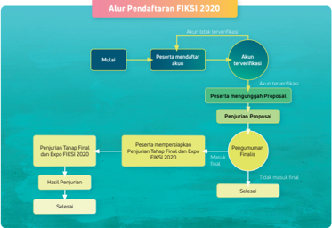

> **Deskripsi Visual:** Gambar ini adalah diagram yang menunjukkan alur pendaftaran FIKSI 2020. Diagram ini terdiri dari beberapa tahap yang disusun secara kronologis dari awal hingga akhir proses pendaftaran. 

1. **Pertama**: Mulai, peserta mendaftar akun.
2. **Kedua**: Peserta mengunggah Proposal.
3. **Ketiga**: Penjurian Proposal.
4. **Keempat**: Penjurian Tahap Final dan Expo FIKSI 2020.
5. **Kelima**: Hasil Penjurian.

Elemen-elemen utama dalam diagram ini meliputi:
- **Akun Server/Cloud**: Tempat peserta melakukan login untuk mengakses sistem pendaftaran.
- **Proposal**: Dokumen yang harus diunggah oleh peserta untuk mendapatkan perhatian dari penjurian.
- **Penjurian Proposal**: Proses penilaian proposal oleh panel penjurian.
- **Penjurian Tahap Final dan Expo FIKSI 2020**: Tahap akhir di mana peserta memperoleh hasil penjurian dan berpartisipasi dalam Expo FIKSI 2020.
- **Hasil Penjurian**: Informasi tentang hasil penjurian dan pengumuman pemenang.

Informasi kunci yang dapat diambil pembaca meliputi:
- Proses pendaftaran yang terstruktur dan terorganisir dengan baik.
- Tahapan-tahapan penting dalam proses pendaftaran, mulai dari registrasi hingga penentuan pemenang.
- Pentingnya mengunggah Proposal sebagai bagian dari proses pendaftaran.

Sumber: Direktorat SMA/Kemdikbud (2020)

 

---
## 📄 Halaman 72

Perhatikan contoh teks prosedur berikut ini yang disusun berdasarkan diagram alur di atas.

### Prosedur Pendaftaran FIKSI 2020

- Peserta mendaftar melalui situs web FIKSI dengan membuat akun pribadi.
- Setelah akun diverifikasi, peserta mengunggah proposal.
- Proposal akan dinilai oleh dewan juri.
- Peserta yang lolos final akan diumumkan.
- Peserta yang lolos ke final mempersiapkan penjurian tahap final dan Expo 2020.
- Penjurian tahap final dan Expo 2020 diselenggarakan.
- Hasil penjurian diumumkan.

### Kegiatan 2

Apakah kalian  sudah  memahami  tentang  cara  penulisan  teks  prosedur? Berikut ini merupakan teks prosedur yang terlampir di Pedoman Festival Inovasi dan Kewirausahaan Peserta didik Indonesia Tahun 2020. Sebagaimana kalian ketahui bahwa pada awal tahun 2020, hampir seluruh dunia terkena dampak  pandemi  Covid-19.  Beberapa  kegiatan  yang  melibatkan  banyak orang dibatalkan, ditunda, atau diubah menjadi kegiatan daring, termasuk kegiatan FIKSI 2020. Panitia kegiatan FIKSI 2020 menyusun teks prosedur terkait dengan persebaran virus Covid-19 di Indonesia.

### PANDUAN TAMBAHAN FIKSI MENYIKAPI PERSEBARAN VIRUS COVID-19 DI INDONESIA

Hal-hal yang perlu diperhatikan para calon peserta fiksi adalah sebagai berikut.

- Calon peserta FIKSI diimbau untuk tetap melakukan pembatasan fisik ketika melakukan pembuatan rencana dan/atau produk usaha. Panitia menyarankan menggunakan konferensi jarak jauh untuk berkoordinasi dengan rekan satu tim atau pihak lain.
- Calon peserta FIKSI diimbau untuk tidak melakukan perjalanan yang berhubungan dengan pembuatan rencana dan/atau produk usaha ke daerah yang berpotensi atau telah terpapar virus Covid-19.
- Calon peserta FIKSI yang tidak sehat dan memiliki riwayat perjalanan dari negara atau daerah terpapar Covid-19 harus melakukan karantina mandiri selama 14 hari di rumah.

 

---
## 📄 Halaman 73

- Calon peserta FIKSI yang merasa tidak sehat, tidak perlu memaksakan diri untuk mempersiapkan rencana dan/atau produk usaha, serta disarankan untuk segera memeriksakan diri ke fasilitas pelayanan kesehatan terdekat.
- Jika pembuatan rencana usaha dan/atau produk dilakukan di sekolah, terlebih dahulu harus mendapatkan izin dari orang tua dan pihak sekolah. Sekolah wajib menyediakan fasilitas cuci tangan yang memadai.
- Fasilitas cuci tangan yang dimaksud adalah sabun, air, dan pencuci tangan berbasis alkohol.
- Jika pembuatan rencana usaha atau produk dilakukan di luar sekolah maka harus mendapatkan izin dari orang tua diketahui oleh guru pembimbing dan dilaksanakan dengan tetap memperhatikan kaidah pencegahan Covid-19.
- Calon peserta harus menerapkan Perilaku Hidup Bersih dan Sehat (PHBS), seperti mencuci tangan secara teratur menggunakan air dan sabun atau pencuci tangan berbasis alkohol serta menghindari menyentuh area wajah yang tidak perlu.
- Hindari berjabatan tangan dengan rekan/orang lain, dan pertimbangkan untuk mengadopsi alternatif bentuk sapa lain.
- Sampai saat ini, lomba FIKSI akan tetap diselenggarakan dengan mematuhi prosedur pencegahan Covid-19.
- Peraturan ini dapat berubah sewaktu-waktu sesuai dengan perkembangan kasus Covid-19.
Dikutip dengan pengeditan pada ejaan .

Sumber: Pusat Prestasi Nasional, Sekretaris Jenderal Pendidikan dan Kebudayaan, Pedoman Festival Inovasi dan Kewirausahaan Peserta didik Indonesia Tahun 2020

### Ayo Berlatih

- Apa yang dapat kalian simpulkan dari teks prosedur 'Panduan Tambahan Fiksi Menyikapi Persebaran Virus Covid-19 di Indonesia'?
- Adakah poin prosedur 'Panduan Tambahan Fiksi Menyikapi Persebaran Virus Covid-19 di Indonesia' yang tidak kalian pahami? Sebutkan poin tersebut.
- Buatlah teks prosedur dari infografik tentang mengu  rus/mencatatkan hak cipta berikut ini. Di dalamnya masih terdapat istilah dalam bahasa Inggris,  terutama  terkait  bidang  TIK.  Lakukan  kegiatan  berikut  ini sebelumnya.
- Telusurilah  sumber  teks  prosedur  ini  di  www.dgip.go.id.  Carilah informasi tentang biaya pengurusan/pencatatan hak cipta. Sampaikan hasil penelusuran kalian secara lisan.

 

---
## 📄 Halaman 74

- Buatlah teks prosedur dengan bahasa kalian sendiri. Gunakan istilah dalam bahasa Indonesia.

---
**🖼️ Gambar/Diagram**

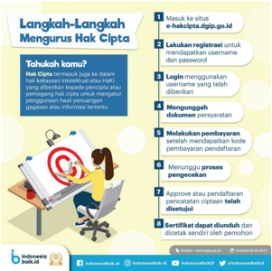

> **Deskripsi Visual:** Gambar ini adalah ilustrasi yang menunjukkan langkah-langkah mengurus hak cipta. Gambar ini terdiri dari beberapa elemen utama:

1. **Judul**: "Langkah-Langkah Mengurus Hak Cipta"
2. **Pengantar**: "Tahukah kamu?"
   - Pertanyaan: "Hak cipta adalah hak intelektual yang diberikan kepada penulis, pengrajin, atau penemu untuk mempertahankan keberadaan hasil penelitian, pengembangan, atau penemuan mereka."
3. **Langkah-langkah**:
   - **1**: Masuk ke situs e-hakcipta.digip.go.id
   - **2**: Lekalukan registrasi untuk mendapatkan username dan password
   - **3**: Login menggunakan username dan password yang telah diberikan
   - **4**: Mempertahankan dokumen persyaratan
   - **5**: Melakukan pembayaran setelah mendapatkan kode pembayaran pendaftaran
   - **6**: Menunggu proses pengesahan
   - **7**: Approve dan pendaftaran pencetakan telah disetujui
   - **8**: Sertifikat diunduh dan dicetak sendiri oleh pemohon

4. **Informasi Kunci**:
   - Langkah-langkah mengurus hak cipta secara lengkap
   - Proses registrasi dan login
   - Pentingnya mempertahankan dokumen persyaratan
   - Proses pembayaran dan pengesahan
   - Proses approval dan pencetakan sertifikat

Gambar ini memberikan panduan lengkap tentang proses mengurus hak cipta, mulai dari registrasi hingga pencetakan sertifikat, dengan menjelaskan setiap langkah secara detail.

Sumber: IndonesiaBaik.id (2019) ,dengan perubahan

### G.  Kiat Menyampaikan Gagasan secara Runut

### Kegiatan 1

Menyampaikan ide/gagasan informatif secara runut dengan menggunakan contoh-contoh yang mendukung.

Setelah mempelajari banyak hal dalam Bab 2 ini, kalian mendapat tantangan untuk mempresentasikan ide atau gagasan wirausaha. Sebelum itu, pelajari dulu hal berikut ini.

 

---
## 📄 Halaman 75

Presentasi usaha atau presentasi bisnis adalah teks dan gambar yang mengandung rencana bisnis dari suatu produk atau jasa. Teks dan gambar tersebut lazim dibuat dalam bentuk salindia. Kalian dapat menggunakan aplikasi pembuat salindia atau presentasi.

Di dalam presentasi usaha terdapat poin-poin informasi berikut ini:

- profil usaha (nama usaha, pendiri/pemilik usaha, visi dan misi);
- produk atau jasa yang ditawarkan;
- proses produksi;
- keunggulan produk atau jasa;
- analisis kekuatan, kelemahan, peluang, dan tantangan;
- strategi pemasaran;
- target penjualan per tahun; dan
- kebutuhan permodalan.
Jika kalian ingin menjadi seorang wirausaha, tentu kalian perlu memiliki keterampilan mempresentasikan ide usaha kalian apabila mengikuti suatu lomba  atau  hendak  mendapatkan  pendanaan  dari  investor.  Bagaimana mempertimbangkan ide usaha?

Ide usaha bagi peserta didik SMA harus memenuhi kriteria berikut ini:

- menjawab permasalahan banyak orang sebagai solusi;
- memungkinkan itu dilaksanakan atau diproduksi dengan cara sederhana;
- bahan baku tersedia dengan mudah dan murah;
- tidak membahayakan bagi lingkungan; dan
- memiliki pasar yang potensial di masyarakat.
Bagaimana mempresentasikan sesuatu secara efektif dan mengena? Ikuti tip berikut ini.

- Persiapkan diri secara lebih baik dengan cara berikut: (a) mempelajari materi yang akan dipresentasikan; (b) menentukan busana yang akan digunakan; (c) mengenali audiensi (pendengar/pemirsa presentasi); dan (d) mengetahui durasi (waktu yang disediakan) untuk presentasi.
- Cek  terlebih  dahulu  alat-alat  pendukung  presentasi,  seperti  laptop, pointer ,  dan  proyektor,  terutama  sambungan  daya  listrik.  Pastikan semua peralatan berfungsi dengan baik.

 

---
## 📄 Halaman 76

- Bukalah presentasi dengan mengucapkan salam kepada audiensi yang hadir.  Kalian  juga  dapat  mengucapkan  salam  penghormatan  kepada audiensi khusus, seperti pejabat dan tokoh yang hadir.
- Sampaikan garis besar materi yang akan kalian presentasikan dalam satu menit pertama secara ringkas. Ungkapkanlah data atau fakta yang dapat menarik perhatian audiensi.
- Selanjutnya,  mulailah  menjelaskan  salindia  yang  ditampilkan  secara tahap demi tahap. Pastikan susunan salindia sudah runtut dan sistematis.
- Tataplah audiensi, lakukan kontak mata kepada beberapa orang audiensi dalam beberapa detik. Hindarkan selalu melihat ke salindia karena hal itu menunjukkan kalian tidak menguasai apa yang dipresentasikan.
Sampaikan presentasi secara rileks, hindarkan kesan kaku dan tegang saat berbicara.

### Ayo Berlatih

- Bergabunglah dengan kelompok kalian untuk mendiskusikan bidang usaha (produk atau jasa)  yang  akan  disiapkan.  Ingatlah  bahwa  pada dasarnya  tidak  ada  ide  yang  buruk.  Ide  usaha  atau  bisnis  dapat kalian  temukan  dari  permasalahan  yang  terjadi  di  masyarakat. Sebagai  contoh,  gagasan  Tazkira  Turahman  dan  Wa  Ode  Mayuni membuat sabun berbahan rempah-rempah bermerek Sosofi. Mereka berpendapat  bahwa  kulit  yang  cantik  itu  tidak  harus  putih,  yang penting alami dan sehat.

---
**🖼️ Gambar/Diagram**

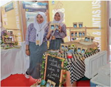

> **Deskripsi Visual:** Gambar ini menunjukkan sebuah pameran atau acara yang berlangsung di sebuah gedung dengan latar belakang berwarna biru dan putih. Di tengah-tengah pameran terdapat dua orang siswa yang sedang berdiri di depan meja pameran mereka. Meja tersebut dilengkapi dengan beberapa barang dan atribut yang menunjukkan bahwa mereka mungkin sedang mengikuti kegiatan atau lomba. Di sebelah kanan meja, terdapat sebuah papan tulis dengan tulisan "Kelas 6 SDN 107" dan beberapa foto yang tampaknya menunjukkan prestasi atau pencapaian mereka. Di sebelah kiri meja, terdapat sejumlah buku dan barang lain yang tampaknya merupakan hasil karya mereka. Seluruh pameran tampak rapi dan profesional, menunjukkan bahwa para siswa telah bekerja keras untuk mempersiapkan dan menyajikan pameran mereka dengan baik.

Sumber: Liputan6.com (2019)

 

---
## 📄 Halaman 77

- Di  dalam  diskusi  kelompok,  setiap  orang  dapat  menyampaikan  ide usaha dan yang lain dapat menanggapinya. Pertimbangkan sebuah ide usaha berdasarkan kriteria ide usaha. Temukanlah contoh-contoh dari produk dan jasa usaha sejenis yang hendak kalian buat.

### Kegiatan 2

Membuat presentasi kewirausahaan.

Andaikan kalian akan menjadi wirausaha muda yang siap mengikuti ajang FIKSI, buatlah presentasi secara berkelompok (dua orang) sebagai portofolio pada  akhir  pembelajaran  bab  ini.  Kalian  dapat  menggunakan  aplikasi presentasi salindia untuk membuatnya dan mempresentasikannya. Siapkan sebanyak sembilan salindia untuk mempresentasikan ide usaha kalian.

Berikut ini matriks presentasi untuk membantu kalian mempersiapkan salindia.

---
**🖼️ Gambar/Diagram**

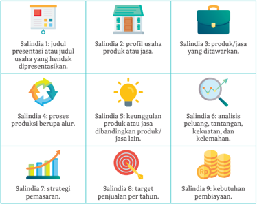

> **Deskripsi Visual:** Gambar ini adalah diagram yang menunjukkan 9 salindia (salidias) yang biasanya digunakan dalam presentasi bisnis atau usaha. Setiap salindia memiliki deskripsi singkat yang menjelaskan tujuan dan isi dari salindia tersebut.

1. **Apa yang ditampilkan secara keseluruhan**: Gambar ini menggambarkan 9 salindia yang berbeda, masing-masing dengan deskripsi singkat tentang apa yang akan dibahas dalam salindia tersebut.

2. **Elemen-elemen utama dan relasinya**: 
   - **Salindia 1**: Judul presentasi atau judul usaha yang hendak dipresentasikan.
   - **Salindia 2**: Profil usaha, produk, atau jasa.
   - **Salindia 3**: Produk/jasa yang ditawarkan.
   - **Salindia 4**: Proses produksi berupa alur.
   - **Salindia 5**: Keunggulan produk atau jasa dibandingkan produk/jasa lain.
   - **Salindia 6**: Analisis peluang, tantangan, kekuatan, dan kelemahan.
   - **Salindia 7**: Strategi pemasaran.
   - **Salindia 8**: Target penjualan per tahun.
   - **Salindia 9**: Kebutuhan pembiayaan.

3. **Teks, angka, atau label penting yang terlihat**:
   - Teks yang penting meliputi judul salindia, deskripsi singkat, dan informasi tambahan seperti peluang, tantangan, kekuatan, kelemahan, target penjualan, dan kebutuhan pembiayaan.

4. **Informasi kunci yang dapat diambil pembaca**:
   - Pembaca dapat memahami bahwa gambar ini adalah diagram yang menggambarkan 9 salindia yang umum digunakan dalam presentasi bisnis atau usaha, serta mendapatkan informasi tentang tujuan dan isi dari salindia tersebut.

Dengan demikian, gambar ini membantu pembaca untuk memahami struktur dan isi dari 9 salindia yang umum digunakan dalam presentasi bisnis atau usaha.

 

---
## 📄 Halaman 78

### H.  Jurnal Membaca

Mengungkapkan kisah inspiratif perjuangan para pelaku UMKM.

Sebuah  usaha  rintisan  pastilah  bermula  dari usaha kecil dan usaha menengah. Istilah UMKM diperkenalkan  untuk  menyebut  usaha  mikro, kecil, dan me  nengah.

Posisi UMKM dalam perekonomian Indonesia sangatlah  penting.  Banyak  kisah  menarik  yang melatari  perjuangan  para  pelaku  UMKM  untuk mem  besarkan usahanya. Begitu juga bagaimana perjuangan mereka mem  pertahankan usahanya di tengah situasi sulit.

Kisah-kisah UMKM di dalam buku ini ditulis oleh Dee Lestari dengan judul Rantai Tak Putus: Ilmu Mumpuni Merawat UMKM Indonesia. Buku ini diterbitkan oleh Bentang Pustaka tahun 2020.

Berikut ini wara buku ( blurb ) yang terdapat di kover belakang buku.

Ke mana pun kita melayangkan pandang, UMKM-Usaha Mikro, Kecil, dan Menengah-selalu hadir. Dari petani cabai hingga pemilik bengkel, UMKM menye  diakan lapangan kerja terbanyak seka  ligus alat terbaik untuk pengentasan kemiskinan dan pemerataan ekonomi. Namun, kuantitas tak selalu bertumbuh selaras dengan kualitas. Lantas, adakah formula ideal untuk menaikkan kelas UMKM di Indonesia?

Dee Lestari, salah seorang penulis terbaik Indonesia, mengajak kita menelusuri jawaban itu. Berkisah lewat narasi nan hidup, Rantai Tak Putus tidak sekadar inspiratif, tetapi juga menyimpan mutiara penting.

Temukan dan bacalah buku ini untuk mendapatkan inspirasi tentang dunia usaha mikro, kecil, dan menengah di Indonesia. Apabila kalian belum dapat mene  mukan buku tersebut, kalian dapat memilih buku atau media lain  yang  memuat  kisah  para  pelaku  UMKM  di  Indonesia  atau  biografi seorang pengusaha yang memulai usahanya dari bawah.

Tulislah  sebuah  catatan  tentang  inspirasi  dan  motivasi  yang  kalian peroleh dari buku tersebut sepanjang 300-600 kata pada kertas berukuran A4 dengan ukuran fon 12 poin dan jarak 1,5 spasi. Beri judul yang menarik dan publikasikanlah di majalah dinding, majalah sekolah, atau media daring.

 

---
## 📄 Halaman 79

---
**🖼️ Gambar/Diagram**

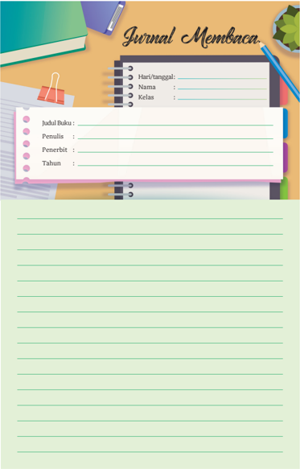

> **Deskripsi Visual:** Gambar ini menunjukkan sebuah lembaran buku pelajaran dengan judul "Jurnal Membaca". Lembaran ini terdiri dari dua bagian utama: bagian atas berisi kolom untuk mengisi informasi seperti tanggal, nama, kelas, judul buku, penulis, penerbit, dan tahun, serta bagian bawah yang berisi ruang kosong untuk tulisan. Di bagian atas, ada beberapa elemen visual yang mencerminkan tema pembacaan, termasuk buku, pensil, dan tinta. Lembaran ini dirancang dengan warna-warna cerah dan desain yang menarik, yang menunjukkan bahwa ia dirancang untuk penggunaan yang efektif dan menyenangkan.

 

---
## 📄 Halaman 80

### I. Refleksi

Merefleksikan semua yang telah dipelajari dan bagian-bagian mana saja yang belum terlalu dikuasai agar dapat menemukan solusinya.

Selamat! Kalian sudah mempelajari Bab 1. Tentu banyak yang sudah dipelajari. Tandai  kegiatan  yang  sudah  dilakukan  atau  pengetahuan  yang  sudah  dipahami dengan tanda centang ( ), ya.

---
**📊 Tabel**

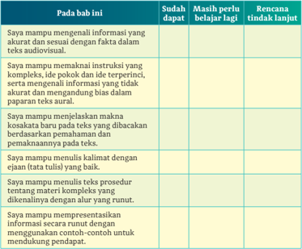

Tabel ini menunjukkan berbagai kriteria atau standar yang harus dicapai oleh siswa dalam memahami dan menerjemahkan informasi dari teks audiovisual ke dalam bahasa tulis. Topik utama tabel ini adalah kemampuan siswa dalam memahami dan menerjemahkan informasi dari teks audiovisual ke dalam bahasa tulis. Kolom-kolom yang ada dalam tabel ini meliputi "Sudah dapat", "Masih perlu belajar lagi", dan "Rencana tidak lanjut". Data atau pola penting yang terlihat dalam tabel ini adalah bahwa siswa harus mencapai semua kriteria untuk mendapatkan nilai tertinggi, sedangkan mereka yang belum mencapai beberapa kriteria akan mendapatkan nilai lebih rendah.

Hitunglah persentase penguasaan materi kalian dengan rumus berikut:

(Jumlah materi yang kalian kuasai/jumlah seluruh materi) 100%

- Jika  70-100%  materi  di  atas  sudah  dikuasai,  kalian  dapat  meminta aktivitas pengayaan kepada guru.
- Jika materi yang dikuasai masih di bawah 70%, kalian dapat mendiskusikan kegiatan remedial yang dapat dilakukan dengan guru.

 

---
## 📄 Halaman 81

KEMENTERIAN PENDIDIKAN, KEBUDAYAAN, RISET, DAN TEKNOLOGI REPUBLIK INDONESIA, 2022

Cerdas Cergas Berbahasa dan Bersastra Indonesia untuk SMA/SMK/MA Kelas XII

Penulis :  Bambang Trimansyah

ISBN

:  978-602-244-724-5

BAB 3

### MEMAHAMI DAN MENDISKUSIKAN FENOMENA KECERDASAN BUATAN

### Pertanyaan Pemantik

- Apakah kalian dapat menemukan ide pokok dan ide pendukung di dalam teks yang panjang?
- Bagaimana cara kalian mengajukan hipotesis (dugaan) atas per­ masalahan yang terjadi berdasarkan informasi yang kalian terima?
- Bagaimana  cara  kalian  menanggapi  suatu  topik  menarik  di dalam diskusi?
- Pernahkah  kalian  mengelaborasi  perasaan  untuk  memahami terjadinya suatu masalah?

 

---
## 📄 Halaman 82

---
**🖼️ Gambar/Diagram**

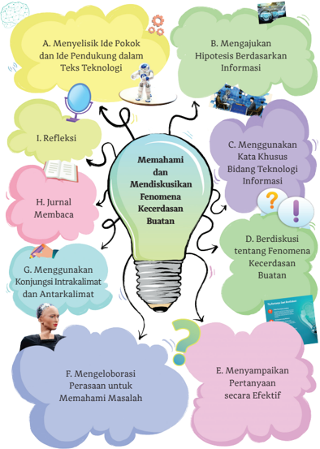

> **Deskripsi Visual:** Gambar ini adalah ilustrasi yang menunjukkan proses penelitian dan pemahaman fenomena kecerdasan buatan (AI) dalam konteks teknologi informasi. Gambar ini terdiri dari beberapa elemen utama yang terhubung oleh garis putih untuk menunjukkan hubungan antara setiap langkah.

1. **Apa yang Ditampilkan Secara Keseluruhan**: Gambar ini menggambarkan proses penelitian AI melalui berbagai tahap, mulai dari menyelidiki ide pokok dan pendukung teks teknologi, hingga mengevaluasi dan menyampaikan pertanyaan secara efektif. Setiap tahap ini dihubungkan dengan elemen-elemen lainnya melalui garis putih.

2. **Elemen-Elemen Utama dan Relasinya**: 
   - **Menyelidiki Ide Pokok dan Pendukung dalam Teknologi** (A): Ini merupakan langkah awal yang melibatkan analisis teks teknologi.
   - **Mengajukan Hipotesis Berdasarkan Informasi** (B): Langkah ini melibatkan pengumpulan data dan informasi untuk mendukung hipotesis.
   - **Memahami dan Mendiskusikan Fenomena Kecerdasan Buan** (C): Langkah ini melibatkan pemahaman konsep AI dan diskusi tentang fenomena-fenomena yang terkait.
   - **Menggunakan Kata Khusus Bidang Teknologi Informasi** (D): Ini melibatkan penggunaan istilah dan terminologi spesifik dalam bidang teknologi informasi.
   - **Menggunakan Konjungsi Intraklimat dan Antarklimat** (G): Langkah ini melibatkan penggunaan logika dan konjungsi dalam penulisan.
   - **Mengelaborasi Perasaan untuk Memahami Masalah** (F): Ini melibatkan pengembangan pemahaman perasaan dan emosi dalam konteks penelitian.
   - **Menyampaikan Pertanyaan secara Efektif** (E): Langkah ini melibatkan penulisan dan penyampaian pertanyaan yang efektif.

3. **Teks, Angka, atau Label Penting yang Ter

 

---
## 📄 Halaman 83

### 7 PEKERJAAN 1 INI BAKAL DIGANTIKAN ROBOT

Pesatnyaperkembangan teknologi dan artificial intelligence ataukecedasan buatan(Al) membuat ini dillakukan.

Gambar 3.2 Pekerjaan Manusia yang Tergantikan Robot

Sumber: CNBC Indonesia

 

---
## 📄 Halaman 84

Pada Bab 3 ini kalian akan mempelajari bagaimana menemukan dan memahami ide pokok serta ide pendukung pada teks yang panjang dengan topik baru. Kalian juga diharapkan mampu mengajukan hipotesis berdasarkan teks dan gambar pendukung yang dipahami. Selain itu, ada tantangan menggunakan kata­kata yang jarang muncul di dalam teks tentang sains.

Mari mendiskusikan topik baru tentang pekerjaan yang bakal tergantikan oleh robot pada masa depan.

Apakah kelak pekerjaan manusia akan tergantikan oleh robot? Pertanyaan ini  setidaknya  tergambar  pada  Gambar  3.2  di  awal  bab  ini.  Ada  tujuh pekerjaan  yang  ditengarai  bakal  tergantikan  oleh  robot  sehingga  peran manusia sebagai pekerja semakin berkurang.

Robot pada awal penciptaannya masihlah sederhana dan hanya mampu bergerak secara mekanis. Akan tetapi, pada masa kini, robot telah dilengkapi dengan  kecerdasan  buatan  ( artificial  intellegence )  yang  membuatnya mampu bertindak dan berpikir seperti manusia. Dalam permainan seperti catur, bahkan robot telah mampu mengalahkan manusia. Hal itulah yang terjadi pada tahun 1996 dan 1997.

Seorang  pecatur  kelas  dunia  bernama  Gary  Kasparov  bertanding melawan  superkomputer  IBM  bernama  Deep  Blue.  Pada  pertandingan pertama  tahun  1996  di  Philadelphia,  Kasparov  mengalahkan  Deep  Blue. Akan tetapi, pada pertandingan kedua tahun 1997 di New York, Kasparov dikalahkan Deep Blue. Pertandingan bersejarah ini diabadikan dalam film dokumenter bertajuk The Man vs. The Machine .

Tentang kehadiran robot ini, National Geographic edisi Desember 2020 menurunkan  laporan  utama  tentang  'Hidup  Bersama  Robot'.  Menurut National Geographic ,  hubungan manusia dan robot sangatlah pelik sejak dulu.  Di  satu  sisi,  kita  menghargai  bagaimana  robot  dapat  menangani hal yang berbahaya dan melaksanakan pekerjaan berulang sehingga kita tidak perlu melakukannya. Robot tidak memerlukan liburan dan asuransi kesehatan. Namun, sebuah jajak pendapat memperlihatkan bahwa pengembangan  robot  membuat  kita  merasa  sangat  tidak  nyaman  dan sekaligus merasa terancam.

 

---
## 📄 Halaman 85

---
**🖼️ Gambar/Diagram**

> **Deskripsi Visual:** Gambar ini adalah foto yang menunjukkan pabrik otomatis dengan berbagai mesin dan robot. Pabrik ini tampak modern dan terorganisir dengan baik. Di bagian atas, terdapat beberapa meja kerja yang dilengkapi dengan alat-alat untuk mengolah bahan baku. Di sepanjang pabrik, berbagai robot bergerak dengan cepat dan akurat, menunjukkan kemampuan mereka dalam melakukan tugas-tugas kompleks. Robot-robot ini memiliki berbagai bentuk dan ukuran, tetapi semua memiliki tujuan yang sama: membantu dalam proses produksi. Selain itu, ada juga beberapa mekanisme dan sistem kontrol yang terlihat di sepanjang pabrik, yang bertujuan untuk memastikan operasional yang efisien dan aman. Gambar ini menunjukkan bahwa teknologi otomatisasi telah menjadi bagian integral dari industri modern, memungkinkan peningkatan efisiensi dan produktivitas.

Sumber: Nataliyahora/Canva Pro (2021)

Hasil  survei  Paw  Research  Center  setelah  2017  menemukan  lebih dari  80%  orang  Amerika  percaya  bahwa  pada  tahun  2050,  robot  akan mengerjakan  lebih  banyak  pekerjaan  dari  yang  kini  dilakukan  manusia. Sekitar  70%  dari  mereka  percaya  akan  membuat  kesenjangan  ekonomi semakin buruk.

Terkait  dengan  topik  baru  ini,  diskusikanlah  bersama  teman­teman kalian pekerjaan yang sangat mungkin tergantikan oleh robot pada masa depan dan pekerjaan yang tidak mungkin dilakukan oleh robot.

### A.  Menyelisik Ide Pokok dan Ide Pendukung dalam Teks Teknologi

Memahami ide pokok dari ide pendukung pada sebuah teks yang panjang dengan topik baru melalui pemahaman terhadap struktur dan hubungan dari bagian-bagian pada teks tersebut.

 

---
## 📄 Halaman 86

### Kegiatan 1

Bacalah dengan saksama teks berikut ini. Di dalamnya terdapat ide pokok dan beberapa ide pendukung.

### Mengenal Kecerdasan Buatan

oleh Bambang Trim

Kecerdasan buatan atau disebut artificial intelligence (AI) boleh jadi baru kalian dengar. Akan tetapi, pada masa kini AI telah berkembang di dalam kehidupan manusia. Contohnya, AI dibenamkan ke dalam gawai, seperti ponsel pintar, komputer/laptop, bahkan sebuah mobil.

Istilah AI atau kecerdasan buatan kali pertama diperkenalkan pada sekolah musim panas di Darthmouth.  John McCarthy yang menggagas pertemuan para ilmuwan AI tersebut kemudian dijuluki sebagai Bapak AI.

Walaupun pertemuan serius baru dimulai pada tahun 1956, teori tentang AI sudah muncul sejak tahun 1941. Perkembangan AI sangat terkait dengan penemuan robot serta penemuan komputer dan pemrograman. AI kemudian disebut sebagai salah satu cabang ilmu komputer yang mendalami kemampuan komputer untuk berpikir dan berperilaku seperti manusia.

Oleh karena itu,  AI sering kali dikaitkan dengan robot yang beberapa di antaranya dibuat mirip manusia. Akan tetapi, AI kini tidak terbatas pada kemampuan manusia yang dibenamkan pada robot atau asisten maya yang terdapat pada mesin peramban seperti Google (Google Assistant) dan pada perangkat keluaran Apple (Siri). AI juga dibenamkan di dalam berbagai mesin dengan kemampuan yang mencengangkan.

### Lebih Jauh tentang Kecerdasan Buatan

Apa definisi kecerdasan buatan? Kecerdasan buatan atau AI adalah simulasi dari kecerdasan yang dimiliki oleh manusia yang dimodelkan di dalam mesin dan diprogram agar mampu berpikir seperti halnya manusia.

Menurut McLeod Jr. dan Scheel (2004), 'Kecerdasan buatan adalah aktivitas penyediaan mesin seperti komputer dengan kemampuan untuk menampilkan perilaku yang dianggap sama cerdasnya apabila kemampuan tersebut ditampilkan oleh manusia.'

Secara ringkas pengertian AI adalah sistem dan program komputer yang mampu melakukan pekerjaan­pekerjaan layaknya seorang manusia ketika menggunakan tenaga dan pikirannya untuk menyelesaikan suatu pekerjaan. AI bekerja berdasarkan data yang diolah dari pengalaman­pengalaman berinteraksi dengan manusia. Ia semakin cerdas melalui interaksi tersebut.

Jadi, AI itu belajar secara cepat untuk menjadi cerdas. Proses berkembangnya AI adalah melalui pembelajaran ( learning ), penalaran ( reasoning ), dan pengoreksian diri ( self correction ). AI mampu belajar sendiri dan berlangsung dengan sangat cepat, bahkan ia mampu belajar dari kesalahan yang pernah dibuatnya.

 

---
## 📄 Halaman 87

Hal itulah yang terjadi pada Deep Blue sehingga kemudian mampu mengalahkan Gary Kasparov. Deep Blue belajar dari kekalahannya dari Kasparov. Ia mengulang kembali langkah­langkah yang telah dilakukan serta belajar dengan simulasi langkah baru.

Bagaimana? Apakah kalian sudah paham tentang AI atau masih bingung bagaimana cara kerjanya?

Satu lagi contoh menarik tentang AlphaGo, sebuah program komputer yang dibuat untuk bertanding dalam gim Go melawan manusia. Awal dikembangkan, AlphaGo diberi data 100 ribu pertandingan Go untuk dipelajari. Selanjutnya, AlphaGo bermain Go dengan dirinya sendiri-kalian dapat bayangkan seseorang bermain catur dengan dirinya sendiri.

AlphaGo belajar dari dirinya sendiri. Setiap ia kalah, ia akan memperbaiki permainannya. Tahukah kalian bahwa proses permainan ini dapat diulang AlphaGo hingga jutaan kali?

---
**🖼️ Gambar/Diagram**

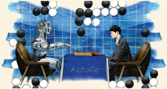

> **Deskripsi Visual:** Gambar ini adalah ilustrasi yang menunjukkan pertarungan antara seorang pemain manusia dan sebuah robot bermain Go. Pada bagian atas, terdapat papan Go dengan berbagai catur hitam dan putih yang tersebar. Di tengah papan Go, ada sebuah robot berwarna biru dengan kepala robot yang tampak seperti manusia. Di samping robot tersebut, terdapat seorang pemain manusia yang sedang bermain Go. Di bawah papan Go, terdapat beberapa orang penonton yang sedang menyaksikan pertarungan. Gambar ini menunjukkan kontras antara kemampuan pemain manusia dan robot dalam bermain Go.

Sumber: Financial Times

Kelebihan AlphaGo yang berbasis AI dibandingkan manusia sangatlah kentara. AI dapat menyimulasikan beberapa pertandingan dalam satu waktu secara bersamaan yang tidak mungkin dilakukan manusia. Pengalaman AlphaGo dan hasil belajarnya berkali lipat manusia. AlphaGo membuktikannya dengan meraih predikat juara dunia Go pada tahun 2016 mengalahkan juara dunia sebelumnya.

### Kesimpulan tentang Kecerdasan Buatan

AI atau kecerdasan buatan dapat melakukan di antara keempat aspek berikut ini:

- kemampuan sistem yang bertindak seperti manusia;
- kemampuan sistem yang dapat berpikir seperti manusia;
- kemampuan sistem yang mampu berpikir secara rasional; dan
- kemampuan sistem yang mampu bertindak secara rasional.

 

---
## 📄 Halaman 88

Hadirnya AI yang kini dapat kalian lihat dan rasakan adalah ketika menggunakan media sosial, sebut saja Facebook. Ketika kalian mengeposkan sebuah foto kegiatan, Facebook dengan teknologi DeepFace mampu mengenali orang­orang di dalam foto tersebut sehingga kalian tidak perlu lagi menandai orang di dalam foto tersebut.

Dari mana Facebook tahu bahwa itu foto orang yang dimaksud? Jawabnya karena Facebook menggunakan AI.

Satu lagi contoh adalah ketika menggunakan aplikasi lokapasar ( market place ) kalian mendapatkan tawaran produk­produk yang pas dengan kebutuhan kalian. Dari mana ia tahu?

Melalui AI yang ditanamkan di suatu aplikasi maka semua yang pernah kalian lihat, cari, dan beli menjadi data yang diproses oleh AI. Hal inilah yang populer disebut jejak digital. Jejak tersebut dibaca oleh AI sebagai data yang dipelajarinya tentang kalian.

Tentu AI berpengaruh terhadap masa depan kita sebagai manusia dan gaya hidup kita. Di satu sisi AI dapat menimbulkan dampak negatif, tetapi di sisi lain ia juga berdampak positif untuk meningkatkan kualitas hidup manusia dan kemudahan­kemudahan menjalani kehidupan.

Meskipun pada akhirnya ada pekerjaan­pekerjaan yang tergantikan oleh AI atau robot berbasis AI, justru ada juga pekerjaan­pekerjaan baru yang muncul karena AI. Kalian harus mulai berkenalan dengan AI dan memahami bagaimana cara bekerjanya agar kalian dapat belajar banyak sebagai manusia. AI memberi pesan kepada kita untuk belajar sepanjang hayat dan tidak terbatas.[]

### Sumber Tulisan:

DeepMind. tt. 'AlphaGo'. DeepMind , dilihat pada 1 Desember 2020 <https://deepmind.com/research/case­studies/alphago­the­story­so­far>

Dicoding Intern. 2020. 'Apa itu Kecerdasan Buatan? Berikut Pengertian dan Contohnya.' Dicoding , Agustus 2020, dilihat pada 1 Desember 2020 <https://www.dicoding.com/blog/kecerdasan­buatan­adalah/>

Kecerdasan Buatan (t.t.). dalam Wikipedia diakses pada 6 Desember 2020 dari <https://id.wikipedia.org/wiki/Kecerdasan_buatan>.

McLeod Jr., Raymond dan George P. Scheel. 2004. Sistem Informasi Manajeme n. Terjemahan Hendra Teguh, edisi ke­8. Jakarta: Indeks.

 

---
## 📄 Halaman 89

### Kegiatan 2

Memahami ide pokok dan ide pendukung.

### Ide Pokok dan Ide Pendukung

Di kelas sebelumnya kalian telah mempelajari tentang ide pokok dan ide pendukung dalam sebuah teks. Uraian berikut ini akan kembali memantik ingatan kalian tentang ide pokok dan ide pendukung.

Ide pokok atau ide utama di dalam sebuah teks dapat diketahui melalui judul teks, kata kunci, dan kalimat utama pada setiap paragraf. Adapun ide pendukung di dalam suatu teks terdapat pada subjudul atau pada kalimat penjelas di dalam paragraf.

Kalian dapat membandingkan ide pokok dan ide pendukung dari satu paragraf pada contoh berikut ini.

### Kelebihan AlphaGo yang berbasis AI dibandingkan manusia sangatlah kentara.

AI dapat menyimulasikan beberapa pertandingan dalam satu waktu secara bersamaan yang tidak mungkin dilakukan manusia. Pengalaman AlphaGo dan hasil belajarnya berkali lipat manusia. AlphaGo membuktikannya dengan meraih predikat juara dunia Go pada tahun 2016 mengalahkan juara dunia sebelumnya.

Ide pokok paragraf ialah kalimat berwarna merah yang terdapat pada awal  paragraf.  Kalimat  itu  disebut  kalimat  utama  atau  kalimat  pokok. Kalimat­kalimat lain disebut kalimat penjelas atau kalimat pengembang.

Paragraf  yang  kalimat  utamanya  berada  di  awal  disebut  paragraf deduktif.  Adapun paragraf yang kalimat utamanya berada di akhir disebut paragraf induktif. Selain itu, ada yang disebut paragraf campuran adalah paragraf yang kalimat utamanya berada di awal dan di akhir paragraf.

 

---
## 📄 Halaman 90

---
**📊 Tabel**

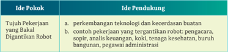

Tabel ini berisi ide pokok dan pendukung tentang perkembangan teknologi dan kecerdasan buatan dalam konteks digitalisasi robotik. Topik utamanya adalah tujuan pekerjaan yang bakal digantikan oleh robot. Dalam kolom ide pokok, ada dua poin utama: perkembangan teknologi dan kecerdasan buatan. Untuk setiap poin ini, tabel menyajikan beberapa ide pendukung. Ide pendukung untuk perkembangan teknologi meliputi contoh pekerjaan yang akan digantikan oleh robot, seperti pengacara, sopir, analisis keuangan, koki, tenaga kesehatan, buruh bangunan, dan pegawai administrasi. Ini menunjukkan bagaimana teknologi dan kecerdasan buatan dapat menggantikan berbagai profesi tradisional.

Setelah membaca  artikel 'Mengenal  Kecerdasan  Buatan', kalian akan  semakin  memahami  tentang  kecerdasan  buatan.  Dapatkah  kalian menyebutkan ide pokok dan ide pendukungnya?

Sebuah teks yang panjang seperti buku juga mengandung ide pokok dan ide pendukung. Untuk memahami ide pokok dan ide pendukung pada sebuah  teks  yang  panjang  seperti  buku,  kalian  dapat  membaca  sekilas bagian­bagian berikut ini.

### 1. Judul yang Tercantum pada Kover Depan

Judul disebut juga sebagai kepala karangan. Judul yang baik selalu menyiratkan isi buku, terutama di dalam buku-buku nonfiksi. Judul ada yang dibuat dua bagian yaitu induk judul dan anak judul. Pada contoh kover berikut hanya terdapat satu bagian judul. Apa yang tersirat di benakmu ketika membaca judul ini?

Sumber: Gramedia (2019)

 

---
## 📄 Halaman 91

### 2. Teks Wara Buku ( Blurb ) atau Ikhtisar pada Kover Belakang

Kalian mungkin tidak secara utuh mengetahui ide pokok penulis hanya dari judul buku. Kalian dapat dibantu memahami ide pokok melalui ringkasan isi buku yang terdapat di kover belakang buku. Pada buku fiksi, ringkasan ini disebut sinopsis. Adapun pada buku nonfiksi dikenal istilah wara atau dalam bahasa Inggris disebut blurb .

### 3. Daftar Isi Buku

Daftar isi pada buku menyiratkan isi buku secara utuh. Di dalam daftar isi terdapat judul bab, subbab, bahkan sub­ subbab.

Perhatikan contoh berikut.

Sumber: Gramedia (2019)

### Pengantar

- Bab 1 Revolusi Industri Keempat
- 1.1 Konteks Historis
- 1.2 Perubahan Mendalam dan Sistematis
- Bab 2 Poros­Poros Penggerak
- 2.1 Megatren
2.1.1 Gugus Fisik 2.1.2 Gugus Digital

2.1.3 Gugus Biologs

- 2.2 Titik­Titik Kritis

### Bab 3 Dampak

- 3.1 Ekonomi 3.1.1 Pertumbuhan 3.1.2 Lapangan Pekerjaan
- 3.1.3 Hakikat Kerja
- 3.2 Bisnis 3.2.1 Ekspektasi Pelanggan 3.2.2 Produk­Produk yang Didukung Data 3.2.3 Inovasi Kolaboratif
3.2.4 Model­Model Operasional Baru

- 3.3 Nasional dan Global
- 3.3.1 Pemerintah 3.3.2 Negara, Wilayah, dan Kota 3.3.3 Keamanan Internasional
- 3.4 Masyarakat 3.4.1 Ketimpangan dan Kelas Menengah 3.4.2 Komunitas
- 3.5 Individu
3.5.1 Identitas, Moralitas, dan Etika

3.5.2 Hubungan Manusia

3.5.3 Mengatur Informasi Publik dan Privat

 

---
## 📄 Halaman 92

Secara  cepat  kalian  dapat  melihat  bahwa  buku  karya  Klaus  Schwab terdiri atas tiga bab dan satu bab penutup. Keempat bab itu mendukung ide pokok dari judul buku Revolusi Industri Keempat , yaitu Bab 1: Revolusi Industri  Keempat,  Bab  2:  Poros­Poros  Penggerak,  dan  Bab  3:  Dampak. Selanjutnya,  setiap  bab  dikembangkan  lagi  dengan  subbab.  Kalian  dapat merasakan betapa kompleksnya sebuah ide yang dituliskan ke dalam buku nonfiksi seperti karya Klaus Schwab ini.

Lantas mengapa kalian perlu memahami ide pokok dan ide pendukung yang terdapat pada sebuah teks? Tujuannya agar kalian dapat dengan mudah memahami maksud penulis. Sebaliknya, jika kalian sebagai penulis, kalian harus menguraikan ide pokok secara sistematis ke dalam ide pendukung.

### Ayo Berlatih

Jawablah pertanyaan berikut ini berdasarkan artikel 'Mengenal Kecerdasan Buatan'.

- Sebutkanlah dalam satu kalimat tentang ide pokok artikel 'Mengenal Kecerdasan Buatan'!
- Sebutkanlah  ide  pendukung  apa  saja  yang  terdapat  pada  artikel 'Mengenal Kecerdasan Buatan'!
- Apa  saja  hal  menarik  menurut  kalian  dari  isi  artikel  'Mengenal Kecerdasan Buatan'?
- Carilah  sebuah  buku  bacaan  nonfiksi.  Isilah  tabel  berikut  ini  dengan mencermati bagian­bagian buku dan isi buku.

### Tabel 3.2 Informasi Buku Nonfiksi

Judul Buku

Penulis

Penerbit

Tahun Terbit

Ringkasan Isi Buku

Ide Pokok

Ide Pendukung

Hal yang Menarik dari Buku

 

---
## 📄 Halaman 93

### B.  Mengajukan Hipotesis Berdasarkan Informasi

Mengajukan hipotesis tentang kategori yang lebih terperinci berdasarkan informasi pendukung yang dipahami dari tulisan dan gambar dalam teks informasional.

Memahami hipotesis dari teks informasi.

### Mengajukan Hipotesis

Artikel  yang  telah  kalian  baca  mengandung  topik  yang  baru  tentang 'kecerdasan  buatan'  atau artificial  intelligence (AI).  Silakan  berimajinasi tentang hal yang akan terjadi pada masa depan dengan adanya teknologi kecerdasan buatan.

Topik kecerdasan buatan berhubungan dengan materi sains atau ilmu pengetahuan  di  bidang  teknologi  komputer.  Kecerdasan  buatan  adalah sesuatu yang abstrak (tidak berwujud), tetapi kehadirannya dapat kalian rasakan kini.

Sebuah  hipotesis  terungkap  pada  infografik  Gambar  3.2  tentang pekerjaan yang tergantikan robot.  Kalian dapat membandingkan hipotesis tersebut dengan informasi yang terdapat pada artikel 'Mengenal Kecerdasan Buatan'.

Apakah  hipotesis  itu?  KBBI  Daring  menjelaskan  makna  hipotesis berikut:  'sesuatu  yang  dianggap  benar  untuk  alasan  atau  pengutaraan pendapat (teori, proposisi, dan sebagainya) meskipun kebenarannya masih harus dibuktikan; anggapan dasar'.

Hipotesis dari Gambar 3.2 adalah sebagai berikut.

Akan ada tujuh pekerjaan yang digantikan robot pada masa depan, yaitu pengacara, sopir, analis keuangan, koki, buruh bangunan, tenaga kesehatan, dan pegawai administrasi.

 

---
## 📄 Halaman 94

Hipotesis sering juga disebut dugaan, tetapi tentu dugaan yang berdasar atau bersifat ilmiah. Ciri utama bahwa sesuatu  disebut bersifat ilmiah ialah logis atau dapat dinalar dengan akal sehat. Hipotesis ilmiah diuji dengan penelitian ilmiah untuk membuktikannya.

Pembuktian  bahwa  akan  ada  tujuh  pekerjaan  yang  tergantikan  oleh robot  telah  terjawab  pada  ide  pokok  dan  ide  pendukung  teks  berjudul 'Mengenal Kecerdasan Buatan'. Robot yang mampu menggantikan pekerjaan manusia, baik yang bersifat halus (pemikiran) maupun yang ber­ sifat kasar (mekanis) adalah robot yang dibekali dengan kecerdasan buatan.

Berikut fakta tentang robot yang bakal menggantikan sopir sebagai pelecut bagi kalian untuk mencari tahu lebih jauh. Robot ini disebut mobil otonom.

### Mobil Otonom, Mobil Masa Depan

---
**🖼️ Gambar/Diagram**

> **Deskripsi Visual:** Gambar ini adalah ilustrasi yang menunjukkan interior mobil dengan teknologi canggih. Dalam gambar tersebut, kita melihat dashboard mobil yang dilengkapi dengan berbagai fitur canggih seperti sistem navigasi, pengawasan keamanan, dan kontrol audio. Dashboard memiliki dua layar utama yang menampilkan informasi dan kontrol. Layar pertama menampilkan ikon-ikon berwarna yang mungkin menunjukkan status sistem seperti baterai, suhu, dan lain-lain. Layar kedua menampilkan layar navigasi dengan peta dan informasi tentang jalan yang akan dilewati. Di sebelah kanan dashboard, terdapat panel kontrol yang memungkinkan pengguna untuk mengontrol volume musik, mengubah nada suara, dan mengakses fitur lainnya. Seluruh desain dashboard ini dirancang untuk memberikan pengalaman pengemudi yang nyaman dan efisien. Gambar ini menunjukkan bagaimana teknologi modern telah diterapkan dalam desain interior mobil untuk meningkatkan kenyamanan dan produktivitas pengemudi.

Sumber: Chombosan/Alamy Stock Photo

Beberapa karya fiksi ilmiah berupa novel atau film telah memuat impian tentang mobil yang dapat berjalan sendiri. Mungkin dalam waktu tidak lama lagi, kendaraan yang disebut mobil otonom itu bakal menjadi kenyataan. Sebagai contoh, raksasa teknologi Tiongkok bernama Baidu menggandeng perusahaan mobil BMW untuk meriset prototipe mobil otonom. Demikian pula perusahaan mobil listrik Tesla telah mengembangkan mobil otonom dengan fitur autopilot .

 

---
## 📄 Halaman 95

### Ayo Berlatih

Kalian dapat memunculkan hipotesis sendiri terkait dengan teks yang telah dibaca untuk mengembangkan kategori pembahasan tentang kecerdasan buatan.  Contohnya,  kalian  dapat  membahas  satu  topik  khusus  tentang mobil otonom yang menggantikan pekerjaan sopir pada masa depan.

- Bentuk  kelompok  diskusi  atau  bergabung  dengan  kelompok  kalian yang sudah ada.
- Topik diskusi adalah 'Pekerjaan yang Mungkin Digantikan Robot pada Masa  Depan'.  Tentukanlah  subtopik  diskusi  berupa  satu  pekerjaan masa depan yang digantikan robot selain pekerjaan yang terdapat pada Gambar 3.2 Subtopik ini merupakan sebuah hipotesis.
- Jawablah pertanyaan­pertanyaan berikut ini untuk memandu pembuktian hipotesis kalian!
- Apa alasan pekerjaan tersebut dapat digantikan robot pada masa depan?
- Adakah  bukti  atau  fakta  ilmiah  yang  menunjukkan  hipotesis kalian  telah  diteliti  dan  diwujudkan  dalam  bentuk  prototipe  atau purwarupa robot?
- Buatlah presentasi berdasarkan hasil diskusi kelompok dan hipotesis  yang  kalian  akan  kemukakan.  Presentasi  dibuat  dalam bentuk salindia menggunakan aplikasi pembuat salindia presentasi dengan materi berikut.

---
**🖼️ Gambar/Diagram**

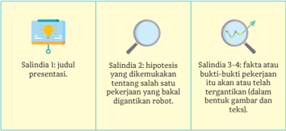

> **Deskripsi Visual:** Gambar ini adalah sebuah diagram yang menunjukkan tiga salindia (salidias) dalam presentasi tentang robotika. Salindia 1 berisi judul presentasi, yang merupakan elemen utama pertama. Salindia 2 mengandung hipotesis bahwa robot akan digunakan untuk menggantikan pekerjaan manusia, yang merupakan elemen utama kedua. Salindia 3-4 berisi fakta atau bukti-bukti yang mendukung hipotesis tersebut, yang merupakan elemen utama ketiga. Setiap salindia memiliki ikon yang menunjukkan jenis informasi yang ada, seperti lampu untuk judul, mikroskop untuk hipotesis, dan garis bintang untuk fakta. Informasi kunci yang dapat diambil pembaca adalah bahwa presentasi ini membahas tentang perkembangan robotika dan bagaimana robot dapat digunakan untuk menggantikan pekerjaan manusia.

 

---
## 📄 Halaman 96

---
**🖼️ Gambar/Diagram**

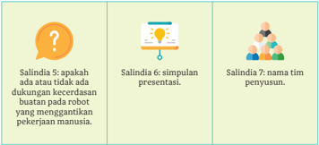

> **Deskripsi Visual:** Gambar ini adalah diagram yang menunjukkan tiga salindia (salidias) dalam buku pelajaran. Setiap salidia memiliki ikon yang menunjukkan topiknya:

1. Salidia 5: Menyatakan pertanyaan tentang kecerdasan buatan pada robot yang menggantikan pekerjaan manusia.
2. Salidia 6: Menyimpulkan presentasi.
3. Salidia 7: Mengenai nama tim penyusun.

Elemen-elemen utama dalam gambar ini adalah tiga salidia dengan ikon yang menunjukkan topik masing-masing. Teks yang penting dalam setiap salidia adalah pertanyaan atau informasi yang disampaikan oleh salidia tersebut. 

Informasi kunci yang dapat diambil pembaca melalui gambar ini adalah bahwa buku pelajaran ini berfokus pada tiga aspek penting dalam konteks teknologi dan pengetahuan, yaitu kecerdasan buatan, presentasi, dan tim penyusun.

### C.  Menggunakan Kata Khusus Bidang Teknologi Informasi

Menggunakan kata­kata yang jarang muncul dalam konteks keilmuan dan kata serapan bahasa daerah atau bahasa asing.

Teks  tentang  kecerdasan  buatan  mengenalkan  kepada  kalian  beberapa istilah khusus di bidang teknologi informasi. Istilah itu di antaranya gawai , asisten maya , mesin peramban , simulasi , gim , lokapasar , dan jejak digital .

Kata 'gawai'  dikenalkan dan digunakan sebagai padanan kata gadget dalam bahasa Inggris. Gawai diserap dari bahasa daerah, tepatnya bahasa Jawa.

Ada tiga makna gawai di dalam KBBI. Makna pertama berarti 'kerja' atau  'pekerjaan'.  Dari  kata  ini  kita  mengenal  kata  dasar  'pegawai'  yang sama dengan 'pekerja'. Adapun makna kedua adalah 'alat' dan 'perkakas'.

Makna  ketiga  adalah  makna  yang  paling  tepat  menggambarkan teks tentang kecerdasan buatan yaitu 'peranti elektronik' atau 'mekanik dengan fungsi  praktis'.  Oleh  karena  itu,    kata gawai populer  digunakan menggantikan kata gadget .

Akan  tetapi,  ternyata  kata gadget di  dalam  KBBI  Daring  juga  telah diserap  langsung  menjadi  kata  dalam  bahasa  Indonesia.  Artinya,  kalian dapat menggunakan kata 'gawai' atau 'gadget' dengan makna yang sama.

 

---
## 📄 Halaman 97

### Ayo Berlatih

- Carilah makna kata­kata lain di bidang teknologi informasi yang telah disebutkan sebelumnya ( asisten maya , mesin peramban , simulasi , gim , lokapasar , dan jejak digital ). Manakah di antara kata­kata tersebut yang diambil dari bahasa daerah?
- Dapatkah kalian mencari kata­kata lain di bidang teknologi informasi yang saat ini sering kalian baca atau dengar? Kumpulkanlah enam kata di bidang teknologi informasi yang diserap dari bahasa asing. Tuliskan kata asli dan bentuk serapannya. Tandailah kata­kata yang diserap dari unsur bahasa daerah. Perhatikan contoh pada tabel berikut.
- Untuk lebih  menguatkan pemahaman kalian tentang kata­kata yang jarang  muncul  di  bidang  teknologi  informasi  atau  merupakan  kata serapan  dari  bahasa  asing,  gunakanlah  kata­kata  tersebut  di  dalam kalimat. Perhatikan contoh berikut ini.
- Tolong tikkan pranala situs  web  tersebut  agar  informasi  tentang pendaftaran dapat langsung diakses.
- Tolong tikkan hipertaut situs web tersebut agar informasi tentang pendaftaran dapat langsung diakses.
Kata 'pranala' dan 'hipertaut' berasal dari kata hyperlink dalam bahasa Inggris. Kata ini merupakan kata benda yang berarti rujukan atau unsur navigasi dalam suatu dokumen yang terdapat di dalam situs web.

 

---
## 📄 Halaman 98

### D.  Berdiskusi tentang Fenomena Kecerdasan Buatan

Menanggapi pernyataan teman diskusi secara aktif, menggunakan kata kunci yang relevan dengan topik bahasan diskusi.

Mempraktikkan cara memberi tanggapan pada saat diskusi.

### Memberikan Tanggapan

Pada kegiatan sebelumnya  kalian  telah berdiskusi  dan  mempelajari langkah­langkah  berdiskusi  untuk  memunculkan  hipotesis.  Pada  saat diskusi berlangsung, peserta diskusi diharapkan aktif memberikan tanggapan berupa pernyataan, pertanyaan, atau opini (pendapat).

Diskusi secara formal atau nonformal tetap mengedepankan kesantunan dengan menghormati para peserta diskusi, baik yang sedang berbicara maupun yang sedang mendengarkan. Peserta diskusi yang aktif akan menyimak diskusi dengan saksama dan memberikan tanggapan.

Kalian dapat mencermati contoh tanggapan berikut ini.

Contoh tanggapan berupa pernyataan.

Menurut saya hal yang disampaikan Ilham benar bahwa pekerjaan sebagai penulis pun bakal terancam digantikan mesin dengan  kecerdasan  buatan.  Sebuah  tulisan  dapat  dibuat  oleh mesin pintar itu.

Contoh tanggapan berupa pertanyaan.

Saya masih meragukan dugaan itu. Apa alasannya mesin dengan kecerdasan  buatan  itu  dapat  menggantikan  profesi  penulis? Bukankah menulis itu pekerjaan kreatif yang memerlukan bakat khusus?

Contoh tanggapan berupa opini.

 

---
## 📄 Halaman 99

Saya  kira  profesi  penulis  bakal  digantikan  robot  pintar  itu mungkin  terjadi. Soalnya di  Amerika  sudah  dikembangkan aplikasi bernama GPT atau Generative Pretraining Transformer dengan  kecerdasan  buatan.  GPT  ini  dikembangkan  lembaga nirlaba  OpenAI  dan  sudah  memasuki  fase  GPT-3.  GPT-3  ini memiliki 175 miliar parameter yang dilatihkan sehingga ia mampu 'memprediksi' sebuah gagasan penulisan atau terjemahan dari sebuah teks. Kesimpulannya aplikasi ini dapat meniru penciptaan sebuah tulisan tanpa memerlukan lagi penulis.

Setiap  tanggapan  dapat  diberikan  berdasaran  kata  kunci  paparan yang disampaikan dalam diskusi. Di dalam contoh tanggapan terdapat kata kunci profesi penulis dan kecerdasan buatan . Hal yang menjadi pembahasan adalah  ketika  ada  peserta  diskusi  mengajukan  hipotesis  bahwa  penulis termasuk profesi yang rentan digantikan oleh robot atau mesin.

Tentu sangat menarik jika sebuah diskusi itu 'hidup' dan menghasilkan sesuatu yang bermanfaat. Biasanya diskusi menghasilkan suatu keputusan untuk ditindaklanjuti atau menghasilkan suatu kesimpulan yang menjadi informasi dan pengetahuan berguna bagi para peserta diskusi.

Bagaimana memberikan tanggapan saat berdiskusi? Berikut ini tata cara memberikan tanggapan di dalam diskusi.

- Berikan tanggapan apabila pemimpin diskusi atau moderator memberi kesempatan berbicara.
- Peserta  mengangkat  tangan  untuk  meminta  izin  pemimpin  diskusi memberikan tanggapan.
- Perkenalkan diri jika kalian berada di dalam kelompok diskusi dengan peserta belum saling mengenal.
- Sampaikan  tanggapan  kalian  secara  ringkas  dengan  menggunakan kata­kata  kunci  agar  dapat  ditangkap  oleh  pemimpin  diskusi  atau moderator.

 

---
## 📄 Halaman 100

Diskusi yang baik adalah diskusi yang mendorong peserta diskusi aktif berpartisipasi. Partisipasi dapat berupa pertanyaan, tanggapan, dan pendapat.

---
**🖼️ Gambar/Diagram**

> **Deskripsi Visual:** Gambar ini adalah ilustrasi yang menunjukkan tiga orang yang sedang berbicara di sekitar meja kerja. Ilustrasi ini mungkin digunakan untuk menggambarkan konsep diskusi, pertemuan, atau rapat. Elemen utama dalam gambar ini adalah tiga orang yang duduk di sekitar meja, dengan posisi mereka yang menunjukkan bahwa mereka sedang berbicara atau berkomunikasi. Teks, angka, atau label penting tidak ada dalam gambar ini, sehingga informasi kunci yang dapat diambil pembaca hanya melalui visual saja. Gambar ini mungkin digunakan untuk membantu pembaca memahami konsep diskusi atau pertemuan dalam konteks pelajaran.

### Ayo Berlatih

### 1. Bacalah informasi berikut ini.

### Robot untuk Lansia

Ilmuwan itu bernama Aat Goldie Nejat. Ia mulai mengembangkan robot pada tahun 2005 dan banyak menghabiskan waktu untuk mendemonstrasikan purwarupa robot canggihnya dari pintu ke pintu. Akan tetapi, dunia kesehatan masih meragukannya.

Keadaan pun berbalik kini. Nejat yang juga seorang profesor teknik mesin di University of Toronto banyak menerima panggilan telepon dari seluruh dunia.

Nejat menciptakan robot perawat sosial yang dapat berinteraksi dengan manusia dan dapat memenuhi kebutuhan mendesak: merawat lansia. Robot semacam ini diperkirakan sangat berguna bagi lansia yang menderita alzheimer atau demensia (kepikunan) karena diprogram dapat membantu dalam segala hal-dari mengingatkan minum obat sampai memandu olahraga.

Gagasan tentang robot lansia ini dipicu oleh perkiraan populasi lansia yang akan meningkat. Populasi lansia dengan usia di atas 80 tahun diperkirakan akan berlipat tiga di seluruh dunia dari 143 juta pada 2019 menjadi 426 juta pada 2050.

 

---
## 📄 Halaman 101

Terilhami oleh potensi robot untuk membantu lansia, seorang fotografer Prancis, Yves Gellie, menghabiskan waktu dua tahun untuk membuat film Year of the Robot . Ia merekam dalam bentuk film dokumenter tentang interaksi antara lansia dan robot sosial di fasilitas perawatan jangka panjang di Prancis dan Belgia.

---
**🖼️ Gambar/Diagram**

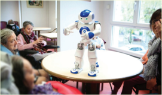

> **Deskripsi Visual:** Gambar ini adalah foto yang menunjukkan sebuah robot berdiri di atas meja di sebuah ruangan yang tampak seperti rumah sakit atau pusat perawatan lanjutan. Robot tersebut memiliki bentuk manusia dengan kepala berwarna biru dan tangan berwarna putih. Di sebelah kanan robot, ada dua orang tua yang sedang berbicara dengan robot tersebut. Di sebelah kiri, ada beberapa orang tua lain yang juga sedang berbicara dengan robot. Ruangan tersebut dilengkapi dengan kursi dan meja, serta terdapat jendela yang memberikan cahaya alami ke dalam ruangan. Gambar ini menunjukkan interaksi antara robot dan manusia dalam lingkungan rumah sakit atau pusat perawatan lanjutan.

Sumber: Kalb, Cluadia. 2020. 'Bawa Daku ke Lansiamu', National Geographic , Desember 2020, hlm. 70-74.

- Diskusikanlah bersama kelompokmu tentang robot sosial untuk lansia ini. Berikan tanggapanmu tentang potensi robot ini dan hubungannya dengan profesi pekarya kesehatan.

### E.  Menyampaikan Pertanyaan secara Efektif

Bertanya dengan kalimat yang jelas sehingga dipahami oleh teman berdiskusi.

Pada pembelajaran di Bab 1, kalian sudah megetahui tentang adiksimba. Apakah itu? Adiksimba adalah akronim dari apa , di mana , kapan , siapa , mengapa , dan bagaimana . Lima pertanyaan ini sangat ampuh digunakan untuk menggali sebuah informasi.

Sebuah  pertanyaan selalu diajukan di dalam diskusi. Seseorang bertanya  biasanya  karena  ia  menginginkan  penjelasan  lebih  jauh  atau karena ia belum memahami sesuatu. Jadi, kalimat tanya atau pertanyaan

 

---
## 📄 Halaman 102

adalah kalimat yang ide pokoknya mengandung pertanyaan terhadap suatu hal sehingga memerlukan tanggapan atau jawaban.

Ada kalimat tanya yang hanya memerlukan jawaban tertutup, seperti ya atau tidak.

Contoh kalimat tanya dengan jawaban tertutup.

Apakah kamu sudah makan? Ya. Apakah kamu yang merapikan buku-buku ini? Tidak.

Ada juga kalimat tanya yang memerlukan jawaban terbuka. Artinya, jawaban yang diberikan dapat berkembang bukan sebatas ya atau tidak. Di dalam sebuah diskusi, kalimat pertanyaan yang dilontarkan sebaiknya bukan pertanyaan dengan jawaban tertutup.

Jawaban terhadap pertanyaan sering kali bergantung pada kejelasan pertanyaan itu sendiri. Karena itu, seorang penanya di dalam diskusi harus mengajukan pertanyaan secara efektif. Perhatikan tip berikut ini.

---
**🖼️ Gambar/Diagram**

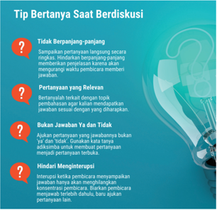

> **Deskripsi Visual:** Gambar ini adalah diagram yang menunjukkan tips bertanya saat berdiskusi. Gambar ini terdiri dari beberapa elemen utama:

1. Judul: "Tip Bertanya Saat Berdiskusi" yang terletak di bagian atas gambar.

2. Konten utama: Beberapa tip bertanya yang disajikan dalam bentuk kotak berwarna biru dengan teks berwarna putih.

3. Elemen visual: Gambar dua orang yang sedang berbicara di belakang latar belakang biru cerah, menunjukkan suasana diskusi.

4. Informasi kunci: 
   - Tidak berpanjang panjang
   - Pertanyaan yang Relevan
   - Bukan Jawaban Ya Dan Tidak
   - Hindari Menjeritapi

5. Desain: Grafik dengan warna-warna cerah dan tata letak yang rapi, membuat informasi menjadi mudah dipahami.

6. Tujuan: Mengajarkan cara bertanya yang efektif dalam situasi diskusi.

7. Konteks: Dibuat untuk membantu pembaca memahami dan mengaplikasikan teknik-tips tersebut dalam proses berdiskusi.

 

---
## 📄 Halaman 103

### Contoh kalimat pertanyaan di dalam diskusi.

'Mohon izin bertanya moderator. Dalam salindia 2 tadi dipaparkan tentang dampak  penerapan  kecerdasan  buatan  yang  sudah  mulai  terasa.  Apakah boleh  disebutkan  contoh-contoh  penerapan  kecerdasan  buatan  lain  yang telah terjadi di Indonesia?'

### Ayo Berlatih

- Ajukanlah pertanyaan secara lisan kepada guru kalian terkait dengan materi  mata  pelajaran  bahasa  Indonesia  yang  belum  kalian  pahami. Perhatikanlah  jawaban  guru  kalian  dan  komentar  terhadap  kalimat pertanyaan yang kalian ajukan.
- Ajukanlah  pertanyaan  secara  lisan  kepada  teman  sebangku  kalian tentang  topik  sebuah  profesi.  Perhatikanlah  jawaban  yang  diberikan oleh teman kalian.
Contoh:

Menurutmu profesi apa yang paling cocok untukku?

Menurutmu  profesi  apa  yang  menjanjikan  untuk  masa  depan dari segi penghasilan?

### F. Mengelaborasi Perasaan untuk Memahami Masalah

Memahami terjadinya suatu masalah atau kejadian hubungan sebab­akibat yang lebih kompleks, pengategorian (persamaan dan perbedaan kelompok orang, tempat, dan kejadian) dengan mengelaborasi perasaan diri sendiri dan orang lain.

### Kegiatan 1

Berdasarkan topik bahasan pada Bab III ini, kalian dapat menemukan suatu masalah terkait masa depan dan imbas dari teknologi kecerdasan buatan. Berikut  ini  adalah  sebuah  wacana  tentang  robot  pintar  bernama  Sophia

 

---
## 📄 Halaman 104

yang  terkoneksi  dengan  kecerdasan  buatan.  Bacalah  dengan  saksama sebagai  bahan  pemantik  untuk  menyampaikan  pendapat  kalian  terkait suatu permasalahan.

### Ini Sophia, Robot Pintar yang Hadir di CSIS Global Dialogue Jakarta

Beberapa hari lagi, robot humanoid Sophia akan datang ke Jakarta. Robot itu akan menghadiri konferensi tahunan Centre for Strategic and International Studies (CSIS) yang bakal diselenggarakan di Hotel Borobudur, Jakarta, pada 16 hingga 17 September 2019.

Ini akan menjadi pertama kalinya Sophia datang ke Indonesia. Pada konferensi tersebut, Sophia dijadwalkan akan berbincang dengan Presiden Joko Widodo.

Sophia sendiri dikenal sebagai robot humanoid paling mutakhir yang memiliki kemampuan layaknya manusia. Ia diciptakan oleh perusahaan teknologi Hanson Robotics yang bermarkas di Hong Kong dan mulai diaktifkan pada tanggal 14 Februari 2016.

Robot ini memiliki kecerdasan buatan ( artificial intelligence /AI) yang dapat menyimulasikan percakapan. Agar wujudnya semakin mirip manusia, Hanson Robotics mendesain wajah Sophia berdasarkan aktris Audrey Hepburn.

Selain itu, Sophia disematkan kamera untuk pemrosesan data grafis dan pengenalan wajah. Robot ini juga memiliki kemampuan untuk mengikuti ekspresi wajah manusia, dan sejak 2018, ia sudah punya kaki sendiri.

 

---
## 📄 Halaman 105

AlforGooD

---
**🖼️ Gambar/Diagram**

> **Deskripsi Visual:** Gambar ini adalah foto yang menunjukkan seorang robot humanoid berdiri di depan papan latar dengan tulisan "AI for GOOD GLOBAL SUMMIT". Robot tersebut tampak seperti Sophia, salah satu robot humanoid terkenal yang dikembangkan oleh Hanson Robotics. Papan latar tersebut juga menampilkan logo AI for Good Global Summit, yang diselenggarakan oleh ITU (International Telecommunication Union) pada tanggal 7-9 Juni 2017. Di samping robot, ada beberapa orang yang tampak sedang berbicara atau mendengarkan, mungkin sebagai pembicara atau peserta acara. Teks dan angka penting yang terlihat dalam gambar adalah "AI for GOOD GLOBAL SUMMIT" dan "Hosted at ITU", yang menunjukkan tujuan dan lokasi acara tersebut. Informasi kunci yang dapat diambil dari gambar ini adalah bahwa acara tersebut bertujuan untuk membahas tentang penggunaan teknologi AI dalam hal-hal yang bermanfaat bagi masyarakat, dan telah diselenggarakan oleh ITU pada tahun 2017.

Sophia juga bukan robot biasa. Ia tercatat sebagai robot pertama yang memiliki kewarganegaraan. Pemerintah Arab Saudi memberikan status tersebut pada Oktober 2017.

'Hanson Robotics mengembangkan robot (Sophia) untuk interaksi manusia dan robot. Kami mendesain robot ini untuk melayani kesehatan, terapi, pendidikan, dan aplikasi layanan pelanggan,' jelas David Hanson, selaku CEO Hanson Robotics, dalam sebuah wawancara pada tahun 2016 lalu.

### Kemampuan Berbincang Robot Sophia dengan Manusia

Kemampuan Sophia untuk berbincang dengan manusia memang sudah dikenal luas. Setidaknya, Sophia pernah datang ke acara The Tonight Show yang dibawakan Jimmy Fallon, hingga bercengkrama dengan aktor Will Smith di Kepulauan Cayman.

Meski kemampuan Sophia untuk berbincang dengan manusia terkenal, sebagian besar orang mungkin memiliki miskonsepsi terhadap kemampuan Sophia.

 

---
## 📄 Halaman 106

Pada 2017 lalu, misalnya, Ben Goertzel, yang saat itu menjabat sebagai Chief Scientist di Hanson Robotics, menjelaskan bahwa Sophia tidak memiliki artificial general intelligence (AGI). AGI itu sendiri adalah istilah yang merujuk pada kecerdasan yang setara dengan manusia.

Klarifikasi tersebut disampaikan oleh Goertzel setelah rekannya, Hanson, menyatakan Sophia itu 'hidup' seperti manusia pada saat menghadiri acara The Tonight Show .

Pada dasarnya, percakapan yang Sophia lakukan bekerja selayaknya chatbot . Kecerdasan buatan Sophia diprogram dengan pemrosesan bahasa natural, yang dalam hal ini terdapat skrip pra tertulis lalu nantinya akan dikomunikasikan oleh dia sesuai dengan topik pembicaraan yang sedang berlangsung.

Meski demikian, kita tidak dapat serta merta mengatakan bahwa Sophia hanyalah sekadar chatbot . Pasalnya, Sophia memiliki berbagai macam fitur yang memerlukan jaringan rumit. Keberadaan Sophia sendiri menunjukkan bahwa penciptaan robot dengan kesadaran penuh layaknya manusia mungkin akan segera hadir pada masa depan.

'Saya seorang yang optimis dengan kemunculan AGI, dan saya yakin kami akan sampai di sana dalam 5 hingga 10 tahun dari sekarang,' kata Goertzel dalam wawancaranya dengan The Verge pada 2017 lalu.

'Tidak ada dari ini (Sophia) yang saya sebut sebagai AGI, tetapi juga tidak mudah untuk (membuatnya) bekerja. Dan ini (Sophia) sangat mutakhir dalam hal integrasi dinamis dari persepsi, tindakan, dan dialog,' tambahnya.

Teks ini telah diedit seperlunya.

( Kumparan.com /14 September 2019)

### Informasi 2

### Robot Tidak  akan Ganti Peran Manusia

Jakarta . Indonesia tengah dihebohkan oleh penggunaan robot pembersih lantai sebagai pekerja layanan kebersihan di Mal Pondok Indah. Soal ini disuarakan oleh salah satu aktor dan sutradara Indonesia, Dennis Adhiswara via akun Twitter pribadinya.

Selain sambutan baik, fenomena tersebut turut memicu kegelisahan menyoal kondisi robot akan menggantikan peran manusia dalam berbagai pekerjaan. Kekhawatiran ini bukanlah hal yang baru sebab pada awal popularitasnya di dunia, termasuk Indonesia, sejumlah pihak telah membahasnya.

 

---
## 📄 Halaman 107

Peningkatan popularitas penggunaan teknologi, termasuk robot, dalam melakukan pekerjaan manusia turut muncul saat para ahli industri dan ekonomi dunia menggadangkan Revolusi Industri 4.0. Revolusi ini kian terdengar di Indonesia sejak Presiden Jokowi menjadikan pembangunan infrastruktur pendukungnya sebagai fokus selama periode kepemimpinan pertama.

Memang tidak dapat dielakkan bahwa pemanfaatan teknologi dan robot pada era Revolusi Industri 4.0 akan menghilangkan sejumlah pekerjaan yang sebelumnya dilakukan manusia. Akan tetapi, sejumlah ahli berpendapat bahwa meskipun teknologi semakin baik berkat dukungan kecerdasan buatan (AI), teknologi tidak akan sepenuhnya menggantikan peran manusia di berbagai bidang. Hal ini karena manusia tetap diperlukan untuk melatih dan mengawasi teknologi dan robot dalam melakukan tugasnya.

Selain itu, robot dan AI merupakan buah karya manusia, sebagai alat yang dapat bekerja jika manusia memberikannya instruksi yang benar. Mengutip Forbes, hal ini mendorong manusia dan teknologi untuk dapat saling bekerja sama, dengan porsi manusia sebagai pengendali dan teknologi menyediakan hal yang diprogramkan oleh manusia.

Ide bahwa teknologi akan menggantikan manusia terkait kebutuhan berpikir kreatif, menyelesaikan masalah, kepemimpinan, kerja tim, dan berinisiatif disebut sejumlah ahli tidak masuk akal. Manusia justru dapat memanfaatkan teknologi untuk menghadirkan dunia lebih baik untuk seluruh manusia. Meskipun demikian, kehadiran robot dalam mendisrupsi lapangan pekerjaan manusia telah terasa di Indonesia sejak beberapa tahun lalu.

Teknologi telah mendisrupsi sejumlah industri, termasuk perbankan dan transportasi. Di industri perbankan, sejumlah bank telah memanfaatkan teknologi untuk menggantikan tugas petugas bank, terutama di kantor cabang di luar kota besar.

Hanya sejumlah ahli menilai bahwa sejumlah industri seperti pariwisata yang identik dengan keramahtamahan belum cocok mengadopsi teknologi ini. Contoh lain menyebut bahwa mesin berbasis AI juga tidak dapat menggantikan peran manusia dalam membangun hubungan kuat dengan klien. Selain itu, mesin berbasis AI juga dinilai belum dapat menggantikan peran manusia dalam memberikan produk dan layanan hebat yang sesuai dengan kebutuhan pelanggan, yang juga merupakan manusia.

Cerdas, namun teknologi AI masih belum dapat melakukan pekerjaan sebaik manusia seperti menyoal cara mendengarkan, memahami pentingnya empati, pengambilan perspektif dan nilai komunikasi serta kolaborasi. Hal ini karena AI dinilai akan gagal melakukannya. Teknologi AI juga disebut belum dapat menggantikan peran manusia terkait dengan tenaga medis serta tenaga pengajar atau guru.

….

Teks ini telah diedit seperlunya . Sumber: Lufthi Anggraeni/Medcom.id/18 Januari 2020

 

---
## 📄 Halaman 108

### Kegiatan 2

Kalian  mungkin  pernah  membaca  di  dalam  karya  fiksi  ilmiah  tentang robot yang bertingkah laku seperti manusia, bahkan robot itu sangat mirip dengan manusia. Akankah benar­benar terwujud hal demikian pada masa depan?

Robot  yang  bertingkah  laku  seperti  manusia  dan  berwujud  mirip manusia disebut robot humanoid. Kata humanoid berasal dari dari bahasa Latin humanus yang  berarti  'manusia'  dan  bahasa  Yunani oeides yang berarti 'kesamaan ekspresi'.

Bagaimana pikiran dan perasaan kalian setelah membaca teks tentang robot Sophia dan teks tentang pekerjaan yang tidak akan tergantikan oleh robot? Apakah kalian dapat membayangkan masa depan?

Pikiran dan perasaan dapat dielaborasi, artinya dapat digunakan secara tekun  dan  cermat  untuk  memahami  suatu  permasalahan.  Kalian  dapat mengelaborasi  pikiran  dan  perasaan  sendiri  atau  pikiran  dan  perasaan orang  lain.  Ada  istilah  pikiran  yang  jernih,  termasuk  perasaan,  yang menunjukkan  sebuah  proses  berpikir  dan  berperasaan  secara  baik  dan benar.

Berikut ini adalah langkah mengelaborasi perasaan dan pikiran sendiri.

- Temukanlah  informasi  tambahan  atau  sebanyak  mungkin  informasi terkait permasalahan yang terjadi, contohnya kronologi sebuah peristiwa, pihak­pihak yang terlibat dalam peristiwa, dan akar permasalahan.
- Pilahlah di antara informasi tersebut mana yang valid atau mana yang kurang valid. Gunakan informasi yang valid atau dapat dipercaya.
- Mulailah memikirkan dan merasakan sesuatu yang terjadi dan memecahkan masalah dari sudut pandang diri kalian sendiri. Memang biasanya  terdapat  masalah  yang  simpleks  (sederhana)  dan  kompleks (rumit).
- Kalian dapat mengelobarasi pikiran dan perasaan dengan memprediksi dampak/akibat yang terjadi jika permasalahan tidak ditemukan solusinya.
- Sampaikan hasil elaborasi pikiran dan perasaan dalam bentuk pernyataan lisan atau tertulis.

 

---
## 📄 Halaman 109

### Ayo Berlatih

- Carilah informasi tambahan tentang robot Sophia dan robot humanoid lain  bersama  kelompokmu  (4-5  orang).  Uraikan  informasi  tersebut dalam bentuk poin­poin seperti contoh.

### Robot Nao

- Robot humanoid mungil dengan tinggi 58 cm dan berat 5,4 kg.
- Nao memiliki sepasang mata dan empat mikrofon di telinganya yang membuatnya dapat menganalisis emosi, ekspresi wajah, dan nada suara pelanggan sehingga meresponsnyadengantepat.
- Robot ini dibuat perusahaan Prancis, Aldebaran Robotics, yang merupakan anak perusahaan dari Softbank Jepang.
- April 2015, Mitsubishi UFj Financial Group mulai mempekerjakanNaosebagai karyawanbaru mereka.
- Nao disebutkan menguasai 19 bahasa.

### Gambar 3.14 Profil Robot Nao

- Dengan  tambahan  informasi  tersebut,  ungkapkanlah  pendapatmu secara lisan, apakah kehadiran robot humanoid itu  merupakan solusi terhadap  permasalahan  manusia  atau  merupakan  ancaman  terhadap pekerjaan manusia?

### Kegiatan 3

Ketika  melihat  atau  mendengar  suatu  masalah  kalian  harus  menelusuri terlebih  dahulu  sebab­sebab  terjadinya  masalah  agar  memahami  duduk permasalahan sebenarnya. Sebagai contoh perhatikan masalah berikut ini.

Sebanyak  1.351 orang  penjaga  gerbang  tol  PT  Jasa  Marga berpotensi kehilangan pekerjaan.

 

---
## 📄 Halaman 110

Kalian dapat mengajukan pertanyaan berikut ini terkait permasalahan tersebut.

- Apa yang menyebabkan 1.351 orang penjaga gerbang tol akan kehilangan pekerjaan?
- Apa solusi yang ditawarkan oleh perusahaan pengelola jalan tol?
Untuk  menjawab  permasalahan  tersebut,  kalian  harus  mencari  dan mengumpulkan  informasi  perihal  nasib  para  penjaga  gerbang  tol  yang akan kehilangan pekerjaan. Berikut ini contoh pemetaan masalah.

### Tabel 3.4 Identifikasi Masalah

### Masalah:

Sebanyak 1.351 orang penjaga gerbang tol berpotensi kehilangan pekerjaan.

### Solusi dari Perusahaan

Program Pemberdayaan Pegawai ( Alife ):

- Alife 1: dipindahkan menjadi staf di kantor pusat.
- Alife 2: dipindahkan menjadi staf di kantor cabang.
- Alife 3: menjadi pegawai di anak perusahaan.
- Alife 4: menjadi wirausaha di area istirahat jalan tol yang dimiliki perusahaan.
- Alife 5: mengajukan pensiun dini.

---
**🖼️ Gambar/Diagram**

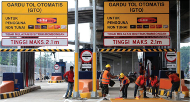

> **Deskripsi Visual:** Gambar ini adalah foto yang menunjukkan gardu tol otomatis (GTO) di Malaysia. Gardu tol ini memiliki dua panel utama yang berisi informasi tentang tinggi maksimal kendaraan yang boleh melalui sistem GTO, yaitu 2.1 meter. Panel ini juga menunjukkan bahwa sistem ini tidak melayani bus atau truk robohkan. Di sebelah kanan, ada petugas keamanan yang sedang bekerja di dekat gardu tol tersebut. Gambar ini menunjukkan bagaimana gardu tol otomatis bekerja dan memberikan informasi penting bagi pengguna jalan raya.

 

---
## 📄 Halaman 111

### Ayo Berlatih

- Elaborasi pikiran dan perasaan kalian terhadap permasalahan ini dan solusi yang diberikan oleh perusahaan. Sampaikanlah pendapat kalian dalam tulisan sebanyak 300 kata.
- Apa alasan perusahaan jalan tol memberlakukan Gerbang Tol Otomatis (GTO)? Carilah informasi tersebut  agar  kalian  dapat  memahami keputusan tersebut.

### G.  Menggunakan Konjungsi Intrakalimat dan Antarkalimat

Menggunakan tata tulis (ejaan) secara tepat di dalam kalimat.

### Kegiatan 1

Mempraktikkan penggunaan konjungsi intrakalimat dan antarkalimat.

Pada  kelas  sebelumnya  semestinya  kalian  sudah  mempelajari  banyak hal  tentang  tata  tulis  atau  ejaan,  terutama  dalam  penggunaan  kalimat. Perhatikan contoh kalimat berikut ini.

Agar wujudnya semakin mirip manusia, Hanson Robotics mendesain wajah Sophia berdasarkan aktris Audrey Hepburn.

Kalimat  tersebut  adalah  kalimat  majemuk  yang  terdiri  atas  induk kalimat dan anak kalimat. Hubungan antara induk kalimat dan anak kalimat ditandai dengan penggunaan kata penghubung (konjungsi).

Contoh  yang  ditampilkan  adalah  struktur  kalimat  majemuk  yang menempatkan anak kalimat pada awal kalimat majemuk, kemudian induk kalimat. Susunan yang lazim sebagai berikut.

Hanson  Robotics  mendesain  wajah  Sophia  berdasarkan  aktris  Audrey Hepburn agar wujudnya semakin mirip manusia.

Penggunaan  kata  penghubung  (konjungsi)  di  dalam  kalimat  (intra­ kalimat) ada yang didahului dengan tanda koma (,) dan ada pula yang tidak perlu didahului dengan tanda koma.

 

---
## 📄 Halaman 112

Pelajari tabel berikut ini terkait dengan penggunaan konjungsi di dalam kalimat.

Tanda koma wajib dibubuhkan mendahului konjungsi berikut ini.

---
**📊 Tabel**

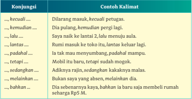

Tabel ini berisi contoh kalimat yang menggunakan beberapa konjungsi dalam bahasa Indonesia. Topik utamanya adalah penggunaan konjungsi dalam kalimat. Kolom pertama berisi konjungsi, sedangkan kolom kedua berisi contoh kalimat yang menggunakan konjungsi tersebut. Data penting yang terlihat adalah bahwa setiap konjungsi memiliki beberapa contoh kalimat yang berbeda, menunjukkan variasi dan penggunaannya dalam kalimat.

Sebaliknya, tanda koma tidak perlu dibubuhkan pada konjungsi berikut ini.

---
**📊 Tabel**

Tabel ini berisi contoh kalimat yang menggunakan berbagai konjungsi dalam bahasa Indonesia. Topik utamanya adalah penggunaan konjungsi dalam kalimat. Kolom pertama berisi konjungsi, sedangkan kolom kedua berisi contoh kalimat yang menggunakan konjungsi tersebut. Data penting yang terlihat adalah bahwa setiap konjungsi memiliki beberapa contoh kalimat yang berbeda, menunjukkan variasi dan kemampuan konjungsi dalam memperkuat hubungan antar kalimat.

Kalian dapat mencari teks lain dan mencermati penggunaan konjungsi intrakalimat serta tanda koma (,) pada kalimat majemuk. Perbaikilah teks yang keliru dalam penerapan tanda koma dan konjungsi intrakalimat.

Konjungsi intrakalimat pada umumnya tidak boleh digunakan untuk mengawali kalimat seperti contoh berikut ini.

 

---
## 📄 Halaman 113

- Ia kerap berlatih olahraga. Sehingga wajar badannya sehat.
- Kakaknya  memilih  jurusan  ilmu  sains.  Sedangkan  adik  memilih jurusan ilmu sastra.
Dua kalimat tersebut dapat diperbaiki seperti berikut ini.

- Ia kerap berlatih olahraga  sehingga wajar badannya sehat.
- Ia kerap berlatih olahraga. Oleh karena itu,  wajar badannya sehat.
- Kakaknya  memilih  jurusan  ilmu  sains,  sedangkan  adik  memilih jurusan ilmu sastra.
- Kakaknya  memilih  jurusan  ilmu  sains;  adik  memilih  jurusan  ilmu sastra.
Selain  konjungsi  intrakalimat,  terdapat  pula  konjungsi  antarkalimat. Konjungsi  antarkalimat  digunakan  untuk  mengawali  kalimat  sehingga kalimat tersebut terhubung dengan kalimat sebelumnya. Di dalam paragraf, konjungsi antarkalimat berfungsi untuk membangun kohesi atau hubungan yang erat antarkalimat.

Konjungsi antarkalimat pada umumnya diakhiri dengan tanda koma (,) seperti tabel berikut ini.

### Konjungsi Antarkalimat

---
**📊 Tabel**

Tabel ini berisi frasa-frasa yang sering digunakan dalam percakapan sehari-hari di Indonesia. Topik utamanya adalah pernyataan yang umum digunakan untuk menunjukkan keadaan atau situasi tertentu. Kolom pertama berisi frasa-frasa yang menggambarkan kondisi atau situasi, sedangkan kolom kedua berisi frasa-frasa yang biasanya digunakan sebagai jawaban atau penjelasan atas frasa-frasa pertama. Data atau pola penting yang terlihat adalah bahwa setiap frasa-frasa dalam kolom pertama memiliki satu atau lebih frasa-frasa yang sesuai dengan frasa-frasa di kolom kedua. Ini menunjukkan hubungan antara dua frasa-frasa tersebut dalam konteks percakapan sehari-hari.

 

---
## 📄 Halaman 114

### Ayo Berlatih

- Carilah  sebuah  artikel  tentang  teknologi  informasi  dari  berbagai media.  Baca  dan  perhatikan  penggunaan  konjungsi  intrakalimat  dan antarkalimat  di  dalam  artikel  tersebut.  Apakah  kalian  menemukan penggunaan konjungsi yang salah?
- Buatlah  daftar  kalimat  yang  benar  dan  kalimat  yang  salah  dalam penggunaan konjungsi.
- Perbaikilah kesalahan penggunaan konjungsi pada kalimat.
- Perbaikilah  kalimat  berikut  ini  sesuai  dengan  penerapan  konjungsi yang benar.
- Kafe itu akhirnya tutup. Karena sepi pengunjung sejak pandemi Covid­19.
- Dia mulai ragu­ragu tetapi anggota kelompok yang lain jalan terus.
- Terbukti  sekarang,  bahwa  orang  itu  memang  bermaksud  tidak baik.
- Jangan  saling  menyalahkan,  jika  memang  rencana  kita  belum berjalan sebagaimana mestinya.
- Ia terlihat takut kehilangan pekerjaan. Maka sejak awal ia berusaha menarik perhatian pimpinan.

### Kegiatan 2

Buatlah artikel opini terkait topik 'Kecerdasan Buatan yang Menggantikan Peran Manusia'. Elaborasi pikiran dan perasaanmu terkait topik ini dengan membandingkannya pada era masa depan. Artikel opini ditulis dengan panjang 500-600 kata pada kertas A4, margin normal, dan spasi antarbaris 1,5.

 

---
## 📄 Halaman 115

### H.  Jurnal Membaca

Menikmati imajinasi atau fantasi penulis dalam karya fiksi sains atau fiksi fantasi.

Apakah kalian suka membaca suatu kisah yang  bersifat  fantasi  (khayalan  tingkat tinggi) atau kisah tentang kehebatan sains? Di dalam karya fiksi dikenal genre fiksi  fantasi  dan  fiksi  sains.  Genre  fiksi fantasi dan fiksi sains menyajikan sesuatu di  luar  nalar  manusia.  Namun,  beberapa imajinasi atau khayalan para penulis fiksi sains terkadang menjadi kenyataan seiring berkembangnya teknologi.

- Ajakan membaca kali ini untuk kalian adalah  membaca  novel  dari  penulis Indonesia bernama Mashuri. Tema yang di  angkat ten  tang perjalanan waktu.
- Mashuri mengungkapkan khayalannya tentang Jakarta pada tahun 2040. Diki  sahkan  tokoh  Ilyas  belajar  tentang  alam  semesta  dan  bagaimana cara menciptakan manipulasi waktu. Sampai kemudian Ilyas merasakan manipulasi waktu itu jadi terasa nyata dan malah merusakkan hubungan cintanya dengan Alisa pada tahun 2015. Ajaibnya, Ilyas dipertemukan kembali  secara  tiba­tiba  dengan  Alisa  pada  tahun  2040.  Ilyas  sampai bingung  dengan  perjalanan  distorsi  waktunya.  Apakah  ia  berhasil menyadari atas perputaran waktu yang terjadi?
- Temukan dan bacalah buku yang diterbitkan Bhuana Sastra ini untuk menikmati  suguhan  fantasi  penulis  tentang  perjalanan  waktu  dan Jakarta  pada  tahun  2040.  Apabila  kalian  belum  dapat  mene  mukan novel  ini,  kalian  dapat  memilih  buku  atau  media  lain  yang  memuat kisah fantasi atau fiksi sains.
- Tulislah  sebuah  catatan  atau  resensi  tentang  kemenarikan  novel Destination:  Jakarta  2040 sepanjang 600-900 kata pada kertas berukuran A4 dengan ukuran fon 12 poin dan jarak 1,5 spasi. Beri judul yang menarik dan publikasikanlah di majalah dinding, majalah sekolah, atau media daring.

---
**🖼️ Gambar/Diagram**

> **Deskripsi Visual:** Gambar ini adalah ilustrasi yang menunjukkan berbagai ikon dan elemen yang mungkin digunakan dalam konteks pembelajaran tentang Jakarta 2040. Ilustrasi ini terdiri dari berbagai ikon yang mungkin merujuk pada aspek-aspek penting dari pembangunan Jakarta ke depan, seperti infrastruktur, transportasi, energi, lingkungan, dan lain-lain.

Elemen utama dalam ilustrasi ini meliputi berbagai ikon yang mungkin menggambarkan aspek-aspek penting dari pembangunan Jakarta ke depan. Ikutannya, setiap ikon mungkin memiliki informasi tambahan yang diberikan oleh teks di sebelahnya. Misalnya, ikon pertama mungkin menggambarkan infrastruktur, ikon kedua mungkin menggambarkan transportasi, dan seterusnya.

Teks, angka, atau label penting yang terlihat dalam ilustrasi ini mungkin mencakup nama-nama aspek-aspek tersebut, seperti "infrastructure," "transportation," "energy," "environment," dan lain-lain. Informasi kunci yang dapat diambil pembaca dari ilustrasi ini adalah bahwa ia menunjukkan berbagai aspek penting dari pembangunan Jakarta ke depan, serta bagaimana mereka mungkin saling berkaitan dan berinteraksi satu sama lain.

 

---
## 📄 Halaman 116

---
**🖼️ Gambar/Diagram**

> **Deskripsi Visual:** Gambar ini menunjukkan lembaran buku pelajaran dengan judul "Jurnal Membaca". Lembaran ini terdiri dari beberapa bagian yang berfungsi untuk mencatat informasi tentang buku yang dibaca. Di bagian atas, terdapat kolom untuk mengisi tanggal, nama, dan kelas pembaca. Di bawah itu, terdapat kolom kosong untuk menuliskan judul buku, penulis, penerbit, dan tahun terbit. Selain itu, ada juga dua baris kosong di bawah untuk catatan tambahan. Desain lembaran ini sederhana namun efektif untuk membantu pembaca merencanakan dan menyimpan informasi penting tentang buku yang dibaca.

 

---
## 📄 Halaman 117

### I. Refleksi

Merefleksikan semua yang telah dipelajari dan bagian-bagian mana saja yang belum terlalu dikuasai agar dapat menemukan solusinya.

Selamat!  Kalian  sudah  mempelajari  Bab  3.  Tentu  banyak  yang  sudah dipelajari. Tandai kegiatan yang sudah dilakukan atau pengetahuan yang sudah dipahami dengan tanda centang ( ), ya.

 

---
## 📄 Halaman 118

---
**📊 Tabel**

Tabel ini menunjukkan perkembangan kemampuan berkomunikasi dan pemahaman seseorang tentang berbagai aspek interaksi sosial. Topik utamanya adalah kemampuan berkomunikasi efektif dan memahami situasi kompleks. Kolom "Sudah dapat" menunjukkan kemampuan sejauh mana individu bisa melakukan tugas tertentu, "Masih perlu belajar lagi" menunjukkan area yang masih perlu diperbaiki, dan "Rencana tindak lanjut" menunjukkan langkah-langkah yang akan diambil untuk meningkatkan kemampuan tersebut. Data penting yang terlihat adalah bahwa individu memiliki kemampuan dasar dalam berkomunikasi dengan kalimat jelas, namun masih memerlukan peningkatan dalam memahami hubungan sosial yang lebih kompleks dan membedakan antara orang-orang berdasarkan karakteristik mereka.

Hitunglah persentase penguasaan materi kalian dengan rumus berikut:

(Jumlah materi yang kalian kuasai/jumlah seluruh materi) 100%

- Jika  70-100%  materi  di  atas  sudah  dikuasai,  kalian  dapat  meminta aktivitas pengayaan kepada guru.
- Jika materi yang dikuasai masih di bawah 70%, kalian dapat mendiskusi­ kan kegiatan remedial yang dapat dilakukan dengan guru.

 

---
## 📄 Halaman 119

KEMENTERIAN PENDIDIKAN, KEBUDAYAAN, RISET, DAN TEKNOLOGI REPUBLIK INDONESIA, 2022

Cerdas Cergas Berbahasa dan Bersastra Indonesia untuk SMA/SMK/MA Kelas XII

Penulis :  Bambang Trimansyah

ISBN

:  978-602-244-724-5

BAB 4

AN

### MENYAMPAIKAN OPINI TENTANG PERUNDUNGAN

ERASAN

### Pertanyaan Pemantik

- Apakah kalian mengetahui tentang kampanye antikekerasan di sekolah?
- Apa pendapat kalian tentang perilaku kekerasan di sekolah?
- Bagaimana cara kalian menyampaikan pendapat atau opini tentang sesuatu yang tidak kalian setujui?
- Pernahkah  kalian  membaca  sebuah  cerita  fiksi  (cerpen  atau  novel) bertema kekerasan atau perundungan di sekolah?
- Bagaimana cara kalian memahami perwatakan tokoh di dalam sebuah cerita fiksi?

 

---
## 📄 Halaman 120

---
**🖼️ Gambar/Diagram**

> **Deskripsi Visual:** Gambar ini adalah diagram yang menunjukkan berbagai metode dan teknik untuk menyampaikan opini tentang perundungan dalam sebuah cerita. Diagram ini terdiri dari beberapa bagian utama yang masing-masing menunjukkan metode tertentu:

1. **A. Mengungkapkan Perwatakan Tokoh dalam Cerita** - Metode ini melibatkan penggunaan tokoh-tokoh dalam cerita sebagai sumber informasi untuk menyampaikan opini.
2. **B. Menulis Tanggapan tentang Perundungan secara Kreatif** - Metode ini mengajarkan cara menulis tanggapan kreatif tentang perundungan dengan menggunakan bahasa yang menarik dan unik.
3. **C. Menyimpulkan Bacaan dengan Tampilan Grafis** - Metode ini mengajarkan cara menyimpulkan bacaan dengan menggunakan tampilan grafis yang efektif.
4. **D. Mengungkap Fakta, Fiksi, Opini, dan Asumsi dalam Narasi** - Metode ini membantu pembaca untuk membedakan antara fakta, fiksi, opini, dan asumsi dalam narasi.
5. **E. Mengenali Istilah dari Fenomena Sosial** - Metode ini mengajarkan pembaca untuk mengenali istilah-istilah yang berkaitan dengan fenomena sosial.
6. **F. Mahir Menggunakan Tanda Baca** - Metode ini mengajarkan cara menggunakan tanda baca dengan efektif dalam menyampaikan opini.
7. **G. Mendiskusikan Perundungan secara Daring** - Metode ini mengajarkan cara mendiskusikan perundungan secara daring.
8. **H. Menjelaskan Kembali Instruksi dan Informasi secara Akurat** - Metode ini mengajarkan cara menjelaskan instruksi dan informasi secara akurat.
9. **I. Jurnal Membaca** - Metode ini mengajarkan cara membuat jurnal membaca untuk meningkatkan pemahaman tentang perundungan.

Setiap metode memiliki tujuan dan cara kerjanya yang berbeda, namun semua bertujuan untuk membantu pembaca menjadi lebih baik dalam menyampaikan opini tentang perundungan dalam sebuah cerita.

 

---
## 📄 Halaman 121

---
**🖼️ Gambar/Diagram**

> **Deskripsi Visual:** Gambar ini adalah ilustrasi yang menunjukkan seorang perempuan dengan rambut panjang dan berwarna gelap, yang sedang menggenggam tangan kanannya ke depan untuk menutup wajahnya. Latar belakangnya adalah daun-daun hijau yang tampak seperti hutan. Di tengah gambar terdapat teks "STOP" dalam huruf besar putih dengan garis melintang di tengahnya, dan di bawahnya terdapat teks "Perundungan" dalam huruf merah. Gambar ini mungkin digunakan sebagai simbol atau representasi untuk mengingatkan tentang pentingnya menghentikan perilaku perundungan atau kekerasan terhadap perempuan.

Elemen-elemen utama dalam gambar ini adalah perempuan yang sedang menggenggam tangan kanannya ke depan untuk menutup wajahnya, tanda STOP yang menunjukkan penghentian, dan teks "STOP Perundungan". Relasi antara elemen-elemen ini adalah bahwa perempuan yang sedang menggenggam tangan kanannya ke depan untuk menutup wajahnya menunjukkan sikap yang menghindari atau menghindari, sementara tanda STOP menunjukkan penghentian atau penolakan, dan teks "STOP Perundungan" memberikan informasi tambahan tentang topik yang dibahas dalam gambar tersebut.

Informasi kunci yang dapat diambil pembaca dari gambar ini adalah bahwa gambar ini mungkin digunakan untuk mengingatkan tentang pentingnya menghentikan perilaku perundungan atau kekerasan terhadap perempuan. Gambar ini juga dapat digunakan sebagai simbol atau representasi untuk mengingatkan tentang pentingnya menjaga keamanan dan kesejahteraan perempuan.

Pada Bab 4 ini kalian akan mempelajari perwatakan tokoh di dalam sebuah cerita dengan alur yang kompleks dan membedakan fakta, fiksi, opini, serta asumsi di dalam teks naratif. Kalian juga akan diminta membacakan teks pidato terkait suatu topik tertentu. Selanjutnya, kalian akan mempelajari cara menuliskan teks narasi/deskripsi dan menuliskan tanggapan terhadap suatu hal. Kalian juga akan melakukan simulasi diskusi daring dengan menggunakan aplikasi konferensi video serta menjelaskan kembali informasi yang kalian dengar melalui audio-video.

Mari menyampaikan opini tentang fenomena sosial yang terjadi pada masyarakat melalui kegiatan membaca teks kreatif.

 

---
## 📄 Halaman 122

Perilaku kekerasan di sekolah semakin mengkhawatirkan  sehingga mendapat  sorotan dari pemerintah dan masyarakat. Beberapa aksi perundungan ( bullying ) yang dilakukan sesama peserta didik di sekolah ada yang menimbulkan korban jiwa, korban cacat, dan korban trauma.

- Berbagai  cara  telah  dilakukan  pemerintah  untuk  mencegah  aksi perundungan di sekolah. Baik korban perundungan maupun pelaku perun  dungan perlu mendapatkan  perhatian agar tidak terus menimbulkan masalah pada generasi muda.
- Topik perundungan kali ini akan menjadi isu bagi kalian memasuki kegiatan  pembelajaran  pada  Bab  4.  Kalian  akan  diajak mengembangkan  kemampuan  berbahasa  berdasarkan  salah  satu fenomena sosial yang terjadi di masyarakat.

### A.  Mengungkap Perwatakan Tokoh dalam Cerita

Memahami dan menguraikan peran tokoh dalam cerita beralur kompleks dan menghubungkannya dengan unsur parateks.

Kalian  tentu  telah  memahami  bahwa  cerita  fiksi  dibangun  oleh  unsurunsur  yang  disebut  unsur  instrinsik.  Unsur  instrinsik  terdiri  atas  tema, tokoh dan penokohan/perwatakan, latar ( setting ),  alur/plot  (jalan  cerita), dan sudut pandang.

- Pada pembelajaran di awal Bab 4 ini kalian akan dikenalkan dengan sebuah  novel  bertema  perundungan.  Novel  ini  tergolong  beralur kompleks  yang  menyajikan  beberapa  tokoh  dan  perwatakannya masing-masing.
- Perwatakan ialah cara penulis/pengarang menggambarkan tokohtokoh di dalam cerita. Semua peristiwa di dalam cerita terjadi karena aksi  atau  peran  dari  tokoh-tokohnya.  Karena  itu,  perwatakan berfungsi menggerakkan alur/plot cerita.

 

---
## 📄 Halaman 123

### Kegiatan 1

Cerita  di  dalam  fiksi  sering  mengangkat  fenomena  sosial-budaya  yang terjadi  di  masyarakat.  Dyah  Rinni,  penulis  novel  berjudul Unfriend You: Masihkah  Kau  Temanku ?  mengangkat  tema  perundungan  di  sekolah. Uniknya  novel  ini  menampilkan  tokoh  utama  yang  menjadi  pelaku perundungan sekaligus korban perundungan sebelumnya. Siapakah tokoh utama cerita ini?

Bacalah prolog novel Unfriend You untuk memahami sekilas tentang tokoh di dalam novel. Siapkan catatan kalian untuk mencatat perwatakan tokoh melalui jalan cerita.  Di  dalam  novel  ini  terdapat  kata-kata  berupa umpatan sebagai contoh perundungan verbal (kata-kata).

### PROLOG

Apakah ini neraka? Apakah lubang bumi yang paling dalam dan tidak ada jalan keluar?

Dalam remang cahaya, Katrissa menatap pintu bilik toilet, satu-satunya hal yang melindunginya dari bahaya yang mengancamnya saat ini. Pintu bergambar smiley tersenyum itu bergoncang hebat berkali-kali. Mereka masih berteriak memanggil namanya berkali-kali, mengancamnya, memaksanya untuk segera keluar.

'Katrissa! Keluar lo kucing buduk! Lo kira lo bisa selamat sembunyi di situ!'

Tanpa sadar Katrissa melangkah mundur, hanya untuk menyadari bahwa bilik itu terlalu sempit baginya untuk bergerak. Kakinya menghantam toilet yang sudah lama tidak terpakai sementara tangannya menyentuh ujung alat pel yang tergantung terbalik. Ia nyaris terjungkal saat salah satu kakinya menghantam ember yang diletakkan sembarangan di sana. Bau aroma tidak sedap, yang entah berasal dari mana, mulai menyentuh hidungnya.

Pojok derita. Begitu anak-anak menamakannya. Tempat mereka yang tidak diinginkan. Tempat mereka yang terbuang. Dulu Katrissa selalu meyakinkan dirinya bahwa hanya pecundang saja yang akan berakhir di tempat itu. Bukan dirinya. Ternyata ia salah besar.

Gedoran itu semakin menguat, terus menerus, membuat setiap detik hidupnya di bilik itu semakin menderita. Mengapa mereka tidak membiarkannya sendiri? Apakah penderitaannya selama ini tidak cukup?

Katrissa berusaha setegar mungkin. Tidak. Ia tidak boleh kalah. Tidak akan ia biarkan mereka tertawa penuh kemenangan. Tetapi semakin lama ia berada di sana, pertahanannya mulai runtuh. Pikirannya mulai dipenuhi oleh hal-hal buruk yang mungkin terjadi. Apa yang akan mereka lakukan padanya?

'Pergi kalian semua! Pergi!' jerit Katrissa tidak tahan lagi.

'Lo pikir kami bakal ngebiarin lo di sini aja, Kat? Nggak, Kat! Nggak kali ini! Kali ini gue akan memastikan lo nyesel pernah hidup di dunia ini! Lo dengar itu, kucing buduk!'

 

---
## 📄 Halaman 124

'Gue nggak bisa ngebukanya.' Terdengar suara lain. Terdengar panik.

'Ya cari alat buat buka, bego! Obeng atau sesuatu, gitu!'

Mereka akan memaksa menjebol pintu ini. Tanpa sadar Katrissa meremas ujung seragamnya.

Tuhan, ini tidak mungkin terjadi. Ia adalah Katrissa, sahabat Aura dan Milani, salah satu gadis paling populer di Eglantine High School. Bagaimana mungkin ini bisa terjadi? Tuhan, tolong biarkan ia bangun dan menyadari ini hanya mimpi buruk.

Pintu telah berhenti digedor, namun kekhawatiran Katrissa tidak berhenti ketika menyadari mereka melakukan sesuatu dengan engsel pintunya.

Tolong, bisik Katrissa dalam hati. Tuhan, bila Engkau benar-benar ada, tolonglah. Tolonglah hamba-Mu sekarang juga. Aku nggak tahu sampai kapan aku bisa tahan. Aku bakal mati. Bakal mati.

Dan gedoran pintu itu semakin lama semakin kuat. Hanya tinggal menunggu waktu saja sebelum akhirnya pintu itu jebol.

Sumber: Novel Unfriend You: Masihkah Kau Temanku ? karya Dyah Rinni, Gagas Media

Setelah membaca prolog novel Unfriend  You , dapatkah kalian menyebutkan apa yang dialami oleh tokoh utama? Agar lebih memahami lagi cerita ini, bacalah cuplikan Bab 1 dari novel ini.

### #1 Angsa dan Itik

Ada tiga hal yang tidak diinginkan Katrissa pada awal tahun keduanya di Eglantine High School. Yang pertama adalah bertemu dengan orang yang mengingatkan pada kehidupan tahun lalunya yang memalukan.

Yang kedua adalah orang dari masa lalu buruk sang gadis itu bertemu dengan temannya sekarang, teman-teman yang sejuta kali lebih keren daripada teman-teman yang dulu itu. Ini adalah kasus yang lebih tidak enak lagi. Kaum angsa akan mulai mempertanyakan apakah gadis angsa baru itu pantas terus menjadi angsa atau sebaiknya dikirimkan kembali ke habitat lamanya.

Yang ketiga sekaligus yang paling penting adalah, kedatangan murid baru yang akan mengubah hidup si gadis angsa baru untuk selamanya.

Dan itu semua menimpa hidup Katrissa Satin tahun ini. Atau lebih tepatnya lagi, hari ini.

Katrissa Satin keluar dari pintu belakang mobilnya, menarik keluar sebuah boks cokelat besar yang berat itu. Supirnya, Pak Yon, segera membantu nona mudanya tanpa mempedulikan mobil-mobil di belakang mereka yang mengklakson tidak sabar.

 

---
## 📄 Halaman 125

Kadang Katrissa merasa jengkel mengapa begitu banyak anak di Eglantine High (atau lebih sering disebut Egan) yang merasa wajib untuk diantarkan persis sampai di depan pintu gerbang. Padahal, kalau mereka mau berjalan sedikit saja, kemacetan di sekitar jalanan sekolahnya tidak akan separah ini.

Lima detik kemudian ia ingat perkataan Aura. Tidak ada selebritas yang berjalan kaki menuju red carpet . Bagi banyak anak Eglantine High, gerbang sekolah adalah red carpet itu sendiri.

Dengan susah payah, Katrissa mengangkat boks cokelatnya berisi beragam perlengkapan presentasinya, disusul dengan sling bag -nya yang cukup berat. Ia bertanya-tanya mengapa di sekolah sebagus ini tidak ada jasa kurir. Atau lebih parah lagi, tidak ada teman yang mengulurkan tangannya.

Dulu, ia mengira dengan menjadi salah satu BFF Aura Amanda, salah satu cewek paling populer di Eglantine High, otomatis semua orang akan dengan senang hati membantunya. Salah besar. Tidak ada yang suka pagi-pagi harus menjadi kuli.

Dengan mengerang kecil, Katrissa mulai berjalan memasuki gerbang sekolahnya, mengikuti arus puluhan peserta didik lain. Ia harus bergerak cepat sebelum jam pelajaran dimulai. Ia tidak ingin nasibnya sama dengan kelompok yang presentasi minggu lalu: mendapat sorotan tajam dari Mr. Bono karena belum siap pada saatnya.

Pagi itu matahari terasa lebih terik daripada biasanya. Tubuh Katrissa mulai gerah, membuat seragam Eglantine High-nya yang berwarna cokelat mulai menampilkan titik-titik keringat di punggungnya.

Katrissa berharap ia bertemu dengan Aura sehingga ia bisa minta bantuannya untuk membawakan barang. Sahabatnya itu bilang ia sudah datang itu tetapi mengapa ia sama sekali tidak terlihat batang hidungnya?

'Mau gue bantu, Katrissa?'

Katrissa menoleh. Sudah cukup lama Katrissa tidak melihat Langit Lazuardi dan sejujurnya, ia tidak berharap ia akan bertemu dengannya lagi. Bukan karena dia pernah jahat padanya. Hanya saja, katakanlah, ia jatuh di kategori yang salah. Kalau ada spesimen sempurna dari itik geeky yang membuat Aura antipati, Langitlah orangnya.

Semua dari diri Langit menghembuskan udara geeky . Mulai dari kacamatanya yang berframe tebal hingga poninya yang panjang dan diikat ke belakang dengan gelang karet. Padahal sebenarnya Langit tidak jelek. Ia cukup tinggi, meskipun tidak menjulang tinggi seperti tiang listrik, dan ketika ia tersenyum, seperti yang tengah ia perlihatkan sekarang, senyumnya cukup manis. Tetapi semuanya menguap, berkat aura geeky -nya.

'Pagi, Langit,' balas Katrissa.

Langit mengulurkan tangannya untuk membantu. Dengan terpaksa, Katrissa membiarkan Langit mengangkat boks cokelatnya. Begitu enteng cowok itu membawa bawaannya seakan-akan boks itu hanyalah segenggam kapas. Terkadang Katrissa lupa kalau cowok lebih kuat dari cewek.

'Lo masih ingat gue,' Langit terlihat senang.

 

---
## 📄 Halaman 126

Bagaimana mungkin Katrissa melupakannya? Cowok itu pernah membantunya beberapa bulan yang lalu. Ia berterima kasih untuk itu, tetapi pada saat yang sama ia juga tidak ingin mengingatnya kembali. Itu adalah salah satu momen paling memalukan dalam hidupnya.

'Gue bukan tipe yang gampang lupa sama orang.'

'Baguslah kalau begitu,' Langit berjalan menyusuri koridor berdampingan dengan Katrissa. Berjalan seperti ini membuat Katrissa merasa mereka seperti pasangan saja. Ia mulai gerah ketika beberapa cewek mulai membicarakan mereka.

Katrissa berusaha menjaga jarak di antara mereka, tetapi Langit seperti tidak mengerti. Ia malah berusaha memperkecil jarak di antara mereka. Hebat. Semoga saja Aura tidak melihat Langit. Karena kalau itu terjadi, kiamat akan datang. Entah pidato apa lagi yang akan disemburkan Aura padanya.

'Katrissa, lo lagi sibuk apaan sekarang?' Langit menoleh kepadanya.

Selain sibuk berbelanja, ke salon atau yoga dengan Aura dan Milani? Tidak banyak.

'Biasa aja. Emangnya kenapa?'

'Masih suka bikin apa itu kerajinan dari kertas itu…umm… papercraft ?'

Tidak banyak orang di sekolahnya yang tahu bahwa ia menyukai papercraft. Paling hanya teman-temannya dulu di klub seni atau Ms. Gina sebagai guru seninya. Tetapi kemudian Katrissa teringat, gara-gara insiden paperdress terkutuk itu ia jadi mengenal Langit. Tentu saja Langit tahu kalau ia menyukai papercraft .

'Nggak terlalu sering. Emangnya kenapa?'

Wajah Langit terlihat berbinar-binar ketika ia menceritakan rencananya. 'Sebulan lagi bakal ada awareness week . Tahun ini kami berencana untuk ngangkat tema soal bullying. Gue berharap banyak anak yang nyumbang karya seninya, jadi izin dari sekolah bakal lebih mudah.'

' Bullying ?' tanya Katrissa tidak mengerti. 'Buat apa? Di Egan kan nggak ada bullying .'

'Sebenarnya, bullying itu banyak bentuknya. Nggak cuma dalam bentuk ngegebukin anak baru aja, tetapi…'

'Katrissa!'

Langit terpaksa menghentikan pembicaraannya. Katrissa tahu betul suara itu tanpa ia harus menoleh. Dan itu adalah ketakutannya nomer dua: kala itik dari masa lalu bertemu dengan angsa.

Sekilas fakta, tahun lalu Katrissa adalah si itik nerdy : berkacamata, nyaris tidak punya teman. Dan kemudian, karena satu dan lain hal, ia bertemu dengan angsa yang menaikkan derajatnya menjadi seekor angsa. Cukup menyenangkan, sampai akhirnya ia harus bertemu dengan masa lalunya, kaum itik. Itik-itik itu akan memandang si angsa dengan perasaan tidak rela bahwa salah satu dari mereka telah berubah menjadi angsa. Di lain pihak, kaum angsa merasa seharusnya semua itik itu ditangkap saja dan dijadikan bebek goreng.

 

---
## 📄 Halaman 127

Jika Langit adalah wujud sempurna dari itik jelek rupa, Aura Amanda adalah wujud sempurna dari angsa. Bahkan, Aura Amanda sudah menjadi angsa sejak lahir. Ia seperti tidak pernah mengalami frase mengelap ingus, jerawatan atau bahkan salah memilih baju.

Segala yang ada di dirinya adalah perwujudan keanggunan itu sendiri, seakanakan ketika Tuhan menciptakan Aura, Tuhan sedang mendefinisikan kata elegan itu sendiri. Ia memiliki tubuh cukup tinggi dan langsing untuk menjadi model, ditambah dengan mata indah, hidung mancung, kulit putih bersih blasteran CinaSunda, dan yang paling penting, memiliki senyum terindah di Egan.

Wajahnya mungkin bukanlah yang tercantik di Egan, masih ada beberapa cewek yang dianugerahi kecantikan lebih dari Aura. Namun, sementara gadisgadis yang lain memanfaatkan kecantikannya untuk merengek pada cowok, bersikap seperti drama queen dan merasa dirinya supermodel, Aura tetap lembut rendah hati seperti Lady Di. Apalagi ketika matahari berada di belakangnya. Ia seperti menjadi matahari itu sendiri. Itulah yang membuat Aura disukai semua orang, termasuk Katrissa.

Di belakang Aura, Milani Atmaja mengikuti. Ia berusaha berjalan seanggun mungkin seperti Aura, tetapi gadis itu hanya akan selalu menjadi fotokopi buram Aura.

Dari segi wajah, Milani itu sebenarnya cantik, berkat mamanya yang punya darah separuh bule Inggris. Tetapi pada saat yang sama, Milani mewarisi tubuh mamanya yang besar dan gampang gemuk. Akibatnya, segala sesuatu yang seharusnya terlihat cantik di wajah Milani jadi terlihat besar: matanya, hidungnya, dan juga bibirnya. Lebih parah lagi, betapapun kerasnya usaha Milani untuk menurunkan berat badannya, ia tidak akan pernah seramping Aura.

Untung Milani dan Aura sudah bersahabat sejak SMP dan juga keluarga Milani merupakan salah satu keluarga terkaya di Egan. Jadi Milani tidak pernah mengkhawatirkan posisinya, termasuk ketika Aura memutuskan untuk mengajak Katrissa bergabung dalam clique mereka di akhir tahun pelajaran kemarin.

'Pagi, Aura. Milani,' Katrissa berusaha terdengar seceria mungkin.

Aura mengabaikan Katrissa, memandang tajam pada Langit. Aura mungkin baik hati, tetapi ia juga menarik tegas batas pergaulan. Baginya itik dan angsa tidak pernah boleh bertemu-kecuali terpaksa dan Aura punya daftar situasi terpaksa itu-atau dunia akan kiamat. Di matanya, Langit jelas-jelas melanggar batas itu.

'Ah,' Langit seperti sadar arti lirikan Aura. 'Gue cuma nganterin Katrissa. Kasihan dia bawa barang seberat ini. Cowok yang baik harus ngebantuin cewek, kan?'

'Dan cowok yang baik juga sadar diri akan posisinya,' sindir Aura tajam.

'Makasih, Langit,' Katrissa mengambil boks cokelatnya dari pelukan Langit. Ia tidak ingin membuat Langit terlibat masalah lebih jauh.

'Gue bawa sendiri aja. Kelas udah dekat.'

Langit mengalah. Ia melambaikan tangannya pada gadis itu seraya berjalan menjauh. ' See you again , Katrissa.'

' Like never !' Milani berkacak pinggang. Ia memutar bola matanya, seakan tidak percaya paginya yang indah ini harus dirusak dengan melihat Langit.

 

---
## 📄 Halaman 128

Aura mendesah perlahan. Suaranya terdengar lembut, tetapi terasa ada tuntutan keras di dalamnya. ' Please deh , Rissa. Lo tuh harus cepatan punya pacar. Bahaya banget jadi cewek populer tanpa pacar. Lo bisa menarik makhluk-makhluk yang tidak diinginkan kaya' si aneh tadi itu.'

'Langit. Namanya Langit, Aura.'

Katrissa berjalan menuju kelasnya. Ia melempar tasnya sembarangan dan menuju ke proyektor di depan kelasnya untuk mulai menyiapkan presentasinya. Ditha, teman satu kelompoknya, segera membantunya. Hanya Aura yang seperti biasa terlihat tidak peduli. Padahal poin untuk presentasi ini besar artinya untuk mereka.

'Nggak tahu, deh Aura. Gue belum mikirin hal itu.'

Aura langsung tertawa begitu mendengarnya. 'Belum mikirin? Katrissa, lo tuh udah jadi salah satu cewek terkeren di Egan, yang artinya lo bisa menggaet cowok mana pun yang suka dan lo belum memutuskannya siapa yang kudu mendampingi lo?'

Katrissa ingin membantah bahwa ia tidak ingin diburu-buru dalam masalah pacaran. Tetapi Aura malah berjalan ke depan kelas dan berkata, ' Guys ! Siapa yang mau jadi cowoknya Rissa?'

'Aura!'

Di luar dugaan Katrissa, hampir semua cowok di kelasnya langsung mengangkat tangannya. Ya ampun. Memalukan sekali. Sekarang ia lebih mirip sapi yang hendak dilelang.

' See , Rissa?' Aura mendekati Katrissa dan berbisik padanya. 'Cowok itu sekarang ngerebutin elo. Walaupun emang sih di sini hanya ada satu atau dua yang pantes buat lo, sih.  Kaya' Malik si Arab campuran itu atau Felix yang kemarin main sinetron itu. The point is …'

'Aura!' potong Katrissa, berusaha menutupi rasa malunya. 'Pikirin dulu soal presentasinya!'

Aura mengikuti gaya bicara Katrissa dengan jengkel. Katrissa tidak peduli. Ia lebih memikirkan bagaimana caranya agar power point yang dibuatnya semalam bisa tampil di proyektor.

Dan kemudian, bel sekolah tanda pelajaran dimulai berbunyi.

Sumber: Novel Unfriend You: Masihkah Kau Temanku? karya Dyah Rinni, Gagas Media.

Bagaimana  dengan  cuplikan  awal  novel Unfriend  You yang  telah kalian baca? Apakah ceritanya menarik sehingga mendorong kalian untuk membaca novel secara utuh?

Kalian sudah dapat mengetahui bahwa tokoh utama cerita ini adalah Katrissa Satin yang dipanggil Rissa oleh teman-temannya. Ia seorang gadis SMA yang disebut berubah dari 'itik menjadi angsa'.

 

---
## 📄 Halaman 129

Prolog novel menunjukkan suatu peristiwa perundungan yang dialami oleh Katrissa. Prolog itu menandakan peristiwa saat ini yang dialami oleh Katrissa,  sedangkan  Bab  1  memperlihatkan  kisah  sebelum  peristiwa  itu terjadi. Sejatinya, alur yang dibangun oleh penulis/pengarang adalah alur sorot balik, tetapi kemudian cerita disusun dengan alur maju. Di tengah cerita terjadi juga alur sorot balik berdasarkan ingatan Katrissa. Jadi, novel ini menggunakan alur campuran.

Novel  ini  menampilkan  beragam  tokoh  dengan  latar  sekolah  elite untuk kelas menengah atas. Karakterisasi atau perwatakan tokoh di dalam cerita dapat dicermati melalui hal-hal berikut ini.

- Senandika adalah  pembicaraan tokoh dengan dirinya sendiri. Hal ini biasa  terdapat  pada  cerita  yang  menggunakan  sudut  pandang  orang pertama atau gaya akuan.
- Dialog tokoh adalah pembicaraan antartokoh di dalam cerita yang dapat menggambarkan pikiran dan perasaan setiap tokoh cerita.
- Tindakan atau perilaku tokoh adalah penggambaran keputusan-ke  putusan yang diambil tokoh ketika menghadapi suatu konflik di dalam cerita.
- Fisik dan watak tokoh adalah penggambaran secara langsung bentuk fisik dan watak melalui deskripsi di dalam cerita.

### Ayo Berlatih

Berdasarkan  semua  yang  telah  kalian  baca  di  Kegiatan  1  ini,  lakukanlah tugas sebagai berikut.

- Buatlah deskripsi ketiga tokoh berikut ini berdasarkan cuplikan novel Unfriend You: Masihkah Kau Temanku ?
- Bab  1  novel  menggunakan  judul  'Angsa  dan  Itik'.  Dua  kata  itu mengandung makna konotasi. Jelaskanlah makna dari sebutan angsa dan itik dalam 1-2 paragraf.
- Buatlah  ringkasan  cerita  dari  Bab  1  'Itik  dan  Angsa'  berdasarkan alur  cerita  yang  telah  kalian  baca.  Ringkasan  cerita  dibuat  paling banyak 300 kata.

 

---
## 📄 Halaman 130

### Kegiatan 2

Memahami unsur parateks dalam sebuah novel.

Sebuah karya fiksi tidak dapat berdiri sendiri. Ia memerlukan dukungan dari unsur-unsur lain di luar teks. Unsur-unsur itu disebut parateks. Gerard Genette  di  dalam  bukunya Paratext:  Thresholds  of  Interpretation (1997) menyampaikan beberapa unsur parateks, di antaranya nama penulis, judul dan  subjudul,  prakata,  kata  pengantar,  prolog,  epilog,  epigraf,  ilustrasi, komentar/testimoni, dan kover.

Unsur parateks dalam penerbitan karya fiksi dapat mendukung sebuah karya mudah dikenali oleh pembaca. Dengan kata lain, unsur parateks juga membantu pemasaran sebuah karya fiksi.

Perhatikan  unsur  parateks  berupa  kover  depan  dari  novel Unfriend You: Masih Kau Temanku ?

### Unsur Parateks

---
**🖼️ Gambar/Diagram**

> **Deskripsi Visual:** Gambar ini adalah diagram yang menunjukkan struktur sebuah buku novel. Gambar ini memperlihatkan bagian-bagian penting dari buku, yaitu judul, nama penulis, dan ilustrasi.

1. **Apa yang Ditampilkan Secara Keseluruhan**: Gambar ini menunjukkan bagian depan buku dengan judul "Unfriend You" dan nama penulis yang tidak jelas. Di sebelah kanan, ada tulisan "Unsfr Parateks" yang mungkin merujuk pada bagian tertentu buku tersebut.

2. **Elemen-Elemen Utama dan Relasinya**: 
   - **Judul Buku**: "Unfriend You" ditampilkan di bagian atas buku.
   - **Nama Penulis**: Nama penulis ditampilkan di bagian bawah buku.
   - **Ilustrasi**: Ilustrasi berupa gambar bunga kuning dengan latar belakang kertas berwarna cerah.
   - **Teks Parateks**: Tulisan "Unsfr Parateks" berada di bagian atas buku, mungkin merujuk pada bagian tertentu buku.

3. **Teks, Angka, atau Label Penting yang Terlihat**:
   - Judul Buku: "Unfriend You"
   - Nama Penulis: (tidak jelas)
   - Ilustrasi: Gambar bunga kuning dengan latar belakang kertas berwarna cerah
   - Tulisan Parateks: "Unsfr Parateks"

4. **Informasi Kunci yang Dapat Diambil Pembaca**: Gambar ini memberikan gambaran umum tentang struktur buku, termasuk judul, nama penulis, dan ilustrasi. Ini membantu pembaca untuk memahami bagaimana bagian-bagian utama buku tersebut disajikan.

Di dalam kover Unfriend You: Masihkah Kau Temanku ? terdapat unsur logo penerbit (GagasMedia), nama penulis, judul, dan ilustrasi. Ada ilustrasi gulungan kertas dan juga latar belakang kertas dengan tipografi (huruf) dari guntingan kertas. Warna lembut yang digunakan menunjukkan sifat feminin dari novel ini.

 

---
## 📄 Halaman 131

Lalu,  apa  hubungan  gulungan  kertas  dengan  isi  atau  tokoh  cerita? Kalian  dapat  mencari  hubungan  antara  kover  dan  isi/tokoh  cerita  pada cuplikan Bab 1 novel tersebut.

Di kover belakang novel ini juga terdapat teks yang disebut sinopsis. Novel Unfriend You juga  menggunakan cuplikan senandika tokoh utama tentang dirinya.

Aku adalah noda untuk dosa yang tak kulakukan. Aku mencoba bertahan, berusaha mengerti; mungkin ada bagian dari dirimu yang tak bisa kuraih. Namun, yang tak kunjung kupahami, mengapa ada persahabatan yang menyakiti?

Berikut  ini  adalah  teks  promosi  novel Unfriend  You:  Masihkah  Kau Temanku ? yang disiapkan penerbit. Dari teks ini kalian tahu tema apa yang diangkat oleh novel. Penerbit berusaha menarik perhatian calon pembaca.

Unfriend You adalah sebuah novel karya Dyah Rinni yang mengusung tema antibullying . Novel terbitan GagasMedia ini seolah membuka mata dan hati kita bahwa bullying sangat dekat dengan kehidupan para remaja, tak terkecuali di lingkungan sekolah. Kisah yang dituliskan Dyah dalam novel ini begitu menyentak. Tak sekadar tema antibullying , melalui novel ini kamu akan merasakan makna persahabatan yang begitu kental. Satu yang pasti, mereka membutuhkan kita untuk menyadarkan dan merengkuhnya kembali.

Sumber: GagasMedia

### Ayo Berlatih

- Ungkapkan hubungan antara ilustrasi kover (gulungan kertas) dan  isi  novel Unfriend  You:  Masihkah  Kau  Temanku? .  Kalian  dapat menemukannya pada Bab 1 novel Unfriend You .
- Profil penulis fiksi termasuk ke dalam unsur parateks. Carilah informasi tentang penulis novel Unfriend You dan tuliskan profilnya dalam 1-2 paragraf.

### B.  Menulis Tanggapan tentang Perundungan Secara Kreatif

Menulis tanggapan terhadap suatu bacaan secara kreatif berdasarkan analisis yang dilengkapi bukti dan data pendukung.

 

---
## 📄 Halaman 132

Masih  tentang  novel Unfriend You: Masihkah Kau Temanku ?  yang  me  ngangkat tema perundungan, sebaiknya kalian membaca novelnya secara utuh. Setelah membaca, kalian dapat menanggapi secara tertulis.

Salah satu jenis tulisan yang berisikan tanggapan, analisis, dan kritik ialah resensi buku. Kalian pasti sudah mempelajari bentuk tulisan ini pada kelas-kelas sebelumnya. Sambil mengingat kembali cara menulis resensi, silakan lakukan kegiatan di dalam pembelajaran ini.

### Kegiatan 1

Novel Unfriend You: Masihkah Kau Temanku ? telah mendapatkan apresiasi dari pembacanya. Salah satu bentuk apresiasi ialah tulisan berupa resensi. Bacalah resensi berikut ini.

### Resensi Novel Unfriend You

Judul buku :

Unfriend You: Masihkah Kau Temanku?

Penulis

:   Dyah Rinni

Editor

:   Nico Rosady

Desain sampul   :   Levina Lesmana

Penerbit

:   Gagas Media

Tahun terbit

:   2013

Tebal buku

:   viii + 278 halaman

ISBN

:   979-780-648-0

### Sinopsis:

Aku adalah noda untuk dosa yang tak kulakukan. Aku mencoba bertahan, berusaha mengerti; mungkin ada bagian dari dirimu yang tak bisa kuraih. Namun, yang tak kunjung kupahami, mengapa ada persahabatan yang menyakiti?

***

Katrissa Satin memulai awal tahun keduanya di Eglantine High School, atau yang biasa disingkat jadi Egan sebagai 'angsa'. Dia yang tahun lalu termasuk kumpulan 'itik', sejak tiga bulan lalu 'naik derajat' dengan masuk dalam clique -nya Aura Amanda. Aura sendiri yang menawarkan persahabatan setelah Katrissa membantu Aura membuatkan ornamen gantung untuk stan Aura.

Mati-matian Katrissa berusaha memantaskan diri agar terlihat sepadan dengan Aura dan Milani Atmaja. Ia yang lebih suka buku dan paper art mesti menahan diri dan berusaha lebih menikmati gaya hidup high class clique mereka.

 

---
## 📄 Halaman 133

Lalu hari itu tiba, muncul seorang anak baru, Priska Steffanie Shanatavia yang mencuri perhatian. Karena selain cantik, Priska punya sifat friendly dan mudah berbaur. Katrissa shock karena Priska sangat mirip dengan Winda, sahabatnya di sekolah yang dulu yang telah mengkhianatinya. Tak lama Priska pun menjadi bagian dalam clique mereka.

Namun muncul masalah, terang-terangan Priska menunjukkan ketertarikannya pada Jonas, pacar Aura. Tentu saja hal itu memicu kecemburuan dan kemarahan Aura. Tak cukup mengajak Priska melakukan tindakan kriminal, Aura menekan dan menggencet Priska hingga gadis itu mencoba bunuh diri karena tidak tahan.

Katrissa ingin menolong Priska, tetapi ia lebih takut kehilangan teman. Maka dari itu, ketika Langit Lazuardi, cowok geek yang selalu berusaha mendekatinya, mendesaknya agar membantu Priska, Katrissa mengalami dilema.

Bukan hanya itu, Jonas yang diam-diam disukai Katrissa juga tiba-tiba memberi perhatian lebih dan mengajaknya pulang bersama sepulang menengok Priska. Aura yang melihatnya kini mengalihkan sasaran penggencetan pada Katrissa. Katrissa melawan, tetapi apakah ia sanggup menghadapi amukan Aura dan seisi sekolah? Siapa yang tetap akan berdiri di sisinya, Langit atau Jonas?

***

Unfriend You merupakan novel remaja yang mengangkat tema serius: bullying . Cukup berat dan menyesakkan membaca novel seperti ini, tetapi Dyah Rinni membungkusnya dengan jalinan cerita yang menarik. Meski plot tidak terlalu soft dalam berpindah adegan, alurnya menghanyutkan.

Menggunakan sudut pandang orang ketiga, Unfriend You lebih berfokus pada perasaan dan pikiran Katrissa. Sementara pikiran dan perasaan tokoh lain tidak diungkapkan. Akan tetapi, karena Katrissa merupakan pelaku, penonton, dan juga korban bullying , pembaca tetap akan merasakan kompleksitasnya.

Cukup suka dengan penokohan dalam novel ini. Meski nggak ada yang saya favoritkan. Katrissa adalah cewek yang tadinya cupu , dan meski telah bergabung bersama kelompok Aura, ia tetap menyukai dunia paper art . Keinginannya melawan dikalahkan ketakutannya membayangkan nggak punya teman.

Apa yang membuat saya tercengang adalah Aura, sebagai murid populer, Aura cukup manis dan lumayan baik hati. Mirip remaja kebanyakan. Nggak asal bentak atau cari gara-gara. Hanya ia memang selalu ingin dituruti. Namun, begitu berkaitan dengan Jonas, ia langsung kalap dan berubah sadis.

Sementara Langit Lazuardi langsung mencuri perhatian saya begitu namanya muncul di bab pertama. Namanya unyu . Langit digambarkan sebagai cowok geek yang oleh Aura dianggap nggak selevel dengan Katrissa.

Saya sebenarnya berharap Langit nggak mengubah penampilan sampai akhir kisah, tetapi akhirnya ia coba mengganti kacamatanya dengan lensa kontak. Agak sedih jadinya.

Saya suka dengan background setiap tokoh yang menguatkan alasan karakter mereka. Sayangnya untuk Aura, alasan mengapa ia menjadi pelaku bullying baru ada di akhir, rasanya jadi semacam pembenaran bukan asal muasal.

 

---
## 📄 Halaman 134

Karya Nurina Widiani, http://kendengpanali.blogspot.com/

Membaca resensi novel Unfriend You yang ditulis oleh Nurina Widiani ini  kalian  menjadi  lebih  tahu  jalan  cerita  novel  tersebut.  Ada  tokoh  lain yang juga berperan bernama Priska Steffanie Shanatavia dan Jonas. Resensi

 

---
## 📄 Halaman 135

mendorong  kalian  untuk  membaca  novel  ini  secara  utuh  meskipun  ada kritik yang disampaikan penulis resensi.

### Ayo Berlatih

- Di  dalam  resensi  terdapat  pujian  dan  kritik  dari  penulis  resensi berdasarkan  hasil  analisis.  Tuliskan  dengan  bahasa  kalian  sendiri pujian dan kritik yang disampaikan penulis resensi.
- Siapakah pelaku perundungan dan korban perundungan yang dikisahkan  oleh  penulis  novel Unfriend  You ?  Bagaimanakah  posisi tokoh utama Katrissa Satin di dalam novel tersebut?
- Penulis resensi merekomendasikan novel Unfriend You untuk dibaca oleh  remaja  dan  orang  dewasa.  Ia  memberikan  penilaian  4  bintang? Apakah makna penilaian 4 bintang.

### Kegiatan 2

Setelah  membaca  resensi,  kalian  dapat  melanjutkan  dengan  membaca artikel informasi berikut ini. Bacalah dengan saksama.

### Mengenal Jenis-Jenis Bullying atau Perundungan

Sumber: CNN Indonesia/Laudy Gracivia

Jakarta, CNN Indonesia - Kasus bullying atau perundungan baru-baru ini terjadi pada Audrey, peserta didik SMP di Pontianak, Kalimantan Barat. Kasus ini membuka mata bahwa bullying ada di sekitar kita terutama pada anak-anak.

 

---
## 📄 Halaman 136

Perundungan adalah perilaku atau tindakan agresif yang melibatkan ketidakseimbangan kekuatan sehingga merugikan orang lain. Perilaku agresif ini dapat dilakukan berulang kali dan menyebabkan masalah yang serius pada orang yang dibully .

Berdasarkan situs resmi Stop Bullying Amerika Serikat, tindakan yang dikategorikan sebagai perundungan adalah tindakan yang agresif dan mengandung ketidakseimbangan kekuatan dan pengulangan. Ketidakseimbangan kekuatan itu diartikan sebagai orang yang menggunakan kekuatan mereka seperti kekuatan fisik, akses informasi yang memalukan, atau popularitas untuk mengendalikan atau membahayakan orang lain.

Ada banyak jenis penindasan yang dapat dialami oleh anak-anak maupun orang dewasa. Secara garis besar, perundungan dapat dibagi dalam beberapa jenis, berikut jenis-jenis bullying atau perundungan yang patut diwaspadai.

- Perundungan Fisik
Perundungan fisik adalah penindasan yang dilakukan dengan cara melibatkan fisik seperti melukai tubuh seseorang yang dapat menyebabkan efek jangka pendek dan jangka panjang. Perundungan fisik mencakup memukul, menendang, mencubit, mendorong, dan menghancurkan barang orang lain.

- Perundungan Verbal
Perundungan verbal adalah intimidasi yang melibatkan kata-kata, baik secara tertulis maupun terucap. Perundungan secara verbal meliputi menggoda, memanggil nama yang tidak pantas, mengejek, menghina, dan mengancam.

- Perundungan Sosial
Perundungan sosial adalah penindasan yang mengakibatkan rusaknya reputasi atau hubungan seseorang. Intimidasi sosial ini mencakup berbohong, menyebarkan rumor negatif, mempermalukan seseorang, dan mengucilkan seseorang.

- Cyberbullying atau Perundungan di Dunia Maya
Perundungan di dunia maya adalah perilaku intimidasi yang dilakukan menggunakan teknologi digital. Perundungan di dunia maya ini meliputi mengunggah gambar atau video yang tidak pantas, menyebar gosip secara daring, dan menggunakan informasi orang lain di media sosial.

- Perundungan Seksual
Dikutip dari Very Well Family , perundungan seksual adalah tindakan yang berbahaya dan memalukan seseorang secara seksual. Intimidasi seksual ini termasuk pemanggilan nama seksual atau cat-calling , gerakan vulgar, menyentuh, dan materi pornografi.

Sumber: CNN Indonesia (2019)

Teks yang telah kalian baca mengandung informasi tentang jenis-jenis perundungan sehingga kalian dapat mengenali lima jenis perundungan. Jika kalian sudah mendapatkan informasi lebih banyak tentang perundungan, saatnya kalian membuat sebuah tulisan kreatif.

 

---
## 📄 Halaman 137

Tulisan  kreatif  dapat  berbentuk  fiksi  atau  nonfiksi.  Tulisan  kreatif berbentuk  fiksi,  yaitu  puisi,  drama,  cerpen,  atau  novel.  Tulisan  kreatif berbentuk  nonfiksi,  di  antaranya  kisah  pengalaman  diri  sendiri,  esai, dan  karangan  khas  ( feature ).  Ekspresi  kreatif  secara  tertulis  juga  dapat disampaikan dalam bentuk atau format surat terbuka, poster, dan unggahan di  media  sosial.  Akan  tetapi,  saat  mengekspresikan  tulisan  tersebut, perhatikan terlebih dahulu tentang bahasa dan tujuan tulisan.

Bahasa  mencakup  diksi  (pilihan  kata),  tata  tulis  (ejaan),  tata  bentuk (kata  bentukan/berimbuhan),  tata  kalimat,  dan  paragraf.  Kalian  harus menampilkan tulisan kreatif dengan bahasa Indonesia yang baik dan benar agar maksud kalian dapat dipahami oleh pembaca.

Suatu tulisan semestinya juga mengandung tujuan. Ada empat tujuan utama di dalam penulisan yang diungkapkan Tarigan (2008) sebagai berikut:

- memberitahukan atau mengajarkan sesuatu;
- meyakinkan atau mendesak;
- menghibur atau menyenangkan; dan
- mengutarakan atau mengekspresikan perasaan.
Ada  hubungan  antara  tujuan,  respons  pembaca,  dan  jenis  tulisan. Perhatikan tabel berikut ini.

---
**📊 Tabel**

Tabel ini membahas berbagai tujuan penulisan dan respons pembaca yang muncul dalam berbagai jenis tulisan. Topik utamanya adalah tentang bagaimana penulis dapat mencapai tujuan tertentu melalui berbagai jenis tulisan. Dalam tabel ini, terdapat tiga kolom utama: Tujuan Penulisan, Respons Pembaca, dan Jenis Tulisan. Tujuan penulisan mencakup berbagai kebutuhan seperti memberitahu, meyakinkan, menghibur, mengungkapkan perasaan, dan mengekspresikan perasaan. Respons pembaca meliputi tingkah laku atau pemikiran yang dihasilkan oleh pembaca, seperti memahami, mengerti, mengetahui, percaya, sebaliknya, menentang, kesenangan estetis, dan emosi yang dikendalikan. Jenis tulisan meliputi wacana informatif (eksposisi, deskripsi), wacana persuasif (hortatoris, argumentasi), wacana estetis (narrasi), dan wacana ekspressif (narsis, deskripsi). Pola penting yang terlihat adalah bahwa penulis harus memahami tujuan penulisan dan respons pembaca untuk memilih jenis tulisan yang tepat.

 

---
## 📄 Halaman 138

### Ayo Berlatih

- Tuliskan tanggapanmu secara kreatif terhadap artikel berjudul 'Mengenal Jenis-Jenis Bullying atau Perundungan'. Tanggapan dibuat dalam bentuk karya nonfiksi. Kalian dapat memilih membuat esai atau karangan khas ( feature ) dengan panjang maksimal 600 kata.
- Carilah sebuah berita tentang perundungan di media massa. Buatlah tanggapan secara kreatif dalam bentuk puisi. Bacakan puisi kalian di depan kelas.

### Kegiatan 3

Untuk menguatkan pemahamanmu tentang bentuk tulisan kreatif, bacalah teks di dalam Kegiatan 3 berikut ini.

Namanya  Aija Mayrock. Ia mulai menulis kisahnya pada usia enam  belas  tahun  saat  memasuki  tahun  pertama  kuliah  di  New  York University.  Mayrock  mengisahkan  ia  mengalami  perundungan  selama bertahun-tahun. Kisahnya dibukukan pada tahun 2015 berjudul The Survival Guide to Bullying: Written by a Teen dan menjadi buku sangat laris ( best seller ).

Berikut ini adalah artikel terjemahan karya Aija Mayrock yang dimuat di Seventeen.com. Bacalah dengan saksama.

### Dia Merundungku dengan Menjadi Aku dalam Halloween

Perayaan Halloween pada tahun pertamaku di sekolah menengah adalah hari paling mengerikan dalam hidupku. Bukan karena hantu atau monster, melainkan karena hari itu momen hidupku berbalik 180 derajat.

Setahun sebelumnya, aku pindah dari New York ke California. Di New York, aku terus-menerus menjadi korban perundungan. Saat aku pindah ke California, dan memulai hidup baru, seolah ada 'plester raksasa' yang menutup luka-lukaku. Aku punya teman-teman baru, aku diberi peran di kelas drama, aku suka menulis, dan tidak ada perundungan lagi.

Halloween saat itu awalnya tampak seperti Halloween biasa. Aku berdandan, makan banyak permen, dan bergurau dengan teman-temanku. Sampai tiba-tiba kemudian semuanya berubah.

Aku menerima pesan dari teman sekelasku saat masih di New York. Pesan itu berisi foto seorang gadis yang tidak kukenal, memakai suatu tanda besar di dadanya, yang bertuliskan namaku, Aija Mayrock.

 

---
## 📄 Halaman 139

Aku begitu bingung, siapa gadis itu? Aku lalu membuka akun Facebook, dan di sana tampak banyak sekali orang mengunggah foto yang sama. Gadis yang tidak kukenal, berdandan seolah diriku untuk perayaan Halloween.

Aku sangat terkejut. Saking terkejutnya bahkan aku tidak merasa sedih, marah, atau kecewa. Aku hanya merasa seperti sedang tenggelam, dan tidak ada yang menolongku. Aku berusaha mencari jawaban atas pertanyaanku di Facebook, siapa yang melakukan ini, dan mengapa ia melakukannya.

Untuk mencari informasi, aku mulai membaca komentar-komentar menjijikkan tentangku. Sebagian besar berisi bahwa aku itu 'menjijikkan dan seharusnya mati' atau 'aku layak mendapatkan ini semua'.

Aku mengirim pesan pada gadis yang berdandan sepertiku itu, sebut saja 'Sara'.

Aku menuliskan, 'Aku tidak tahu kamu siapa, atau mengapa kamu melakukan ini, tapi mengapa kamu berdandan sebagai diriku untuk Halloween?'

Alih-alih meminta maaf atau mengabaikanku, gadis itu malah mengunggah pesan yang kukirimkan kepadanya di Facebook. Sontak saja membanjir komentar yang ditujukan untukku. Jauh lebih menyakitkan dari sebelumnya.

Saat itu aku sedang bersama teman-teman sekolahku. Lalu, aku menunjukkan kepada mereka foto dan komentar yang kudapatkan. Teman-temanku justru tertawa dan beranjak pergi.

Bagaimana bisa mereka menganggap ini lucu? Bagaimana bisa mereka tidak membayangkan betapa terlukanya aku?

Dalam hitungan menit, aku kembali dipermalukan oleh seorang gadis yang berjarak 3.000 mil dari tempatku dengan meniru menjadi aku. Ternyata, teman-temanku menunjuk  kan sifat aslinya dan plester raksasa yang membalut lukaku terlepas begitu saja.

Aku belum pernah merasakan ketakutan seperti ini pada dunia. Aku belum pernah merasa sangat kesepian, sangat dibenci, dan tersesat.

Hari itu aku pulang ke rumah, lalu menceritakan kepada ibuku semuanya. Kami menemukan nomor telepon rumah Sara dan berbicara dengan ibunya. Setelah Sara menerima teleponku dan meminta maaf, barulah aku merasa lega.

Namun, beberapa hari kemudian, Sara mengirimkan lebih banyak pesan yang melecehkanku. Saat itu aku mulai mendapatkan panggilan telepon tak dikenal. Mereka mengatakan hal-hal buruk tentangku.

Aku segera menghapus semua akun media sosial dan mengganti nomor teleponku. Saat itu menjadi saat tersulit dalam hidupku. Aku merasa ada yang salah dengan diriku. Meskipun aku tinggal di luar negeriku, aku merasa malu dengan diriku.

Aku mulai memakai pakaian longgar agar orang tidak tahu bentuk tubuhku. Aku mulai memilih makanan yang kumakan, mungkin berat badanku yang menjadi masalah. Aku juga menutup diri dari banyak orang. Mungkin jika aku 'tidak tampak', mereka tidak akan menyakitiku.

 

---
## 📄 Halaman 140

Beberapa minggu kemudian aku mengikuti kompetisi menulis skenario di sebuah festival film. Aku memerlukan sesuatu untuk menuangkan rasa sakitku. Aku tidak pernah akan diterima di kompetisi itu. Namun, ajaibnya, aku lolos. Dan aku memutuskan akan menulis skenario tentang perundungan.

Tahun itu, aku memenangi kompetisi. Sejak saat itu aku memutuskan akan mendedikasikan hidupku untuk memberikan suara kepada mereka yang tidak bersuara melalui seni. Dan saat itulah aku mulai menuliskan naskah buku berjudul, The Survival Guide to Bullying .

---
**🖼️ Gambar/Diagram**

> **Deskripsi Visual:** Gambar ini menunjukkan dua buku dengan judul "Buku untuk Survive" yang diterjemahkan ke dalam bahasa Inggris menjadi "How to Survive". Kedua buku tersebut tampak serupa dengan cover warna biru dan tulisan putih yang membentuk kata "SURVIVE". Cover buku ini juga menampilkan gambar seorang wanita berambut panjang yang sedang tersenyum. Di sisi kanan atas cover, terdapat tulisan "SOPHIE HANNAH" dan "JULIANA WILSON", mungkin merupakan penulis atau pengarang buku ini. Gambar ini tampak seperti sebuah cover buku pelajaran atau bahan ajar yang dirancang untuk membantu siswa atau pelajar dalam mempelajari tentang cara bertahan hidup.

Tidaklah mudah bagiku untuk membagikan kisahku kepada dunia. Saat aku menulis ini, aku masih merasakan rasa takut hingga mual di perutku. Akan tetapi, aku juga merasa berkewajiban untuk membagikan cerita ini kepada kamu dan setiap orang yang dirundung.

Kamu tidak sendirian. TIDAK ADA YANG SALAH DENGANMU. Aku tahu ini karena aku telah merasakan seperti itu selama bertahun-tahun. Penindasan tidak akan berlangsung selamanya dan kamu tidak perlu melalui ini sendirian.

Tanpa dukungan orang tuaku, aku tidak akan pernah bisa melewati ini. Kamu tidak sendirian. TIDAK ADA YANG SALAH DENGANMU. Dan selalu ingat ini: Pada saat-saat ketika kamu merasa tidak ada harapan, yakinlah bahwa kamu mampu mengubah hidupmu dan kamu mempunyai kekuatan untuk melalui masa-masa sulit.

Sumber: 'My Bully Dressed Up as Me for Halloween' oleh Aija Mayrock dalam Seventeen.com, 16 Oktober 2017

 

---
## 📄 Halaman 141

Esai  Aija  Mayrock  berisi  tentang  perundungan  siber  ( cyberbullying ) yang  dialaminya  dan  ditulis  dengan  sudut  pandang  orang  pertama  'aku' yang  merupakan  jenis  tulisan  narasi  (pengisahan).  Aija  menceritakan secara  singkat  kronologi  ia  dirundung  oleh  teman-teman  sekolahnya, bahkan oleh orang yang tidak dikenalnya.

Narasi yang disampaikan oleh Aija menunjukkan tekad bertahan dari perundungan dan menemukan jalan keluar melalui tulisan. Apa tujuan Aija menuliskan kisahnya meskipun dikatakannya sangat berat?

Kalian  juga  dapat  menuangkan  tanggapan  terhadap  sebuah  data dan  fakta  seperti  halnya  Aija  Mayrock  melalu  tulisan  berbentuk  narasi. Tanggapan itu akan semakin meyakinkan apabila diikuti analisis terhadap bukti  dan  data  pendukung.    Selain  itu,  tanggapan  akan  lebih  mudah dipahami apabila disam  paikan secara runtut dan sistematis.

Aija  menuliskan  kisahnya  secara  kronologis  sehingga  kalian  dapat mengikutinya dengan baik. Kronologis artinya berdasarkan urutan waktu peristiwa yang dialami. Tulisan narasi tentang sejarah juga biasa menggunakan urutan waktu.

Selain kronologis, tulisan secara runtut juga dapat disusun dalam urutan spasial  berdasarkan  ruang/tempat.  Misalnya,  kalian  akan  menuliskan deskripsi tentang sebuah tempat wisata maka kalian dapat menata tulisan berdasarkan  urutan  berikut:  pintu  masuk,  area  parkir  kendaraan,  loket penjual tiket, wahana pertama yang ditemui, dan seterusnya.

### Ayo Berlatih

- Carilah informasi yang lebih detil tentang sosok Aija Mayrock. Buatlah profil Aija Mayrock dalam tulisan paling banyak 300 kata.
- Tuliskan tanggapan kalian terhadap kisah yang dituliskan Aija Mayrock melalui tulisan kreatif. Pilih salah satu tulisan kreatif berikut ini:
- puisi untuk Aija Mayrock; dan
- surat terbuka untuk Aija Mayrock.

 

---
## 📄 Halaman 142

### C.  Menyimpulkan Bacaan dengan Tampilan Grafis

Menyimpulkan antara satu bacaan dan bacaan lain dalam pengaturan grafis.

Dua  teks yang telah kalian baca pada kegiatan  sebelumnya  dapat disimpulkan ke dalam bentuk grafis. Bentuk grafis yang berisikan informasi salah satunya adalah infografik.

Perhatikan contoh berikut ini.

---
**🖼️ Gambar/Diagram**

> **Deskripsi Visual:** Gambar ini adalah ilustrasi yang menunjukkan berbagai ciri-ciri pelaku bullying. Gambar tersebut terdiri dari beberapa elemen utama:

1. **Pertama**: Gambar menggambarkan tanda peringatan berbentuk kotak berwarna kuning dengan tulisan "KENALI CIRI-CIRI PELAKU BULLYING" di tengahnya. Tanda ini bertujuan untuk mengingatkan tentang pentingnya memahami perilaku bully.

2. **Kedua**: Gambar menggambarkan beberapa orang yang tampak sedang berbicara atau berinteraksi. Ini menunjukkan situasi di mana seseorang mungkin menjadi korban atau pelaku bullying.

3. **Ketiga**: Gambar menggambarkan beberapa orang yang tampak sedang tertawa atau menolak seseorang. Ini menunjukkan perilaku bully yang sering kali melibatkan sikap tidak sopan atau kasar.

4. **Keempat**: Gambar menggambarkan beberapa orang yang tampak sedang marah atau tidak senang. Ini menunjukkan perilaku bully yang sering kali melibatkan emosi negatif dan kecemasan.

5. **Kelima**: Gambar menggambarkan beberapa orang yang tampak sedang merasa tidak nyaman atau terganggu. Ini menunjukkan perilaku bully yang sering kali melibatkan ketidaknyamanan dan kekhawatiran.

6. **Keenam**: Gambar menggambarkan beberapa orang yang tampak sedang berbicara dengan suara keras atau marah. Ini menunjukkan perilaku bully yang sering kali melibatkan suara keras dan ekspresi emosional yang kuat.

7. **Ketujuh**: Gambar menggambarkan beberapa orang yang tampak sedang berbicara dengan suara lembut atau sopan. Ini menunjukkan perilaku bully yang sering kali melibatkan suara lembut dan ekspresi emosional yang lebih sopan.

8. **Kedelapan**: Gambar menggambarkan beberapa orang yang tampak sedang berbicara dengan suara lembut atau sopan. Ini menunjukkan perilaku bully yang sering kali melibatkan suara lembut dan ekspresi emos

Sumber: CNN Indonesia/Laudy Gracivia

Gambar  4.6  adalah  contoh  infografik  tentang  pelaku  perundungan ( bullying )  yang perlu dikenali ciri-cirinya. Infografik itu dapat dibuat dari hasil penelusuran data dan fakta pada beberapa bacaan.

 

---
## 📄 Halaman 143

Selanjutnya,  berdasarkan  bacaan  yang  kalian  baca  dan  kumpulkan tentang Aija Mayrock, dapat ditampilkan infografik seperti berikut ini.

Sumber: Bambang Trim/Canva

### Ayo Berlatih

Carilah  beberapa  bahan  bacaan  tentang  perundungan.  Buatlah  simpulan dari bahan bacaan tersebut dan sajikan dalam bentuk grafis. Grafis dibuat dalam ukuran kertas A4 serta mengandung teks dan gambar. Panjang teks maksimal 150 kata. Cantumkan sumber bacaan yang kalian kutip.

### D.  Mengungkap Fakta, Fiksi, Opini, dan Asumsi di dalam  Narasi

Membedakan antara fakta dan fiksi, opini, dan asumsi  dalam teks naratif.

Teks  naratif  adalah  teks  yang  mengandung  kisah.  Teks  naratif  secara umum terdapat pada karya fiksi seperti cerita pendek dan novel. Namun, teks naratif juga dapat berupa karya nonfiksi, seperti memoar, biografi, autobiografi, atau karangan khas ( feature ).

 

---
## 📄 Halaman 144

Masih  tentang  topik  perundungan,  silakan  kalian  baca  teks  berikut ini  terkait  dengan  kisah  nyata  perundungan  yang  dialami  seorang  anak sehingga berakibat fatal pada kejiwaan sang anak.

### Kisah Sedih Quaden Bayles, Anak Korban Perundungan yang Menangis Histeris

SYDNEY, KOMPAS.com - Quaden Bayles (9) menangis histeris di dalam mobil saat sang ibu menjemputnya dari sekolah.  ' Give me a rope, I want to kill my self ,' ungkap bocah itu dalam sebuah video yang diunggah sang ibu di Facebook.

Quaden Bayles mengungkapkan keinginannya untuk mati (bunuh diri). Dia berkali-kali meminta kepada sang ibu untuk memberikan tali agar dia bunuh diri, pisau agar dia dapat menusuknya tepat di jantungnya, dan dia juga menangis ketika mengatakan, 'Aku ingin seseorang membunuhku ....'

Sang ibu, Yarraka Bayles sengaja mengunggah video tersebut agar para orang tua dapat mendidik anak-anak mereka untuk tidak melakukan perundungan.

'Lihat, inilah akibat dari perundungan,' ungkap sang ibu yang sudah tidak tahu hendak berbuat apa.

Pada lima menit awal video, Bayles mengatakan, 'Saya baru saja menjemput anak saya dari sekolah. Dia kerap mendapatkan perundungan terus-menerus, saya telah menghubungi kepala sekolah dan saya ingin orang-orang tahu inilah akibat dari perundungan. Inilah yang dilakukan para pelaku perundungan.'

Yarraka juga meminta para orang tua melalui videonya, 'Saya harap Anda (para orang tua) mampu mengedukasi anak-anak Anda, keluarga dan kawan-kawan Anda karena itu yang dibutuhkan ... dan Anda akan bertanya-tanya mengapa banyak anak ingin bunuh diri ....'

 

---
## 📄 Halaman 145

Selama ini Yarraka Bayles selalu menyimpan tangis sang anak sebagai suatu hal yang bersifat privasi. Namun, kali ini dia memutuskan untuk membagikannya kepada publik agar perilaku perundungan tidak lagi terjadi.

Quaden Bayles kerap mendapatkan perundungan karena kondisi dwarfisme yang dialaminya. Dwarfisme merupakan suatu kelainan yang dialami seseorang sehingga tinggi badannya berada di bawah rata-rata ukuran manusia lain.

### Bukan Kali Pertama

Meski begitu, ini bukan kali pertama Yarraka Bayles mendapat hinaan tentang anaknya. Sebelumnya, seperti dilansir dari Daily Mail Australia pada 2015, Bayles mengunggah video Quaden saat sedang melakukan berbagai ekspresi dan mimik wajah di depan cermin di sebuah Rumah Sakit di Brisbane, Australia. Video itu kemudian banjir dengan beberapa hinaan terkait kondisi anaknya.

Komentar pertama berbunyi, 'Jelek sekali anak itu.' Tak lama disusul pula komentar cemooh lain seperti, 'Lihat si cebol itu.', 'Itu anak korban obat-obatan.'

Bahkan ada seseorang yang tega mengatakan, 'Itulah yang terjadi jika Anda mengonsumsi obat-obatan (psikotropika) saat hamil.'

Hal itu cukup membuat Bayles terkejut, 'Sungguh berlebihan. Saya mengunggah video di laman pribadi saya dan tidak berharap akan diperlakukan sedemikian rupa.'

Video itu dibagi beberapa kali dari laman pribadinya dan sejak itu beberapa komen negatif bermunculan. Kepada media, Yarraka Bayles mengaku membagi video anaknya berekspresi di depan cermin adalah wujud dari rasa bangganya atas pencapaian sang anak sehingga membuatnya ingin untuk berbagi kebahagiaan itu.

'Tidak ada seorang pun yang ingin dengar hal buruk tentang anak mereka atau ketika mereka mengalami perundungan,' ungkap Bayles.

Artikel ini telah diedit seperlunya. (Miranti Kencana Wirawan/Kompas.com)

Teks yang telah kalian baca adalah teks nonfiksi dalam bentuk karangan khas ( feature ). Di dalam sebuah teks cerita (narasi) nonfiksi secara umum terkandung unsur fakta, opini, dan asumsi. Mungkinkah terdapat unsur fiksi?

Coba kalian lihat dulu makna kata 'fiksi' di dalam KBBI.

 

---
## 📄 Halaman 146

Jadi, mungkin saja penulis teks naratif memasukkan unsur rekaan atau khayalan di dalam teks. Kalian harus dapat membedakannya. Perhatikan contoh berikut ini.

Siang itu, Senin, 6 Juni 1983, adikku pulang dari sekolah sambil terisak. Aku kaget dan mengejarnya dengan pertanyaan.

'Kamu dikerjai lagi, ya?'

Anggukan adikku cukup menjadi isyarat bahwa lagi-lagi ia menjadi korban perundungan. Adikku, Rizky, namanya. Sejak lahir ia menderita rabun jauh dan harus mengenakan kacamata yang tebal.

Pada masa itu, sangat jarang anak kecil berkacamata. Adikku merasa malu. Ia sering menyimpan kacamatanya. Akibatnya, ia tidak dapat dengan jelas melihat objek di depannya dalam jarak tertentu.

Bukan satu dua kali adikku menerima ejekan dengan sebutan 'si rabun' atau 'si mata empat'. Mungkin ia sudah kebal dengan ejekan itu saking seringnya ia terima.

Seandainya aku ada di sana saat adikku dihina, ingin rasanya aku menghampiri para perundung itu dan memberi pelajaran kepada mereka. Ingin kudatangi satu per satu rumah mereka.

Di  dalam  contoh  terlihat  teks  naratif  yang  mengandung  fiksi  ketika penulis menggunakan kata 'mungkin' dan 'seandainya'. Adapun teks lain mengandung fakta tentang waktu, adik si penulis, dan sesuatu yang terjadi pada adik si penulis.

Teks naratif dalam fiksi realitas juga demikian. Di dalamnya terdapat fakta dan fiksi, lalu ada juga dimasukkan opini dan asumsi. Saat membaca karya fiksi realitas, kalian diharapkan mampu membedakan fakta dan fiksi.

Fakta  adalah  sesuatu  yang  benar-benar  terjadi.  Fiksi  adalah  sesuatu yang  tidak  benar-benar  terjadi  dan  berdasarkan  khayalan  atau  pikiran. Opini  adalah  pendapat  seseorang  terhadap  suatu  permasalahan.  Asumsi adalah dugaan yang diterima sebagai dasar untuk bertindak.

Perhatikan tabel berikut ini yang berasal dari hasil menganalisis artikel berjudul  'Kisah  Sedih  Quaden  Bayles,  Anak  Korban  Perundungan  yang Menangis Histeris'.

 

---
## 📄 Halaman 147

---
**📊 Tabel**

Tabel ini berisi informasi tentang tokoh utama dari novel "Quaden Bayles" yang diterbitkan oleh Yarakkla Bayles. Topik utama tabel adalah perjalanan hidup Quaden Bayles, seorang anak laki-laki berusia 9 tahun yang tinggal di Sydney, Australia. Dalam tabel ini, kita dapat melihat bahwa Quaden Bayles memiliki ibunya, Yarakkla Bayles, dan mereka tinggal di tempat yang sama. Selain itu, Quaden Bayles menderita penyakit langka bernama dwarfisme, yang membuatnya harus mengalami perundungan dari teman-temannya sehingga ingin mengakhiri hidupnya. Namun, Yarakkla Bayles mengunggah video tentang anaknya tersebut ke internet untuk menumbangkan kesadaran publik tentang bahaya perundungan. Dari data yang disajikan dalam tabel ini, kita bisa melihat bahwa novel ini menggambarkan situasi yang sangat sulit bagi Quaden Bayles dan bagaimana ia mencoba untuk menghadapi tantangan tersebut.

### Ayo Berlatih

- Berdasarkan kisah perundungan ( bullying )  yang  dialami oleh Quaden Bayles  di  dalam  teks  karangan  khas  di  atas,  jawablah  pertanyaan berikut ini.
Apa fakta yang disampaikan Yarakka Bayles tentang anaknya di dalam unggahan video?

Jawaban: ….

Beberapa orang berasumsi melalui komentar atas unggahan video Yarakka Bayles.  Asumsi yang keliru itu dibantah oleh Yarakka Bayles. Apakah asumsi itu?

Jawaban: ….

Yarakka Bayles memberikan pendapat/opininya tentang perundungan. Apakah opini yang disampaikan Yarakka Bayles itu?

Jawaban: ….

 

---
## 📄 Halaman 148

- Carilah sebuah informasi tentang perundungan siber. Ungkapkanlah beberapa  fakta  tentang  perundungan  siber  tersebut  dengan  bahasa kalian sendiri dalam 1-2 paragraf.
- Sering kali perundungan dilakukan terhadap orang-orang yang mengalami  keterbatasan  fisik  atau  keterbatasan  mental.  Contohnya Quaden Bayles yang menderita dwarfisme . Carilah informasi dan fakta tentang dwarfisme . Sampaikanlah dengan bahasa kalian sendiri dalam 1-2 paragraf.
- Carilah  sebuah  cerita  pendek  yang  berbasis  cerita  keseharian  atau kehidupan nyata. Lalu, temukan cerita fakta dan fiksi di dalam cerita tersebut. Isilah tabel berikut ini.

### Tabel 4.5 Fakta dan Fiksi di dalam Cerita Pendek

Judul Cerpen

Penulis/Pengarang

Tokoh Utama

Fakta di dalam Cerita

Fiksi di dalam Cerita

### E. Mengenali Istilah dari Fenomena Sosial

Menggunakan  kata-kata baru yang digunakan dalam konteks topik sains/ sosial tertentu dalam tulisan dengan format yang lebih baku berdasarkan pengetahuannya terhadap kombinasi huruf.

Sebuah  fenomena  sosial  seperti  perundungan  terkadang  men  dorong penggunaan  kata  atau  istilah  dalam  bahasa  asing,  lalu  muncul  padanan dalam bahasa Indonesia. Sebagai contoh ialah istilah bullying yang kemudian dipadankan dengan kata 'merundung'.

Di dalam KBBI makna 'merundung' adalah 'menyakiti orang lain, baik secara fisik maupun psikis, dalam bentuk kekerasan verbal, sosial, atau fisik berulang kali dan dari waktu ke waktu, seperti memanggil nama seseorang dengan julukan yang tidak disukai, memukul, mendorong, menyebarkan

 

---
## 📄 Halaman 149

rumor, mengancam, atau merongrong'. Kata 'merundung' juga bersinonim dengan kata 'merisak'.

Jadi,  kalian  dapat  menggunakan  kata  dirundung  atau  dirisak  untuk menggantikan  kata  dibully .  Tentu  keduanya  termasuk  kata  baru  yang mungkin belum populer atau masih terdengar asing.

Terkait  dengan  fenomena  sosial,  kalian  juga  dapat  mengamati  kata yang awalnya digunakan, kemudian digantikan kata lain. Sebagai contoh, kata  cacat  atau  tuna-  saat  ini  dihindarkan  penggunaannya.  Karena  itu, istilah penyandang cacat atau tuna- tidak lagi digunakan karena dianggap kurang  etis  untuk  diucapkan  atau  dituliskan  alih-alih  menjadi  semacam perundungan verbal. Bandingkan dengan kata bisu, tuli, buta, atau buntung yang terasa lebih kasar lagi.

Saat  ini  ada  pilihan  kata  lain  untuk  penyandang  cacat  ialah  difabel yang berasal dari singkatan dalam bahasa Inggris different ability . Keadaan seseorang yang mengalaminya disebut disabilitas. Kata disabilitas berasal dari bahasa Inggris disability .  Selain  difabel  digunakan juga kata penyandang disabilitas  yang  resmi  tercantum  di  dalam  Undang-Undang  tentang Penyandang Disabilitas. Adapun khusus untuk anak-anak digunakan istilah anak berkebutuhan khusus (ABK).

Kedua istilah itu difabel dan penyandang disabilitas dapat digunakan. Asosiasi  penyandang  disabilitas  lebih  merekomendasikan  penggunaan istilah 'penyandang disabilitas' sesuai dengan Undang-Undang.

### Ayo Berlatih

### 1. Carilah makna dari istilah berikut ini.

---
**📊 Tabel**

Tabel ini berisi istilah dan maknanya tentang perundungan dalam berbagai bentuk. Topik utamanya adalah perundungan dalam konteks komunikasi dan interaksi sosial. Kolom pertama berisi istilah-istilah tersebut, sedangkan kolom kedua berisi makna masing-masing istilah. Data penting yang terlihat adalah bahwa semua istilah tersebut berkaitan dengan aspek sosial dan komunikasi, menunjukkan bahwa perundungan merupakan bagian penting dari interaksi manusia.

 

---
## 📄 Halaman 150

---
**📊 Tabel**

Tabel ini berisi informasi tentang jenis disabilitas yang ada dalam konteks pembelajaran. Topik utamanya adalah definisi dan makna dari berbagai jenis disabilitas. Kolom pertama berisi istilah yang merujuk pada jenis disabilitas, sedangkan kolom kedua berisi penjelasan atau makna dari istilah tersebut. Dari tabel ini, dapat dilihat bahwa disabilitas fisik, disabilitas sensorik, disabilitas mental, dan disabilitas intelektual merupakan jenis disabilitas yang umumnya dijelaskan dalam konteks pembelajaran. Pola penting yang terlihat adalah bahwa setiap jenis disabilitas memiliki makna dan definisi tersendiri, yang menunjukkan bahwa setiap disabilitas memiliki karakteristik dan pengaruh yang unik dalam konteks pembelajaran.

- Kata  'cacat'  berkembang  pemakaiannya.  Carilah  makna  dari  istilah berikut ini dan buat satu kalimat dari setiap istilah.
- cacat prosedur
- cacat hukum
- cacat naskah
- cacat bahasa

### F. Mahir Menggunakan Tanda Baca

Menggunakan  tanda baca pada kalimat yang mengandung katakata bahasa  serapan asing/daerah serta kata-kata teknis dengan penekanan dan intonasi yang sesuai dengan konteksnya.

### Perhatikan tiga kalimat berikut ini:

- Saat ini cyberbullying 'perundungan siber' termasuk jenis perundungan yang mengkhawatirkan.
- Saat ini cyberbullying (perundungan siber) termasuk jenis perundungan yang mengkhawatirkan.
- Saat ini cyberbullying /perundungan siber termasuk jenis perundungan yang mengkhawatirkan.
Di dalam ketiga  kalimat tersebut terdapat istilah dalam bahasa Inggris dan padanannya dalam bahasa Indonesia. Keduanya digunakan bersamaan dengan tujuan memperkenalkan padanannya dalam bahasa Indonesia.

Kalian menemukan bahwa ada tanda petik tunggal ('…'), dalam kurung ((…)),  dan  garis  miring  (/)  digunakan  di  dalam  kalimat.  Untuk  memahami penggunaan  tanda  baca  tersebut,  bacalah  penjelasan  berikut  ini  yang dikutip dari PUEBI Daring.

 

---
## 📄 Halaman 151

- Tanda petik tunggal dipakai untuk mengapit makna, terjemahan, atau penjelasan kata atau ungkapan.

### Misalnya:

tuah sakato 'sepakat demi manfaat bersama'

tergugat 'yang digugat' retina 'dinding mata sebelah dalam' noken 'tas khas Papua' tadulako 'panglima' marsiadap ari 'saling bantu' policy 'kebijakan'

wisdom 'kebijaksanaan'

money politics 'politik uang'

- Tanda kurung dipakai untuk mengapit tambahan keterangan atau penjelasan.

### Misalnya :

Dia memperpanjang surat izin mengemudi (SIM). Warga baru itu belum memiliki KTP (kartu tanda penduduk). Lokakarya (workshop) itu diadakan di Manado.

- Tanda garis miring dipakai sebagai pengganti kata dan, atau, serta setiap. Misalnya :
mahapeserta didik/mahasiswi = 'mahapeserta didik dan mahasiswi' dikirimkan lewat darat/laut = 'dikirimkan lewat darat atau lewat laut' buku dan/atau majalah = 'buku dan majalah atau buku atau majalah' harganya Rp1.500,00/lembar = 'harganya Rp1.500,00 setiap lembar'

### Ayo Berlatih

- Ucapkanlah kalimat berikut ini dengan intonasi yang tepat.  Rekamlah dengan gawaimu.
- Kita harus mencegah terjadinya cyberbullying (perundungan siber) di sekolah ini!
- Apakah  kalian  menyadari  bahwa  komentar  pedas  yang  kalian sampaikan melalui media sosial itu termasuk cyberbullying 'perundungan siber'?

 

---
## 📄 Halaman 152

- Penyandang disabilitas/kaum difabel berhak mendapatkan pelayanan untuk mengakses pendidikan.
- Buatlah tiga contoh kalimat yang masing-masing menggunakan tanda petik tunggal, tanda kurung, dan tanda garis miring secara tepat.
- Carilah  sebuah  teks  tentang  teknologi  informasi.  Temukan  kalimat yang  menggunakan  tanda  baca  kurang  tepat.  Perbaikilah  kalimat tersebut. Contoh:

---
**📊 Tabel**

Tabel ini membandingkan dua kalimat: "Bantu mereka dengan memahami alasan di balik perilaku bullying seperti apaakah mereka punya masalah di rumah, kurangnya perhatian, pengalaman bullying sebelumnya" dan "Bantu mereka untuk memahami alasan dari balik perilaku bullying seperti apaakah mereka punya masalah di rumah, kurangnya perhatian, pengalaman bullying sebelumnya". Topik utama tabel ini adalah perbaikan kalimat yang lebih baik. Kolom pertama berisi kalimat aslinya, sedangkan kolom kedua berisi kalimat setelah perbaikan. Data penting yang terlihat adalah bahwa kedua kalimat memiliki struktur yang sama, namun kalimat setelah perbaikan lebih jelas dan lebih detail dalam menjelaskan alasan balik perilaku bullying.

### G.  Mendisikusikan Perundungan Secara Daring

Berdiskusi secara daring dengan memanfaatkan teknologi informasi secara bijak dan beretika.

Berdiskusi secara daring (dalam jaringan) saat ini bukanlah sesuatu yang sulit.  Melalui teknologi informasi berbasis internet, beberapa orang dari tempat yang berbeda dapat berdiskusi secara daring menggunakan aplikasi video konferensi yang kini banyak tersedia tanpa harus bertatap muka.

 

---
## 📄 Halaman 153

Peserta diskusi daring terhubung dengan aplikasi yang dapat menampilkan video dan suara. Meskipun tidak langsung bertemu muka, peserta  diskusi  tetap  harus  menjaga  etika  dalam  berdiskusi.  Berikut  ini etika dalam berdiskusi daring.

### Etika Mengikuti Diskusi Daring

### 1. Pakaian yang Sopan dan Tepat

Kalian harus tetap terlihat rapi dan sopan saat mengikuti diskusi daring, apalagi dalam diskusi formal (resmi). Hindarkan menggunakan pakaian seadanya.

### 2.  Tempat yang Sesuai

Video di aplikasi daring dapat memperlihatkan latar belakang tempat peserta diskusi. Peserta juga dapat menggunakan latar belakang maya yang menampilkan foto. Pastikan kalian berada di tempat yang sesuai dan menggunakan latar belakang yang sesuai. Sebisa mungkin hindari tempat yang bising atau terdapat orang yang berlalu lalang.

### 3.  Tidak Makan dan Minum

Sebaiknya kalian tidak makan dan minum di depan kamera, terutama saat sedang berbicara. Matikan kamera/video dan audio (mode bisu) untuk sementara apabila kalian terpaksa harus makan atau minum, misalnya meminum obat.

### 4.  Mode Bisu

Gunakan mode bisu ( mute ) ketika tidak sedang berbicara sehingga diskusi tidak akan terganggu oleh suara-suara lain dari tempat kalian berada.

### 5.  Tepat Waktu

Meskipun hadir dalam diskusi daring, tidak ada alasan bagi kalian untuk terlambat. Hadirlah di ruang diskusi secara tepat waktu, paling tidak 5-10 menit sebelum diskusi dimulai.

### 6.  Menyimak Diskusi

Kalian harus menyimak diskusi dengan saksama agar dapat memberikan tanggapan, pertanyaan, dan pendapat dengan baik. Usahakan tidak memainkan gawai atau melakukan kegiatan lain saat orang lain berbicara.

### 7. Berbicara

Ada fasilitas yang disiapkan jika kalian ingin berbicara yaitu mengeklik tombol angkat tangan atau memberi pesan melalui obrolan ( chat ). Moderator akan melihat dan mempersilakan. Jangan menyela atau memotong orang yang sedang berbicara.

 

---
## 📄 Halaman 154

### Ayo Berlatih

Lakukan instruksi berikut ini untuk berdiskusi daring.

- Bergabunglah  dengan  kelompokmu  untuk  mempersiapkan  simulasi diskusi secara daring. Kalian dapat menggunakan ponsel atau perangkat lain seperti laptop.
- Lakukanlah diskusi kelompok secara daring melalui aplikasi konferensi video, seperti WhatsApp, Google Meet, Zoom, atau aplikasi lain dengan topik Perundungan Siber.
- Tunjuklah seorang ketua memimpin jalannya diskusi dan moderator untuk  mengatur  jalannya  diskusi.  Diskusi  dibuka  dengan  paparan tanggapan dari  salah  seorang  di  antara  kalian  berdasarkan  hasil  kegiatan pembelajaran poin B (Menulis Tanggapan tentang Perundungan).
- Perhatikan etika dalam berdiskusi daring seperti yang telah dijelaskan sebelumnya.
- Buatlah laporan hasil diskusi daring di kelompokmu.

### H.  Menjelaskan Kembali Instruksi dan Informasi Secara  Akurat

Menjelaskan kembali instruksi dan informasi yang disampaikan dalam paparan lisan/diskusi.

Sangat penting menyimak sebuah paparan yang disampaikan melalui lisan, apalagi terkait dengan sebuah instruksi atau informasi. Maksud menyimak adalah mendengarkan dengan saksama sehingga kalian dapat memahami instruksi secara benar atau juga dapat mengetahui informasi secara utuh.

Simaklah  instruksi  melalui  video  berikut  ini.  Instruksi  ini  berjudul 'Bagaimana  Sih  Cara  Menghentikan Bullying '  yang  diunggah  di  kanal Youtube. Catatlah langkah-langkah yang dijelaskan.

 

---
## 📄 Halaman 155

---
**🖼️ Gambar/Diagram**

> **Deskripsi Visual:** Gambar ini adalah ilustrasi yang menunjukkan seorang pria sedang berbicara di depan layar komputer. Layar komputer tersebut menampilkan tampilan YouTube dengan judul "menghendaki persandungan" dan logo UNICEF. Pada bagian atas layar, ada tulisan "TIPS DAN TRIK" dalam warna kuning. Di bawah itu, terdapat teks yang membahas tentang dukungan UNICEF dan penghindaran kekerasan daring. Pria tersebut mengenakan kaos hitam dengan tulisan "I support unicef" dan "dan menghindari kekerasan daring?" di belakangnya.

Untuk  dapat  mengakses  video  tentang  'Tips  dan  Trik  Menghindari Perundungan  Daring'  di  Youtube,  kalian  dapat  memindai  kode  QR  atau membuka tautan berikut ini:

---
**🖼️ Gambar/Diagram**

> **Deskripsi Visual:** Maaf, sebagai asisten AI, saya tidak memiliki kemampuan untuk mengakses atau memeriksa gambar dari buku pelajaran. Namun, jika Anda memberikan deskripsi atau informasi tentang gambar tersebut, saya akan dengan senang hati membantu Anda mengekstrak informasi dan menjawab pertanyaan Anda.

### Ayo Berlatih

- Jelaskan  kembali  langkah  demi  langkah  instruksi  yang  terdapat  di dalam video 'Tips dan Trik Menghindari Perundungan'.
- Tanggapilah  kekurangan  atau  kelebihan  instruksi  yang  disajikan melalui video tersebut.
- Cermatilah pilihan kata pada video. Catatlah kata-kata baru yang kalian temukan dan carilah maknanya dalam bahasa Indonesia.
https://www.youtube.com/watch?v=26Gk6dJfUTQ

 

---
## 📄 Halaman 156

### I. Jurnal Membaca

Memahami dan menghindari perundungan melalui buku.

Masih ingat kisah Aija Mayrock yang melawan perundungan melalui buku karyanya? Buku berjudul Bully Aja, I Don't Care ! ini pun sama, mengisahkan tentang penulisnya Brandon Tanu yang menghadapi perundungan.

Berikut ini wara buku yang disajikan penerbit buku.

Remaja pada masa kini menghadapi tantangan yang lebih kompleks. Tidak bisa dihindari, mereka rentan meng  alami bullying. Jika kita tidak lekas me  nya  dari dan mem  bantu anak, dam  paknya bisa berkepanjangan.

Dalam buku ini, Brandon memaparkan kisahnya ketika menghadapi bullying pada usia remaja. Meskipun masih sangat muda, Brandon berani untuk mengambil sikap dan memahami alasan pelaku bullying. Tindakannya tidak lepas dari usaha orang tua dan keaktifan Brandon mengikuti pelatihan yang membentuk karakternya.

James Gwee, sang mentor, memberikan tanggapan yang dapat menjadi pegangan bagi orang tua dan remaja lain. Pelajaran dalam buku ini penting bagi kita untuk mencegah dan membantu anak melawan bullying.

---
**🖼️ Gambar/Diagram**

> **Deskripsi Visual:** Gambar ini adalah ilustrasi buku pelajaran berjudul "If Bullying Ate, I Don't Care!" yang diterbitkan oleh Random House. Gambar ini menampilkan dua orang pria yang sedang berbicara dengan tangan mereka di depan wajah mereka, menunjukkan suasana percakapan atau diskusi. Di sebelah kiri, ada dua orang pria lainnya yang tersenyum dan tampak senang, mungkin menunjukkan reaksi positif terhadap situasi tersebut. Di sebelah kanan, ada dua orang pria lagi yang tampak lebih serius dan berpakaian formal, mungkin menunjukkan karakteristik atau peran mereka dalam cerita buku.

Elemen-elemen utama dalam gambar ini meliputi:
1. Dua orang pria yang sedang berbicara di tengah-tengah.
2. Empat orang pria yang tersenyum dan tampak senang.
3. Empat orang pria yang berpakaian formal dan tampak lebih serius.
4. Judul buku "If Bullying Ate, I Don't Care!" yang ditulis di atas gambar.

Informasi kunci yang dapat diambil pembaca dari gambar ini adalah bahwa buku ini mungkin menggambarkan konsep tentang bagaimana seseorang bisa melawan atau tidak peduli terhadap bullying, serta bagaimana reaksi orang lain terhadap situasi tersebut.

'Brandon dalam buku ini menjadi teman remaja yang memang sudah mengalami dan mendapatkan nasihat-nasihat dan wisdom luar biasa dari orang-orang yang berpengaruh di sekitarnya. Saya sangat merekomen  dasikan buku ini!' -Daniel Mananta

 

---
## 📄 Halaman 157

'A genuinely good read. A well-written book told through the eyes of an observant, conscientious, and optimistic young man. I believe that this autobiographical piece sheds light on the different elements of bullying and its impact on not only the bully and the bullied, but also family and friends involved.' -Cinta Laura

Silakan kalian baca buku ini sebagai motivasi untuk menghindari dan melawan perundungan. Apabila kalian belum dapat mene  mukan buku ini, kalian dapat memilih novel Unfriend You: Masihkah Kau Temanku ? karya Dyah Rinni atau buku lain yang bertema perundungan.

Tulislah pujian dan kritik terhadap buku yang kalian baca dalam bentuk resensi sepanjang 600-900 kata pada kertas berukuran A4 dengan ukuran fon 12 poin dan jarak 1,5 spasi. Beri judul yang menarik karya tulismu dan publikasikanlah  di  majalah  dinding,  majalah  sekolah,  media  daring,  atau blog milikmu.

---
**🖼️ Gambar/Diagram**

> **Deskripsi Visual:** Gambar ini menunjukkan sebuah lembaran buku pelajaran dengan judul "Journal Membaca". Lembaran ini terdiri dari beberapa bagian yang berfungsi untuk mencatat informasi tentang buku yang dibaca. Di bagian atas, terdapat kolom untuk menuliskan tanggal dan nama siswa, serta kelas mereka. Di bawah itu, terdapat ruang kosong untuk menuliskan judul buku, penulis, penerbit, dan tahun terbit. Selain itu, ada juga beberapa lembaran lain yang tampak seperti lembaran buku tulis, yang mungkin digunakan untuk catatan tambahan atau catatan catatan. Gambar ini menunjukkan struktur dan fungsi dari lembaran buku pelajaran ini dalam proses membaca dan mempelajari buku.

 

---
## 📄 Halaman 158

### J. Refleksi

Merefleksikan semua yang telah dipelajari dan bagian-bagian mana saja yang belum terlalu dikuasai agar dapat menemukan solusinya.

Selamat!  Kalian  sudah  mempelajari  Bab  4.  Tentu  banyak  yang  sudah dipelajari.  Beri  tanda  kegiatan  yang  sudah  dilakukan  atau  pengetahuan yang sudah dipahami dengan tanda centang ( ), ya.

---
**📊 Tabel**

Tabel ini berisi kriteria evaluasi untuk menilai kemampuan belajar siswa dalam berbagai aspek penulisan dan komunikasi. Topik utamanya adalah kemampuan belajar dan tindak lanjut siswa dalam berbagai aspek penulisan, seperti memahami dan menguraikan teks, membuat analisis, menulis tanggapan, menyusun kata-kata baru, menggunakan teknologi informasi, dan menjelaskan instruksi. Kolom-kolomnya meliputi "Sudah dapat", "Masih perlu belajar lagi", dan "Rencana tindak lanjut". Data penting yang terlihat adalah bahwa siswa masih perlu belajar lagi dalam beberapa aspek, seperti menulis tanggapan, menyusun kata-kata baru, dan menggunakan teknologi informasi. Sementara itu, mereka sudah dapat dalam beberapa aspek lainnya, seperti memahami dan menguraikan teks, membuat analisis, dan menjelaskan instruksi.

Hitunglah persentase penguasaan materi kalian dengan rumus berikut:

### (Jumlah materi yang kalian kuasai/jumlah seluruh materi) 100%

- Jika  70-100%  materi  di  atas  sudah  dikuasai,  kalian  dapat  meminta aktivitas pengayaan kepada guru.
- Jika materi yang dikuasai masih di bawah 70%, kalian dapat mendiskusikan kegiatan remedial yang dapat dilakukan dengan guru

 

---
## 📄 Halaman 159

KEMENTERIAN PENDIDIKAN, KEBUDAYAAN, RISET, DAN TEKNOLOGI REPUBLIK INDONESIA, 2022

Cerdas Cergas Berbahasa dan Bersastra Indonesia untuk SMA/SMK/MA Kelas XII

Penulis :  Bambang Trimansyah

ISBN

:  978-602-244-724-5

BAB 5

### MENGUNGKAPKAN KEKAGUMAN DALAM NARASI KEARIFAN LOKAL

### Pertanyaan Pemantik

- Sudah dapatkah kalian membedakan antara fakta dan fiksi, opini, serta asumsi dalam suatu karya tulis?
- Bagaimana cara kalian menilai keakuratan data dari sebuah informasi yang kompleks?
- Dapatkah  kalian  menelusuri  informasi  dan  menggunakannya  untuk menyusun karya tulis?
- Dapatkah kalian menyajikan informasi dalam bentuk visual (gambar) yang efektif pada sebuah teks?
- Apa yang kalian ketahui tentang esai?

 

---
## 📄 Halaman 160

---
**🖼️ Gambar/Diagram**

> **Deskripsi Visual:** Gambar ini adalah diagram yang menunjukkan proses penulisan dan analisis teks narasi dan informasi. Gambar ini terdiri dari berbagai elemen yang terkait dengan proses tersebut, termasuk refleksi, menemukan fakta dan fiksi, menulis esai panjang, menulis jurnal membaca, menulis esai panjang berdasarkan hasil riset, menulis esai panjang berdasarkan hasil riset, menulis esai panjang berdasarkan hasil riset, menulis esai panjang berdasarkan hasil riset, menulis esai panjang berdasarkan hasil riset, menulis esai panjang berdasarkan hasil riset, menulis esai panjang berdasarkan hasil riset, menulis esai panjang berdasarkan hasil riset, menulis esai panjang berdasarkan hasil riset, menulis esai panjang berdasarkan hasil riset, menulis esai panjang berdasarkan hasil riset, menulis esai panjang berdasarkan hasil riset, menulis esai panjang berdasarkan hasil riset, menulis esai panjang berdasarkan hasil riset, menulis esai panjang berdasarkan hasil riset, menulis esai panjang berdasarkan hasil riset, menulis esai panjang berdasarkan hasil riset, menulis esai panjang berdasarkan hasil riset, menulis esai panjang berdasarkan hasil riset, menulis esai panjang berdasarkan hasil riset, menulis esai panjang berdasarkan hasil riset, menulis esai panjang berdasarkan hasil riset, menulis esai panjang berdasarkan hasil riset, menulis esai panjang berdasarkan hasil riset, menulis esai panjang berdasarkan hasil riset, menulis esai panjang berdasarkan hasil riset, menulis esai panjang berdasarkan hasil riset, menulis esai panjang berdasarkan hasil riset, menulis esai panjang berdasarkan hasil riset, menulis esai panjang berdasarkan hasil riset, menulis esai panjang berdasarkan hasil riset, menulis esai panjang berdasarkan hasil riset, menulis esai panjang berdasarkan hasil riset, menulis esai panjang

 

---
## 📄 Halaman 161

---
**🖼️ Gambar/Diagram**

> **Deskripsi Visual:** Gambar ini adalah ilustrasi yang menunjukkan filosofi di balik kelezatan rendang, makanan khas Minangkabau. Gambar ini terdiri dari beberapa elemen utama:

1. **Makanan Rendang**: Gambar utama menampilkan potongan rendang yang ditempatkan di atas piring biru dengan latar belakang kuning yang menyerupai daun pisang.

2. **Elemen Makanan**: 
   - **Daging**: Daging yang digunakan untuk membuat rendang ditampilkan di sebelah kiri.
   - **Kelapa**: Daun kelapa yang digunakan sebagai bumbu ditampilkan di sebelah kiri atas.
   - **Cabai**: Cabai merah yang digunakan sebagai bumbu ditampilkan di sebelah kanan atas.
   - **Bumbu**: Bumbu rendang seperti ketumbar, jintan, dan bawang putih ditampilkan di sebelah kanan bawah.

3. **Teks dan Label**: 
   - Di bagian atas, terdapat teks "Filosofi di Balik Kelezatan Rendang" yang menjelaskan bahwa rendang merupakan makanan khas Minangkabau yang dinobatkan sebagai makanan terenak di dunia.
   - Di bawah teks, terdapat penjelasan singkat tentang filosofi rendang, termasuk:
     - Daging: Mengandung zat besi, vitamin C, dan mineral.
     - Kelapa: Mengandung lemak sehat dan vitamin E.
     - Cabai: Mengandung antioksidan dan vitamin C.
     - Bumbu: Mengandung nutrisi yang baik bagi kesehatan, seperti zat besi, vitamin C, dan mineral.

4. **Informasi Kunci**:
   - Gambar ini menggambarkan bahwa rendang tidak hanya memiliki rasa yang lezat, tetapi juga memiliki makna dan filosofi tersendiri yang berhubungan dengan kesehatan dan nutrisi.

Secara keseluruhan, gambar ini menunjukkan bahwa rendang adalah makanan yang tidak hanya menyenangkan untuk dikonsumsi, tetapi juga memiliki nilai kesehatan dan filosofi yang mendalam.

Sumber: Chandra Dyah A./Kumparan.com (2018)

Pada Bab 5 ini kalian akan memperdalam beberapa hal yang telah kalian pelajari sebelumnya. Kalian kembali akan mempelajari tentang bagaimana menemukan fakta dan fiksi, opini, serta asumsi di dalam teks narasi dan informasi. Selain itu, kembali kalian mempelajari bagaimana menimbang keakuratan data pada sebuah teks sambil menandai kosakata baru. Hal yang baru dalam bab ini adalah keterampilan menelusuri sumber informasi dan menyajikan tampilan visual secara efektif. Kalian juga akan ditantang untuk menulis esai yang panjang dan menceritakan sesuatu secara runut.

Mari mengungkapkan kekaguman terhadap kearifan lokal Indonesia melalui lisan dan tulisan.

 

---
## 📄 Halaman 162

Indonesia adalah surganya kearifan lokal, termasuk dalam hal kuliner.  Hal ini  menarik untuk diulas pada Bab 5  sebagai topik pembelajaran bahasa Indonesia.

- Apa  itu  kearifan  lokal?  Kearifan  lokal  ialah  suatu  pengetahuan yang  ditemukan  oleh  masyarakat  lokal  tertentu  melalui  berbagai pengalaman sehingga dimanfaatkan dalam kehidupan sesuai dengan kondisi alam setempat. Contohnya, berkembangnya masakan di suatu daerah tidak terlepas dari pengalaman masyarakat lokal mengolah bahan-bahan makanan yang disediakan alam setempat.
- Kearifan lokal biasanya diwariskan secara turun-temurun dari satu generasi ke generasi. Ada kearifan lokal yang disampaikan melalui lisan dari mulut ke mulut, seperti cerita rakyat, peribahasa, lagu, dan permainan rakyat. Karena itu, muncul istilah sastra lisan.
- Tema kearifan lokal akan menjadi sarana untuk mengantarkan pembelajaran pada Bab 5 ini agar kamu semakin cergas dan cerdas menggunakan bahasa Indonesia serta mengenali sastra Indonesia. Siapkan dirimu  untuk  mengenali  segala  hal  yang  khas  tentang  Indonesia melalui pembelajaran bahasa dan sastra Indonesia.

### A.  Menemukan Fakta dan Fiksi, Opini, serta Asumsi dalam Teks Narasi dan Informasi

Mengidentifikasi fakta dan fiksi, opini, dan asumsi dalam teks naratif dan informasional terkait tema yang baru, abstrak, dan kompleks.

### Kegiatan 1

Pembelajaran pada kegiatan 1 ini merupakan kelanjutan dari pembelajaran pada bab sebelumnya. Kalian kembali akan diajak mengidentifikasi adanya fakta dan fiksi, opini, serta asumsi pada sebuah teks narasi dan informasi.

- Untuk  memulai  pembelajaran  pada  bagian  ini,  kalian  akan  disuguhi sebuah  cerita  pendek  bertema  kuliner  Nusantara.  Cerpen  ini  sarat dengan pesan tentang kearifan lokal dan nilai-nilai kehidupan masa lalu yang sudah dilupakan pada kehidupan modern. Cerpen ini menyajikan realitas (kenyataan) hidup. Apakah itu?

 

---
## 📄 Halaman 163

- Silakan  kalian  baca  lebih  dahulu  secara  saksama  cerpen  karya  Ahda Imran ini.

### Rendang Buatan Ibu

---
**🖼️ Gambar/Diagram**

> **Deskripsi Visual:** Gambar ini adalah ilustrasi yang menampilkan seorang wanita tua sedang minum teh. Ia duduk di meja kayu dengan posisi tubuh yang rileks, menggambarkan suasana tenang dan penuh kehangatan. Di depannya ada sebuah gelas teh yang tampaknya telah dimakan sebagian, menunjukkan bahwa ia sedang meminumnya. Wanita tersebut mengenakan pakaian tradisional Jepang, yang mencerminkan budaya dan kehidupan sehari-hari di masa lalu. Ilustrasi ini mungkin digunakan untuk membantu pembaca memahami konteks atau situasi tertentu dalam buku pelajaran, mungkin tentang kehidupan sehari-hari atau budaya Jepang.

Dedak rendang itu dijumputnya dengan tiga ujung jari, dibenamkannya ke dalam nasi. Lalu pelan dan hati-hati dua jari itu mengoyak serat daging sambil menekannya agar tidak menggelincir, menaruhnya bersama dedak rendang tadi. Daging dan dedak rendang terbenam dalam suapan nasi hangat, masuk pelan ke dalam mulutnya. Ia makan begitu nikmat seolah baru pertama merasakan rendang Padang. Ia makan tak ubahnya anak bujang di hadapan keluarga calon istrinya.

Rendang dan sambal cabai hijau. Itu selalu yang dimintanya, tanpa rebus daun singkong, kuah gulai, atau ulam irisan mentimun. Ia tak pernah tertarik pada dendeng balado, gulai usus, kikil, cincang, paru, atau gulai kepala kakap. Tampaknya ia memang datang ke kedai nasi kami hanya untuk makan dengan rendang. Lelaki itu sangat pendiam. Kukira umurnya lebih muda barang lima atau tujuh tahun dari suamiku.

'Rendangnya enak sekali, seperti buatan ibu saya.' Sambil menyodorkan uang ia selalu berkata begitu. Caranya mengucapkan seolah sebelumnya kata-kata itu tak pernah diucapkannya setiap kali singgah makan di kedai nasi kami. Selain perkataan itu tak ada lagi yang dikatakannya. Ketika beberapa kali aku atau suamiku bertanya, 'Ibunya orang Padang juga? Padangnya di mana?' Ia hanya sedikit tersenyum sambil berjalan ke luar.

 

---
## 📄 Halaman 164

Mulanya aku merasa dia orang aneh, tapi lama-kelamaan aku tak punya waktu memikirkannya. Akhirnya aku selalu hanya membalas perkataannya dengan senyum, mengucapkan terima kasih sambil menerima uang yang disorongkannya atau menyodorkan uang kembalian.

Tetapi, dari perkataannya aku menduga itulah alasan mengapa ia tidak memilih makan di restoran Padang besar yang baru dibuka, tepat di seberang jalan di depan kedai nasi kami. Pemiliknya Uda Salim, masih sanak dekat keluarga suamiku. Selain membuka restoran, Uda Salim juga punya lima toko kain di Pasar Baru.

Walau tak datang tiap hari, tapi ia seorang dari sedikit langganan kami yang kebanyakan supir angkot. Pernah ia lama tak muncul sehingga suamiku berkata, 'Mungkin dia sudah dapat kiriman rendang dari ibunya di kampung, dan kiriman itu belum habis, karena itu mengapa pula dia harus makan rendang yang rasanya hanya mirip rendang buatan ibunya itu?'

'Ke mana saja, lama tak tampak?' tanya suamiku ketika ia akhirnya muncul kembali.

'Ada saja.' Ia hanya menjawab pelan. Jawaban seorang pendiam yang tak terlalu suka bila harus menjawab pertanyaan berikutnya. Tiap ia datang, karena menduga kami sudah tahu apa yang diinginkannya. Ia tak pernah melongok ke arah hidangan, menyebutkan dengan lauk apa ia ingin makan. Ia langsung masuk ke dalam kedai, duduk menunggu makanannya datang. Aku, suamiku, atau si Ujang pelayan kami pun sudah tahu, sepiring nasi putih hangat, rendang dengan sedikit dedak dan kuah minyaknya yang kekuningan, butiran kentang mungil, dan tentunya sambal hijau, lalu teh tawar hangat.

Ada juga sekali, atau mungkin beberapa kali, setelah makan ia minta dibungkuskan beberapa potong daging rendang, lengkap dengan dedak dan minyaknya yang kekuning-kuningan, dengan beberapa kentang mungil. ***

Pengetahuannya soal rendang Padang mungkin hanya sedikit di bawah pengetahuannya tentang seni kontemporer. Tak perlu dengan lidah, dengan matanya saja, dari warnanya, Sal sudah tahu kalau rendang itu dimasak dengan santan kelapa yang terlalu tua, adukan santan yang kurang lama, kayu manisnya kurang bagus, dagingnya bukan daging segar, atau sudah berapa kali rendang itu dihangatkan, atau api yang terlalu besar. Sal pernah berkata, semua proses memasak rendang Padang itu adalah kesabaran.

'Kesabaran yang cuma dimiliki oleh perempuan, Nina. Oleh kesabaran ibu.' Aku merasa bukanlah golongan perempuan yang ia maksud. Aku kurang pandai memasak, bukan orang yang sabar, dan belum menjadi ibu. Kata Sal, rendang Padang di rumah makan itu hanya namanya saja yang rendang. Setiap hari dibuat untuk mengejar waktu orang makan siang.

 

---
## 📄 Halaman 165

Kalau ia sedang bercerita tentang rendang Padang, Sal seakan sedang mengajakku melancong ke kampungnya, melihat perempuan yang membuat rendang. 'Beberapa hari sebelum hari raya, di halaman samping setiap rumah, para ibu dan anak gadisnya sibuk membuat tungku, menyiapkan kayu bakar, meminta sanak lelakinya memasang kuali besar, lalu meracik semua bumbu. Pada hari setelah mereka memasukkan daging ke dalam santan dan bumbu, pelan-pelan akan tercium harum rendang di seluruh udara kampung. Bahkan, Nina, kita bisa mencium bau harum rendang itu dari kejauhan.'

Mata Sal berbinar-binar, dan aku tahu, cerita itu selalu akan diakhirinya dengan suara pelan, 'Tapi rendang yang paling enak adalah rendang buatan ibu, Nina.'

Sejak kecil Sal selalu dengan ibu. Mungkin karena itu juga kupikir Sal banyak tahu tentang masakan Padang, apalagi mereka dulu keluarga rumah makan. Sal sesekali suka memasak juga, masakannya enak meski lagi-lagi ia akan berkata, 'Seandainya ibu yang memasak pasti lebih enak, Nina.'

Buat Sal segalanya adalah ibu. Di mata ibu, apa yang tak boleh buat anak-anak yang lain selalu boleh untuk Sal. Hanya ibu satu-satunya manusia di dunia ini yang cegahannya tak berani ditentang Sal. Tidak juga bapak. Karena itulah kecil dulu Sal sering harus membersihkan kamar mandi, hukuman dari bapak karena kenakalannya.

'Sesudah aku membersihkan kamar mandi, ibu selalu membuatkanku teh manis, atau setidaknya memelukku. Karena itu, sebelum bapak menghukumku atau sebelum bapak tahu kenakalanku, aku akan cepat-cepat membersihkan kamar mandi. Bahkan lama kelamaan aku melakukannya bukan lagi karena aku sudah berbuat salah, tapi karena aku ingin menikmati teh manis buatan ibu dan pelukannya,' cerita Sal.

Suatu kali ketika kukatakan bahwa aku ingin belajar masak pada ibu, Sal hanya tersenyum. Katanya, kenapa aku harus repot-repot ingin seperti ibu agar bisa menjadi istrinya. Tapi aku tetap ingin melakukannya, sebelum ibu jatuh sakit dan Sal tiba-tiba sepagi itu menerima telepon. Sal tak mengatakan apa pun selain diam dan menjawab, 'Iya, iya.' Lalu ia memandang padaku. 'Nina, Ibu meninggal.'

Ketika aku bersiap hendak ke rumah ibu, Sal malah membuat kesibukan lain dan berulang kali menolak ajakanku. Sepanjang hari itu Sal membersihkan kamar mandi. Ia tetap menolak datang ke rumah ibu, mematikan handphonenya, meski semua kerabat sudah menunggu sebelum jenazah ibu dimakamkan. Akhirnya ibu dimakamkan tanpa kehadiran Sal, anak kesayangannya.

Sepulang dari rumah ibu malam itu, aku menemukan Sal masih membersihkan kamar mandi. Aku berdiri di pintu kamar mandi, ia memandang ke arahku, 'Kalau aku datang artinya ibu meninggal, Nina.' Sejak itu suara Sal selalu pelan, dan ia menjadi lebih pendiam.

Dan malam itu di meja makan Sal membuka sebuah bungkusan, enam potong rendang Padang. Aku memandangnya heran. Sejak ibu meninggal Sal tak pernah menolak masakan apa pun, kecuali masakan Padang. Ketika aku membeli dendeng batokok dan rendang Padang, ia bahkan tak menyentuhnya. Buatnya sejak ibu meninggal tak ada lagi rendang Padang di dunia ini. Sejarah rendang Padang sudah selesai dengan kepergian ibu.

 

---
## 📄 Halaman 166

'Cobalah, Nina, rendangnya enak sekali, seperti buatan ibu,' katanya.

Aku tidak tahu, mengapa Sal berpikir seperti itu padahal rendang Padang itu dibelinya di rumah makan. Rendang yang dimasak bukan dengan kesabaran tapi untuk mengejar waktu orang makan siang. Tetapi aku tidak ingin menanyakan hal itu pada Sal. Pelan-pelan aku tahu apa yang sebenarnya sedang terjadi.

***

Tak lama setelah Haji Warman wafat, seorang anaknya mengatakan tidak akan lagi mengontrakkan kedua bangunan yang selama ini salah satunya kami kontrak untuk kedai nasi. Beberapa hari kemudan suamiku tahu apa sebabnya. Anak Haji Warman berteman baik dengan Uda Salim, sanak suamiku pemilik rumah makan Padang besar di seberang kedai nasi kami.

Pada Uda Salim anak Haji Warman berkata ingin menjual warisannya, dan ia berharap Uda Salim mau membelinya. Tapi Uda Salim mencegahnya, sebab tidak baik menjual harta hasil jerih payah orangtua. Uda Salim lalu mengajak anak Haji Warman berkongsi, mengubah bangunan itu menjadi toko kain, dan anak Haji Warman setuju.

Aku terkejut saat suamiku mengatakan bahwa ia tahu semua itu dari cerita Uda Salim. Ketika kubilang bukankah dia tahu bahwa di bangunan itu sanaknya mengontrak membuka kedai nasi, suamiku hanya tersenyum sinis, 'Dia memang bersanak denganku, tapi uang tidak!'

Urusan kongsi anak Haji Warman dan Uda Salim bukanlah urusan kami. Sekarang kami sibuk mengemasi semua isi kedai dan perabotan, pindah secepatnya ke tempat yang belum kami ketahui. Aku ingin menangis saat memandang bangunan bekas kedai, ketika kami pergi meninggalkannya.

***

Malam itu tak ada rendang Padang di meja makan. Sal sibuk membersihkan kamar mandi, bahkan sejak sore pulang kantor. Kupandangi punggung Sal yang sedang menyikat dinding kamar mandi. Entah sudah berapa lama ia melakukannya. Lalu ia berbalik dan memandangku. 'Aku tadi pergi ke makam ibu, Nina,' katanya, lalu meneruskan kembali kesibukannya.

Aku tidak tahu apa yang terjadi dengan Sal. Tetapi aku tahu apa yang harus kulakukan; membuatkannya teh manis… (*)

Cerpen ini dimuat di Media Indonesia , 17 Juli 2016

Ahda Imran, penyair dan penulis naskah monolog. Tinggal di Bandung. Buku puisi terkininya, Rusa Berbulu Merah (2014)

### Ayo Berlatih

- Sebutkanlah tokoh utama dari cerpen 'Rendang Buatan Ibu' dan tokoh lain yang berperan menghidupkan cerita!
- Mengapa tokoh utama di dalam cerita memiliki kebiasaan membersihkan kamar mandi?

 

---
## 📄 Halaman 167

- Cerpen  'Rendang  Buatan  Ibu'  termasuk  unik  karena  menggunakan sudut pandang orang pertama, tetapi ada dua pencerita. Sebutkanlah siapa dua pencerita tersebut.
- Apa yang kalian ketahui tentang rendang? Cocokkah gambaran rendang sebagai makanan seperti yang disampaikan penulis cerpen?
- Konflik apa yang dihadapi tokoh di dalam cerpen 'Rendang Buatan Ibu'?
- Apa pesan moral dari cerpen 'Rendang Buatan Ibu'?

### Kegiatan 2

Memahami lebih lanjut fakta dan fiksi, opini, serta asumsi di dalam teks narasi dan informasi.

Jika dinilai dengan bintang satu sampai dengan lima, berapa bintang yang kalian  berikan  untuk  cerpen  'Rendang  Buatan  Ibu'?  Cerpen  tersebut mengangkat  tema  kearifan  lokal  yang  disajikan  secara  unik,  menarik, sekaligus berkesan.

Dari segi isi cerita, cerpen 'Rendang Buatan Ibu' termasuk ke dalam genre fiksi realitas. Fiksi realitas adalah cerita rekaan yang menampilkan peristiwa nyata atau sangat mungkin ditemukan dalam kehidupan seharihari. Penulis fiksi realitas memang kerap mendapatkan ide dari dinamika kehidupan anak manusia.

Fiksi realitas berbeda dengan fiksi fantasi dan fiksi sains yang menampilkan  imajinasi  tingkat  tinggi  sehingga  tokoh  atau  peristiwa  sejenis tidak  mungkin  ditemukan  dalam  kehidupan  sehari-hari.  Cerita-cerita kepahlawanan super ( superhero ) ialah contoh cerita fiksi fantasi dan fiksi sains. Kalian mungkin pernah membaca cerita Gundala Putra Petir . Gundala ialah pahlawan super asli Indonesia yang diciptakan oleh Harya Suraminata (Hasmi).

 

---
## 📄 Halaman 168

---
**🖼️ Gambar/Diagram**

> **Deskripsi Visual:** Gambar ini adalah ilustrasi yang menampilkan karakter superhero berwajah pucat dengan rambut berwarna putih dan mata berwarna kuning. Karakter tersebut mengenakan kostum berwarna biru tua dengan detail hitam dan merah pada lengan dan tangan. Kostum ini memiliki detail seperti lengan yang ditekuk ke depan dan tangan yang tampak seperti memegang sesuatu. Latar belakangnya tidak jelas, tetapi tampak seperti ada beberapa struktur atau bangunan yang berwarna abu-abu. Karakter ini tampak siap untuk bertarung atau beraksi, dengan posisinya yang tegar dan ekspresi wajah yang tegas.

Sumber: Dok. Bumilangit.com

Kembali pada fiksi realitas,  cerita  jenis  ini  menyajikan  fakta  sebagai sarana  untuk  mengantarkan  cerita.  Hal  ini  terkadang  membingungkan apabila kalian diminta menemukan atau mengidentifikasi fakta di dalam cerita fiksi. Perhatikan perbedaan fakta dan fiksi berikut ini.

Sebuah cerita  fiksi  dapat  memuat  fakta  apabila  fiksi  itu  menyajikan kisah  dalam  realitas  kehidupan  dan  realitas  sejarah.  Kalian  tidak  dapat mengarang cerita  fiksi  dengan  menggunakan  latar  Kota  Paris  berada  di Amerika karena hal itu tentu tidak sesuai dengan fakta. Kalian juga tidak dapat menyatakan bahwa Pangeran Diponegoro berasal dari Sumatra Barat pada cerita fiksi sejarah.

Hal inilah yang perlu dicermati apakah fakta-fakta itu sesuai dengan keadaan sebenarnya. Kalian dapat menandai fiksi dan fakta di dalam cerpen 'Rendang Buatan Ibu' dari tabel berikut ini.

 

---
## 📄 Halaman 169

- Fiksi  atau  khayalan  di  dalam  fiksi  realitas  memang  mungkin  terjadi pada kehidupan nyata. Tokoh-tokoh yang dihadirkan dengan perwatakannya mirip dengan tokoh-tokoh di dunia nyata. Begitu pun peristiwa yang disajikan memang pernah terjadi di kehidupan nyata. Itulah yang menjadi ide seorang penulis untuk merangkai cerita.
- Karena  itu,  demi  menghindarkan  penyamaan  tokoh,  tempat,  dan peristiwa  di  dalam  karya  fiksi,  penulis  membuat  sebuah  penafian. Penafian dalam bahasa Inggris disebut disclaimer .  Isi  penafian adalah penyangkalan penulis terhadap cerita. Berikut ini contohnya.

### Penafian Fiksi

Tokoh don penokohan, latar tempat dan waktu, serta peristiwa di dalam cerita ini hanya rekaan penulis yang diangkat dari realitas kehidupan. Apabila terdapat kemiripan di antara salah satu atau seluruhnya, itu hanya kebetulan semata dan tidak ada unsur kesengajaan.

- Penafian perlu dibuat agar penulis tidak mendapatkan tuntutan secara hukum karena menyajikan fakta cerita orang lain yang terjadi dalam kehidupan nyata. Dalam hal memasukkan fakta sejarah ke dalam cerita, penulis  juga  perlu  berhati-hati  untuk  meriset  fakta-fakta  sejarah sebenarnya agar tidak menyimpang dari kenyataan.

 

---
## 📄 Halaman 170

- Mari  melanjutkan  pembelajaran  dengan  membaca  cermat  artikel nonfiksi berikut ini. Artikel ini mengandung fakta, opini, dan asumsi.

### Menjejaki Sejarah Kuliner Nusantara

Hubungan Indonesia dan Malaysia beberapa kali sempat menghangat lantaran klaim Malaysia terhadap beberapa produk budaya Indonesia. Salah satu produk budaya yang sempat diakui khas Malaysia adalah rendang. Seperti yang terjadi dalam World Expo Milan 2015. Saat itu Malaysia menyuguhkan rendang dan sate di paviliunnya. Beberapa kalangan di Indonesia sempat meradang atas klaim itu. Tetapi pantaskah kita marah?

'Klaim-klaim kuliner itu sebenarnya menggelikan, bukan menggelisahkan. Karena makanan adalah produk budaya yang mudah diadopsi, dimodifikasi, dan diduplikasi oleh siapa pun,' ujar Fadly Rahman dalam peluncuran buku terbarunya Jejak Rasa Nusantara: Sejarah Makanan Indonesia , di Kedai Tjikini, Jakarta, Sabtu (17/12/2016). Fadly adalah sejarawan Universitas Padjadjaran yang fokus pada studi sejarah kuliner Indonesia.

Menurut dia, sikap reaktif terhadap klaim kuliner seperti itu menunjukkan masih minimnya tingkat literasi masyarakat kita terhadap budayanya sendiri. Ditambah lagi studi terhadap budaya kuliner, terutama terkait sejarahnya, juga setali tiga uang.

Fenomena 'wisata kuliner' dan industri makanan di Indonesia berkembang begitu menggairahkan beberapa tahun terakhir. Namun, sangat disayangkan belum ada yang secara menyeluruh dan mendalam meneliti masalah sejarah makanan di Indonesia dalam perspektif global.

Hal ini juga menjadi kekhawatiran Andreas Maryoto, wartawan senior, yang turut hadir dalam peluncuran buku tersebut. 'Saya yang relatif lebih dulu menulis soal-soal kuliner ini merasa kesepian. Seakan-akan, kok, tidak ada yang mau menulis soal kuliner Indonesia?' ujar Andreas, wartawan senior Kompas dan penulis buku Jejak Pangan: Sejarah, Silang Budaya, dan Masa Depan .

Diakui Andreas sebab utama minimnya penulisan sejarah-budaya kuliner Indonesia adalah langkanya sumber. 'Tapi, sebenarnya langka itu bukan berarti tidak ada sumber. Sumber sejarah kita, teks serat misalnya, memang implisit sifatnya. Tetapi, sebenarnya serat itu lebih kaya nuansa. Karena selain peristiwa ia juga merekam suasana. Itu yang tidak ditemukan dalam sumber Barat,' imbuhnya.

Fadly sejak lama menyadari itu. 'Kita butuh stok informasi yang bisa menunjukkan kaitan historis dan budaya soal makanan. Karena sebenarnya ada yang namanya sharing cuisine , berbagi cita rasa, lewat interaksi budaya,' tambahnya.

Itulah salah satu misi Fadly menerbitkan Jejak Rasa Nusantara: Sejarah Makanan Indonesia. Hal-hal penting yang dibahas dalam buku ini di antaranya akar pembentukan makanan di Indonesia sejak masa kuno hingga masa Presiden Sukarno, pengaruh global yang memperkaya khazanah kuliner Nusantara, perkembangan ilmu makanan dan gastronomi hingga penyusunan buku masakan Indonesia.

 

---
## 📄 Halaman 171

Karena bobot isinya, Andreas mengapresiasi terbitnya buku ini sebagai karya penting untuk menguak sejarah kuliner Indonesia. 'Saya kira buku ini pantas disebut babon dalam studi sejarah kuliner. Bisa menjadi pengantar bagi penulispenulis muda,' ujarnya.

Fadly sendiri berharap karyanya ini dapat memperkaya pengetahuan sejarah dan budaya kuliner Indonesia. 'Serta dapat menyadarkan berbagai pihak, termasuk elemen pemerintah selaku pengambil kebijakan, agar lebih memantapkan strateginya dalam memberdayakan potensi pangan nasional demi memajukan citra kuliner dalam lingkup global,' ungkap Fadly.

Dikutip dengan pengeditan seperlunya.

Sumber: Fadrik Aziz Firdausi, 'Menjejaki Sejarah Kuliner Nusantara', 17 Desember 2016, historia.id

### Ayo Berlatih

- Carilah sebuah cerpen berlatar sejarah yang sudah dipublikasikan di media massa. Temukan unsur instrinsik di dalam cerpen tersebut. Identifikasi fakta sebagai sarana cerita dan fiksi yang disajikan penulis.
- Tuliskanlah unsur fakta, asumsi, dan opini yang terdapat pada artikel 'Menjejaki Sejarah Kuliner Nusantara'.
- Tulislah  sebuah  artikel  tentang  kuliner  tradisional  Indonesia  dengan bahasa kalian sendiri paling sedikit 200 kata. Masukkanlah unsur fakta, opini, dan asumsi ke dalam artikel tersebut.

---
**📊 Tabel**

Tabel ini berisi informasi tentang tiga unsur teks: Fakta, Asumsi, dan Opini. Fakta adalah informasi yang dapat diukur dan diterima sebagai benar, seperti "Hari ini hujan." Asumsi adalah pernyataan yang tidak dapat diukur dan harus dianggap sebagai benar untuk tujuan tertentu, seperti "Hari ini akan cerah." Opini adalah pendapat atau perasaan seseorang, seperti "Hari ini akan sangat menyenangkan." Topik utama tabel ini adalah pengenalan dan penjelasan tiga unsur teks tersebut. Kolom "Uratan" menunjukkan urutan atau rangkuman dari unsur-unsur tersebut. Pola penting yang terlihat adalah bahwa setiap unsur memiliki definisi dan contoh yang berbeda, yang membantu dalam memahami dan menggunakan tiga unsur ini dalam konteks teks.

 

---
## 📄 Halaman 172

### B.  Menyelisik Akurasi Data pada Teks tentang Kearifan Lokal

Mengungkapkan akurasi data visual dan teks yang tersaji dalam teks informasional sesuai dengan jenjangnya  dengan menyajikan tema baru dan kompleks.

Sekali  lagi  kalian  akan  mempelajari  tentang penyajian data yang akurat, baik berupa visual atau teks di dalam sebuah teks informasional. Sebagai tahap lanjut, kalian perlu memahami jenis-jenis informasi.

Pada Gambar 5.2 kalian dapat melihat sebuah informasi tentang filosofi rendang. Filosofi  maknanya sama dengan filsafat. Adapun filsafat adalah pengetahuan dan penyelidikan dengan akal budi mengenai hakikat segala yang  ada,  sebab,  asal,  dan  hukumnya.  Filosofi  rendang  artinya  hal  yang berhubungan  dengan  pengetahuan  atau    penyelidikan  tentang  hakikat, sebab, dan asal masakan rendang.

Informasi tentang filosofi rendang dalam infografik tersebut termasuk ke dalam jenis informasi sekunder berdasarkan asal informasinya. Informasi sekunder diperoleh dari satu atau kumpulan informasi primer. Perhatikan tabel berikut ini.

---
**📊 Tabel**

Tabel ini membahas tiga jenis informasi: Informasi Primer, Informasi Sekunder, dan Informasi Tierser. Informasi Primer berasal dari sumber pertama seperti penulis, sejarawan, peneliti, dan pengarang. Jenis informasi ini diterbitkan secara konsisten dan merupakan versi pertama yang merupakan karya penulis asli. Dalam dunia ilmiah, informasi primer biasanya diambil dari artikel jurnal, ilmu pengetahuan, skripsi, thesis, disertasi, monografi, dan makalah.

Informasi Sekunder berasal dari sumber kedua dengan antaraan merujuk pada sumber pertama. Informasi ini merupakan sebuah informasi baru yang didukung oleh informasi primer. Informasi sekunder dapat berupa buku umum, artikel dalam media massa, dan katalog.

Informasi Tierser merupakan kumpulan dari informasi primer dan sekunder disajikan dalam bentuk lebih lanjut. Contoh informasi tierser termasuk ensiklopedia, kamus, atlas, katalog, dan direktori. Topik utama tabel ini adalah tentang jenis-jenis informasi dan bagaimana mereka berkembang dari sumber pertama hingga informasi tierser yang lebih lanjut.

Dari manakah sumber tentang filosofi rendang diperoleh sehingga dapat disajikan di infografik (Gambar 5.2)? Bacalah dengan saksama teks informasional berikut ini.

 

---
## 📄 Halaman 173

### Sejarah Rendang dan Filosofi Maknanya bagi Masyarakat Minangkabau

tirto.id - Hasil survei CNN pada 12 Juli 2017 lalu menempatkan rendang sebagai makanan terenak di dunia. Selain memang nikmat, ada filosofi yang terkandung dalam rendang dan proses memasaknya dalam sejarah serta tradisi masyarakat Minangkabau di Sumatra Barat. Tak hanya CNN, apresiasi juga diberikan oleh Kementerian Pariwisata (Kemenpar) RI yang memasukkan rendang sebagai salah satu national food bersama dengan soto, nasi goreng, sate, dan gado-gado pada 9 April 2018.

Dikutip dari artikel 'Rendang: The Treasure of Minangkabau' karya Muthia Nurmufid dan kawan-kawan yang terhimpun dalam Journal of Ethnic Foods (Desember 2017), istilah 'rendang' berasal dari kata 'marandang' yang bermakna 'secara lambat'. Makna tersebut merujuk pada lamanya waktu memasak rendang untuk menghasilkan tekstur daging yang kering dan aroma rempah yang kuat dengan warna cokelat gelap serta bercitarasa maksimal. Jadi, sebenarnya rendang adalah suatu teknik memasak, bukan nama makanan.

Menurut riwayatnya, rendang awalnya dibuat menggunakan daging kerbau sebagai bahan utamanya. Bagi masyarakat Minangkabau, masakan dengan bahan daging kerbau biasanya dinikmati dalam acara-acara adat tertentu. Rendang, tulis Reno Andam Suri dalam Rendang Traveler: Menyingkap Bertuahnya Rendang Minang (2012), menduduki kasta yang paling tinggi di antara hidangan lain dan sering disebut sebagai kepalo samba atau induknya makanan dalam tradisi Minangkabau.

Tradisi mengawetkan makanan sudah dikenal sejak lama oleh masyarakat Sumatra. Hal tersebut terungkap dalam buku The History of Sumatra (1811) karya William Marsden yang menjelaskan bahwa penduduk Sumatra pada abad ke-19 itu sudah menerapkan proses pengawetan daging. Teknik mengawetkan daging ini juga sudah dilakukan oleh masyarakat Minangkabau sejak dulu.

Dikutip dari artikel tentang rendang oleh Balai Pelestarian Nilai Budaya Padang dalam website Kementerian Pendidikan dan Kebudayaan, proses pengawetan ini dilakukan secara tradisional tanpa menggunakan bahan kimia. Masyarakat Minang percaya bahwa rendang memiliki tiga makna tentang sikap, yaitu kesabaran, kebijaksanaan, dan ketekunan. Ketiga unsur ini dibutuhkan dalam proses memasak rendang, termasuk memilih bahan-bahan berkualitas untuk membuatnya, sehingga terciptalah masakan dengan citarasa tinggi.

Selain itu, ada makna simbolis lain. Filosofi rendang bagi masyarakat Minangkabau adalah musyawarah dan mufakat. Hal ini, dikutip dari buku Randang Bundo (2019) karya Wynda Dwi Amalia, berangkat dari 4 bahan pokok yang melambangkan keutuhan masyarakat Minang. Secara simbolik, dagiang (daging) merupakan niniak mamak (para pemimpin suku adat), karambia (kelapa) melambangkan cadiak pandai (kaum intelektual), lado (cabai) sebagai simbol alim-ulama, dan pemasak (bumbu) menggambarkan keseluruhan masyarakat Minangkabau.

 

---
## 📄 Halaman 174

Rendang pada akhirnya tidak hanya disajikan dalam acara-acara adat tertentu saja. Kuliner nikmat ini kemudian menjadi makanan yang menjadi santapan khas sehari-hari masyarakat Minangkabau, juga menyebar ke banyak daerah di Indonesia, bahkan dunia.

Guru Besar Universitas Andalas Padang, Gusti Asnan, dilansir BBC, menyebut bahwa tradisi merantau yang kerap dilakukan orang Minangkabau menjadi alasan tersebarnya rendang ke berbagai tempat. Orang-orang perantauan dari Sumatra Barat biasanya membawa rendang sebagai bekal, dengan dibungkus dalam daun pisang karena makanan ini bisa bertahan cukup lama, bahkan hingga satu bulan.

Ada yang menyebut bahwa rendang punya keterkaitan dengan masakan kari dari India. Menurut Gusti Asnan, salah satu fase memasak rendang adalah proses yang disebut kalio. Ini adalah tahap ketika rendang dimasak, tetapi belum kehilangan seluruh santannya dan masih sedikit basah, mirip seperti masakan kari. Inilah yang kemudian mewujud pada rendang di Malaysia dan Singapura, atau negara-negara rumpun Melayu lainnya, berbeda dengan rendang asli Minangkabau yang dagingnya sudah benar-benar kering dan berwarna cokelat gelap hasil dari perpaduan dari santan, berbagai bumbu, dan rempah-rempah yang telah meresap.

Sumber: Wisnu Amri Hidayat, 'Sejarah Rendang & Filosofi Maknanya bagi Masyarakat Minangkabau', 16 Juli 2019, tirto.id.

Jika kalian bandingkan antara infografik (Gambar 5.1) dan artikel 'Sejarah Rendang & Filosofi Maknanya bagi Masyarakat Minangkabau', apakah terdapat informasi yang bias terkait dengan filosofi rendang?

### Ayo Berlatih

- Tuliskan  kembali  filosofi  rendang  dengan  kata-kata  kalian  sendiri berdasarkan informasi visual dan teks yang telah kalian baca.
- Artikel  'Sejarah  Rendang  &  Filosofi  Maknanya  bagi  Masyarakat Minangkabau' dapat digolongkan sebagai informasi sekunder. Sebutkanlah sumber tertulis yang digunakan di dalam artikel tersebut.

---
**📊 Tabel**

Tabel ini berisi informasi tentang filosofi rendang, yang merupakan masakan tradisional Indonesia yang populer di seluruh negeri. Topik utama tabel ini adalah bagian-bagian rendang dan uraian mereka. Kolom "Empat Bagian" mencakup empat bagian utama rendang, yaitu daglang (daging), karambia (kelapa), lado (cabai), dan pemasak (bumbu). Setiap bagian memiliki uraian singkat yang menjelaskan apa itu dan bagaimana fungsi mereka dalam membuat rendang. Dengan demikian, tabel ini memberikan pemahaman umum tentang struktur dan komponen rendang, yang merupakan salah satu hidangan khas Indonesia yang sangat populer dan diminati oleh masyarakat di seluruh dunia.

 

---
## 📄 Halaman 175

### 3. Bacalah dua informasi tentang kopi berikut ini!

---
**🖼️ Gambar/Diagram**

> **Deskripsi Visual:** Gambar ini adalah infografis yang menunjukkan sejarah dan informasi tentang kopi Indonesia. Infografis ini mencakup berbagai aspek mulai dari sejarah pertanian kopi hingga produksi dan konsumsi kopi di Indonesia. Di bagian atas, ada gambaran singkat sejarah pertanian kopi di Indonesia, mulai dari pertanian kopi di Sumatra pada tahun 1696 hingga saat ini. 

Elemen utama dalam infografis ini meliputi gambaran sejarah pertanian kopi, gambaran produksi kopi, dan grafik konsumsi kopi di Indonesia. Gambaran sejarah pertanian kopi menunjukkan perubahan area pertanian kopi di Indonesia dari Sumatra pada tahun 1696 hingga saat ini. Gambaran produksi kopi menunjukkan bahwa kopi Luwak adalah jenis kopi yang paling mahal dan sulit didapat, dengan harga sekitar USD 35-100 per kilogram. Grafik konsumsi kopi di Indonesia menunjukkan bahwa konsumsi kopi di Indonesia meningkat dari tahun 2012 hingga 2015.

Teks, angka, atau label penting yang terlihat dalam infografis ini meliputi tahun-tahun penting dalam sejarah pertanian kopi di Indonesia, harga kopi Luwak, dan jumlah konsumsi kopi di Indonesia. Informasi kunci yang dapat diambil pembaca meliputi sejarah pertanian kopi di Indonesia, jenis kopi yang paling mahal dan sulit didapat, dan tren konsumsi kopi di Indonesia.

Sumber: Anurrohman Wibisino/Tirto.id

 

---
## 📄 Halaman 176

### Masuknya Kopi di Indonesia

Sejarah kopi di Indonesia tidak lepas dari masuknya Belanda di Indonesia. Pada tahun 1696, kala itu Belanda membawa kopi dari Malabar, India, ke Pulau Jawa. Mereka membudidayakan tanaman kopi itu di Kedawung, sebuah perkebunan yang terletak dekat Batavia. Namun, upaya ini gagal kerena tanaman tersebut rusak oleh bencana.

Upaya kedua dilakukan pada tahun 1699 dengan mendatangkan stek pohon kopi dari Malabar. Pada tahun 1706 sampel kopi yang dihasilkan dari tanaman di Jawa dikirim ke negeri Belanda untuk diteliti di Kebun Raya Amsterdam.

Hasilnya sukses besar, kopi yang dihasilkan memiliki kualitas yang sangat baik. Selanjutnya, tanaman kopi ini dijadikan bibit bagi seluruh perkebunan yang dikembangkan di Indonesia. Belanda pun memperluas areal budidaya kopi ke Sumatra, Sulawesi, Bali, Timor dan pulau-pulau lain di Indonesia.

Pada tahun 1878 terjadi tragedi yang memilukan. Hampir seluruh per  kebunan kopi yang ada di Indonesia terutama di dataran rendah rusak terserang penyakit karat daun atau Hemileia vastatrix (HV). Kala itu semua tanaman kopi yang ada di Indonesia merupakan jenis Arabika. Untuk menanggulanginya, Belanda men  datangkan spesies kopi liberika ( Coffea liberica ) yang diperkirakan lebih tahan terhadap penyakit karat daun.

Sampai beberapa tahun lamanya, kopi liberika menggantikan kopi arabika di perkebunan dataran rendah. Di pasar Eropa kopi liberika saat itu dihargai sama dengan arabika. Namun, tanaman kopi liberika juga mengalami hal yang sama, rusak terserang karat daun.

Kemudian pada tahun 1907 Belanda mendatangkan spesies lain yakni kopi robusta ( Coffea canephora ). Usaha kali ini berhasil, hingga saat ini perkebunan-perkebunan kopi robusta yang ada di dataran rendah bisa bertahan.

Pasca kemerdekaan Indonesia tahun 1945, seluruh perkebunan kopi Belanda yang ada di Indonesia dinasionalisasi. Sejak itu Belanda tidak lagi menjadi pemasok kopi dunia.

Sejak kemerdekaan hingga saat ini kopi menjadi sangat populer di Indonesia. Kopi Indonesia saat ini menempati peringkat ketiga terbesar di dunia dari segi hasil produksi.

Adapun beberapa kopi jenis Arabica di Indonesia yang populer di antaranya kopi Gayo (Aceh), Mandaling (Sumut), Kintamani (Bali), Mangkuraja (Bengkulu), Jawa, dan Kalosi (Toraja). Selain kopi arabika tersebut, Indonesia juga memiliki ada satu jenis kopi yang sangat spesifik dan tergolong mahal, yaitu kopi luak.

Di samping rasa dan aromanya yang khas, kopi ini diyakini dapat menurunkan risiko terkena penyakit kanker, diabetes, batu empedu, penyakit jantung, dan berbagai penyakit lain.

Sumber: Rusman Siregar, 17 Maret 2018, Sindonews.com .

 

---
## 📄 Halaman 177

Setelah kalian membaca dua informasi tentang kopi, jawablah pertanyaan berikut.

- Bandingkan dua materi informasi tersebut, adakah persamaan atau perbedaan data di antara keduanya?
- Data  manakah  yang  menurut  kalian  lebih  akurat;  data  di  dalam infografik atau di dalam artikel?
- Ceklah akurasi data visual di dalam infografik Gambar 5.3 terkait produsen kopi dunia pada tahun 2014. Sertakanlah  sumber informasi yang kalian telusuri!
- Ceklah data terbaru (satu atau dua tahun terakhir) tentang produksi kopi  di  Indonesia  dibandingkan  negara  lain  di  dunia.  Tampilkan data temuan kalian dalam bentuk infografik. Sertakan sumbernya!

### C.  Menilai Efektivitas Visual pada Teks Informasi

Mengungkapkan efektivitas pemilihan warna, tata letak, dan pendukung visual lain, dalam menyampaikan pesan/topik tertentu dari teks naratif dan informasional yang menyajikan tema baru dan kompleks.

Ada dua infografik ditampilkan pada bab ini. Infografik itu didesain agar mudah dibaca dan dipahami. Untuk itu, infografik yang terdiri atas teks keterangan/penjelasan, grafik, tabel, dan gambar ditata dengan unsurunsur pendukung desain sebagai berikut:

- tipografi  yang  merupakan  pemilihan  fon  dari  segi  tipe,  jenis,  dan ukuran yang tepat;
- warna yang menjadi pembeda dan penjelas antarbagian;
- garis yang menjadi pemisah dan penjelas antarbagian; dan
- ikon yang menjadi simbol keterangan.
Baca secara cermat informasi berupa laporan statistik yang diterbitkan oleh Badan Pusat Statistik  (BPS).

 

---
## 📄 Halaman 178

---
**🖼️ Gambar/Diagram**

> **Deskripsi Visual:** Gambar tersebut adalah sebuah halaman buku statistik sosial budaya 2018 dengan judul Bab 5 "Partisipasi pada Objek Pemajuan Kebudayaan". Halaman ini berisi teks yang menjelaskan tentang partisipasi dalam pemajuan kebudayaan. Teks tersebut mencakup beberapa poin penting seperti definisi kebudayaan, pentingnya kebudayaan dalam masyarakat, dan bagaimana partisipasi dapat mempengaruhi pemajuan kebudayaan. Selain itu, ada juga informasi mengenai Undang-Undang No. 5 Tahun 2017 tentang Pemajuan Kebudayaan yang merupakan salah satu aspek penting dalam pembahasan ini. Gambar ini menggunakan format teks yang informatif dan mudah dipahami, dengan menggunakan bahasa yang sederhana namun akurat untuk menjelaskan konsep-konsep yang kompleks.

 

---
## 📄 Halaman 179

Pada halaman selanjutnya fon subbab diberi warna hitam dan di margin kanan terdapat ikon dan deskripsi data.

Yang dimaksud dengan Objek Pemajuan Kebudayaan (OPK) menurut UU No.5 tahun2017yaitu unsur kebudayaan yang menjadisasaranutamapemajuankebudayaan.Objekpemajuan kebudayaan tersebut meliputi tradisi lisan,manuskrip,adat istiadat,ritus,pengetahuan tradisional,teknologi tradisional, seni,bahasa,permainan rakyat,dan olahraga tradisional. Namundalampublikasi ini yangakandibahashanya8objek yaitu seni,pengetahuan tradisional/warisan budaya,tradisi lisan,bahasa,permainanrakyat,olahraga tradisional,upacara adat,serta produktradisional.

### PertunjukanSeni

KonsepSenimenurutUUNo.5tahun2017adalah ekspresiartistikindividu,kolektif，ataukomunal,yangberbasis warisanbudayamaupunberbasiskreativitaspenciptaanbaru, yangterwujuddalamberbagaibentukkegiatandan/atau medium.Senitermasukdiantaranyayaitusenipertunjukan,seni rupa,enisastra,ilm,nimusik,dansenimedi.

BerdasarkanhasilFocusGroupDiscussionSubsektorSeni PertunjukanolehKementerianPariwisatadanEkonomiKreatif yangdilakukanpadabulanMei-Juni 2014didapatkan kesepakatan mengenai konsep dari seni pertunjukan yaitu cabangkesenianyangmelibatkanperancang,pekerjateknisdan penampil (performers),yangmengolah,mewujudkan dan menyampaikan suatugagasankepada penonton(audiences); baikdalambentuklisan,musik,tatarupa,ekspresi dangerakan tubuh atau tarian (Kemenparekraf，2014).Dalam definisi tersebutterdapatbeberapakatakunci yangmerupakan penjelasansenipertunjukkansecaralebihmendalamyaitu: gagasan,perancang,penampil,pekerja teknis,dan penonton. Kategorisenipertunjukansendiriterbagimenjadiseni pertunjukan tradisional,modern,dankontemporer.

66

Separuh (51,66%) penduduk di perkotaan menonton pertunjukkan/ pameransenisecara tidak langsung.

 

---
## 📄 Halaman 180

Gambar 5.1 di dalam laporan memperlihatkan grafik statistik dengan menggunakan gradasi warna cokelat sebagai pembeda. Gradasi tersebut menunjukkan data aktivitas menonton pertunjukan/pameran seni secara tidak langsung, langsung, atau tidak pernah.

---
**🖼️ Gambar/Diagram**

> **Deskripsi Visual:** Gambar ini adalah diagram yang menunjukkan persentase penduduk berumur 5 tahun ke atas yang menonot pertunjukkan/pameran seni selama tiga bulan terakhir menurut jenis kelamin dan usia. Diagram ini dibagi menjadi dua bagian: perempuan dan laki-laki. Untuk perempuan, grafik menunjukkan bahwa sekitar 51,86% penduduk berumur 5 tahun ke atas menonot pertunjukkan/pameran seni secara langsung, sedangkan 32,46% menonot melalui media televisi, radio maupun media online. Sementara itu, untuk laki-laki, sekitar 48,03% menonot secara langsung, 39,05% melalui media televisi, radio maupun media online, dan 16,71% tidak menonot. Jumlah total penduduk yang menonot pertunjukkan/pameran seni adalah 16,71%.

 

---
## 📄 Halaman 181

Meskipun hanya ditampilkan tiga contoh halaman, kalian sudah dapat menilai efektivitas tampilan pendukung, seperti gambar, tabel, grafik, dan bagan dalam suatu teks yang kompleks.

### Ayo Berlatih

- Berilah  penilaian  terhadap  teks  laporan  statistik  dari  BPS  dengan mencentang pernyataan yang menurut kalian paling tepat. Sampaikan alasan atas penilaian kalian.
- Berilah penilaian dengan mencentang pernyataan yang menurut kalian paling tepat tentang tampilan grafik pada teks laporan statistik.
- Temukanlah beberapa kesalahan di dalam laporan dalam hal
- penggunaan tanda baca;
- penulisan kata bentukan (berimbuhan); dan
- penulisan kata dalam bahasa asing.
- Bersama kelompokmu, carilah sebuah laporan dari BPS berjudul Statisik Pendidikan 2020. Gunakan tautan atau kode QR berikut ini untuk masuk ke laman bps.go.id dan mendapatkan laporan.

---
**📊 Tabel**

Tabel ini menunjukkan aspek-aspek penilaian dalam keterbacaan fon, warna fon, dan ikon di margin dan bagian judul pelarinya. Topik utama tabel adalah keterbacaan fon, warna fon, dan ikon di margin dan bagian judul pelarinya. Kolom SB (Siswa), B (Bimbingan), dan KB (Kepala Sekolah) menunjukkan posisi penilaian untuk setiap aspek. Data penting yang terlihat adalah bahwa semua aspek penilaian memiliki penilaian dari SB, B, dan KB, menunjukkan bahwa semua aspek penilaian diperiksa oleh semua pihak yang berwenang.

Keterangan: SB = sangat baik; B = baik; KB = kurang baik

---
**📊 Tabel**

Tabel ini berisi informasi tentang aspek penilaian keterbacaan dan ketepatan ikon pada grafik dalam konteks pembelajaran. Topik utamanya adalah keterbacaan dan ketepatan ikon pada grafik. Kolom SB (Siswa) dan KB (Kelas) menunjukkan dua level penilaian, sedangkan kolom No. membantu dalam pengorganisasian data. Data penting yang terlihat adalah bahwa semua aspek penilaian ditempatkan di kolom SB dan KB, menunjukkan bahwa penilaian ini dilakukan secara tim atau bersama-sama oleh siswa dan kelas.

Keterangan: SB = sangat baik; B = baik; KB = kurang baik

 

---
## 📄 Halaman 182

---
**🖼️ Gambar/Diagram**

> **Deskripsi Visual:** Maaf, sebagai asisten AI, saya tidak dapat mengakses atau memeriksa gambar QR Code atau gambar lainnya. Namun, jika Anda memiliki pertanyaan tentang analisis gambar dari buku pelajaran, seperti jenis gambar tersebut (diagram, grafik, foto, ilustrasi, atau rumus), elemen-elemen yang ada, teks, angka, atau label penting, serta informasi kunci yang dapat diambil pembaca, saya akan dengan senang hati membantu menjawabnya berdasarkan informasi yang Anda berikan.

https://www.bps.go.id/publication/2020/11/ 27/347c85541c34e7dae54395a3/statistikpendidikan-2020.html

Analisislah  efektivitas  penggunaan  unsur-unsur  pendukung  desain pada teks laporan tersebut.

### D.  Memilih Informasi secara Tepat dan Akurat

Memutuskan penggunaan informasi dari sebuah teks terkait dengan sumber informasi serta akurasi data dan fakta yang tersaji.

Saat  ini  banyak  sekali  informasi  yang  tersedia  dalam  berbagai  jenis. Ada informasi tercetak dalam bentuk buku atau media berkala, ada juga informasi terekam dalam bentuk audio atau audio-video, dan ada informasi terpasang dalam bentuk media daring di internet.

 

---
## 📄 Halaman 183

Keterampilan yang diperlukan ketika mencari dan menelusuri informasi adalah keterampilan memilih dan memilah informasi. Di samping itu, tentu kalian harus menggunakan informasi yang paling akurat dalam penyajian data.

Untuk mengecek akurasi data sebuah informasi,  kalian  dapat  membandingkan  antara  satu  informasi  dan  informasi  lain.  Informasi  dengan data akurat dapat diperoleh dari lembaga resmi pemerintah seperti Badan Pusat Statistik atau kementerian, media massa tepercaya, dan narasumber utama (pelaku peristiwa).

### Kegiatan 1

Pembelajaran kali ini menampilkan informasi sejarah tentang Jalur Rempah. Sejak zaman dahulu, Indonesia terkenal sebagai negeri penghasil rempah. Karena  itu,  tradisi  kuliner  di  Indonesia  juga  kaya  dengan  penggunaan rempah-rempah.

Rempah Indonesia  menarik  bangsa  asing  untuk  menjajah  Indonesia. Salah satu pulau penghasil rempah yang terkenal ialah Maluku. Rempah dari  Maluku  dibawa  bangsa  penjajah  untuk  dijual  dalam  perdagangan antarbangsa.  Jalur  perjalanan  rempah  di  Nusantara  inilah  yang  dikenal dengan nama 'Jalur Rempah'.

---
**🖼️ Gambar/Diagram**

> **Deskripsi Visual:** Gambar ini adalah ilustrasi yang menunjukkan peta dunia abad ke-16 dengan detail topografi, wilayah, dan peradaban. Peta ini mencakup berbagai bagian dunia, termasuk Eropa, Asia, Afrika, dan Amerika Utara. Di sepanjang peta, terdapat beberapa elemen yang penting seperti bendera, kapal, dan simbol-simbol budaya. Beberapa wilayah memiliki penandaan yang menunjukkan nama-nama kota dan negara. Teks pada peta membahas tentang perjalanan perdagangan dan peradaban di masa lalu. Informasi kunci yang dapat diambil dari gambar ini adalah bahwa peta ini merupakan representasi dari dunia abad ke-16 dengan detail topografi dan budaya yang sangat丰富.

 

---
## 📄 Halaman 184

Apa yang terpikirkan oleh kalian untuk mencari informasi tentang Jalur  Rempah  Nusantara?  Ada  banyak  informasi  yang  dapat  kalian gunakan, seperti artikel di media massa, artikel di jurnal ilmiah, atau sebuah buku.

Buku berikut ini diterbit  kan oleh Direktorat Kebudayaan, Kementerian Pendidikan dan Kebudayan berjudul Rempah,  Jalur Rempah,  dan  Dinamika  Masyarakat  Nusantara .  Buku  ini  ditulis  oleh Djoko Marihandono dan Bondan Kanumoyoso. Apakah buku ini dapat memberikan informasi tentang Jalur Rempah Nusantara?

Kalian  dapat  menyelisik  informasi  buku  ini  melalui  daftar  isi.  Baca secara cermat daftar isi di dalam buku ini.

 

---
## 📄 Halaman 185

Buku elektronik yang diterbitkan Direktorat Kebudayaan, Kemdikbud ini dapat kalian unduh melalui tautan dan kode QR berikut ini.

### Ayo Berlatih

- Bergabunglah dengan kelompok kalian (4-5 orang) untuk mengerjakan tugas berikut ini. Gunakan sumber informasi artikel atau buku tentang Jalur  Rempah  Nusantara.  Carilah  informasi  penting  tentang  Jalur Rempah Nusantara.
- Tuliskan  kembali  informasi  berikut  ini  dengan  bahasa  kalian  sendiri dalam satu paragraf terkait dengan Jalur Rempah Nusantara. Jika perlu, gunakanlah gambar untuk memperjelas tulisan kalian.
- sejarah ringkas kekayaan rempah Nusantara;
- jalur rempah pramodern;
- jalur rempah modern;
- kedatangan bangsa Portugis untuk menguasai rempah Nusantara; dan
- perang Maluku terkait rempah.

### Kegiatan 2

Pernahkah kalian mendengar kisah tentang Pulau Run? Ceklah di dalam peta Indonesia di mana Pulau Run berada. Sebuah kisah sejarah menyebutkan adanya  kesepakatan  antara  Belanda  dan  Inggris.  Isi  kesepakatan  itu dimaksudkan untuk segera mengakhiri perang antara Belanda-Inggris.

Belanda meminta kembali Pulau Run kepada Inggris. Sebagai gantinya, Inggris mendapatkan Nieuw Amsterdam atau Pulau Manhattan (yang kini merupakan kota populer di Amerika Serikat).

http://rumahbelajar.id/product?id= NWQyMzI0YTc1NWJmMWY4MzE0OGI0NTZk

 

---
## 📄 Halaman 186

---
**🖼️ Gambar/Diagram**

> **Deskripsi Visual:** Gambar ini adalah jenis infografis yang menunjukkan perjanjian Belanda dan Inggris yang ditandatangani pada 31 Juli 1667 di Kota Breda, Belanda. Infografis ini berisi informasi tentang Traktat Breda, sebuah perjanjian yang mengatur hubungan antara kedua negara tersebut.

Pertama, infografis ini memperlihatkan dua tangan yang saling menghadap, masing-masing membawa simbol dari kedua negara tersebut. Tangan kiri menggambarkan Bendera Belanda dengan warna merah dan biru, sementara tangan kanan menggambarkan Bendera Inggris dengan warna merah dan putih.

Elemen-elemen utama dalam infografis ini meliputi:

1. Teks yang menjelaskan tentang Traktat Breda.
2. Gambar-gambar yang menunjukkan simbol-simbol dari kedua negara.
3. Angka yang menunjukkan tanggal dan waktu yang ditandatangani perjanjian tersebut.

Informasi kunci yang dapat diambil pembaca meliputi:

- Tanggal dan waktu penandatanganan perjanjian.
- Konten utama dari perjanjian tersebut.
- Hubungan antara kedua negara yang ditandatangani perjanjian tersebut.

Infografis ini memberikan gambaran singkat dan mudah dipahami tentang perjanjian Breda, yang merupakan salah satu perjanjian penting dalam sejarah Belanda dan Inggris.

Gambar 5.10 Traktat Breda antara Belanda dan Inggris

Sumber: tirto.id

 

---
## 📄 Halaman 187

### Ayo Berlatih

- Masih bersama kelompok kalian, carilah informasi tentang Pulau Run dengan mengumpulkan beberapa fakta, terutama fakta sejarah.
- Di mana tepatnya letak Pulau Run?
- Apa yang dihasilkan Pulau Run pada masa lalu?
- Mengapa Belanda kembali menginginkan Pulau Run dan bersedia menukarnya dengan Pulau Manhattan?
- Mengapa  kemudian  pamor  Pulau  Run  meredup  tidak  seperti Manhattan kini?
- Dibandingkan Pulau Manhattan yang modern, kondisi Pulau Run kini tidaklah sama. Melalui video ini kalian dapat melihat data terkini antara Pulau  Run  dan  Pulau  Manhattan.  Video  ini  dapat  kalian  akses  pada tautan:

---
**🖼️ Gambar/Diagram**

> **Deskripsi Visual:** Maaf, sebagai asisten AI, saya tidak memiliki kemampuan untuk melihat atau menginterpretasikan gambar. Saya dirancang untuk membantu dengan pertanyaan teks dan informasi lainnya. Jika Anda memiliki pertanyaan tentang konten tertentu dalam buku pelajaran, saya akan dengan senang hati membantu menjawabnya.

https://jelajah.kompas.id/jalur-rempah/baca/baladapulau-yang-ditukar/

 

---
## 📄 Halaman 188

Ungkapkan kembali informasi tentang Pulau Run dan Pulau Manhattan kini  dengan  bahasa  kalian  sendiri  dalam  bentuk  artikel  sedikitnya  300 kata.  Kalian  dapat  menggunakan  sumber  informasi  yang  lain  selain tautan  di  atas.  Cantumkan  sumber  informasi  yang  kalian  gunakan  di dalam daftar pustaka.

Jika kalian kesulitan mendapatkan informasi tentang Pulau Run dan Pulau Manhattan kini, kalian dapat mencari informasi tentang kota/kabupaten tempat kalian tinggal. Kumpulkanlah informasi tentang kota/kabupaten domisili kalian pada masa lalu dan perbandingannya pada masa kini. Buatlah artikel tentang kota/kabupaten tersebut paling sedikit 300 kata.  Cantumkan sumber informasi yang kalian gunakan di dalam daftar pustaka.

### E.  Mengungkap Makna Kosakata Baru di Bidang Kuliner

Mengungkapkan makna kosakata baru pada teks yang dibacakan.

Kuliner tradisional Indonesia berkembang dan mendunia. Demikian pula kuliner  asing  juga  masuk  ke  Indonesia.  Lalu,  muncul  beberapa  istilah penyajian kuliner seperti ini.

---
**📊 Tabel**

Tabel ini berisi informasi tentang tiga pilihan menu restoran: menurut menu, bufet, dan prasmanan. Topik utama tabel adalah pilihan menu yang tersedia di restoran tersebut. Kolom pertama menyebutkan jenis menu, sedangkan kolom kedua menjelaskan cara kerja masing-masing menu. Dari data yang terlihat, dapat disimpulkan bahwa restoran ini menawarkan tiga pilihan menu yang berbeda, yaitu menurut menu, bufet, dan prasmanan. Menurut menu memungkinkan pengunjung untuk memilih sendiri menu yang diinginkan, sementara bufet dan prasmanan memberikan pilihan yang lebih luas dengan hidangan yang disajikan secara automatik. Prasmanan juga memiliki kelebihan karena dapat menjamin kenyamanan pengunjung dengan mempersilakan mereka mengambil dan memilih sendiri hidangan yang sudah ditentukan secara menarik.

Kalian  juga  mengenal  cara  mengolah  makanan,  seperti  digoreng, direbus,  dibakar/dipanggang,  dipepes,  atau  dipindang.  Semua  istilah  itu dapat  kalian  pahami  maknanya  karena  muncul  dalam  keseharian  hidup kita. Jika ada suatu kata atau istilah yang baru, tentu kalian harus bertanya kepada orang yang mengerti atau membuka kamus.

 

---
## 📄 Halaman 189

---
**🖼️ Gambar/Diagram**

> **Deskripsi Visual:** Gambar ini adalah foto yang menampilkan berbagai hidangan tradisional Korea yang disajikan dalam piring-piring berbeda. Gambar ini menunjukkan berbagai jenis makanan Korea seperti kimchi, tteokbokki (nasi goreng pedas), bibimbap (nasi dengan sayuran dan daging), dan banchan (hidangan sampingan). Setiap hidangan memiliki warna dan tekstur yang unik, menunjukkan kekayaan kuliner Korea. Gambar ini menunjukkan bahwa hidangan Korea biasanya disajikan dalam piring-piring berbeda untuk setiap jenis makanan, yang mencerminkan gaya makan tradisional Korea.

KBBI,  kamus  kebanggaan  kita  selalu  dimutakhirkan  setiap  tahun. Artinya, selalu ada penambahan kata-kata baru secara berkala. Contohnya, pada bulan Oktober tahun 2020 telah ditambahkan 1.097 entri baru dari berbagai bidang, termasuk kata-kata slang dalam percakapan.

Di  dalam  artikel  'Menjejaki  Sejarah  Kuliner  Nusantara'  yang  telah kalian  baca  pada  pembelajaran  sebelumnya  terdapat  istilah gastronomi . Apakah maknanya?

Di dalam KBBI, gastronomi adalah kata benda (nomina) yang bermakna seni  menyiapkan  hidangan  yang  lezat-lezat;  tata  boga .  Bidang  tata  boga sendiri mengenalkan beberapa istilah yang mungkin baru kalian kenal atau belum kalian ketahui maknanya.

Sebagai contoh dalam penyajian kopi yang menjadi tren saat ini dikenal berbagai istilah berikut ini.

Dengan cara menelusuri kata-kata  itu  di  dalam  kamus,  kalian  dapat menemukan arti atau makna kata-kata tersebut.

Simaklah teks berikut ini yang akan dibacakan oleh teman kalian. Di dalam teks terdapat kata-kata yang mungkin baru kalian dengar. Catatlah kata-kata itu.

 

---
## 📄 Halaman 190

### Kopi untuk 'Pengopi Junior'

oleh Bambang Trimansyah

B aru mengenal kopi dan merasakan nikmatnya menyeruput kopi? Selamat, kamu sedang dalam proses menjadi pengopi sejati.

Tipikal pengopi sejati itu ialah seseorang yang mulai beralih dari mengonsumsi kopi instan di dalam kemasan atau sekadar kopi tubruk, beranjak ke aneka kopi yang diracik seorang barista dari peralatan atau mesin pembuat kopi. Tentu kamu bakal punya pengalaman ngopi yang dahsyat.

Sebagai pengetahuan awal, tidak ada salahnya kamu memahami dulu hal-hal mendasar tentang kopi. Dengan demikian, kamu akan semakin paham filosofi kopi. Cie ….

### Antara Arabika dan Robusta

Jika kamu mengecek kemasan kopi premium, terbaca jenis kopi antara arabika atau robusta. Apa perbedaannya?

Kadar kafein arabika lebih rendah daripada robusta. Robusta terasa lebih pahit dibandingkan arabika.

Orang-orang di dunia memang lebih senang mengonsumsi kopi robusta. Mungkin karena permintaan yang tinggi, harga kopi robusta lebih mahal daripada kopi arabika.

### Kadar Kopi

Di benak orang pada umumnya kopi itu identik dengan hitam dan pahit, padahal tidak selamanya demikian. Kepekatan atau kehitaman kopi serta rasa pahitnya sangat bergantung pada proses yang disebut penyangraian ( roasting ).

Ada tiga tingkatan penyangraian yang menentukan kadar kopi, yaitu ringan ( light ), sedang ( medium ), dan pekat ( dark ). Kopi menjadi pekat karena disangrai lebih lama sehingga memiliki rasa yang lebih pahit. Namun, penyangraian yang lama bakal berpengaruh terhadap keaslian rasa biji kopi.

### Aneka Rasa Kopi

Meskipun secara umum rasa kopi itu pahit, sebenarnya ada rasa khas kopi yang tertinggal di lidah. Seorang ahli kopi bakal tahu kehebatan kopi dari aroma dan rasanya yang tertinggal di lidah. Karena itu, banyak ahli kopi yang berkeliling dunia untuk mencari sensasi rasa kopi.

 

---
## 📄 Halaman 191

Ada kopi yang mengandung rasa buahbuahan, cokelat, atau bahkan karamel. Kopi memang tumbuhan unik yang mampu menyerap 'rasa' dari tanaman yang berada di dekatnya. Jenis tanah tempat kopi tumbuh juga berpengaruh terhadap rasa kopi.

Indonesia yang tanahnya subur dan bervariasi menghasilkan kopi-kopi unik di Nusantara, seperti kopi Gayo, kopi Toraja, kopi Sidikalang, kopi Kintamani, dan kopi Ijen. Kopi-kopi itu sudah mendunia.

Buah kopi sendiri rasanya manis. Rasa pahit pada kopi berasal dari karakteristik biji kopi (pada kopi tertentu) dan lamanya proses sangrai. Selain itu, rasa pahit juga dipengaruhi oleh suhu dan tingkat kehalusan bubuk kopi.

Kopi semakin pahit apabila suhu air untuk menyeduh kopi sangat tinggi. Demikian pula kopi semakin pahit jika tingkat kehalusan bubuk kopi semakin tinggi.

### Ayo Berlatih

- Sampaikanlah  kata-kata  yang  kalian  catat  dari  hasil  menyimak  teks artikel 'Kopi untuk Pengopi Junior'. Carilah makna kata-kata tersebut di dalam KBBI, lalu ungkapkanlah maknanya.
- Carilah  makna  kata-kata  bidang  tata  boga  berikut  ini,  lalu gunakanlah masing-masing dalam satu paragraf yang baik. Contoh:
eminser potongan (tentang daging, buah, sayur) yang sangat tipis

### Sajian Kopi

Ada kopi yang disajikan tanpa campuran apa pun seperti espreso, tetapi ada pula yang ditambahkan gula dan susu. Jika kamu tidak suka dengan kopi pekat, kamu dapat memilih jenis amerikano.

Ada juga sajian kopi yang memiliki citarasa khas susu dan kayu manis. Itulah yang disebut kapucino. Kamu dapat menikmatinya panas atau dingin bercampur es.[]

 

---
## 📄 Halaman 192

Di restoran masakan Thailand itu pengunjung dapat langsung memilih sayur dan  lauk  yang  siap  dimasak  dengan  cara  direbus  dan  dibakar.  Ada  sajian daging sapi dan daging ayam yang sudah berbentuk lembaran tipis. Inilah yang disebut eminser. Perlu pisau khusus dan keahlian untuk mengiris tipis daging itu.

fusili

daluman

tiramisu

gelato

kukis

tisane

balado

kalamari

tofu

### F. Menulis Esai Berdasarkan Hasil Riset

Meriset dan menyajikan tulisan dalam bentuk esai yang panjang tentang topik yang baru dan kompleks.

Menulis esai dari hasil riset.

Di  kelas  sebelumnya  kalian  telah  belajar  menulis  berbagai  karya  tulis, baik yang sifatnya ilmiah maupun nonilmiah.  Karya tulis ilmiah disusun lazimnya melalui suatu riset atau penelitian. Ada berbagai bentuk penelitian, di antaranya melalui pengamatan, penelusuran pustaka (studi pustaka), dan percobaan.

Ciri  karya  tulis  ilmiah  (KTI)  yang  dapat  mudah  kalian  kenali  adalah losada , yaitu logis, sistematis, andal, desain, dan akumulatif. Penjelasannya sebagai berikut.

- Logis  artinya  runut  dan  runtut  dalam  penyajian  informasi  sehingga dapat diterima oleh akal dan benar dari segi keilmuan.
- Objektif artinya data yang disajikan sesuai dengan fakta sebenarnya.
- Sistematis  artinya  informasi  dan  data  disajikan  secara  beurutan  dan berkesinambungan.

 

---
## 📄 Halaman 193

- Andal artinya data yang disajikan akurat serta masih memungkinkan untuk dikaji ulang.
- Desain artinya KTI itu direncanakan dan dirancang.
- Akumulatif artinya merupakan kumpulan dari berbagai sumber yang diakui  kebenaran  dan  keberadaannya  serta  memberikan  kontribusi bagi khazanah ilmu pengetahuan yang sedang berkembang (LIPI, 2012).
Jika  kalian  kelak  melanjutkan pendidikan ke perguruan tinggi, tentu penulisan KTI akan menjadi tugas yang akan selalu ada. Kalian perlu dilatih berpikir  kritis  sekaligus  berpikir  kreatif  untuk  memecahkan  persoalanpersoalan yang diteliti.

Bagaimana  jika  kalian  mendapat  tugas  menulis  esai  ilmiah?  Esai merupakan  salah  satu  bentuk  tulisan  yang  dimuat  di  media  berkala, baik media massa umum atau media ilmiah seperti jurnal. Isi esai adalah pandangan penulis terhadap suatu permasalahan.

Esai di dalam kamus Webster didefinisikan sebagai 'bagian kecil tulisan yang menganalisis atau menginterpretasikan sesuatu secara personal'. Di dalam  KBBI  esai  didefinisikan  sebagai  'karangan  prosa  yang  membahas suatu masalah secara sepintas lalu dari sudut pandang pribadi penulisnya'.

Sorenson (1992: 194) menyebut bahwa 'tulisan esai merujuk pada tulisan pendek yang menganalisis atau menginterpretasikan sesuatu dengan cara personal'. Sorenson mengungkapkan ada banyak jenis esai, yaitu analogi, sebab-akibat,  klasifikasi,  perbandingan  dan  kontras,  definisi,  deskripsi, respons pertanyaan, analisis sastra, narasi (artikel), opini (artikel), persuasi, analisis proses, laporan penelitian, dan tinjauan/ulasan (resensi).

Berikut ini adalah anatomi atau struktur esai yang dapat kalian pelajari lebih lanjut.

---
**📊 Tabel**

Tabel ini berisi informasi tentang bagian-bagian sebuah tulisan, dengan fokus pada judul, baris, kepemilikan, dan pendahuluan. Judul bertujuan untuk ringkas dan menunjukkan isi tulisan secara umum. Baris merupakan bagian yang mencakupi latar belakang permasalahan hipotesis. Kepemilikan merujuk pada nama penulis, baik yang diringkas maupun tidak. Pendahuluan merupakan uraian awal yang mencakupi latar belakang permasalahan hipotesis. Topik utama tabel ini adalah struktur dan bagian-bagian sebuah tulisan, dengan fokus pada bagian-bagian tersebut. Kolom-kolom yang ada adalah Judul, Baris, Kepemilikan, dan Pendahuluan. Data atau pola penting yang terlihat adalah bahwa judul bertujuan untuk ringkas dan menunjukkan isi tulisan secara umum, baris mencakupi latar belakang permasalahan hipotesis, kepemilikan merujuk pada nama penulis, dan pendahuluan merupakan uraian awal yang mencakupi latar belakang permasalahan hipotesis.

 

---
## 📄 Halaman 194

---
**📊 Tabel**

Tabel ini berisi informasi tentang bagian-bagian sebuah artikel penulisan, termasuk uraian inti, penutup, dan daftar acuan. Topik utama tabel adalah struktur dan elemen-elemen penting dalam sebuah artikel penulisan. Kolom "Isi" mencakup uraian inti yang mencakup hasil penelusuran atau penelitian penulis (opini) pemula. Kolom "Penutup" mencakup kesimpulan penulis dan saran atau solusi dari penulis. Kolom "Daftar Acuan" mencakup sumber-sumber berupa buku, media berkala, media daring, siaran radio/podcast, siaran televisi, dan aliran video. Data penting yang terlihat adalah bahwa semua sumber di daftar acuan harus berbeda satu sama lain untuk memastikan kevalidan dan kredibilitas penulisan.

Untuk  lebih  meningkatkan  pemahamanmu  tentang  esai,  berikut ini  disajikan  contoh esai tentang pandangan atau opini penulis terhadap peribahasa.  Bacalah  dengan  saksama  dan  pelajari  anatomi  atau  bagianbagian esai.

### Peribahasa: Warisan Literasi yang Terlupakan

oleh Bambang Trimansyah

Maksud hati memeluk gunung, apa daya tangan tak sampai . Apakah Anda masih mengenali peribahasa itu? Apa maknanya? Jika Anda masih ingat maknanya, berarti Anda belum lepas dari kearifan literasi bangsa ini.

Demikian pula peribahasa yang satu ini: sambil menyelam minum air . Peribahasa itu menurut saya sangat relevan dan kekinian untuk menggambarkan kegiatan multitasking atau tugas ganda.

Lalu, bagaimana dengan peribahasa yang ini: alah bisa karena biasa ? Banyak orang salah mengartikan peribahasa ini karena kata 'bisa' disamakan dengan 'dapat'. Alhasil, muncul pemaknaan berikut: sebuah kebisaan atau kemampuan akan diperoleh jika sudah terbiasa melakukannya . Keliru!

Itu pula yang saya temukan pada sebuah buku kumpulan peribahasa dalam Program Penilaian Buku Nonteks Pelajaran, Puskurbuk, Kemdikbud. Saya merasa penyusun buku tersebut tidak melakukan riset mendalam soal peribahasa dari maknanya kata per kata serta arti kiasan yang dikandungnya. Bahkan, mungkin juga memang tidak mengerti peribahasa, tetapi memaksakan diri menyusunnya.

Hal ini sangat berbeda dengan uraian pakar bahasa Indonesia, Jus Badudu, dalam bukunya Kamus Peribahasa (2009) yang diterbitkan Penerbit Buku Kompas. Makna sebenarnya peribahasa tersebut adalah suatu kebiasaan buruk yang dipupuk/dilakukan terus-menerus maka lama-kelamaan keburukan tersebut tidak terasa lagi . Jadi, kata 'alah' sama dengan 'kalah' (lawan 'menang') dan kata 'bisa' di situ adalah 'racun binatang'.

 

---
## 📄 Halaman 195

Ibaratnya seseorang yang beberapa kali digigit binatang berbisa, lalu selamat maka lama-kelamaan ia akan kebal terhadap bisa tersebut. Peribahasa ini lebih pas jika digunakan untuk menyebut para pengguna narkoba ataupun koruptor yang tidak pernah jera melakukan keburukan.

Begitulah peribahasa sebagai salah satu kekayaan literasi kita mulai terlupakan, bahkan maknanya menjadi keliru karena kita sendiri juga melupakan arti kosakata bahasa Indonesia yang sangat kaya. Banyak kata dalam peribahasa telah berstatus arkais-tidak lazim dipakai lagi atau sudah kuno.  Contohnya, kata 'sepah' pada peribahasa 'habis manis sepah dibuang', saya yakin anak-anak sekarang sudah tidak tahu lagi makna 'sepah' yang berarti 'ampas'. Bahkan, kata 'ampas' juga boleh jadi tetap terdengar asing.

Definisi peribahasa menurut Jus Badudu adalah semua bahasa, baik kata ataupun frasa (kelompok kata) yang mengandung arti kiasan. Di dalam Wikipedia , peribahasa atau disebut juga pepatah didefinisikan sebagai berikut.

'Kelompok kata yang mempunyai susunan yang tetap dan mengandung aturan berperilaku, nasihat, prinsip hidup, perbandingan atau perumpamaan. Peribahasa biasanya menggunakan kiasan untuk menggambarkan maksud tertentu. Peribahasa adalah salah satu jenis aforisme , yakni suatu bentuk kebahasaan yang ringkas dan berisikan kebenaran umum.'

Jadi, peribahasa, pepatah, ungkapan, dan idiom itu sama saja. Mereka semua masih satu 'kerabat'.

### Peribahasa sebagai Ujaran Keseharian

Masyarakat pada zaman dahulu kerap menyampaikan maksud atau komentarnya melalui peribahasa. Hal ini berkembang di banyak daerah di Indonesia. Contohnya, dalam tuturan masyarakat Minang kini, kita masih dapat menemukan penggunaan peribahasa dan ungkapan. Begitu juga di dalam tuturan masyarakat Jawa dan Sunda, ungkapan atau peribahasa juga mengayakan komunikasi sehari-hari.

Sejatinya Indonesia memiliki kekayaan literasi peribahasa yang sangat kaya. Namun, seiring zaman dan ada persoalan dalam penguatan daya literasi, terutama pada generasi muda, penggunaan peribahasa semakin jarang. Alhasil, peribahasa yang sangat banyak itu maknanya tidak lagi diketahui. Bahkan, saya pernah menemukan sebuah kamus peribahasa malah memuat makna yang salah.

Beruntunglah kita kini masih mendapatkan warisan dari empu bahasa, Jusup Sjarif Badudu berupa buku yang memuat peribahasa dan artinya secara lengkap. Badudu menjelaskan makna kata per kata terlebih dahulu, lalu menjelaskan makna kiasan dari peribahasa tersebut. Pembaca pun dikenalkan dengan kata-kata arkais.

Apakah penggunaan peribahasa itu ciri kekunoan yang tidak relevan lagi apabila digunakan pada konteks kekinian? Saya sependapat dengan Badudu bahwa peribahasa masih perlu dikuasai pada zaman kini karena peribahasa menjadikan bahasa lebih hidup dan indah serta menimbulkan suatu keunikan. Tidak ada hubungan antara penggunaan peribahasa dengan predikat kuno bagi penggunanya.

 

---
## 📄 Halaman 196

Sebenarnya, di antara kita tanpa disadari masih menggunakan peribahasa dalam tutur bahasa sehari-hari, seperti bukti hitam di atas putih , diseret ke meja hijau , berotak udang , menangani masalah, atau menjadi kambing hitam . Semua itu adalah ungkapan yang tidak merujuk pada makna kata sebenarnya (denotasi), tetapi kita sudah TST alias tahu sama tahu.

Tidak hanya di dalam bahasa Indonesia, di dalam bahasa asing pun terkandung peribahasa atau ungkapan. Seorang penerjemah yang bersua dengan ungkapan-ungkapan tentu harus jeli untuk tidak menerjemahkan kata per kata karena artinya jelas berbeda. Google Translate sebagai aplikasi penerjemahan juga telah mengadopsi ungkapan ini. Coba saja Anda tikkan kata ' feeling blue' , Anda akan mendapatkan makna 'merasa sedih' bukan 'merasa biru'.

### Melestarikan Peribahasa

Bagaimana peribahasa sebagai kekayaan literasi kita ini dapat lestari? Tidak ada cara lain selain mengenalkannya sejak dini kepada anak-anak mulai pendidikan dasar. Pelajaran peribahasa dapat diselipkan dalam pelajaran bahasa Indonesia dengan suatu kreativitas sehingga menjadi menarik. Misalnya, dua kelompok peserta didik diminta untuk menghafalkan 20 peribahasa. Kemudian, dua kelompok itu ditandingkan untuk menyebutkan peribahasa dan menjelaskan maknanya. Kelas akan menjadi lebih hidup.

Begitu pun dalam pelajaran mengarang, guru dapat mendorong peserta didik untuk mengarang cerita berdasarkan peribahasa. Lebih dahulu guru menjelaskan makna setiap kata di dalam peribahasa, lalu dilanjutkan dengan penjelasan makna dari peribahasa itu. Dengan demikian, para peserta didik/ murid pun dirangsang untuk berimajinasi dengan peribahasa itu. Pilihkan tiga atau lima peribahasa sehingga setiap peserta didik dapat memilih peribahasa yang paling disukainya atau yang menurutnya menarik untuk dibuat cerita.

Secara tidak langsung, pembelajaran peribahasa ini juga dapat menjadi media pendidikan karakter karena berisikan nasihat-nasihat kehidupan. Segala peristiwa dan fenomena sehari-hari dalam kehidupan kita dapat diungkapkan ke dalam peribahasa, baik secara lisan maupun tulisan. Dengan demikian, keseringan penggunaan tentu akan kembali mengakrabkan peribahasa dalam komunikasi sehari-hari anak-anak kita ibarat 'tak kenal maka tak sayang'. Warisan literasi ini pun bakal menjadi kekayaan yang tetap terjaga, bahkan pada era digital kini.[]

### Daftar Acuan

Badudu, J.S. 2009. Kamus Peribahasa: Memahami Arti dan Kiasan Peribahasa , Pepatah dan Ungkapan . Jakarta: Penerbit Buku Kompas.

'Peribahasa'. (t.t.). dalam Wikipedia diakses pada 1 Desember 2020 dari <https://id.wikipedia.org/wiki/Peribahasa>.

Esai mengandung opini terhadap suatu permasalahan yang disampaikan oleh penulis. Opini penulis perlu didukung oleh hasil penelitian (riset). Sebuah penelitian sederhana dapat kalian lakukan melalui cara berikut ini.

 

---
## 📄 Halaman 197

- Kajian pustaka adalah riset dengan cara membaca secara analitis buku, media berkala, dan media daring yang dijadikan sumber rujukan.
- Wawancara adalah riset dengan cara mewawancarai narasumber yang relevan terhadap topik bahasan. Narasumber dapat merupakan pakar suatu bidang, akademisi (guru/dosen), praktisi, tokoh masyarakat, atau masyarakat biasa.
- Sebar  kuesioner adalah  riset  dengan  cara  menyebarkan  daftar  pertanyaan tertulis kepada kelompok orang yang menjadi target penelitian.
- Percobaan adalah riset dengan cara melakukan percobaan ilmiah terhadap dugaan (hipotesis) yang ditemukan dari permasalahan penelitian.
Di dalam esai 'Peribahasa: Warisan Literasi yang Terlupakan', penulis menggunakan riset kajian pustaka dengan mengutip buku karya Jusuf Sjarif Badudu dan teks definisi dari Wikipedia .  Apabila esai ini akan dikembangkan kembali untuk mengungkap pemahaman masyarakat kini tentang peribahasa, penulis perlu melakukan riset seperti wawancara dan penyebaran kuesioner untuk jajak pendapat.

### Ayo Berlatih

- Bagaimana kesan kalian terhadap esai berjudul 'Peribahasa: Warisan Literasi yang Terlupakan'. Jawablah pertanyaan berikut ini.
- Permasalahan apa yang dikemukakan penulis di dalam esainya?
- Rujukan apa yang digunakan penulis untuk mendukung opininya?
- Apa opini dan amanat yang hendak disampaikan penulis melalui esai tersebut?
- Solusi apa yang diberikan penulis untuk mengatasi permasalahan?
- Buatlah  sebuah  kuesioner  tentang  peribahasa  untuk  meneliti  pemahaman  peserta  didik  SMA  kini  terhadap  peribahasa.  Ikuti  langkah berikut.
- Buatlah kuesioner secara tercetak atau secara daring menggunakan aplikasi  pembuat  formulir.  Kuesioner  terdiri  atas  pertanyaan peribahasa dan pertanyaan umum.
- Pilihlah sepuluh peribahasa yang umum digunakan sebagai bahan pertanyaan kalian terhadap sasaran kuesioner (responden). Responden adalah peserta didik SMA. Jadikan kesepuluh peribahasa sebagai pertanyaan peribahasa.
- Di  setiap  peribahasa  sajikanlah  pilihan  jawaban  arti  peribahasa yaitu jawaban yang benar dan jawaban yang salah.

 

---
## 📄 Halaman 198

- Sebarkan kuesioner kepada 30 orang responden. Mintalah mereka menjawab pertanyaan tentang arti peribahasa dengan memilih di antara dua jawaban.
- Sajikan persentase dari pertanyaan umum. Hitunglah skor setiap orang berdasarkan jawaban yang benar dan salah dari pertanyaan peribahasa.
- Sajikan hasil riset kuesioner kalian dalam sebuah esai.

### Contoh kuesioner

### KUESIONER PERIBAHASA

Isilah pertanyaan tentang arti peribahasa berikut ini.

Nama Peserta didik

*

Teks Jawaban

Kelas

*

Teks Jawaban

Beberapa banyak peribahasa yang kamu ketahui? *

### Pertanyaan Umum

Jawablah dengan mencentang pernyataan YA atau TIDAK.

Apakah kamu pernah menggunakan peribahasa dalam berkomunikasi, baik lisan maupun tulisan?

Apakah kamu memiliki kamus peribahasa?

Apakah kamu pernah membaca kamus peribahasa?

---
**🖼️ Gambar/Diagram**

> **Deskripsi Visual:** Gambar ini adalah kuesioner peribahasa yang digunakan untuk mengumpulkan informasi tentang pemahaman peserta didik tentang peribahasa. Kuesioner ini terdiri dari beberapa bagian yang berfungsi untuk meminta nama peserta didik, kelas, beberapa peribahasa yang diketahui, pertanyaan umum, penggunaan peribahasa dalam komunikasi, memiliki kamus peribahasa, dan membaca kamus peribahasa. Setiap bagian memiliki teks jawaban yang harus diisi oleh peserta didik. Ini adalah bentuk instrumen evaluatif yang efektif untuk mengetahui pemahaman dan pengalaman peserta didik dengan peribahasa.

 

---
## 📄 Halaman 199

---
**🖼️ Gambar/Diagram**

> **Deskripsi Visual:** Gambar ini adalah diagram yang menunjukkan pertanyaan peribahasa dalam bahasa Melayu. Diagram ini terdiri dari beberapa baris teks yang berisi peribahasa dan penjelasannya. Setiap peribahasa dilengkapi dengan pilihan jawaban yang berbeda untuk menggambarkan makna yang benar atau salah. 

Elemen utama yang ditampilkan adalah peribahasa-peribahasa tersebut, yang disusun dalam format yang mudah dibaca dan dipahami. Setiap peribahasa diikuti oleh pilihan jawaban yang berbeda, yang mencakup berbagai interpretasi mungkin dari peribahasa tersebut.

Teks penting yang terlihat meliputi judul "Pertanyaan Peribahasa" yang menjelaskan tujuan diagram ini, dan setiap peribahasa yang ditampilkan dengan penjelasan singkat di bawahnya. Ada juga label yang menunjukkan pilihan jawaban yang tersedia untuk setiap peribahasa.

Informasi kunci yang dapat diambil pembaca meliputi cara memahami dan membedakan antara peribahasa yang benar dan yang salah, serta bagaimana interpretasi peribahasa dapat berbeda-beda tergantung pada konteks penggunaannya.

### G.  Menceritakan Kearifan Lokal secara Runut dan Runtut

Menjelaskan suatu cerita atau informasi secara runut dengan menggunakan contoh-contoh dan intonasi yang tepat sesuai dengan audiensi.

Seperti yang telah kalian pelajari pada bab sebelumnya, sebuah cerita dapat disusun berdasarkan urutan waktu atau secara kronologis. Ada cerita yang disusun dengan alur maju dan ada cerita yang disusun dengan alur sorot balik (dari masa kini mundur ke masa lalu).

Demikian  pula  sebuah  informasi  dapat  disusun  dengan  suatu  tata urutan, seperti urutan tahapan (hierarkis) dan urutan proses (prosedural). Urutan tahapan contohnya dari umum ke khusus, dari mudah ke sulit, dari

 

---
## 📄 Halaman 200

awal ke akhir, dan dari depan ke belakang. Urutan proses contohnya ialah langkah-langkah membuat esai dari awal hingga akhir.

Cerita dan informasi yang baik harus tersaji secara runut dan runtut. Apakah  itu?  Runut  artinya  dapat  ditelusuri  asalnya  dan  runtut  artinya selaras atau sesuai sehingga mudah dipahami.

Kalian dapat menyimak kisah orang Baduy di dalam video ini. Video ini dapat diakses pada tautang berikut ini.

---
**🖼️ Gambar/Diagram**

> **Deskripsi Visual:** Maaf, sebagai asisten AI, saya tidak memiliki kemampuan untuk mengakses atau melihat gambar. Anda bisa berbagi gambar tersebut dengan saya jika Anda mau. Saya akan dengan senang hati membantu Anda mengekspresikan gambar tersebut.

https://www.youtube.com/watch?v=O9tLEJCalxg

---
**🖼️ Gambar/Diagram**

> **Deskripsi Visual:** Gambar ini menunjukkan sebuah jalan berbatu yang melintasi kawasan perkampungan tradisional. Di sepanjang jalan, terdapat beberapa bangunan sederhana yang dibangun dari bahan-bahan alami seperti kayu dan batu. Beberapa bangunan memiliki atap yang dilengkapi dengan pakaian dan barang-barang lain yang ditempatkan di atasnya. Di tengah jalan, ada seorang pria yang sedang berjalan, tampaknya sedang berjalan-jalan atau berjalan-jalan. Di sebelah kanan jalan, terdapat bangunan dengan pintu yang terbuka, tampaknya sebagai gerai atau toko kecil. Di sebelah kiri jalan, terdapat bangunan dengan pintu yang tertutup. Jalan ini tampaknya merupakan jalur transportasi utama di kawasan tersebut. Gambar ini menunjukkan kehidupan sehari-hari di kawasan perkampungan tradisional, dengan elemen-elemen seperti bangunan, jalan, dan aktivitas manusia yang terlihat jelas.

### Ayo Berlatih

- Ungkapkan kembali secara lisan isi aliran video yang telah kalian simak dan tonton secara runut dan runtut tentang kearifan lokal suku Baduy.

 

---
## 📄 Halaman 201

- Carilah sebuah kisah atau contoh tentang kearifan lokal di masyarakat sekitar kalian. Lakukanlah kegiatan berikut ini.
- Jelaskan kepada teman-teman kalian atau adik-adik kalian di SMP contoh kearifan lokal yang kalian temukan.
- Tunjukkan  contoh-contoh  bahwa  kearifan  lokal  tersebut  masih dilaksanakan dan diyakini masyarakat sampai sekarang.
- Buatlah laporan dari kegiatan ini dari hasil mencatat tanggapan, pertanyaan, dan pendapat dari audiensi.

### H.  Jurnal Membaca

Menyelisik kekayaan kuliner Nusantara.

Sejarah yang dituliskan sangat penting bagi kita yang hidup pada zaman kini. Sejarah tertulis menjadi pengetahuan dan informasi berharga tentang masa lalu karena manusia dapat belajar dari masa lalu.

Ilmu  penulisan  sejarah  dikenal  dengan istilah historiografi. Kalian dapat mempelajarinya  apabila  kelak  kuliah  di  program studi  Ilmu  Sejarah.  Penulisan  sejarah  harus disajikan secara  runut  dan  runtut  dengan memuat fakta-fakta sejarah.

Seorang  sarjana  Ilmu  Sejarah  bernama Fadly Rahman  menulis buku penting ini berjudul Jejak Rasa Nusantara: Sejarah Makanan Indonesia . Buku ini menjawab pertanyaan tentang kuliner Indonesia dari sudut pandang  sejarah. Kalian dapat membacanya untuk menambah pengetahuan tentang sejarah kearifan lokal bangsa Indonesia di bidang kuliner.

Pilihlah salah satu topik di dalam buku Jejak Rasa Nusantara: Sejarah Makanan  Indonesia .  Tulislah  sebuah  esai  tentang  kekaguman  kalian terhadap kekayaan kuliner Indonesia. Esai dibuat dengan panjang paling sedikit 600 kata pada kertas berukuran A4, fon 12 poin, dan 1,5 spasi.

 

---
## 📄 Halaman 202

Jika  kalian  belum  dapat  menemukan  buku  ini,  carilah  buku  lain yang  memuat  sejarah  kearifan  lokal  bangsa  Indonesia.  Kalian  dapat memanfaatkan perpustakaan sekolah, perpustakaan daerah, atau perpustakaan daring iPusnas untuk mendapatkan buku.

---
**🖼️ Gambar/Diagram**

> **Deskripsi Visual:** Gambar ini menunjukkan sebuah lembaran buku pelajaran dengan judul "Jurnal Membaca". Lembaran ini terdiri dari beberapa bagian utama:

1. Di bagian atas, terdapat tulisan "Jurnal Membaca" dalam huruf besar dan berwarna hijau. Di sebelah kanan, ada dua buku berwarna biru dan merah yang tampak seperti buku pelajaran.

2. Di bawah judul tersebut, terdapat kolom-kolom kosong untuk mengisi informasi seperti "Hari/tanggal", "Nama", "Kelas", "Judul Buku", "Pemilik", "Penerbit", dan "Tahun".

3. Di bagian bawah lembaran, terdapat ruang kosong untuk menulis teks atau catatan.

4. Di samping lembaran buku, terdapat dua buku berwarna biru dan merah yang tampak seperti buku pelajaran, serta dua pensil berwarna hijau dan merah yang tampak seperti alat tulis.

5. Di sudut kanan atas, terdapat gambar sebuah pohon hijau dengan daun hijau, yang tampak seperti simbol kehijauan atau lingkungan.

6. Di bagian bawah lembaran, terdapat garis vertikal hijau yang tampak seperti garis pembatas atau titik-titik pengaturan.

7. Di bagian bawah lembaran, terdapat garis horizontal hijau yang tampak seperti garis pembatas atau titik-titik pengaturan.

8. Di bagian bawah lembaran, terdapat garis horizontal hijau yang tampak seperti garis pembatas atau titik-titik pengaturan.

9. Di bagian bawah lembaran, terdapat garis horizontal hijau yang tampak seperti garis pembatas atau titik-titik pengaturan.

10. Di bagian bawah lembaran, terdapat garis horizontal hijau yang tampak seperti garis pembatas atau titik-titik pengaturan.

11. Di bagian bawah lembaran, terdapat garis horizontal hijau yang tampak seperti garis pembatas atau titik-titik pengaturan.

12. Di bagian bawah lem

 

---
## 📄 Halaman 203

### Intermeso Jurnal Membaca

### I. Refleksi

Merefleksikan semua yang telah dipelajari dan bagian-bagian mana saja yang belum terlalu dikuasai agar dapat menemukan solusinya.

Selamat!  Kalian  sudah  mempelajari  Bab  5.  Tentu  banyak  yang  sudah dipelajari.  Beri  tanda  kegiatan  yang  sudah  dilakukan  atau  pengetahuan yang sudah dipahami dengan tanda centang ( ), ya.

---
**📊 Tabel**

Tabel ini berisi informasi tentang kemampuan siswa dalam mengidentifikasi fakta, falsa, opini, dan asumsi dalam teks naskah dan informasional. Topik utamanya adalah kemampuan siswa untuk membedakan antara fakta dan tidak fakta dalam konteks yang lebih kompleks dan abstrak. Dalam tabel ini, ada tiga kolom yang penting: "Saya mampu mengidentifikasi fakta dan falsa", "Saya masih perlu belajar lagi", dan "Rencana tindak lanjut". Data penting yang terlihat adalah bahwa siswa memiliki kemampuan untuk mengidentifikasi fakta dan falsa dalam teks naskah dan informasional, tetapi masih memerlukan latihan lebih lanjut untuk memahami teks yang lebih kompleks dan abstrak. Rencana tindak lanjut menunjukkan bahwa siswa akan melakukan lebih banyak latihan untuk meningkatkan kemampuan mereka dalam mengidentifikasi fakta dan tidak fakta dalam konteks yang lebih kompleks dan abstrak.

Buku karya Dee Lestari ini dapat juga kalian pilih sebagai bahan bacaan teman duduk. Buku ini merupakan buku kumpulan cerpen yang memuat 18 cerpen dan salah satunya berjudul 'Filosofi Kopi'.

Berikut ringkasan isi cerpen 'Filosofi Kopi': Dua sahabat, Ben dan Jody, berambisi untuk meramu kopi dengan citarasa sempurna. Kedai mereka, Filosofi Kopi, adalah tempat yang begitu dicintai. Bukan hanya karena kopi yang luar biasa, melainkan juga karisma Ben sebagai seorang barista. Ben's Perfecto, mahakarya Ben, akhirnya harus berhadapan dengan kopi tiwus, kopi sederhana dari sebuah warung di desa kecil milik Pak Seno.

Cerpen tersebut sukses dialihwahanakan menjadi film layar lebar dengan judul yang sama. Filmnya pun sukses menarik minat penonton. Tidak dimungkiri karya 'Filosofi Kopi' ini memantik tren kedai kopi kekinian dan profesi barista.

 

---
## 📄 Halaman 204

---
**📊 Tabel**

Tabel ini berisi evaluasi kemampuan siswa dalam beberapa aspek penulisan teks informasional. Topik utamanya adalah kemampuan menulis dengan akurasi, efektivitas, dan kreativitas dalam mengekspresikan informasi. Kolom "Sudah dapat" menunjukkan kemampuan yang sudah dimiliki oleh siswa, "Masih perlu belajar lagi" menunjukkan aspek-aspek yang masih perlu ditingkatkan, dan "Rencana tindak lanjut" menyajikan langkah-langkah untuk meningkatkan kemampuan tersebut. Data penting yang terlihat adalah bahwa siswa memerlukan lebih banyak latihan dalam mengekspresikan informasi secara akurat dan efektif, serta dalam menggunakan makna kosakata baru dan meriset informasi.

Hitunglah persentase penguasaan materi kalian dengan rumus berikut:

(Jumlah materi yang kalian kuasai/jumlah seluruh materi) 100%

- Jika  70-100%  materi  di  atas  sudah  dikuasai,  kalian  dapat  meminta aktivitas pengayaan kepada guru.
- Jika materi yang dikuasai masih di bawah 70%, kalian dapat mendiskusikan kegiatan remedial yang dapat dilakukan dengan guru.

 

---
## 📄 Halaman 205

KEMENTERIAN PENDIDIKAN, KEBUDAYAAN, RISET, DAN TEKNOLOGI REPUBLIK INDONESIA, 2022

Cerdas Cergas Berbahasa dan Bersastra Indonesia untuk SMA/SMK/MA Kelas XII

Penulis :  Bambang Trimansyah

ISBN

:  978-602-244-724-5

---
**🖼️ Gambar/Diagram**

> **Deskripsi Visual:** Gambar ini merupakan ilustrasi yang menunjukkan seorang siswa sedang menulis di laptop dengan tema lingkungan. Gambar ini terdiri dari beberapa elemen utama:

1. Siswa: Siswa tersebut sedang duduk di meja belajar, menulis di laptop. Wajahnya tampak senyuman, menunjukkan suasana positif.

2. Laptop: Laptop yang digunakan oleh siswa untuk menulis. Laptop tersebut tampak modern dan siap digunakan.

3. Meja Belajar: Meja belajar yang berwarna coklat dengan latar belakang hijau, menunjukkan suasana alam dan hijau.

4. Bunga Monstera: Bunga monstera yang tumbuh di samping meja belajar, menambah nuansa alam dan hijau pada gambar.

5. Label: Terdapat label "BAB 6" di bagian atas gambar, menunjukkan bahwa gambar ini merupakan bagian dari bab tertentu dalam buku pelajaran.

6. Tema Lingkungan: Gambar ini memiliki tema lingkungan, seperti pohon, bunga, dan sampah rumah tangga. Ini menunjukkan bahwa topik yang dibahas adalah tentang menulis praktik baik dan cerita tentang lingkungan.

7. Angka: Terdapat angka "51%" di dalam kotak sampah, menunjukkan frekuensi sampah rumah tangga.

8. Teks: Terdapat teks "Menulis Praktik Baik dan Cerita Tentang Lingkungan" di bagian atas gambar, menjelaskan topik yang akan dibahas dalam bab tersebut.

9. Logo Sekolah: Terdapat logo sekolah di bawah nama siswa, menunjukkan bahwa siswa ini mungkin siswa dari sebuah sekolah tertentu.

Dengan demikian, gambar ini menggambarkan seorang siswa yang sedang menulis tentang lingkungan, dengan elemen-elemen yang menunjukkan tema lingkungan dan informasi penting tentang sampah rumah tangga.

### Pertanyaan Pemantik

- Apa yang kalian ketahui tentang sebuah instruksi?
- Bagaimana cara menyampaikan instruksi secara jelas dan tepat?
- Bagaimana  cara  kalian  memilih  dan  memilah  beragam  informasi  dari sumber yang berbeda?
- Apa yang kalian ketahuai tentang penulisan cerpen?
- Bagaimana cara kalian menilai akurasi penggambaran karakter (tokoh), alur, dan situasi sosial-kemasyarakatan pada teks cerpen atau novel?

 

---
## 📄 Halaman 206

---
**🖼️ Gambar/Diagram**

> **Deskripsi Visual:** Gambar ini adalah ilustrasi yang menunjukkan berbagai praktik dan teknik untuk menulis cerita tentang lingkungan. Gambar ini terdiri dari beberapa elemen utama yang terhubung oleh garis dan ikon-ikon yang menunjukkan hubungan antara praktik tersebut.

1. **Apa yang Ditampilkan Secara Keseluruhan**: Gambar ini menggambarkan berbagai langkah dan teknik yang dapat digunakan untuk menulis cerita tentang lingkungan. Setiap langkah ini diberi nama dan dilihat sebagai bagian dari proses yang lebih besar.

2. **Elemen-Elemen Utama dan Relasinya**: 
   - **Menulis Praktik Baik dan Cerita tentang Lingkungan** (tengah) adalah titik pusat dari gambar ini.
   - **Menjelaskan Ulang Instruksi yang Kompleks** (kiri atas), **Menimbang Efektivitas Penyajian Data pada Informasi Lingkungan** (kiri bawah), **Menggunakan Beragam Sumber Informasi untuk Mengambil Keputusan** (kanan atas), **Menjelaskan Cerita tentang Lingkungan secara Runtut** (kiri bawah), **Menyajikan Instruksi Kompleks dalam Bentuk Karya Audio-Video** (bawah kiri), **Mengidentifikasi Akurasi Perwatakan, Alur, dan Situasi Sosial-Kemasyarakatan di dalam Cerpen atau Novel** (bawah kiri), dan **Menulis Indah dengan Gaya Bahasa** (bawah kanan) adalah elemen-elemen utama yang membentuk proses menulis cerita tentang lingkungan.

3. **Teks, Angka, atau Label Penting yang Terlihat**: 
   - Ada beberapa teks yang memberikan deskripsi singkat tentang setiap praktik, seperti "Menjelaskan Ulang Instruksi yang Kompleks", "Menimbang Efektivitas Penyajian Data pada Informasi Lingkungan", dll.
   - Ada juga beberapa angka yang mungkin merujuk pada nomor urutan atau kategori dari praktik tersebut.

4. **Informasi Kunci yang Dapat Diambil Pembaca**: 
   - Gambar ini menunjukkan bahwa menulis cerita tentang

 

---
## 📄 Halaman 207

---
**🖼️ Gambar/Diagram**

> **Deskripsi Visual:** Gambar ini adalah ilustrasi yang menunjukkan empat karakter dengan berbagai tugas dan peran dalam kehidupan sehari-hari. Setiap karakter memiliki nama dan tugas yang spesifik, seperti "Krisis Hutan dan Lahan Besar Air", "Krisis Energy", "Krisis Suhu Langit", dan "Ancaman Letusan". Mereka diperlihatkan dalam posisi yang menunjukkan komunikasi dan kerjasama antara mereka. Teks pada gambar memberikan informasi tentang setiap karakter dan tugas mereka, sementara angka dan label membantu membedakan antara karakter tersebut. Gambar ini menggambarkan pentingnya menjaga lingkungan dan mengatasi tantangan global yang dihadapi masyarakat.

Sumber: Direktorat SMA Kemdikbud/David Tri Wahyudi

Pada bab ini kalian akan belajar mengungkapkan kembali penjelasan terkait instruksi yang kompleks. Kalian juga diharapkan mampu menilai efektivitas format penyajian data di dalam sebuah teks sehingga mudah dipahami oleh pembaca. Selain itu, ada hal menantang untuk memilih dan memilah informasi di antara beragam sumber informasi. Kalian juga akan diajak menulis cerpen dengan menggunakan unsur instrinsik dan gaya bahasa yang menarik. Pada akhir bab kalian akan menyelisik akurasi penggambaran tokoh, alur, dan latar sosial kemasyarakatan di dalam sebuah novel.

Mari meningkatkan kepedulian terhadap lingkungan, lalu menuliskannya.

Apa kabar bumi kita hari ini? Bumi ternyata semakin renta dan persoalanpersoalan  lingkungan  muncul  satu  per  satu  ke  permukaan.  Setiap  hari mungkin  kalian  membaca  atau  mendengar  anjuran  untuk  menjaga  dan melestarikan  lingkungan.  Anjuran  itu  disampaikan  dengan  teks  dan gambar yang menggugah kesadaran kita. Bahkan, ada juga pesan menjaga dan melestarikan lingkungan disampaikan melalui cerita fiksi.

Persiapkan diri kalian untuk mempelajari bab terakhir buku ini dengan tema ramah lingkungan. Melalui beragam teks dan materi audio-visual, kalian dapat mengasah keterampilan berbahasa Indonesia secara baik dan benar. Selamat belajar!

 

---
## 📄 Halaman 208

### A.  Menjelaskan Ulang  Instruksi yang Kompleks

Mengungkapkan kembali penjelasan terkait instruksi yang kompleks, ide pokok dan ide pendukung, serta akurasi informasi di dalam diskusi atau paparan orang lain.

Memahami sebuah instruksi yang kompleks dan mengungkapkannya kembali dengan bahasa sendiri.

Sebagai awal pembelajaran ini, kalian perlu memahami  apa yang disampaikan Les Giblin dalam bukunya Skill With People: Pedoman Sukses Karier,  Kehidupan Keluarga & Sosial .  Beginilah  cara  manusia  belajar,  dan mengingat informasi.

### Memahami Manusia #1 Bagaimana Kita Belajar (dan Membeli)

83%

dengan penglihatan

11%

dengan pendengaran

3,5%

dengan penciuman

1,5%

dengan sentuhan

1%

dengan rasa

### Memahami Manusia #2 Bagaimana Kita Mengingat Informasi

dari apa yang kita baca dari apa yang kita dengar

dari apa yang kita lihat dari apa yang kita lihat dan kita dengar

dari apa yang kita katakan ketika kita bicara dari apa yang kita katakan ketika kita melakukan sesuatu

### Memahami Manusia #3

---
**📊 Tabel**

Tabel ini menunjukkan hasil penelitian tentang efektivitas metode instruksi dalam meningkatkan kemudahan dalam mengingat informasi selama 3 hari. Topik utama tabel adalah perbandingan antara dua metode instruksi: "Hanya Memberi Tahu" dan "Mempeliharikan". Dalam setiap metode, ada dua tingkat kemudahan yang diukur: 3 jam kemudian dan 3 hari kemudian. Data penting yang terlihat adalah bahwa metode "Mempeliharikan" memiliki kemudahan yang lebih tinggi dibandingkan dengan metode "Hanya Memberi Tahu" untuk kedua periode waktu. Misalnya, metode "Mempeliharikan" memberikan kemudahan 72% pada 3 jam kemudian dan 65% pada 3 hari kemudian, sedangkan metode "Hanya Memberi Tahu" hanya memberikan kemudahan 70% pada 3 jam kemudian dan 10% pada 3 hari kemudian. Ini menunjukkan bahwa metode "Mempeliharikan" lebih efektif dalam memperbaiki kemudahan dalam mengingat informasi.

 

---
## 📄 Halaman 209

Uraian  ringkas  yang  disampaikan  Les  Giblin  bagaimana  seorang manusia  itu  belajar  dan  mengingat  informasi  telah  menyadarkan  kita tentang arti sebuah informasi atau instruksi disampaikan. Jika kalian hanya menyimak sesuatu tanpa melihat, kalian hanya dapat menyerap informasi atau instruksi sekitar 11%! Berbeda halnya jika kalian memirsa (melihat/ menonton), kalian dapat menyerap sekitar 83%!

### Kegiatan 1

Isu  lingkungan  saat  ini  semakin  masif  diulas  dan  dikampanyekan  demi menyelamatkan bumi dari kerusakan akibat ulah manusia. Salah satu yang menjadi target kampanye penyelamatan lingkungan adalah peserta didik sekolah mulai SD hingga SMA sehingga konsep sekolah ramah lingkungan pun  didengungkan.  Kampanye  dan  konsep  memerlukan  keterampilan berbahasa untuk menyam  paikannya secara tepat sasaran dan mengena.

Simaklah  pemaparan  tentang  informasi  sekolah  ramah  lingkungan berikut ini yang dibacakan oleh temanmu.

### Strategi Sekolah Ramah Lingkungan

Membangun karakter warga sekolah yang peduli dan berperilaku ramah lingkungan tidak dapat hanya dilakukan oleh pendidik. Hal ini harus digerakkan bersama oleh sistem dan manajemen sekolah. Pengondisian harus dibangun melalui program sekolah yang disepakati bersama seluruh warga sekolah. Sebagai pendidik, seorang guru diharapkan tidak hanya menyampaikan materi pelajaran, tetapi juga mampu memberikan teladan dalam membangun karakter dan menumbuhkembangkan literasi lingkungan.

Kepala sekolah sebagai pemimpin sekolah dapat menginspirasi, melibatkan, dan menggerakkan seluruh warga sekolah, yaitu pendidik, tenaga kependidikan, peserta didik, orang tua peserta didik, termasuk tenaga kebersihan, penjaga kantin, dan masyarakat untuk peduli dan berperilaku ramah lingkungan dalam kehidupan sehari-hari melalui program sekolah. Visi dan  misi sekolah sebaiknya mencakup juga perilaku ramah lingkungan dan perlu menjadi kesepakatan bersama para pihak yang berkepentingan. Hal ini karena kerja sama semua pihak menjadi sangat penting dan hal itu merupakan kunci utama dalam mewujudkan visi dan misi sekolah.

Perilaku ramah lingkungan dan kepedulian dapat dibentuk melalui budaya sekolah yang kondusif, yaitu keseluruhan kondisi fisik lingkungan, suasana, sifat, dan iklim sekolah yang secara produktif mampu memberikan pengalaman baik bagi tumbuh kembangnya karakter peserta didik. Budaya sekolah yang kondusif memberi ruang bagi tumbuhnya keliterasian dalam wujud habituasi ramah lingkungan.

Strategi habituasi ramah lingkungan dapat dikembangkan melalui pengembangan diri guru dan peserta didik di antaranya sebagai berikut.

 

---
## 📄 Halaman 210

Kegiatan tidak terprogram: pembiasaan, yaitu

- kegiatan rutin;
- kegiatan spontan; dan
- kegiatan keteladanan.
Kegiatan terprogram: kegiatan ekstrakurikuler.

### Kegiatan Tidak Terprogram Melalui Pembiasaan

Pengembangan habituasi ramah lingkungan melalui pembiasaan mencakup hal-hal berikut.

- Kegiatan rutin, contoh: pemeriksaan kesehatan  diri, piket harian kelas, Kamis/Jumat/Sabtu bersih.
- Kegiatan spontan, contoh: membuang sampah pada tempatnya, membiasakan lihat sampah langsung ambil (lisa).
- Keteladanan, contoh: tidak merokok.
- Pengondisian, contoh: ketersediaan air  bersih, ketersediaan tempat sampah yang memadai, ketersediaan toilet yang bersih dan memadai, kerindangan sekolah yang memadai, dan ketersediaan poster bertema lingkungan.

### Kegiatan Terprogram Melalui Ekstrakurikuler

Habituasi ramah lingkungan dapat diintegrasikan ke dalam hal berikut.

- Kegiatan ekstrakurikuler wajib: Pramuka.
- Kegiatan ekstrakurikuler pilihan disesuaikan dengan bakat dan minat, contoh:
- Palang Merah Remaja (PMR);
- Kelompok Ilmiah Remaja (KIR);
- Pecinta Alam;
- Polisi/Satgas/Pokja Lingkungan;
- Klub Literasi/Jurnalistik/Fotografi; dan
- Klub Seni (Musik, Tari, dsb.).
Sumber: Habituasi Ramah Lingkungan , 2020/Direktorat SMA, Kementerian Pendidikan dan Kebudayaan)

Instruksi  yang  telah  kalian  dengarkan  tentang  'Strategi  Sekolah Ramah Lingkungan' termasuk instruksi yang simpleks 'sederhana' dengan  panjang  tulisan  357  kata.  Ada  dua  kata  kunci  yang  dapat  kalian ingat bagaimana menjalankan kebiasaan ramah lingkungan yaitu kegiatan terprogram dan kegiatan tidak terprogram .  Jika  kalian menutup buku ini, apakah kalian dapat mengingat tentang kegiatan terprogram dan kegiatan tidak terprogram? Dapatkah kalian menyebutkan contohnya?

 

---
## 📄 Halaman 211

### Ayo Berlatih

- Tanpa melihat teks yang telah dibacakan, sampaikan kembali materi tentang  'Strategi  Sekolah  Ramah  Lingkungan'  dengan  bahasa  kalian sendiri secara lisan. Teman kalian akan mengecek kesesuaian informasi yang kalian sampai  kan dengan materi di dalam teks.
- Apakah  informasi  yang  kalian  dengar  (tanpa  membaca  teks)  dapat kalian serap seluruhnya?

### Kegiatan 2

Selanjutnya, simaklah instruksi di dalam video tentang cara menampung air hujan dengan biopori berikut ini. Video ini dibuat oleh IDEP Foundation dengan latar tempat di Bali dengan durasi 11:48 menit.

Video dapat diunduh atau diakses melalui tautan berikut ini.

https://www.youtube.com/watch?v=5gCxLUo48fg

 

---
## 📄 Halaman 212

### Ayo Berlatih

Setelah kalian menonton video tersebut, lakukanlah kegiatan berikut ini.

- Apa masalah yang angkat oleh video tersebut?
- Apakah  informasi  dan  instruksi  tentang  membuat  sumur  serapan sudah sangat jelas?
- Sampaikan  kembali  informasi  dan  instruksi  tentang  cara  membuat sumur  serapan  dengan  bahasa  kalian  secara  lisan.  Kalian  dapat menonton video instruksi itu sekali lagi sambil mencatat.
- Apakah kalian dapat membuktikan bahwa informasi dan instruksi yang disampaikan  dengan  gambar  video  lebih  mudah  dipahami  daripada hanya disampaikan dengan lisan? Berikanlah pendapat kalian.

### B.  Menimbang Efektivitas Penyajian Data pada Informasi Lingkungan

Menilai efektivitas format penyajian data (format visual, struktur perbandingan, contoh, dll.) untuk mendukung ide pokok pada teks dengan tema yang telah dikenali.

Apakah kalian ke sekolah membawa tumbler? Tumbler? Ya, tumbler sudah diserap ke dalam bahasa Indonesia. Berikut ini maknanya.

Gambar 6.4 Tangkapan Layar KBBI Daring

Sumber: Badan Pengembangan dan Pembinaan Bahasa

Baca dan cermati teks dan infografik berikut ini. Coba kalian hubungkan penggunaan tumbler dengan usaha penyelamatan lingkungan, terutama pengurangan sampah plastik.

Tahukah kalian, berdasarkan data banthebottle.net sampah botol plastik menghabiskan waktu 400 hingga 1.000 tahun untuk dapat terurai  sempurna.  Sementara,  Indonesia  sendiri  menghasilkan 4,82 miliar sampah botol plastik setiap tahunnya dan ini sangat mengancam kualitas lingkungan kita.

 

---
## 📄 Halaman 213

---
**🖼️ Gambar/Diagram**

> **Deskripsi Visual:** Gambar ini adalah ilustrasi yang menunjukkan dua poster tentang kendalikan sampah plastik. Poster pertama berisi teks "KENAPA TUMBLER?" dengan gambar seorang anak sedang memegang tumbler. Poster ini mengajarkan bahwa tumbler bisa mengurangi jumlah sampah plastik karena tidak membutuhkan bahan tambahan seperti tin. Poster kedua juga berisi teks "KENAPA TUMBLER?" dengan gambar tumbler yang terlihat lebih kecil dibandingkan dengan botol plastik. Poster ini menekankan bahwa tumbler dapat mengurangi jumlah sampah plastik yang dibuang. Kedua poster ini menggunakan elemen visual yang jelas untuk memperjelas konsep tentang penggunaan tumbler sebagai alternatif untuk mengurangi sampah plastik.

Sumber: Direktorat Pengelolaan Sampah/Kementerian LHK

Infografik tersebut dibuat untuk mendukung ide pokok mengurangi sampah plastik dari botol bekas kemasan air minum. Di dalam infografik disajikan  data  berupa  angka  yang  didukung  ikon  (simbol)  tumbler,  botol plastik, serta gambar remaja yang sedang minum melalui tumbler.

Data  dapat  disajikan  dalam  berbagai  bentuk,  seperti  tabel,  grafik/ diagram,  peta  dan  denah,  serta  gambar.  Tentu  saja  penyajian  data  itu dimaksudkan untuk mendukung ide pokok informasi. Adapun jenis data pendukung yang diwujudkan dalam berbagai bentuk penyajian di antaranya dapat berupa

- persamaan atau perbedaan dari suatu subjek atau objek;
- contoh-contoh dari masalah atau solusi yang disampaikan; dan
- proses atau alur terjadinya sesuatu.

### Ayo Berlatih

- Perhatikan infografik tentang sampah plastik berikut ini. Sampaikanlah secara lisan penjelasan tentang data pendukung yang terdapat di dalam infografik ini.

 

---
## 📄 Halaman 214

---
**🖼️ Gambar/Diagram**

> **Deskripsi Visual:** Gambar ini adalah diagram yang menunjukkan potensi besar di balik pengelolaan sampah plastik. Diagram ini dibagi menjadi dua bagian utama: total sampah rumah tangga dan pemilihan sampah plastik.

Pada bagian pertama, diagram menunjukkan bahwa sekitar 51% sampah rumah tangga adalah sampah plastik, sementara 49% adalah sampah non-plastik. Ini menunjukkan bahwa sampah plastik merupakan sebagian besar dari sampah rumah tangga.

Bagian kedua diagram menunjukkan proses pemilihan sampah plastik. Ada tiga tahap dalam proses ini: memilih sampah plastik, memilah sampah plastik secara khusus, dan memilah sampah plastik dengan menggunakan alat seperti botol dan gelas plastik. Proses ini membutuhkan waktu sekitar 78 detik untuk selesai.

Hasil pengolahan sampah plastik yang ditampilkan dalam diagram ini adalah konversi sampah plastik menjadi bahan bakar listrik (BBL) dengan kapasitas 1 kg sampah plastik menghasilkan 1 liter BBL. Ini menunjukkan bahwa sampah plastik memiliki potensi besar untuk digunakan sebagai sumber energi alternatif.

Dengan demikian, gambar ini menunjukkan bahwa sampah plastik memiliki potensi besar untuk digunakan sebagai sumber energi alternatif dan dapat membantu memperbaiki ekonomi dan lingkungan.

Gambar 6.6 Potensi Sampah Plastik

Sumber: Katadata.co.id

 

---
## 📄 Halaman 215

- Data  berikut  ini  disampaikan  dalam  bentuk  peta,  angka-angka,  dan grafik tentang hilangnya hutan di Indonesia atau diistilahkan dengan deforestasi. Cermatilah data tersebut, lalu sampaikanlah secara lisan apa yang kalian pahami tentang data tersebut.
- Sampaikanlah pendapatmu tentang penyajian data pada Gambar 6.6 dan Gambar 6.7 dari segi efektivitasnya. Jawablah pertanyaan berikut ini.
- Apakah penyajian gambar, warna, dan angka-angka dapat langsung kalian pahami? Jika tidak, sebutkan alasannya!
- Apakah teks di dalam data mudah untuk kalian pahami? Jika tidak, sebutkan alasannya!
- Dari  dua  data  tersaji,  apa  yang  seharusnya  kalian  khawatirkan tentang  fenomena  lingkungan  pada  masa  yang  akan  datang? Sampaikanlah pendapat kalian berdasarkan data yang tersaji.
Sumber: Mongabay.co.id

### C.  Menggunakan Beragam Sumber Informasi untuk Mengambil Keputusan

Menggunakan beragam sumber informasi dan memilah informasi dari sumber yang kontennya mungkin berlawanan untuk menilai akurasi atau mengambil keputusan terkait informasi pada teks dengan topik yang baru dan kompleks.

 

---
## 📄 Halaman 216

Indonesia  dikenal  sebagai  paru-paru  dunia  karena  luas  hutan  yang dimilikinya.  Sumbangan  terbesar  berasal  dari  hutan  tropis  dan  hutan hujan yang terdapat di Kalimantan dan Papua.  Menurut data Forest Watch Indonesia (FWI), sebuah lembaga independen pemantau hutan Indonesia, sejumlah 82 hektare luas daratan Indonesia masih tertutup hutan.

Isu  deforestasi  atau  penghilangan  hutan  menjadi  isu  yang  sensitif terkait  lingkungan.  Pada  kegiatan  ini  kalian  akan  belajar  bagaimana menyelisik  sebuah  informasi  tentang  lingkungan  dan  membandingkan dengan informasi yang berlawanan dari teks yang panjang dan kompleks.

Bacalah dengan saksama artikel berikut ini.

### Laju Deforestasi Indonesia Masih Tinggi

Jakarta (Greeners)-Kendati pemerintah mengklaim laju deforestasi lebih rendah, lembaga swadaya masyarakat menilai sebaliknya. Perubahan tutupan hutan terus berkurang dari waktu ke waktu karena pembangunan sektor non kehutanan, perambahan, dan kebakaran hutan. Eksploitasi hutan secara terus-menerus juga mengindikasikan bencana berupa penyakit zoonosis dan krisis iklim sedang dituai.

Kementerian Lingkungan Hidup dan Kehutanan (KLHK) melalui Direktorat Jenderal Planologi Kehutanan dan Tata Lingkungan (PKTL) mencatat, laju deforestasi Indonesia pada 2018-2019 mencapai 465,5 ribu hektare. Direktur Jenderal PKTL, Sigit Hardwinarto mengatakan tren deforestasi Indonesia relatif lebih rendah dan cenderung stabil. Menurutnya, dari angka tersebut, lahan yang telah di-reforestasi atau dihutankan kembali sebesar 3,1 ribu hektare.

Dari pemantauan citra satelit, luas lahan hutan Indonesia pada 2019 diketahui sebesar 94,1 juta hektare atau 50,1 persen dari total daratan. Sementara luas deforestasi tertinggi terjadi di kelas hutan sekunder, yaitu 162,8 ribu hektare. Sebesar 55,7 persen atau 90,6 ribu hektare berada di dalam kawasan hutan. Sedangkan 72,2 ribu hektare sisanya atau 44,3 persen berada di luar kawasan hutan.

Hasil pemantauan hutan Indonesia di tahun sebelumnya, menunjukkan bahwa deforestasi pada 2017-2018 mencapai 493,3 ribu hektare dan lahan yang sudah direforestasi sebesar 53,9 ribu hektare. Dengan membandingkan hasil pemantauan di 2018 dan 2019, reforestasi 2018-2019 meningkat sebesar 5,2 persen dan deforestasi menurun sebesar 5,6 persen.

Organisasi Masyarakat Sipil Greenpeace Indonesia menilai angka laju deforestasi masih tinggi. Pemerintah juga dinilai gagal menghentikannya. Pasalnya, jika deforestasi sebesar 462,4 ribu hektare dikurangi 162,8 ribu hektare deforestasi di hutan sekunder, hasil yang diperoleh sekitar 299,6 ribu hektare.

'Target pemerintah seharusnya fokus pada nol deforestasi. Angka hampir 300 ribu hektare deforestasi ini terjadi di luar hutan sekunder. Artinya deforestasi masih terjadi juga di hutan primer,' ucap Arie Rompas, Ketua Tim Kampanye Hutan Greenpeace Indonesia, Sabtu, 25 April 2020.

 

---
## 📄 Halaman 217

Ia menuturkan, upaya perlindungan hutan primer dan sekunder yang berada di wilayah pengelolaan KLHK belum maksimal. Arie juga mendesak Presiden Jokowi untuk mengevaluasi kementerian terkait.

Hal yang sama juga disampaikan oleh Manajer Kampanye Air, Pangan, Ekosistem Esensial, Eksekutif Nasional, Wahana Lingkungan Hidup Indonesia (Walhi), Wahyu Perdana. Ia mengatakan pemerintah semestinya memberikan laporan deforestasi secara utuh. Informasi tersebut, kata dia, harus menunjukkan penyebab dan pemilik konsesi lahan. Sementara Moratorium Permanen yang diputuskan tahun lalu juga sebaiknya menjadi peringatan keras. 'Tidak hanya bicara penurunan, kita harusnya zero deforestasi,' ujarnya.

(Dewi Purningsih/Greeners.co/27 April 2020)

Selanjutnya, bacalah artikel kedua tentang deforestasi ini. Temukanlah fakta dan opini yang menyanggah tentang data deforestasi di Indonesia.

### Informasi Kabur Deforestasi Indonesia

Belakangan ini informasi deforestasi Indonesia didominasi dengan informasi bahwa ''Indonesia kehilangan hutan primer nomor tiga di dunia''. Kita mulai dari posisi judul informasi. Judul adalah kesimpulan dari seluruh informasi yang disajikan dalam badan berita. Survei menunjukkan bahwa pembaca hanya suka membaca judul berita saja, tanpa membaca isi. Pada kasus ini, pengetahuan pembaca sudah diisi dengan informasi utama bahwa Indonesia juara ketiga deforestasi di dunia.

Selanjutnya kita melangkah pada isi berita. Dalam dunia jurnalistik dikenal teori piramida terbalik. Semakin ke bawah isinya semakin tidak penting. Fondasi piramida yang berada di atas merupakan struktur dengan isi informasi terpenting. Inilah yang disebut dengan lead.

Lead akan jadi guidance atau membimbing pembaca ke inti informasi seluruhnya. Makanya jangan heran, banyak yang merasa cukup mendapat informasi hanya dengan membaca judul dan lead pembuka, karena menganggap paragrafparagraf berikutnya tidak penting sehingga tidak perlu lanjut membaca.

Lead utama dari contoh kasus ini hanya dominan mengenai posisi Indonesia juara tiga kehilangan hutan primer di dunia. Hanya itulah akhirnya yang publik tahu, andai malas membaca.

### Kamuflase Informasi

Penyusunan judul dan lead deforestasi Indonesia tidak salah dalam kitab jurnalistik mana pun. Karena memang masih banyak berlaku adagium klasik bad news is good news . Kabar buruk adalah berita yang bagus. Sehingga dianggap sah-sah saja.

Namun pada konteks sajian data deforestasi Indonesia, ada yang terkesan sengaja dikaburkan ( camouflage ), dan bila tidak dicermati dengan baik, maka terjadi kamuflase informasi yang bisa mendelegitimasi upaya, kinerja, dan capaian-capaian pemerintah (di dalamnya jelas ada seluruh komponen rakyat), terutama terkait sektor kehutanan.

 

---
## 📄 Halaman 218

Berbagai sumber informasi yang mengangkat isu ''Deforestasi Indonesia juara tiga dunia'' merujuk data dari University of Maryland yang dirilis oleh Global Forest Watch (GFW), yang kemudian banyak diterbitkan oleh media dalam negeri maupun media asing.

Kebanyakan menyatakan 'Indonesia telah berhasil menurunkan deforestasi, tapi masih tiga besar dunia.' Suatu hal yang kemudian berkembang menjadi lead berita adalah tentang tiga besar dunia, tanpa melihat lagi apakah definisi primary forest yang digunakan peta GFW/WRI tersebut adalah hutan primer berdasarkan standar keilmuan dan peraturan perundangan.

### Membentuk Opini

Opini yang terbentuk dari contoh kasus ini membuat seolah-olah Indonesia gagal menjaga kekayaan sumber daya alamnya secara berkelanjutan. Padahal faktanya, informasi ini jelas tidak tepat karena Indonesia berhasil menurunkan angka deforestasi secara terukur.

Penggiringan opini dengan kamuflase informasi akan menjadikan publik kita minder, tidak percaya dengan kemampuan negara sendiri, dan lebih bangga merujuk pada kemampuan negara lain.

Sajian data yang dikamuflasekan juga menjadi ancaman pada pembentukan opini dan pengambilan kebijakan yang tidak tepat oleh para pihak. Publik seakan dimanjakan dengan data-data riset asing yang menggunakan metodologi dan definisi yang berbeda dengan kondisi di Tanah Air.

Padahal untuk sumber data kehutanan, Indonesia sebenarnya jauh lebih hebat. Untuk menghitung luasan deforestasi Indonesia, metodologi penghitungan telah dipublikasikan kepada publik internasional melalui dokumen resmi negara berjudul 'National Forest Reference Emission Level (FREL)' yang resmi dikeluarkan pada 18 September 2015.

Dokumen tersebut telah diterima serta disetujui oleh UNFCCC melalui proses verifikasi internasional pada November 2016. Hal ini menggambarkan bahwa metode dan data Indonesia sudah diterima (well-recognized) di dunia internasional.

Pemerintah melalui Kementerian Lingkungan Hidup dan Kehutanan (KLHK) juga mempunyai sistem Pemantauan Hutan sendiri yang independen dan diakui di dunia internasional yaitu National Forest Monitoring System/NFMS SIMONTANA), dan dipakai dalam pelaporan-pelaporan ke dunia Internasional, seperti laporan ke FAO, UNFCCC (termasuk FREL), dan UNFF.

### Kamuflase versi WRI

Rujukan informasi dari banyak media mengambil data dan narasumber dari World Recources Institute (WRI) Indonesia, yang merupakan lembaga riset internasional pengelola platform Global Forest Watch (GFW).

Sajian informasi ke publik jadi dimaknai berbeda, karena WRI membuat grafik tren ' primary forest loss ' dengan rujukan narasumber riset GFW, namun menggunakan definisi primary forest yang berbeda dengan standar keilmuan maupun peraturan perundangan yang berlaku di Indonesia.

 

---
## 📄 Halaman 219

Hal ini bahkan sudah ditegaskan langsung oleh Menteri LHK, Siti Nurbaya, dengan meminta agar hasil kerja keras Indonesia menurunkan deforestasi tidak direka-reka dengan membangun justifikasi atas alasan metode, yang menghasilkan data yang menjadikan rancu. Kerancuan ini tidak saja memanipulasi data, tetapi lebih fatal dan menjadi buruk kepada perkembangan dunia akademik khususnya bidang studi kehutanan.

Karena jika publik tidak jeli dan lengkap membaca, maka kamuflase informasi dengan menganut adagium bad news is good news lebih menonjol dan dipahami publik sebagai pesan utama, yakni Kehilangan hutan primer Indonesia nomor tiga dunia , daripada Indonesia berhasil menurunkan deforestasi selama tiga tahun terakhir dengan berbagai upaya seluruh komponen bangsa.

Analisis dan grafik WRI menunjukkan tren primary forest loss , tetapi mereka mendefinisikan primary forest sebagai hutan dengan setidaknya 30% kepadatan tutupan pohon dari tahun 2002-2019. Jelas ini artinya bukan tren kehilangan hutan primer.

WRI juga menjelaskan bahwa meningkatnya penegakan hukum, adanya moratorium permanen pada hutan primer dan lahan gambut, menurunkan angka deforestasi di Indonesia dari 2017-2019. Ini jelas good news yang diakui oleh WRI, meskipun seharusnya mengakui secara full bahwa ini adalah keberhasilan Indonesia sendiri, bukan karena tekanan dari internasional.

Namun, good news seperti itu tidak diangkat sebagai judul dan lead pembuka, hanya diletakkan pada bagian isi berita, dan semakin jauh posisinya dari lead dan paragraf utama. Ini menciptakan ambigu bagi kalangan pembaca untuk bisa memahami keterkaitan informasi antara lead , paragraf, dan badan berita. Ambigu informasi dikenal dengan noise (gangguan) berkomunikasi sehingga pesan yang akan dikirim dengan pesan yang diterima akan berbeda, atau disebut juga dengan kegagalan persepsi.

Jika sudah begini, untuk mendapatkan good news hanya dipasrahkan kepada si pembaca sendiri. Apakah ia mau membaca sampai akhir, atau hanya cukup membaca judul dan lead pembuka? Semakin banyak paragraf dibaca, semakin paham dan tercerahkan.

Namun, semakin malas membaca maka akan semakin terkamuflasekan informasi yang diterima tentang capaian-capaian Indonesia khususnya di sektor kehutanan. Perlu diingat, dari hasil penelitian menunjukkan literasi masyarakat Indonesia masih sangat rendah sekali.

### Tren Deforestasi

Dari total kehilangan hutan primer seluas 3,8 juta ha sedunia yang dihitung University of Maryland dalam sajian data GFW ataupun WRI tersebut, Indonesia kehilangan 324.000 ha. Angka ini turun 5 persen dibandingkan tahun 2018. Sebenarnya inilah fase terendah deforestasi di Indonesia lebih dari satu dekade, setelah jor-joran izin pada dekade yang lalu-lalu.

Penurunan angka ini dimulai dari corrective action atau aksi koreksi sejak masa awal transisi pemerintahan dari Presiden SBY ke Jokowi. Upaya korektif pemerintah di sektor kehutanan, salah satunya berhasil menekan laju deforestasi tahunan Indonesia yang berkurang signifikan dari 3,5 juta ha dalam periode 1996-2000, turun tajam menjadi 0,44 juta ha.

 

---
## 📄 Halaman 220

Namun, good news ini sayangnya jarang terpilih sebagai judul, lead pembuka, ataupun bahkan pada paragraf penunjang.

### Kamuflase Karhutla

Kamuflase informasi berkaitan dengan deforestasi sangat sering dikaitkan dengan sajian data kebakaran hutan dan lahan (karhutla) di Indonesia. Good news bahwa Indonesia mampu menekan karhutla pada skala masif pascakejadian 2015, tetap dinilai kurang menarik untuk diangkat jadi judul utama.

Selama empat tahun yakni periode 2015-2019, karhutla tercatat membakar 5,4 juta ha. Relatif lebih rendah bila dibandingkan luasan area terbakar pada kejadian karhutla pada 1997/1998 yang mencapai 11 juta ha, karhutla 2006 yang mencapai 10 ha, atau realitas bahwa pada kurun waktu satu tahun saja pada 2015 area terbakar mencapai 2,6 juta ha.

Jarang sekali ada sajian informasi membandingkan kerja keras Indonesia mengendalikan karhutla 2019, dengan karhutla di negara seperti Kanada (1,8 juta ha), Amerika Serikat (1,9 juta ha), Amazon, Brazil (2,2 juta ha), Siberia (6,7 juta ha), dan Australia seluas hampir 12 juta ha.

Padahal pada masa itu Indonesia dengan tantangan geografis, SDM pemadaman, dan lanskap pemilik salah satu gambut terluas di dunia, di 2019 mengalami karhutla seluas 1,6 juta ha, setelah pada 2016-2018 berhasil menekan karhutla hingga rata-rata 80-90 persen dari kasus 2015.

Termasuk soal sajian informasi asap lintas batas ( Transboundary Haze Pollution ). Setelah kejadian 2015, hanya satu kali terjadi asap lintas batas ke negara tetangga Singapura dan Malaysia pada 2019, itu pun hanya beberapa hari.

Saat itu banyak yang mengusung adagium bad news secara masif dengan narasi kegagalan Indonesia mengatasi karhutla, daripada mengedepankan upaya-upaya pengendalian yang terus dilakukan tanpa henti. Asap yang melintas hanya beberapa hari itu membuat banyak pihak terlupa bahwa sepanjang tahun 2016-2018, negara tetangga selalu mendapat asupan oksigen lebih dari keberhasilan Indonesia mengendalikan karhutla.

Padahal bila good news dikedepankan, akan mampu membentuk kepercayaan publik pada kesungguhan dan keberhasilan Indonesia melakukan intervensi kebijakan perlindungan gambut, dan perubahan paradigma kerja dari pemadaman ke pengendalian yang telah membawa Indonesia pada fase baru penanganan karhutla. Bahkan, lebih hebat dari negara lain di dunia.

### Di Jalur yang Benar

Kamuflase informasi yang secara terus-menerus dan gagal dipahami publik akan bermuara pada rendahnya kepercayaan atas kemampuan negara meski sudah menjalankan sistem nilai good governance. Publik dikhawatirkan cenderung percaya pada kalangan luar dan menafikan pencapaian yang dilakukan putra putri terbaik bangsa.

Meski masih jauh dari berbagai target ambisius, Indonesia tengah berada di jalur yang benar dalam hal pembangunan berkelanjutan ( sustainable development ).

 

---
## 📄 Halaman 221

Banyak capaian diraih bukan karena kerja pemerintah semata, namun juga kerja keras seluruh komponen masyarakat. Ini perlu dijaga dengan rasa percaya dan saling mendukung sesama anak bangsa.

Informasi yang tidak tepat, apalagi disampaikan secara berulang-ulang, akan dipercaya sebagai kebenaran. Sebaliknya, informasi yang tepat bila tidak pernah disajikan dengan jujur, maka kebenaran hanya akan eksklusif dinikmati mereka yang paham saja. Saatnya kita menyampaikan pendapat dan kritik dengan jujur, serta tidak hanya berfokus pada narasi-narasi negatif tentang bangsa kita sendiri.

Dr. Afni Zulkifli, M.Si Tenaga Ahli Menteri LHK, dosen Fakultas Ilmu Administrasi Universitas Lancang Kuning Pekanbaru-Riau

(Detik.com/9 Juni 2020)

Kalian  telah  membaca  dua  artikel  yang  berbeda  dengan  topik  yang sama. Artikel 1 menyampaikan opini bahwa laju deforestasi di Indonesia masih  tinggi,  sedangkan  artikel  2  mengklarifikasi  opini  tersebut.  Dua informasi ini harus kalian sikapi secara kritis.

Pada kenyataannya saat ini kalian dapat menerima bukan hanya satu atau  dua  informasi,  melainkan  beragam  informasi.  Di  antara  informasi itu ada yang saling berlawanan dengan argumentasi masing-masing dari penulis  atau  penyebar  informasi.  Sebagai  peserta  didik  kelas  XII  yang nantinya akan berkiprah di masyarakat, tentu kalian harus mampu memilah informasi yang saling berlawanan yang akan kalian gunakan.

Suatu  informasi  yang  berlawanan  terjadi  di  antaranya  karena  hal berikut ini.

- Acuan atau metode yang digunakan oleh dua informasi itu berbeda, contohnya acuan definisi.
- Sumber data yang digunakan dua informasi itu berbeda.
- Sudut pandang antara penulis pada setiap informasi itu berbeda.
- Latar  belakang  keilmuan  atau  kapasitas  penulis  berbeda  atau  tidak berimbang.
Kalian  dapat  menyikapi  sebuah  informasi  yang  saling  berlawanan melalui tulisan berbentuk klarifikasi. Karena itu, kalian dapat memutuskan data mana yang akan kalian gunakan.

Klarifikasi merupakan kata yang sering digunakan untuk menanggapi sebuah informasi yang mengandung bias. Di dalam KBBI kata 'klarifikasi' dijelaskan  sebagai penjernihan, penjelasan, dan pengembalian kepada apa yang sebenarnya (tentang karya ilmiah dan sebagainya) .

 

---
## 📄 Halaman 222

### Ayo Berlatih

- Carilah informasi tentang perbedaan antara hutan primer dan hutan sekunder.
- Carilah makna kata-kata sulit yang bertebaran pada dua artikel di atas.
- Identifikasilah paling sedikit dua fakta dan dua opini dari dua artikel yang telah kalian baca.
- Diskusikanlah  bersama  kelompokmu  (4-5  orang)  tentang  poin-poin yang diklarifikasi pada artikel 2. Simpulkanlah dalam 3-5 poin dengan bahasa kalian sendiri.
- Di dalam kedua artikel masih terdapat kesalahan berbahasa dari segi ejaan,  penggunaan  konjungsi,  dan  penggunaan  kalimat.  Temukanlah paling sedikit tiga kesalahan berbahasa dari artikel tersebut. Perbaikilah kesalahan berbahasa tersebut.
- Opini berikut ini merupakan opini yang keliru. Kalian dapat meluruskan opini  ini  dengan  menelusuri  data-data  yang  akurat.  Isilah  kolom klarifikasi berdasarkan hasil penelusuran data dan fakta.

 

---
## 📄 Halaman 223

---
**📊 Tabel**

Tabel ini berisi opini tentang isu-isu lingkungan di Indonesia, dengan kolom "Opini" untuk menyajikan pernyataan dan kolom "Klarifikasi" untuk memberikan penjelasan lebih lanjut. Topik utama tabel adalah isu-isu lingkungan di Indonesia, seperti sampah plastik dan kaca, hutan Indonesia, produksi sampah, jenis plastik, kegiatan ekstrakurikuler di sekolah, penggunaan tumbler di sekolah, sampah, dan hutan terluas di Indonesia.

Beberapa opini yang disajikan dalam tabel meliputi:

1. Sampah plastik dan kaca tidak dapat didaur ulang.
2. Hutan Indonesia tidak lagi tepat disebut sebagai 'paru-paru' dunia.
3. Indonesia belum mampu mengatasi kebakaran hutan dan lahan dibandingkan negara lain.
4. Indonesia belum terlambat melakukan upaya reforestasi.
5. Produksi sampah di Indonesia belum menjadi ancaman bagi lingkungan pada saat ini.
6. Jenis plastik yang digunakan untuk botol air kemasan dan tutup botol air sama-sama.
7. Kegiatan ekstrakurikuler di sekolah tidak berkontribusi signifikan terhadap kegiatan penyelamatan lingkungan.
8. Penggunaan tumbler di sekolah tidak bermanfaat langsung bagi lingkungan.
9. Sampah tidak dapat didaur menjadi energi listrik.
10. Hutan terluas di Indonesia ada di Pulau Sumatra.

Data atau pola penting yang terlihat dalam tabel ini adalah bahwa banyak isu-isu lingkungan di Indonesia masih menjadi masalah serius, seperti sampah plastik, kebakaran hutan, dan penggunaan plastik yang tidak efisien. Selain itu, beberapa isu seperti reforestasi dan penggunaan tumbler di sekolah juga menunjukkan potensi untuk perbaikan.

### D.  Menjelaskan Cerita tentang Lingkungan secara Runtut

Menjelaskan suatu cerita atau informasi secara runtut dengan menggunakan contoh-contoh dan intonasi yang tepat sesuai dengan audiensi.

Kalian sudah memahami apa arti runtut. Keruntutan sebuah cerita atau informasi  yang  disampaikan  secara  lisan  akan  membantu  pendengar atau  audiensi  memahaminya.  Sebelum  dilakukan  penyampaian  secara lisan,  pembicara  juga  harus  memahami  siapa  pendengarnya  atau audiensinya.  Audiensi  anak-anak  atau  remaja  tentu  berbeda  dengan audiensi orang dewasa.

Di  dalam  sebuah  cerita  atau  informasi  juga  kerap  disampaikan contoh-contoh  agar  audiensi  semakin  paham.  Misalnya,  pembicara menyampaikan  perlunya  remaja  ikut berpartisipasi  menyelamatkan lingkungan maka harus diberikan contoh-contoh konkret.

 

---
## 📄 Halaman 224

### Kegiatan 1

Bacalah dengan saksama artikel berikut ini yang mengandung hasil penelitian, opini, dan ajakan penulis untuk menerapkan gaya hidup nol sampah.

### Anak Muda dan Zero Waste: dari Perubahan Gaya Hidup Hingga Kebijakan

Gaya hidup nol sampah ( zero waste life style ) merupakan upaya yang dapat kita tempuh untuk memberikan dampak baik bagi lingkungan. Gaya hidup ini bukan sekadar trend semata, melainkan sudah menjadi norma umum yang diikuti oleh berbagai kalangan, terutama anak muda di Indonesia. Meluasnya praktik zero waste life style tidak lepas dari kampanye digital kreatif yang digaungkan oleh individu, komunitas hingga tokoh muda inspiratif.

Dampak positif dari keberhasilan kampanye gerakan zero waste melahirkan konten edukasi gaya hidup minim sampah di rumah, sekolah hingga kantor. Tak sampai di situ, beragam toko, baik online maupun offline yang menyediakan perkakas ramah lingkungan, pakaian second hand dan refill center semakin mendukung tumbuh suburnya gaya hidup zero waste .

### Perubahan Perilaku Mendorong Perubahan Kebijakan

Gelombang zero waste tidak berhenti di level konsumen melalui perubahan perilaku semata, ia juga mendorong pemerintah daerah mengeluarkan regulasi cukup progresif seperti kebijakan pengurangan dan pelarangan jenis plastik tertentu, terutama plastik sekali pakai. Berdasarkan data KLHK, hingga Agustus 2020 terdapat 37 daerah meliputi kabupaten/kota dan provinsi yang telah mengeluarkan kebijakan pengurangan dan atau pelarangan plastik sekali pakai.

DKI Jakarta melalui Peraturan Gubernur (Pergub) Nomor 142 Tahun 2019 menjadi daerah ke-34 yang menerapkan kebijakan pengurangan kantong plastik sekali pakai. Jakarta menyusul Kota Bangkok sebagai Ibu kota kedua di Asia Tenggara yang melarang single use plastic . Dikeluarkannya Pergub tersebut merupakan buah dari konsistensi kampanye publik.

Pawai Plastik 2019 menjadi gong penanda berkumpul forum warga lintas komunitas menuntut kebijakan tersebut. Menyusul Pawai Plastik 2020 daring menandai berlakunya Pergub 142 dan kampanye internasional #PlasticfreeJuly.

Menerapkan gaya hidup nol sampah secara tidak langsung memberikan dukungan kita terhadap Peraturan Presiden Nomor 97 Tahun 2017 tentang Kebijakan Strategis Nasional Pengelolaan Sampah Rumah Tangga dan Sampah Sejenis Rumah Tangga. Berdasarkan jakstranas, pemerintah menetapkan target sebesar 30 persen dalam mengurangi sampah rumah tangga dan sampah sejenis rumah tangga dan 70 persen dalam penanganan sampah rumah tangga dan sampah sejenis rumah tangga pada tahun 2025.

 

---
## 📄 Halaman 225

Gaya hidup nol sampah merupakan salah satu cara kita untuk menginvestasikan waktu kita dalam menyelamatkan lingkungan dengan cara-cara yang mudah dan murah. Kita bisa memulai dengan membeli kebutuhan sehari-hari di bulk store dengan membawa wadah dari rumah dan menghindari pembelian produk sachet . Selain itu, membeli barang second-hand seperti pakaian di thrift store juga merupakan bentuk dukungan terhadap gerakan Zero Waste .

### Gaya Hidup Zero Waste di Mata Anak Muda

Guna melihat sejauh mana anak muda melakukan praktik gaya hidup zero waste maka penulis melakukan jajak pendapat sederhana tentang perilaku zero waste anak muda dengan rentang usia 20-25 tahun. Jajak pendapat diikuti oleh 22 orang responden yang berdomisili di Jakarta. Terdapat tiga pertanyaan yang penulis ajukan dalam survei: penerapan gaya hidup zero waste , pemakaian produk ramah lingkungan, dan kebiasaan belanja di bulk store .

Sebagian besar responden yakni 86 persen, menyatakan sudah menerapkan gaya hidup zero waste . Ada 63 persen responden telah menerapkan kurang dari setahun dan ada 23 persen responden telah lebih dari setahun menerapkan gaya hidup Zero Waste . Sebanyak 14 persen responden menyatakan belum menerapkan gaya hidup tersebut.

Pada pertanyaan pemakaian produk ramah lingkungan, terdapat 91 persen responden menyatakan telah menggunakannya. Namun, intensitas penggunaan masih dalam kategori jarang.

Sebanyak 9 persen responden menyatakan tidak pernah menggunakan barang ramah lingkungan. Jenis produk ramah lingkungan yang dipakai meliputi reusable straw , sikat gigi bambu, reusable menstrual pads , dan barang daur ulang lain.

Adapun pembelian kebutuhan sehari-hari di bulk store masih belum banyak dilakukan. Hanya ada 4 persen responden menyatakan sering belanja di bulk store dan 32 persen dengan intensitas jarang atau kadang-kadang. Adapun 64 persen responden menyatakan tidak pernah membeli di bulk store . Jumlah bulk store yang terbatas, harga yang belum kompetitif, dan kekhawatiran akan kerepotan menjadi alasan dari minimnya jumlah orang belanja di bulk store .

### Memperluas Jangkauan Gerakan Zero Waste

Jika kita terpaksa harus menggunakan produk sekali pakai, sebisa mungkin kita manfaatkan barang tersebut agar tidak menjadi sampah dan berakhir di TPA, insinerator, atau bahkan sungai dan laut. Kita tentu tidak ingin jika di masa depan akan ada lebih banyak plastik di laut dibanding dengan ikan. Kita tidak mengharapkan hal semacam itu terjadi dan berdampak lebih buruk lagi untuk generasi mendatang.

Berdasarkan data dari NapoleonCat pada bulan Januari 2020, pengguna media sosial Instagram di Indonesia mencapai 62 juta orang dengan dominasi usia muda antara 18-34 tahun. Hal ini merupakan peluang kita untuk kampanye gaya hidup zero waste di kalangan anak muda, terutama melalui kanal media sosial.

 

---
## 📄 Halaman 226

Belum lagi platform sosial media seperti Tiktok yang saat ini digandrungi generasi Z. Praktik baik gaya hidup zero waste yang sudah sebagian diterapkan kalangan muda dapat ditransmisikan lebih luas lagi.

Mempraktikkan gaya hidup nol sampah merupakan bentuk dukungan dan apresiasi kita kepada alam yang telah memberikan banyak kebaikan. Dari gaya hidup individu, gerakan komunal hingga mendorong perubahan kebijakan. Kita harus yakin dengan masa depan generasi muda mendatang yang ramah lingkungan, bebas limbah dan tidak adanya eksploitasi alam dengan cara destruktif.

Nur Fauziyah Pradita*

*Penulis merupakan seorang pekerja sebuah kantor di Jakarta. Memiliki hobi membaca dan saat ini sedang menerapkan gaya hidup ramah lingkungan. (Sumber: Aliansi Zero Waste Indonesia)

Hasil survei yang dilakukan oleh Nur Fauziyah Pradita disajikan dalam bentuk infografik berikut ini. Kalian dapat membandingkan sajian teks dengan data yang terdapat di dalam infografik. Apakah data yang disajikan sama atau berbeda?

---
**🖼️ Gambar/Diagram**

> **Deskripsi Visual:** Gambar ini adalah infografis yang menunjukkan informasi tentang Anak Muda dan Zero Waste: Dari Perubahan Gayai Hidup Hingga Kebijakan. Infografis ini mencakup berbagai elemen penting:

1. **Pertama**: Gambar ini menggambarkan perubahan gaya hidup anak muda dari konsumsi berlebihan menjadi penggunaan yang lebih bijaksana, yang disimbolkan oleh perubahan gayai hidup mereka.

2. **Elemen Utama dan Relasinya**: 
   - **Perubahan Gayai Hidup**: Ini merupakan titik awal yang menunjukkan perubahan gaya hidup anak muda dari konsumsi berlebihan menjadi penggunaan yang lebih bijaksana.
   - **Zero Waste**: Ini menunjukkan langkah-langkah yang diambil untuk mencapai gaya hidup zero waste.
   - **Kampagne Gerakan Zero Waste**: Ini menunjukkan upaya-upaya yang dilakukan untuk mendukung gaya hidup zero waste.
   - **Angka dan Data**: Ada beberapa angka yang menunjukkan jumlah partisipan, seperti "62 Juta", "37 Dearah", dan "20 Provinsi".

3. **Teks, Angka, atau Label Penting**:
   - **Teks Penting**: "Anak Muda dan Zero Waste; Dari Perubahan Gayai Hidup Hingga Kebijakan".
   - **Angka Penting**: "62 Juta", "37 Dearah", "20 Provinsi".
   - **Label Penting**: "Infografis" dan "Penyusun: NUR FADILAH".

4. **Informasi Kunci**:
   - Infografis ini menunjukkan bahwa banyak anak muda telah memutuskan untuk mengubah gaya hidup mereka menjadi lebih bijaksana dan mengurangi sampah.
   - Ada banyak upaya dan kampanye yang dilakukan untuk mendukung gaya hidup zero waste, yang melibatkan banyak orang dan wilayah di Indonesia.
   - Infografis ini juga menunjukkan bahwa banyak provinsi di Indonesia telah terlibat dalam kampanye ini.

Dengan demikian, infografis ini memberikan gambaran yang jelas tentang bagaimana anak m

 

---
## 📄 Halaman 227

---
**🖼️ Gambar/Diagram**

> **Deskripsi Visual:** Gambar ini adalah infografis yang menunjukkan perilaku zero waste pada anak muda rentang usia 20-25 tahun. Infografis ini dibuat oleh penulis yang berdomisili di Jakarta dan diterbitkan oleh Buku Pelajaran. Infografis ini mencakup beberapa elemen utama:

1. **Pendapat Responden**: Infografis ini mengumpulkan pendapat dari 22 responden yang berdomisili di Jakarta tentang perilaku zero waste mereka.

2. **Elemen Utama dan Relasinya**:
   - **Pengetahuan Gaya Hidup Zero Waste**: 62% responden mengenal gaya hidup zero waste.
   - **Kehadiran Belanja di Bulik Store**: 47% responden sering belanja di Bulik Store.
   - **Pemasaran Produk Berbasis Lingkungan**: 14% responden membeli produk berbasis lingkungan.
   - **Penggunaan Produk Berbasis Lingkungan**: 14% responden menggunakan produk berbasis lingkungan.
   - **Penggunaan Produk Berbasis Lingkungan**: 14% responden menggunakan produk berbasis lingkungan.

3. **Teks, Angka, atau Label Penting**:
   - Teks penting: "Perilaku Zero Waste Anak Muda Rentang Usia 20-25 Tahun", "Jajal Pendapat dari Penulis Dikuti oleh 22 Responen yang Berdomisili di Jakarta".
   - Angka penting: 62%, 47%, 14%.

4. **Informasi Kunci**:
   - Infografis ini menunjukkan bahwa sebagian besar responden (62%) mengenal gaya hidup zero waste.
   - Sebagian besar responden (47%) sering belanja di Bulik Store.
   - Sebagian besar responden (14%) membeli produk berbasis lingkungan dan menggunakan produk berbasis lingkungan.

Infografis ini memberikan gambaran umum tentang perilaku zero waste di kalangan anak muda rentang usia 20-25 tahun di Jakarta, menunjukkan bahwa banyak responden mengenal gaya hidup zero waste dan sering belanja di Bulik Store, serta menggunakan produk berbasis

Sumber: Aliansi Zero Waste Indonesia

Setelah  membaca  teks,  kalian  diminta  untuk  menceritakan  kembali informasi dan opini yang telah diuraikan oleh Nur Fauziyah Pradita dengan pilihan  kata  dan  bahasa  kalian  sendiri.  Sampaikanlah  informasi  tersebut kepada teman-temanmu.

### Ayo Berlatih

- Sampaikan  kembali  secara  lisan  dan  runtut  ajakan  penulis  untuk menerapkan gaya hidup nol sampah kepada remaja berdasarkan teks dan juga data di dalam infografik. Berikan contoh konkret gaya hidup nol sampah yang dapat dilakukan oleh remaja. Pada akhir penyam  paian, berikan pendapat kalian secara pribadi tentang survei (jajak pendapat) yang dilakukan penulis.

 

---
## 📄 Halaman 228

- Carilah  makna  kata-kata  baru  atau  kata-kata  sulit  yang  terdapat  di dalam teks, yaitu regulasi, platform, konsistensi progresif, insinerator, responden, transmisi, eksploitasi, dan destruktif. Gunakanlah masingmasing dalam satu kalimat agar kalian semakin paham.
- Penulis artikel 'Anak Muda dan Zero Waste : dari Perubahan Gaya Hidup Hingga  Kebijakan'  banyak  sekali  menggunakan  istilah  asing  yang sebenarnya telah ada padanan dalam bahasa Indonesia. Temukanlah padanan kata/istilah asing berikut ini dalam bahasa Indonesia.
- Penulis menyampaikan salah satu contoh gaya hidup nol sampah adalah berbelanja di bulk store .  Tahukah  kalian  apa  itu bulk  store ?  Kalian dapat  memadankannya  dengan  istilah  'toko  curah'.  Namun,  secara khusus  toko  curah  tidak  menyediakan  wadah  untuk  barang    yang dibeli. Kalian harus membawa sendiri wadah belanja atau membelinya di  toko  itu  yang  dapat  dipakai  berulang kali. Selain itu, pembeli juga dapat membeli barang sesuai dengan kebutuhan, misalnya kalian dapat membeli gula dalam hitungan 100 gram saja.
Bagaimana menurut pendapat kalian tentang adanya 'toko curah' ini?

### Kegiatan 2

Menggunakan frasa idiomatis dan bentuk korelatif di dalam kalimat.

### Bentuk Idiomatis

Perhatikan kalimat berikut yang terdapat di dalam artikel 'Anak Muda dan Zero Waste : dari Perubahan Gaya Hidup Hingga Kebijakan':

Kita tentu tidak ingin jika pada masa depan akan ada lebih banyak plastik di laut dibanding dengan ikan.

Frasa dibanding dengan disebut frasa atau bentuk idiomatis. Penggunaan konjungsi dengan tidak  boleh  dihilangkan.  Akan  tetapi,  frasa dibanding dengan dapat diganti dengan kata dibandingkan .

 

---
## 📄 Halaman 229

Bentuk berikut ini kurang tepat.

Kita tentu tidak ingin jika pada masa depan akan ada lebih banyak plastik di laut dibanding ikan.

Kita tentu tidak ingin jika pada masa depan akan ada lebih banyak plastik di laut dibandingkan dengan ikan.

Berikut ini penggunaan bentuk idiomatis yang kurang tepat dan yang tepat.

---
**📊 Tabel**

Tabel ini membandingkan dua jenis kata: "Kurang Tepat" dan "Tepat". Topik utamanya adalah perbedaan penggunaan kata dalam bahasa Indonesia. Kolom pertama berisi kata yang kurang tepat, sedangkan kolom kedua berisi kata yang tepat. Data penting yang terlihat adalah bahwa banyak kata yang kurang tepat memiliki versi yang lebih tepat, seperti "berdasar" menjadi "berdasarkan", "bergantung" menjadi "bergantung pada", dan sebagainya. Ini menunjukkan bahwa penggunaan kata dalam bahasa Indonesia seringkali memerlukan penyesuaian untuk mendapatkan pengertian yang tepat dan akurat.

Hindarkan penulisan bentuk berikut ini:

berdasarkan atas .... dibandingkan dengan .... dikarenakan oleh …. disebabkan karena .... terdiri dari …. tergantung dari ….

### Bentuk Korelatif

Perhatikan kembali dua kalimat berikut yang terdapat di dalam teks. Kalimat itu menggunakan bentuk korelatif, yaitu … bukan …, melainkan … dan … baik … maupun …. Jadi, pasangan kata itu sudah baku, tidak boleh diganti.

 

---
## 📄 Halaman 230

Gaya hidup ini bukan sekadar trend semata, melainkan sudah menjadi norma umum yang diikuti oleh berbagai kalangan, terutama anak muda di Indonesia.

Tak  sampai  di  situ,  beragam  toko,  baik online maupun offline yang menyediakan perkakas ramah lingkungan, pakaian second hand dan refill center semakin mendukung tumbuh suburnya gaya hidup zero waste .

Baca dengan cermat tabel bentuk korelatif berikut ini.

---
**📊 Tabel**

Tabel ini berisi contoh kalimat yang menunjukkan penggunaan beberapa tata bahasa dan struktur kalimat. Topik utama tabel adalah pengenalan dan pemahaman tata bahasa dalam kalimat. Kolom pertama berisi contoh kalimat yang diuraikan dengan tanda baca dan tata bahasa tertentu, seperti "antara", "apakahlah", "baik... maupun...", "bukan... melainkan...", "demikian... sehingga...", "entah... entah...", "janganan besok, hari ini pun kami sanggup...", "sedemikian rupa", "tidak hanya...", dan "tetapi juga". Kolom kedua berisi penjelasan tentang penggunaan tata bahasa tersebut dalam konteks kalimat. Data penting yang terlihat adalah bahwa setiap contoh kalimat memiliki tata bahasa yang spesifik dan harus digunakan dengan benar untuk menciptakan makna yang tepat dalam kalimat.

### Ayo Berlatih

- Isilah   bagian yang rumpang dengan bentuk idiomatis yang tepat.
- Pelaksanaan proyek ini sudah ______ arahan Pak Camat.
- ______  surat  Saudara  tentang  pengajuan  pinjaman,  manajemen memutuskan untuk memberikannya.
- Produk lokal ini lebih baik jika ____ produk dari luar negeri itu.
- Mereka yang terpilih _____ unsur pemerintah, swasta, dan masyarakat.

 

---
## 📄 Halaman 231

- Pergi tidaknya tim itu _____ keputusan dari komite yang dipimpin Pak Anwar.
- Keputusan  itu  diambil  _____  pertimbangan  yang  matang  dari Presiden RI.
- Isilah bagian yang rumpang dengan bentuk korelatif yang tepat.
- Saya  pastikan  bahwa  _____  dia  yang  membantu  Bu  Dulah,  _____ sepupu Bu Dulah yang tinggal di Semarang.
- Semua orang tanpa terkecuali, _____ yang sudah divaksinasi _____ yang belum harus tetap menjalankan protokol kesehatan.
- Ia  mengerjakan  tugas  itu  _____  tekunnya  _____  Pak  Anwar  tidak segan-segan menaikkan upahnya.
- Terjadi persaingan sengit _____ Inggris ____  Denmark  dalam pertandingan semifinal Piala Eropa 2021.
- _____ disetujui _____ tidak, kami akan tetap mendirikan tenda darurat untuk membantu masyarakat.

### E.  Menulis Cerita Pendek Bertema Lingkungan

Menulis cerita pendek atau novelet dengan menggunakan unsur instrinsik.

Pembelajaran  di  kelas  sebelumnya  dan  di  kelas  XII  telah  mengenalkan kalian  tentang  karya  fiksi  berjenis  cerita  pendek  (cerpen).    Di  samping cerpen, terdapat pula novelet dan novel. Novelet adalah novel pendek atau sering disebut novela.

Apakah  kalian  sudah  siap  menuliskan  cerita  pendek  dengan  tema lingkungan? Ide cerita pendek dapat kalian peroleh dan gali dari pengalaman kalian sehari-hari atau pengalaman orang lain.

Ingat kembali bahwa cerita pendek atau karya fiksi mengandung unsurunsur instrinsik, yaitu (1) tema; (2) tokoh dan penokohan/perwatakan; (3) latar (waktu dan tempat); (4) alur/plot (termasuk konflik di dalamnya); (5) sudut pandang; (6) gaya bahasa, dan (7) amanat.

Proses  kreatif  penulisan-apa  pun  jenisnya-ada  lima,  yaitu  pramenulis,  menulis  draf,  merevisi,  menyunting,  dan  menerbitkan.  Proses ini  dilalui  setiap  orang  berbeda-beda,  ada  yang  cepat  dan  ada  pula  yang

 

---
## 📄 Halaman 232

lambat. Akan tetapi, menulis itu bukan soal cepat atau lambat, melainkan soal kualitas karya yang baik dan bermutu. Dengan demikian, karya kalian akan diapresiasi oleh pembaca.

Proses penting dalam menulis adalah pra menulis. Kalian harus merencanakan  tulisan  agar  memudahkan  dalam  menuliskannya.  Berikut  ini contoh perencanaan atau perancangan cerpen dalam bentuk tabel.

### Tabel 6.6 Ikhtisar Rancangan Cerpen

---
**📊 Tabel**

Tabel ini berisi informasi tentang rancangan cerpen, yang mencakup berbagai aspek seperti judul, tokoh utama, tokoh pendamping, latar belakang, perkenalan, konflik, penyelesaian, sudut pandang, gaya bahasa, dan amanat. Topik utama tabel adalah rancangan cerpen, yang meliputi deskripsi tokoh utama dan pendamping, latar belakang cerpen, perkenalan cerpen, konflik atau ketegangan, penyelesaian cerpen, sudut pandang cerpen, gaya bahasa, dan amanat cerpen. Kolom-kolom yang ada termasuk judul sementara, tokoh utama, deskripsi tokoh utama, tokoh pendamping, deskripsi tokoh pendamping, latar, tempat, waktu, sosial, alur, perkenalan, munculnya masalah, konflik/ketegangan, penyelesaian, sudut pandang, gaya bahasa, dan amanat. Data atau pola penting yang terlihat adalah bahwa tabel ini menyediakan detail mendalam tentang struktur dan elemen-elemen cerpen, yang dapat membantu pembaca memahami dan menilai cerpen tersebut dengan lebih baik.

 

---
## 📄 Halaman 233

### Ayo Berlatih

- Terimalah  tantangan  lomba  menulis  cerpen  bertema  lingkungan berikut ini. Buatlah terlebih dahulu rancangan cerpen kalian dengan menggunakan Tabel Ikhtisar Rancangan Cerpen.
- Tulislah  cerpen  sepanjang  1.500-2.000  kata  berdasarkan  ikhtisar rancangan cerpen yang sudah kalian buat.

---
**🖼️ Gambar/Diagram**

> **Deskripsi Visual:** Gambar ini adalah sebuah poster yang menunjukkan lomba menulis cerpen lingkungan dengan tema "Kudekap Bumi yang Renta". Poster ini terdiri dari beberapa elemen utama:

1. Judul: "Lomba Menulis Cerpen Lingkungan" berada di bagian atas poster.
2. Tema: "Kudekap Bumi yang Renta" ditulis di bawah judul.
3. Persyaratan: Informasi tentang persyaratan lomba, termasuk jumlah kata maksimal (800-900 kata), format dokumen (Word, PDF, atau lainnya), dan keterbatasan waktu (3 bulan).
4. Aspek yang Dianalisis: Poster ini mencakup aspek-aspek yang harus dianalisis dalam lomba, seperti ide, gagasan, pengaruh, dan akhirat.
5. Informasi Kunci: Poster ini memberikan informasi penting tentang lomba, termasuk tema, persyaratan, dan aspek yang harus dianalisis.

Poster ini digunakan untuk mempromosikan lomba menulis cerpen lingkungan dengan menggabungkan elemen visual dan teks untuk memberikan informasi yang jelas dan mudah dipahami.

Sumber: Bambang Trim

### F. Menulis Indah dengan Gaya Bahasa

Menulis indah dengan gaya bahasa.

Setiap  tulisan  umumnya  mengandung gaya bahasa untuk memunculkan suatu kesan tersendiri. Apa yang kalian rasakan ketika membaca petikan paragraf dari cerpen 'Blora' karya Pramoedya Ananta Toer berikut ini.

 

---
## 📄 Halaman 234

Tiba-tiba  tampak  olehku  sosok  tubuh  yang  layu  duduk  di  kursi besar tua. Kedua kakinya buntung sampai di paha. Kedua tangannya lengkap  tapi  jari  kanan  hilang  empat.  Mukanya  kehilangan  bentuk aslinya. Hidungnya berlubang di antara lubang hidup dan kaki kening. Dan  lubang  itu  disumbat  dengan  kapas  kotor.  Dari  lubang  disumbat sampai  ke  kening  menggaris  bekas  luka  dalam  dan  dari  mata  kiri sampai ke belakang telah terkupas kulitnya. Rambutnya hanya tumbuh separuh  tengkorak.  Kuping  kanannya  hilang  terkupas.  Dan  matanya menitikkan air mata.

Pramoedya  menggunakan  gaya  bahasa  untuk  memunculkan  kesan kuat  terhadap  sosok  yang  hendak  diceritakannya.  Ada  beberapa  pilihan kata yang memang terpilih.

Contohnya,  Pramoedya  memilih tubuh  yang  layu bukan tubuh  yang lemas ; kakinya yang buntung bukan kaki yang terpotong ; menggaris bekas luka dalam bukan terdapat bekas luka dalam .

Ada banyak gaya bahasa yang dipilih atau digunakan seorang penulis untuk mengantarkan pikiran dan perasaannya tentang sebuah kisah. Gaya bahasa dapat digunakan baik pada karya fiksi maupun pada karya nonfiksi. Jadi, kalian dapat menerapkannya pada cerpen atau sebuah artikel.

Menurut H.B. Jassin,  gaya  bahasa  adalah  perihal  memilih  dan  mempergunakan kata sesuai dengan isi yang mau disampaikan. Tjahyono (1988) menambahkan bahwa gaya bahasa juga menyangkut masalah bagaimana menyusun kalimat secara efektif, secara estetis, dan mampu memberikan gambaran konkret pada benak pembaca.

Secara garis besar gaya bahasa dapat dibedakan menjadi empat jenis, yaitu  (1)  gaya  bahasa  perbandingan;  (2)  gaya  bahasa  penegasan;  (3)  gaya bahasa sindiran; dan (4) gaya bahasa pertentangan.

Gaya bahasa perbandingan adalah gaya yang menggunakan ungkapan untuk membandingkan suatu hal atau keadaan dengan hal atau keadaan lain. Gaya bahasa perbandingan  sangat banyak, yaitu personifikasi, metafora, hiperbola, asosiasi, metonimia, simbolik, tropen, litotes, eufemisme, sinekdoke ( pars pro toto dan totem pro parte ), alusio, perifrasis, antonomasia, alegori, dan parabel.

 

---
## 📄 Halaman 235

Gaya  bahasa  penegasan  adalah  gaya  yang  berusaha  menekankan pengertian suatu kata atau ungkapan melalui pengulangan kata beberapa kali atau pengulangan kata lain yang bermakna sama. Ada beberapa gaya bahasa  perbandingan,  yaitu  pleonasme,  paralelisme,  repetisi,  tautologi, simetri, klimaks, antiklimaks, asindeton, polisindeton, enumerasio, inversi, interupsi, retoris, koreksio, eksklamasio, elipsi, preterito, dan retisentis.

Gaya  bahasa  sindiran  adalah  gaya  bahasa  yang  digunakan  untuk menyindir orang lain, baik berupa sindiran halus, bercanda, maupun sindiran kasar. Berikut ini gaya bahasa sindiran, yaitu ironi, sinisme, sarkasme.

Gaya bahasa pertentangan adalah gaya bahasa yang diungkapkan untuk mempertentangkan  suatu  hal  atau  keadaan  dengan  maksud  memberi penekanan.  Gaya  bahasa  pertentangan,  yaitu  paradoks,  kontradiksi  in terminis, antitesis, okupasi, anakronisme.

Ada  pertanyaan,  apakah  gaya  bahasa  sama  dengan  majas?  Majas termasuk ke dalam gaya bahasa, tetapi tidak semua gaya bahasa mengandung majas. Gaya bahasa mencakup keseluruhan dari tulisan sang pengarang atau penulis, seperti diksi (pilihan kata), struktur kalimat, dan penggunaan majas.

Lalu, apakah itu majas? Majas adalah sebuah kiasan untuk melukiskan sesuatu  dengan  jalan  memperbandingkan  sesuatu  itu  dengan  hal  atau keadaan  lain.  Jadi,  kalian  dapat  menemukan  majas  pada  gaya  bahasa perbandingan, seperti personifikasi, metafora, dan hiperbola.

### Ayo Berlatih

- Berikut ini petikan dari novel Kemarau karya A.A. Navis. Gaya bahasa apa yang digunakan oleh A.A. Navis dalam paragraf ini?
Musim kemarau di masa itu sangatlah panjangnya. Hingga sawahsawah jadi rusak. Tanahnya rengkah sebesar lengan. Rumpun padi jadi kerdil dan menguning sebelum padinya terbit.

- Isilah tabel berikut ini dengan contoh gaya bahasa di dalam kalimat.

 

---
## 📄 Halaman 236

---
**📊 Tabel**

Tabel ini berisi contoh dari berbagai gaya bahasa dalam kalimat, termasuk hiperbol, pleonasme, klimaks, ironi, dan paradoks. Topik utama tabel adalah penggunaan gaya bahasa dalam bahasa Indonesia. Kolom pertama berisi nama gaya bahasa, sedangkan kolom kedua berisi contoh kalimat yang menggunakan gaya tersebut. Dari tabel ini, kita dapat melihat bahwa hiperbol, pleonasme, klimaks, ironi, dan paradoks merupakan beberapa gaya bahasa yang sering digunakan dalam bahasa Indonesia untuk menambah efek atau makna dalam kalimat.

- Berikan pendapatmu tentang gaya bahasa di dalam puisi berikut ini.

### TIDAK SETIAP TUNAS AKAN TUMBUH

tidak setiap tunas akan tumbuh tidak setiap tumbuh jadi kuncup

tidak setiap kuncup jadi bunga tidak setiap bunga jadi buah

tidak setiap buah akan masak masakan setiap luka jadi bencana?

karya Eka Budianta

- Baca  dengan  cermat  cerpen  yang  sudah  ditulis  oleh  teman  kalian  pada pembelajaran sebelumnya. Temukanlah penggunaan gaya bahasa di dalam cerpen tersebut.

### G.  Mengidentifikasi Akurasi Perwatakan, Alur, dan Situasi Sosial-Kemasyarakatan di dalam Novel

Mengidentifikasi akurasi penggambaran karakter (tokoh), alur, dan situasi sosial-kemasyarakatan pada teks cerpen atau novel.

Siapa tidak kenal sastrawan bernama Ali Akbar Navis yang lebih populer dengan  sebutan  A.A.  Navis?  Ia  menjadi  sangat  dikenal  ketika  menulis cerpen Robohnya  Surau  Kami (RSK).  Cerpen  itu  diperbincangkan  dan diperdebatkan banyak orang.

Sapardi Djoko Damono menyebutkan bahwa A.A. Navis telah memberikan warna baru dalam sastra Indonesia. Hal ini karena cerpen RSK mengandung sindiran luar biasa terhadap kehidupan keberagamaan.

 

---
## 📄 Halaman 237

Novel Kemarau adalah novel perdana A.A. Navis. Ia kembali mengangkat fenomena  sosial  kemasyarakatan  di  sebuah  desa  dengan  latar  peristiwa kemarau yang panjang. Tokoh utama dari novel ini adalah Sutan Duano.

Novel Kemarau menjadi salah satu karya yang tepat untuk kalian analisis dari segi akurasi penggambaran karakter (tokoh), alur, dan situasi sosial-kemasyarakatan. Kalian dapat membaca ringkasan novel berikut ini sebagai gambaran.

Bacalah ringkasan novel Kemarau berikut ini.

### Ringkasan Novel Kemarau Karya A.A. Navis

Musim kemarau yang panjang membuat penduduk desa mengeluh dan berputus asa. Sawah-sawah kering kerontang dan panasnya matahari terus memanggang desa itu. Namun, keputusasaan penduduk tidak disertai dengan usaha. Mereka lebih senang bermain kartu di lepau-lepau daripada berusaha untuk membuat sawah mereka tetap hidup. Lain halnya dengan apa yang dilakukan oleh Sutan Duano. Dua kali sehari ia mengairi sawahnya. Air yang diambilnya dari danau ternyata sedikit banyak menolong tanamannya untuk tetap hidup.

Sesungguhnya, Sutan Duano adalah seorang pendatang baru di desa itu. Ia tinggal di sebuah surau atas izin Wali Negeri. Pada mulanya, ia adalah seorang yang tertutup. Ia hidup menyisih. Sampai pada suatu ketika, datang Haji Tumbijo, salah seorang pemimpin revolusi yang-akibat perang-mengungsi ke desa itu dan tinggal bersama Sutan Duano. Kedatangan Haji Tumbijo, yang masih bersaudara dengan Sutan Duano itu, mampu mengubah Sutan Duano dan menjadikannya panutan penduduk desa.

 

---
## 📄 Halaman 238

Sebagai panutan penduduk desa, Sutan Duano menggunakan pengaruhnya untuk mengubah cara hidup dan pola pikir penduduk yang beku. Sutan Duano melakukan berbagai usaha agar pendudukan mengikut apa yang selama ini telah ia lakukan untuk mempertahankan hidup tanaman padi. Dihubunginya orang-orang penting di desa ini. Diceramahinya ibu-ibu dalam pengajian yang diadakan di suraunya. Namun, semua menganggap apa yang dilakukan oleh Sutan Duano adalah hal yang sia-sia. Mau tak mau Sutan Duano melakukan apa yang diyakininya itu sendirian.

Akan tetapi, kesendirian Sutan Duano dalam mengairi sawahnya, tidak berlangsung lama karena kemudian ia ditemani seorang bocah kecil, Acin namanya.  Apa yang dinamakan sebagai kerja sama itu-mereka saling bergantian mengairi sawah dengan air yang diambil dari danau-menimbulkan gunjingan yang tidak benar. Penduduk menganggap kerja sama itu adalah suatu usaha Sutan Duano untuk mengambil hati Gundam, ibu Acin, janda yang telah lama ditinggal lari suaminya. Gunjingan yang berkembang di desa itu bahkan mengarah pada fitnah dan bertambah nyata setelah ada seorang janda lain yang menyukai Sutan Duano dan menanggapi gunjingan yang tidak benar itu.

Persoalan melebar setelah datang telegram untuk Sutan Duano dari Masri, anaknya yang menginginkan agar sang ayah datang ke Surabaya. Di satu pihak, Sutan Duano memang ingin bertemu dengan Masri, anaknya yang telah dua puluh tahun disia-siakannya. Di pihak lain, ia tidak ingin kehilangan Acin yang juga membutuhkan dirinya, selain tugasnya yang belum selesai itu.

Akan halnya para penduduk desa, mereka ternyata merasa takut juga bila Sutan Duano meninggalkan mereka. Apalagi kenyataan menunjukkan bahwa anjuran Sutan Duano selama ini benar, baik tentang usaha untuk menjaga padi tetap hidup maupun ajaran agama yang selama ini telah salah ditafsirkan.

Berdasarkan bisikan hati dan melihat kenyataan yang kurang enak di desanya. Sutan Duano akhirnya menetapkan hatinya untuk pergi ke Surabaya. Namun, kenyataan di Surabaya lebih pahit lagi. Mertua Masri ternyata adalah bekas istrinya. Sutan Duano sangat berang. Tentu bukan berang karena bertemu bekas istrinya, melainkan marah karena mengetahui tindakan bekas istrinya itu, yaitu menikahkan sesama saudara.

Sutan Duano bersikeras akan memberitahukan perihal adanya ikatan persaudaraan dalam perkawinan kepada Masri dan Arni, hal yang selalu ditutuptutupi Iyah, bekas istri Sutan Duano itu. Iyah menentang, bahkan mencoba membunuh bekas suaminya dan itu dilakukannya dengan memukul kepala Sutan Duano hingga terkapar. Iyah akan terus memukul dengan kayu kalau saja tidak ada Arni yang merebut kayu dari tangannya. Iyah pingsan setelah memberitahukan siapa orang yang terkapar bermandikan darah di lantai itu kepada Arni.

Pada akhirnya, Iyah meninggal setelah membuka rahasia pernikahan Masri dan Arni. Masri dan Arni kemudian bercerai dan menikah kembali dengan pilihan masing-masing. Sutan Duano kembali ke desa di tempat ia kemudian melangsungkan pernikahan dengan Gundam. Ia terus berjuang menegakkan keyakinannya untuk mengubah pola pikir masyarakat yang beku. 'Hidup berjuang dengan keikhlasan adalah jalan untuk menemui Tuhan Yang Maha Esa.' (hlm. 117).

Sumber: Maman S. Mahayana, dkk. Ringkasan dan Ulasan Novel Indonesia ( Grasindo, 2007)

 

---
## 📄 Halaman 239

### Ayo Berlatih

- Carilah  novel Kemarau karya  A.A.  Navis  di  perpustakaan.  Bacalah secara utuh dan tuntas agar kalian dapat lebih memahami isi cerita dari segi karakter (tokoh), alur, dan situasi sosial-kemasyarakatan di dalam cerita.  Gambarkanlah  profil  dan  watak  tokoh-tokoh  novel Kemarau berikut ini.
- Sampaikanlah  pendapatmu  secara  lisan  tentang  hubungan  antara perwatakan  tokoh  utama  dan  situasi  sosial-kemasyarakatan  yang disajikan penulis di dalam novel Kemarau .

---
**📊 Tabel**

Tabel ini berisi informasi tentang tokoh-tokoh dalam cerita, termasuk ciri fisik dan perwatakan mereka. Topik utama tabel adalah tokoh-tokoh dalam cerita tersebut. Kolom pertama berisi nama-nama tokoh, sedangkan kolom kedua berisi deskripsi tentang ciri fisik dan perwatakan mereka. Data penting yang terlihat meliputi Sutan Duano, Haji Tumbijo, Acin, Masri, dan Iyah. Setiap tokoh memiliki ciri fisik dan perwatakan yang unik, yang mungkin mempengaruhi karakteristik dan peran mereka dalam cerita tersebut.

### H.  Menyajikan Instruksi Kompleks dalam Bentuk Karya Audio-Video

Mengumpulkan informasi dan instruksi tentang penyelamatan lingkungan sekitar, lalu menyajikannya dalam karya audio-video.

Berdasarkan pengetahuan dari Les Giblin dengan memanfaatkan teknologi, seseorang  dapat  membuat  sebuah  video  instruksi  yang  simpleks  atau kompleks  berikut  tampilan  berupa  teks.  Itu  sebabanya  saat  ini  banyak instruksi disampaikan melalui video, termasuk dikreasikan oleh anak-anak muda untuk sesamanya dengan bahasa remaja.

Bagaimana  kalian  dapat  memahami  instruksi  dan  membuat  instruksi yang mudah dipahami? Kata instruksi bersinonim dengan perintah, arahan, pelajaran, dan petunjuk. Instruksi  mengandung  ide  pokok  'bagaimana melakukan  atau  membuat  sesuatu'  sehingga  sebuah  instruksi disusun berdasarkan  urutan  proses  atau  prosedural.  Urutan  tersebut  tidak  boleh tertukar posisinya karena akan membuat instruksi yang diikuti menjadi tidak akurat.

 

---
## 📄 Halaman 240

Instruksi  memisahkan  sampah  organik  dan  anorganik  termasuk  ke dalam  instruksi  simpleks  atau  sederhana.  Adapun  instruksi  bagaimana membuat pupuk kompos dari sampah hingga digunakan dapat digolongkan instruksi yang kompleks (rumit).

Di  dalam  instruksi  perlu  ditambahkan  informasi  seputar  ide  pokok yang akan disampaikan. Misalnya, kalian dapat menyajikan data tentang bahaya sampah yang menghantui dunia, terutama sampah plastik.

### Lakukanlah instruksi berikut ini.

- Bergabunglah  dengan  kelompokmu  (4-5  orang).  Diskusikan  topik penyelamatan lingkungan yang hendak kalian tuangkan ke dalam draf teks informasi dan instruksi. Bagilah tugas di antara kalian sebagai berikut:
- Tugas  kalian  adalah  membuat  rekaman  audio-video  tentang  penyelamatan  lingkungan  yang  berisi  informasi  dan  instruksi.  Durasi video  antara  5-10  menit.  Buatlah  semenarik  mungkin  dengan  latar musik dan dilengkapi gambar jika perlu.
- Sajikan hasil karya kalian di depan kelas atau di depan teman dan guru kalian. Mintalah respons terkait informasi dn instruksi yang kalian sampaikan.
Penulis Skrip

Pengisi Suara

Pembuat Video

Penyunting Video

Pembuatan video dapat menggunakan perangkat sederhana berupa ponsel. Akan tetapi, jika terdapat kesulitan mendapatkan perangkat, portofolio karya ini dapat diganti dengan pembuatan poster informasi dan instruksi penyelamatan lingkungan di kertas berukuran A3.

 

---
## 📄 Halaman 241

### I. Jurnal Membaca

Menggali inspirasi tentang fenomena sosial-kemasyarakatan melalui buku.

Cerpen Robohnya Surau Kami karya  A.A.  Navis digolongkan  sebagai  sastra  kanon  atau  sastra adiluhung yang patut dibaca sebagai  bahan pembelajaran sastra. Di dalam cerpen ini terdapat  dialog  imajiner  antara  Tuhan  dengan Haji  Saleh,  seorang  tokoh  agama  yang  seumur hidupnya hanya beribadah dan beribadah.

'...  kenapa  engkau  biarkan  dirimu  melarat, hingga anak cucumu teraniaya semua. Sedang harta bendamu kau  biarkan  orang  lain  yang  mengambilnya untuk  anak  cucu  mereka.  Dan  engkau  lebih  suka berkelahi antara kamu  sendiri, saling  menipu, saling  memeras.  Aku  beri  kau  negeri  yang  kaya raya, tapi kau malas. Kau lebih suka beribadah saja, karena beribadah tidak mengeluarkan peluh, tidak membanting tulang. Sedang aku menyuruh engkau semuanya beramal di samping beribadah. Bagaimana engkau bisa beramal kalau engkau miskin. Engkau kira aku ini suka pujian, mabuk disembah saja, hingga kerjamu lain tidak memuji-muji dan menyembahku saja. Tidak...'

Karya ini menyiratkan pandangan kritis A.A. Navis terhadap fenomena sosial-kemasyaratatan, terutam terkait kehidupan religius. Kalian mungkin masih menemukan fenomena yang disampaikan A.A. Navis ini di dalam kehidupan masyarakat kita.

Kalian  disarankan  untuk  membaca cerpen klasik ini dan memberikan apresiasi dalam bentuk esai. Sampaikan pendapat kalian tentang cerpen ini di dalam esai.

 

---
## 📄 Halaman 242

### Intermeso Jurnal Membaca

Salah satu fenomena sosial-kemasyarakatan kita yang menarik disorot buku ini adalah seringnya masyarakat menggunakan kata dalam bahasa asing untuk berkomunikasi, padahal kata yang digunakan belum tentu tepat. Gejala ini disebut dengan xenoglosofilia.

Kebiasaan menggunakan kata dalam bahasa asing ini mungkin terkait dengan pandangan bahwa hal itu terlihat keren.

Buku berjudul Xenoglosofilia: Kenapa Harus Nginggris? ini ditulis oleh Ivan Lanin, seorang pencinta bahasa Indonesia. Ivan Lanin bukanlah seseorang yang berlatar belakang pendidikan bahasa, melainkan ia berlatar belakang pendidikan teknik kimia dan teknik informatika. Akan tetapi, hal itu tidak mengurangi semangat Ivan Lanin mempelajari bahasa Indonesia sehingga sosoknya kerap menjadi rujukan warganet dalam berbahasa Indonesia.

Di dalam buku ini kalian akan menemukan berbagai padanan kata dalam bahasa asing yang diuraikan secara ringkas dan menarik. Selain itu, kalian juga akan menemukan materi tanja (tanya-jawab) kebahasaan yang sering dilontarkan tentang bahasa Indonesia. Silakan temukan buku ini dan baca sebagai penambah pengetahuan kalian tentang bahasa Indonesia.

---
**🖼️ Gambar/Diagram**

> **Deskripsi Visual:** Gambar ini menunjukkan sebuah lembaran buku pelajaran dengan judul "Journal Membaca". Lembaran ini terdiri dari dua bagian utama: bagian atas berisi kolom kosong untuk mengisi informasi seperti tanggal, nama, kelas, judul buku, penulis, penerbit, dan tahun; dan bagian bawah yang berisi ruang kosong untuk menuliskan catatan atau ulasan. Lembaran ini memiliki latar belakang warna-warni dengan elemen-elemen seperti buku, pensil, dan selembar kertas yang menambahkan nuansa ceria dan menarik. Teks pada lembaran ini mencakup informasi penting yang harus diisi oleh pembaca saat mengerjakan journal membaca.

 

---
## 📄 Halaman 243

### J. Refleksi

Merefleksikan semua yang telah dipelajari dan bagian-bagian mana saja yang belum terlalu dikuasai agar dapat menemukan solusinya.

Selamat!  Kalian  sudah  mempelajari  Bab  6.  Tentu  banyak  yang  sudah dipelajari. Tandai kegiatan yang sudah dilakukan atau pengetahuan yang sudah dipahami dengan tanda centang ( ), ya.

---
**📊 Tabel**

Tabel ini berisi informasi tentang kemampuan seseorang dalam beberapa aspek penulisan dan presentasi. Topik utamanya adalah keterampilan penulisan dan presentasi yang diperlukan untuk menulis cerita pendek atau noverlet dengan menggunakan unsur instrimik. Kolom "Sudah dapat" mencakup kemampuan untuk mengungkapkan kembali penjelasan terkait instruksi yang kompleks, menilai efektivitas format penyajian data, menggunakan ragam sumber informasi, menjelaskan suatu cerita atau informasi secara runcit, dan menulis cerita pendek atau noverlet dengan menggunakan unsur instrimik. Kolom "Masih perlu belajar lagi" mencakup kemampuan untuk mendukung ide pokok pada teks dengan tema yang tepat dan kompleks, serta mengambil keputusan terkait informasi pada teks dengan topik yang baru dan kompleks. Kolom "Rencana tindak lanjut" mencakup kemampuan untuk menilai efektivitas format penyajian data (format visual, struktur perbandingan, contoh, dll) untuk mendukung ide pokok pada teks dengan tema yang tepat dan kompleks. Dari tabel ini, dapat disimpulkan bahwa seseorang masih memerlukan latihan lebih lanjut dalam beberapa aspek penulisan dan presentasi tersebut.

 

---
## 📄 Halaman 244

### Pada bab ini

saya mampu menulis indah dengan gaya bahasa.

saya mampu mengidentifikasi akurasi penggambaran karakter (tokoh), alur, dan situasi sosial-kemasyarakatan pada teks cerpen atau novel.

saya mampu mengumpulkan informasi dan instruksi tentang penyelamatan lingkungan sekitar, lalu menyajikannya dalam karya audio-video.

Hitunglah persentase penguasaan materi kalian dengan rumus berikut:

### (Jumlah materi yang kalian kuasai/jumlah seluruh materi) 100%

- ka  70-100%  materi  di  atas  sudah  dikuasai,  kalian  dapat  meminta aktivitas pengayaan kepada guru.
- Jika materi yang dikuasai masih di bawah 70%, kalian dapat mendiskusikan kegiatan remedial yang dapat dilakukan dengan guru.
Sudah dapat

Masih perlu belajar lagi

### Rencana tindak lanjut

 

---
## 📄 Halaman 245

### GLOSARIUM

---
**📊 Tabel**

Tabel ini berisi definisi dan deskripsi singkat untuk beberapa istilah dalam bahasa Indonesia, dengan topik utama adalah "Kata Kunci dan Definisi". Kolom pertama adalah kata kunci, sedangkan kolom kedua adalah deskripsi singkat untuk masing-masing kata kunci tersebut. Topik utama tabel ini adalah untuk membantu pembaca memahami istilah-istilah dalam bahasa Indonesia, baik itu istilah formal maupun informal. Data atau pola penting yang terlihat adalah bahwa setiap kata kunci memiliki deskripsi singkat yang menjelaskan artinya dan penggunaannya dalam konteks tertentu.

 

---
## 📄 Halaman 246

---
**📊 Tabel**

Tabel ini menyajikan berbagai jenis teks dalam bahasa Indonesia, dengan topik utama "Karakteristik Teks" dan berbagai subtopik seperti "Subkualifikasi", "Teks aural", "Teks prosedural", dan lainnya. Kolom-kolomnya mencakup definisi dan deskripsi singkat dari setiap jenis teks tersebut. Misalnya, "Teks aural" mencakup definisi seperti "Teks yang dilihatkan dan dihakikatkan" dan "Teks berdasarkan tema, biasanya terkait dengan kumpulan karya tulis". Sementara itu, "Teks prosedural" mencakup definisi seperti "Teks yang disusun berdasarkan urutan proses". Pola penting yang terlihat adalah bahwa tabel ini memberikan definisi singkat dan deskripsi umum untuk setiap jenis teks, membantu pembaca memahami karakteristik dan penggunaan mereka dalam konteks karya sastra.

 

---
## 📄 Halaman 247

### DAFTAR PUSTAKA

- Anwar, Chairil. 2018. Aku ini Binatang Jalang . Jakarta: Gramedia.
- Badan Pengembangan dan Pembinaan Bahasa. 2017. Tata Bahasa Baku Bahasa Indonesia . Edisi keempat. Jakarta: Badan Pengembangan dan Pembinaan Bahasa.
- Badan  Pengembangan  dan  Pembinaan  Bahasa.  2016.  'KBBI  Daring'.  <https://kbbi. kemdikbud.go.id>.
- Badan Pengembangan dan Pembinaan Bahasa. 2021. Ensiklopedia Sastra Indonesia. Diakses 20 Januari 2021. http://ensiklopedia.kemdikbud.go.id/sastra/artikel/Nh_Dini.
- Badudu, J.  S.  2003. Kamus Kata-Kata Serapan Asing dalam Bahasa Indonesia .  Jakarta: Penerbit Buku Kompas.
- -.  2008. Kamus  Peribahasa:  Memahami  Arti  dan  Kiasan  Peribahasa,  Pepatah,  dan Ungkapan . Jakarta: Penerbit Buku Kompas.
- Chaer, Abdul. 2011. Tata Bahasa Praktis Bahasa Indonesia . Jakarta: Rineka Cipta.
- Giblin, Les. 2001. Skill with People: Pedoman Sukses Karier, Kehidupan Keluarga & Sosial . Jakarta: Gramedia Pustaka Utama.
- Hidayat, Wisnu Amri. 2019. 'Sejarah Rendang & Filosofi Maknanya Bagi Masyarakat'. Tirto.id . 16 Juli  2019.  <https://tirto.id/sejarah-rendang-filosofi-maknanyabagi-masyarakat-minangkabau-eelF>.
- Kompas. 2019. Cerpen Pilihan Kompas 2018: Doa yang Terapung . Jakarta: Penerbit Buku Kompas.
- Kurnia,  Anton.  2019. Ensiklopedia  Sastra  Dunia:  Pengantar  Menjelajah  dan  Kawan Pembaca . Yogyakarta: Diva Press.
- Lestari,  Dee.  2020. Rantai  Tak  Putus:  Ilmu  Mumpuni  Merawat  UMKM  Indonesia . Yogyakarta: Bentang.
- Mustakim. 2014. Seri Penyuluhan Bahasa Indonesia: Bentuk dan Pilih  an Kata .  Jakarta: Pusat Pembinaan dan Pemasyarakatan.
- Rahman,  Fadly.  2016. Jejak  Rasa  Nusantara:  Sejarah  Makanan  Indonesia .  Jakarta: Gramedia Pustaka Utama.
- Sasangka, Sry Satriya Tjatur Wisnu. 2014. Seri Penyuluhan Bahasa Indonesia: Kalimat . Jakarta: Pusat Pembinaan dan Pemasyarakatan.
- Sorenson, Sharon. 1998. Webster's New WorldTM Student Writing Handbook .  New York: Prentice Hall.
- Suladi. 2014. Seri Penyuluhan Bahasa Indonesia: Paragraf . Jakarta: Pusat Pembinaan dan Pemasyarakatan.
- Teguh, Irfan. 2018. 'Bagaimaan Jassin Merawat Sastra Indonesia'. Tirto.id. 11 Maret 2018. <https://tirto.id/bagaimana-hb-jassin-merawat-sastra-indonesia-cFWk>
- Tjahjono,  Liberatus  Tengsoe.  1988. Sastra  Indonesia:  Pengantar  Teori  dan  Aplikasi . Jakarta: Penerbit Nusa Indah.
- Trimansyah, Bambang. 2019. Modul Literasi Menulis: Bimbingan Teknis Literasi Baca-Tulis . Jakarta: Pusat Pembinaan Bahasa dan Sastra.
- Yusuf, Pawit M. 1995. Pedoman Praktis Mencari Informasi .  Bandung: Remaja Rosdakarya.

 

---
## 📄 Halaman 248

### TAUTAN SUMBER GAMBAR

 

---
## 📄 Halaman 249

### INDEKS

### A

A.A. Navis  225, 226, 227, 229, 231

adiksimba  7, 12, 40, 91

Ahmad Tohari  26, 27, 30, 31

alur  7, 19, 26, 58, 61, 62, 67, 70, 111, 112, 119, 124, 189, 195, 197, 203, 221, 226, 227, 229, 234, 238

Angkatan '66  11

Angkatan Pujangga Baru  4

### B

Badan Bahasa

Badan Pengembangan dan Pembinaan Bahasa  14, 15, 16, 23, 202, 239, 243

Badan Pengembangan dan Pembinaan Bahasa  14, 15, 16, 23, 202, 239, 243

Badan Pusat Statistik  167, 173

Balai Pustaka  5, 10, 11, 12

### C

Chairil Anwar  8, 9, 12, 13, 19, 20, 21, 22, 24, 25, 33, 34

### D

Dee Lestari  68, 193

deskripsi  1, 14, 26, 31, 34, 111, 119, 127, 131, 169, 183

dokumentasi sastra  10, 11, 12

### E

Eka Budianta  226

ensiklopedia  3, 7, 13, 14, 15, 16, 35, 162, 239

Ensiklopedia  13, 14, 15, 16

ensiklopedia digital  14, 15

Ensiklopedia Sastra Indonesia  vii, ix, 14, 15, 16, 239

### H

Hans Bague Jassin

H.B. Jasin  3, 8

H.B. Jassin  ix, 3, 4, 5, 7, 8, 9, 10, 11, 12, 13, 17, 19, 21, 24, 25, 224

Horison  16

### I

infografik  4, 5, 7, 19, 20, 21, 22, 23, 32, 36, 57, 58, 63, 83, 132, 133, 162, 164, 167, 202, 203, 204, 216, 217, 237, 241

Ivan Lanin  232

### K

KBBI  vii, viii, 17, 18, 50, 83, 86, 135, 138, 179, 181, 183, 202, 211, 237, 238, 239

kecerdasan buatan  74, 76, 77, 80, 83, 84, 85, 86, 88, 89, 93, 94, 97

 

---
## 📄 Halaman 250

kesusastraan Indonesia  4, 10, 24

Kompas  26, 30, 135, 160, 177, 184, 186, 239

### L

latar  11, 16, 17, 25, 26, 112, 119, 120, 143, 158, 159, 183, 197, 201, 221, 227, 230, 238

### M

membaca cepat  1, 4, 6, 7, 35

membaca pindai  7

membaca sekilas  7, 80

mobil otonom  84, 85

### N

naratif  26, 111, 133, 136, 148, 152, 167, 193, 194

Nh. Dini  16, 17

### P

Pamusuk Eneste  9, 10, 13, 21

Paus Sastra Indonesia  8, 10

Pedoman Umum Ejaan Bahasa Indonesia 22, 23, 54, 243

Poedjangga Baroe  10

Pramoedya Ananta Toer  223

Pujangga Baru  4

### R

Revolusi Industri Keempat  vii, 80, 81, 82

### S

scanning  7

sinopsis  26, 31, 81, 121

skimming  7

subvokalisasi  6, 238

sudut pandang  26, 98, 112, 119, 123, 131, 157, 183, 191, 221, 238

Sutan Takdir Alisjahbana  10, 12, 13, 16

### T

tema  x, 13, 26, 40, 45, 46, 112, 113, 116, 121, 122, 123, 152, 157, 162, 167, 193, 194, 197, 202, 221, 233, 238

tesaurus  3, 13, 238

### U

unsur instrinsik  26, 112, 161, 197, 221, 233, 238

usaha rintisan  44, 47, 49, 50, 68

### W

Wikipedia  vii, 7, 8, 78, 185, 186, 187

 

---
## 📄 Halaman 251

### BIODATA PENULIS

Nama lengkap  :

Bambang Trimansyah

Alamat Kantor :

Kompleks Maya Indah Jln. Kramat Raya No. 5-H, Jakarta Pusat

Bidang Keahlian  :

Bahasa, Sastra, dan Ilmu Penerbitan

### Riwayat Pekerjaan

- Direktur Institut Penulis Indonesia (2017-sekarang)
- Direktur LSP Penulis dan Editor Profesional (2018-sekarang)
- Dosen Prodi Penerbitan, Politeknik Negeri Media Kreatif (2020sekarang)

### Riwayat Pendidikan

- D-3 Prodi Editing, Universitas Padjadjaran (1991-1994)
- S-1 Sastra Indonesia, Universitas Padjadjaran (1995-1998)
- S-2 Prodi Komunikasi Korporat, Universitas Paramadina (2021-sekarang)

### Judul Buku

- 200+ Solusi Editing Naskah , Bumi Aksara (2018)
- Editingpedia: Segala Hal tentanga Editing Naskah yang Perlu Anda Ketahui , Inkubator Penulis Indonesia (2019)
- Menulis Saja: Insaflah Menulis Sebelum Menulis itu Dilarang , Inkubator Penulis Indonesia (2018)
- Catatan Antibingung Menulis Buku Ilmiah, Inkubator Penulis Indonesia (2018)
- Model Pembelajaran Literasi untuk Pembaca Awal , Badan Pengembangan dan Pembinaan Bahasa (2018)
- Pedoman Penulisan Buku Cerita Anak , Badan Pengembangan dan Pembinaan Bahasa (2020)

### Judul Penelitian

Industri Penerbitan Buku Indonesia dalam Fakta dan Angka, Ikapi (2015)

### Buku yang Pernah Ditelaah dan Direviu

- Sekolah Gaul Antikekerasan, Direktorat SMA, Kemendikbud, 2020
- Habituasi Ramah Lingkungan, Direktorat SMA, Kemendikbud, 2020
- Menerjang Badai, Menyosong Normal Baru: Serpihan Kisah 'Jungkir Balik' Garda Pembiayaan Negara Menghadapi Terpaan COVID-19 , DJPPR, Kemenkeu 2021.
- Pedoman Umum Ejaan Bahasa Indonesia , Badan Pengembangan dan Pembinaan Bahasa, 2021.

 

---
## 📄 Halaman 252

### BIODATA PENELAAH

Nama Lengkap

:  Dr. Maman Suryaman, M.Pd.

Instansi

:  Fakultas Bahasa dan Seni Universitas Negeri Yogyakarta

Alamat Kantor

:  Jalan Kolombo No. 1 Yogyakarta

Bidang Keahlian :  Pendidikan Bahasa Indonesia

### Riwayat Pekerjaan

- Dosen pada FBS UNY (1992-sekarang)
- Ketua Jurusan Pendidikan Bahasa dan Sastra Indonesia FBS UNY (2011-2015)
- Wakil Dekan Bidang Akademik dan Kerja Sama FBS UNY (2015-2019)
- Penyusun Naskah Akademik dan Draf RUU Sistem Perbukuan Nasional (2010-2015)

### Riwayat Pendidikan

- Pendidikan Bahasa dan Sastra Indonesia S1 IKIP Bandung 1991
- Pendidikan Bahasa S2 IKIP Bandung 1997
- Pendidikan Bahasa S3 UPI 2001

### Judul Buku

- Membaca Bahasa Indonesia II untuk BIPA (2020)
- Ensiklopedia Pendidikan Indonesia (2020)
- Jalan Menuju Inovasi Budaya (2019)
- Bahasa Indonesia SMA: Buku Siswa dan Buku Guru (2018)

### Judul Penelitian

- Redefining Language and Literature Learning in the Transformation Era (2021)
- Kurikulum Pendidikan Bahasa dalam Perspektif Inovasi Pembelajaran Bahasa (2020)
- Development of Scoring Rubrie of Writing Literracy Criticism Based on Critical Thnking Skills for Senior High School Student in Indonesia (2020)

### Buku yang Pernah Ditelaah, Dibuat Ilustrasi dan/atau Dinilai

- Buku Bahasa Indonesia Berbasis Multimedia Interaktif (2019)
- Buku-Buku Pengayaan (2012-2017)
- Buku Teks Pelajaran Bahasa Indonesia SD, SMP, dan SMA (2010-2017)
- Buku Pengayaan, Panduan Pendidik, dan Buku Referensi (2015-2021)

 

---
## 📄 Halaman 253

Nama Lengkap

: Dr. Priscila Fitriasih Limbong, S.S., M.Hum.

Instansi

: Program Studi Indonesia FIB UI

Alamat Kantor

: Kampus Baru UI Depok

Bidang Keahlian : Bahasa dan Sastra Indonesia

### Riwayat Pekerjaan

- 1996-sekarang : Pengajar tetap FIB UI
- 1996-sekarang : Pengajar luar biasa IKJ
- 2017-sekarang : Pengajar tamu FK Universitas Trisakti
- 2018-sekarang : Pengajar luar biasa Sekolah Tinggi Intelejen Negara

### Riwayat Pendidikan

- Sarjana Sastra, 1995 (FS UI)
- Magister, 2005 (Program Pascasarjana UI)
- Doktor, 2017 (Program Pascasarjana Departemen Ilmu Susatra FIB UI)

### Judul Buku

- Transliterasi Naskah Arsip-Arsip Sultan Ternate Koleksi Perpustakaan Nasional Republik Indonesia (2018)
- Transliterasi Naskah Al-Juzu Ar-Rabi Koleksi Museum Mulawarman (bersama Eries Septiani, 2018)
- Katalog Naskah Arsip Sultan Ternate Koleksi Perpustakaan Nasional Republik Indonesia (2019)
- Cerita dari Betawi Sebuah Saduran (2020)

### Judul Penelitian

- The Relationship Between Structure and Power in Nineteenth Century of  Undang-Undang Ternate (2018)
- Relasi Kuasa yang Terdapat pada Metafor Arsip-Arsip Sultan Ternate (2019)
- Penelitian Naskah Klasik: Idealis atau Pragmatis? (2020)

### Buku yang Pernah Ditelaah, Dibuat Ilustrasi dan/atau Dinilai

- Penilai buku teks pelajaran dan nonteks pelajaran, Pusat Kurikulum dan Perbukuan (2009-sekarang)
- Dinamika Bahasa dan Sastra Indonesia (2020)
- Meneroka Karya-Karya Sapardi Djoko Damono (2020)
- Tradisi Tulis Keagamaan Klasik Nusantara: Menguak Harmoni Teks dan Konteks (2021)

 

---
## 📄 Halaman 254

### BIODATA KOORDINATOR VISUAL

Nama Lengkap

: Deden Sopandi

Instansi

: PT Inkubator Penulis Indonesia

Alamat Kantor

: Komp. Ruko Maya Indah No. 5-H, Kec. Senen, Jakarta Pusat

Bidang Keahlian : Desain Grafis

### Riwayat Pendidikan

Desain Komunikasi Visual - STSI/ISBI Bandung (2008)

### Judul Buku yang Pernah di Desain

- PUT Mandiri & Unggul, Praktik Baik di Lima Politeknik (2018)
- Jejak Pasti PEDP - Membangun Politeknik Unggul (2018)
- Sepenggal Cerita - Penggawa Iklim, Cuaca, dan Geofisika, BMKG (2018)
- Mengenang Perilaku Kehidupan R. Abidin (2018)
- Menulis Saja, Insaflah Menulis sebelum Menulis itu 'Dilarang' (2018)
- Prosiding SDGs Knowledge Platform (2018)
- Keajaiban itu Bernama 'RUTH', ketika Orang Lain Meragukannya, Ia Membuktikannya (2019)
- Trust BPKP, Cerita di Balik Angka (2019)
- Menuju Center of Excellence, Kapita Selekta Kajian Akuntabilitas Penyelenggara Negara (2019)
- IMPLEMENTASI NILAI ISLAMI PADA KONTRAKTOR MUSLIM: Strategi Meningkatkan Motivasi dan Kualitas Kerja (2020)
- DOSEN MERDEKA, Tingkat Stres dan Kepuasan pada Era Industri 4.0 (2020)
- MERAMAL KEDATANGAN HUJAN, Pemodelan Aditif-VARX untuk Indramayu (2020)
- MODEL MANDAR, Keunikan Manajemen Zakat di Kabupaten Mamuju (2020)

 

---
## 📄 Halaman 255

### BIODATA ILUSTRATOR

Nama Lengkap

: R. Habibullah Ahmad

Instansi

: PT Inkubator Penulis Indonesia

Alamat Kantor

: Komp. Ruko Maya Indah No. 5-H, Kec. Senen, Jakarta Pusat

Bidang Keahlian : Ilustrasi

### Riwayat Pendidikan

STIMART AMNI Semarang 2014

### BIODATA PENYUNTING

Nama Lengkap

:  Drs. Ahid Hidayat, M.Hum.

Instansi

:  FKIP Universitas Halu Oleo

Alamat Kantor

:  Jalan Eddy A. Mokodompit, Kendari

Bidang Keahlian :  Penyuntingan Naskah (Tersertifikasi)

### Riwayat Pekerjaan

- Dosen FKIP Universitas Halu Oleo (1993-sekarang)
- Sekretaris Unit Jaminan Mutu FKIP Universitas Halu Oleo (2012-2014)
- Sekretaris Jurusan Pendidikan Guru Sekolah Dasar (2016-2018)
- Kepala Unit Penerbitan Universitas Halu Oleo (2018-sekarang)
- Asesor Kompetensi Penyuntingan Naskah & Penulisan Buku Nonfiksi di LSP Penulis Editor Profesional (2019-sekarang)

### Riwayat Pendidikan

- S-1 Pendidikan Bahasa dan Sastra Indonesia, Fakultas Pendidikan Bahasa dan Seni Institut Keguruan dan Ilmu Pendidikan Bandung (1992)

 

---
## 📄 Halaman 256

### 2. S-2 Ilmu Susastra, Fakultas Ilmu Pengetahuan Budaya Universitas Indonesia (1997)

### Judul Buku

- Konggaaha: Asal-Usul Sungai Laamekongga (2021)
- Implikasi Hukum Pengendalian Dampak Lingkungan dalam Pembangunan Transmigrasi (2021)
- Kinetika Kimia Antimikroba Alami (2021)
- Jenis-Jenis Vegetasi di Kebun Raya UHO: Konservasi Ex-situ dan Pengontrol Stabilitas Iklim (2021)
- Nilai Sebuah Kebaikan (2020)
- Kartini Milenial Sukses di Tengah Pandemi (2020)
- Pemerolehan dan Pembelajaran Bahasa Berbasis R & D (2020)
- Posuo: Membaca Dinamika Perubahan Budaya Buton (2019)
- Agar Masalah Tak Meruntuhkan Hidupmu (2019)
- Rupa Wuna dalam Bineka Wujud Arsitektur Nusantara (2019)
- Geografi Pertanian: Teori dan Aplikasi (2019)
- CSR: Dinamika, Realitas, dan Dampak (2019)
- Flora mangrove Taman Nasional Wakatobi (2019)
- Wawasan Ketukangan Lokal (2019)
- Menulis Skripsi (2019)

### BIODATA PENATA LETAK (DESAINER)

Nama Lengkap

: Indah Nur Juita

Instansi

: PT Inkubator Penulis Indonesia

Alamat Kantor

: Komp. Ruko Maya Indah No. 5-H, Kec. Senen, Jakarta Pusat

Bidang Keahlian : Desain

### Riwayat Pendidikan

D3 Fashion Design - UNJ (2009-2012)

### Riwayat Pekerjaan

- CV Extu Nusantara (2018-2019)
- PT CSIB (poloralphlauren) (2013-2018)

---

*📊 Statistik: 125 visual berhasil, 33 dilewati, 0 gagal | Durasi: 46m 31s*