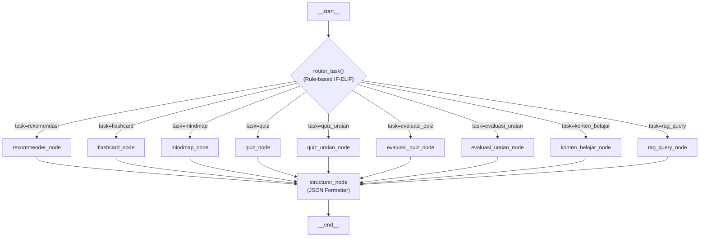

# 📊 Konten PPT Progress — Adaptive Agentic Quiz System (Tim 3)

---

## SLIDE 1: Cover

**Judul:** Adaptive Agentic Quiz System — Progress Report  
**Subtitle:** Tim 3 — Agentic AI untuk Pembelajaran Adaptif  
**Stack:** Python · LangGraph · FastAPI · Qdrant · LazarusNLP · HuggingFace LLM  

---

## SLIDE 2: Problem Statement

### Masalah
- Konten pembelajaran bersifat **statis** — semua siswa dapat soal yang sama tanpa mempertimbangkan tingkat pemahaman
- Evaluasi jawaban uraian masih dilakukan secara **manual** oleh guru
- Tidak ada rekomendasi belajar yang **personal** berdasarkan riwayat performa siswa

### Solusi
Sistem Agentic AI yang mampu:
1. **Generate** konten adaptif (quiz, flashcard, mindmap, materi) yang menyesuaikan tingkat kesulitan berdasarkan nilai siswa
2. **Evaluasi** jawaban siswa secara otomatis (PG deterministik, uraian via LLM)
3. **Rekomendasi** topik belajar berdasarkan analisis performa dan riwayat

---

## SLIDE 3: Arsitektur Sistem — Overview

### Desain Tingkat Tinggi

```
┌────────────────────────────────────────────────────────────────┐
│                      FastAPI (REST API Layer)                  │
│  POST /agent/quiz  ·  POST /agent/flashcard  ·  dst.          │
└──────────────────────────┬─────────────────────────────────────┘
                           │ JSON Request Body
                           ▼
┌────────────────────────────────────────────────────────────────┐
│                  LangGraph StateGraph (DAG)                    │
│                                                                │
│    START → [Router] ──→ [Node Spesialis] ──→ [Structurer] → END│
│              (if-elif)     (RAG + LLM)        (JSON formatter) │
└────────────────────────────────────────────────────────────────┘
                           │
                           ▼
                    JSON Response → Tim 6 Frontend / Tim 5 Chatbot
```

### Komponen Utama
| Komponen | Fungsi |
|---|---|
| **Router** | Rule-based dispatcher (Python if-elif, NO LLM) |
| **9 Node Spesialis** | Masing-masing punya tugas spesifik |
| **Structurer** | Muara akhir — format output jadi JSON standar |
| **Qdrant + LazarusNLP** | Knowledge base untuk RAG retrieval (pdf_rag_collection_v2) |
| **HuggingFace LLM** | Qwen2.5-7B untuk generasi konten |

---

## SLIDE 4: Justifikasi Arsitektur — Kenapa Routing Workflow?

### Arsitektur yang Dievaluasi

#### ❌ Opsi 1: ReAct Agent (Reasoning + Acting)
```
LLM Berpikir → Pilih Tool → Observasi → Berpikir lagi → Tool lagi → ... → Output
```
**Ditolak karena:**
- **Lambat:** Setiap iterasi = 1 LLM call. Generate 1 quiz bisa butuh 3-10x LLM call (unpredictable)
- **Tidak konsisten:** LLM bisa "lupa" menggunakan RAG, atau loop tanpa henti
- **Mahal:** Token usage sangat tinggi karena context menumpuk setiap iterasi
- **Overkill:** Task kita sudah jelas — "buat 5 soal quiz dari bab X". Tidak ada ambiguitas yang butuh LLM memutuskan flow

#### ❌ Opsi 2: Multi-Agent System
```
Agent Guru → Agent Penilai → Agent Recommender → ... (saling komunikasi)
```
**Ditolak karena:**
- **Stateless constraint:** Tim 6 butuh API stateless, multi-agent butuh koordinasi state kompleks
- **Latency:** Komunikasi antar-agent menambah overhead
- **Debugging susah:** Ketika agent A salah, efeknya menjalar ke agent B, C, D
- **Tidak perlu kolaborasi:** Setiap mekanik berdiri sendiri, tidak saling butuh output agent lain

#### ✅ Opsi 3: Task-Specialized Routing Workflow (Dipilih)
```
Request → Router → Node Spesialis → Structurer → Response
```
**Dipilih karena:**
- **Predictable:** Setiap request dijamin masuk ke 1 node → 1 output. Zero ambiguity
- **Cepat:** Hanya 1 LLM call per request (kecuali evaluasi uraian: 5 call untuk 5 soal)
- **Debuggable:** Bisa trace persis node mana yang error
- **Scalable:** Tambah mekanik baru = tambah 1 node + 1 edge. Tidak perlu ubah yang lain
- **Production-ready:** Stateless, cocok untuk integrasi REST API

---

## SLIDE 5: Klasifikasi AI Agent (Referensi IBM)

### Tipe Agent (IBM Classification)
| Tipe | Ciri | Di Sistem Kita |
|---|---|---|
| Simple Reflex | Stimulus → Response langsung | ✅ Router (if task == "quiz" → quiz_node) |
| Model-based | Punya internal state model | ✅ LangGraph AgentState |
| **Goal-based** | Merencanakan aksi untuk capai goal spesifik | **✅ Setiap node punya 1 goal** |
| Utility-based | Evaluasi *seberapa baik* goal tercapai | ➖ Belum |
| Learning | Belajar dari pengalaman | ➖ Belum |

### Arsitektur Agent
| Arsitektur | Ciri | Di Sistem Kita |
|---|---|---|
| Reactive | Pure stimulus-response, no planning | ✅ Router layer |
| Deliberative | Reasoning + planning sebelum act | ✅ Node spesialis (RAG → LLM) |
| **Hybrid** | Gabungan reactive + deliberative | **✅ Arsitektur keseluruhan** |

> **Kesimpulan:** Sistem kami = **Goal-based Agent** dengan **Hybrid Architecture** (Reactive router + Deliberative specialist nodes)

---

## SLIDE 6: Diagram Flow — 9 Mekanik



**Catatan:** Setiap request hanya melewati **2 node** — 1 spesialis + 1 structurer. Tidak ada loop, tidak ada iterasi.

---

## SLIDE 7: Mekanik 1 — Rekomendasi Belajar

### Tujuan
Memberikan rekomendasi 3 bab prioritas untuk dipelajari, berdasarkan data performa siswa

### Flow Detail
```
┌─────────────────────────────────────────┐
│ INPUT (JSON Request Body):              │
│ · student_id: "siswa-001"               │
│ · first_time: true/false                │
│ · hasil_pretest / riwayat_progress      │
│ · matpel_dipilih: ["Matematika", ...]   │
│ · emotion: {emosi: "gugup"}             │
└──────────────┬──────────────────────────┘
               ▼
┌─────────────────────────────────────────┐
│ recommender_node                        │
│                                         │
│ 1. Cek first_time?                      │
│    · TRUE  → pakai data hasil_pretest   │
│    · FALSE → _ambil_prioritas_belajar() │
│              (filter 5 bab terlemah)    │
│                                         │
│ 2. Bangun prompt + data                 │
│ 3. LLM Call → generate rekomendasi JSON │
│ 4. Parse tag <REKOMENDASI>              │
│                                         │
│ ❌ Tidak pakai RAG                       │
│ ✅ 1x LLM call                          │
└──────────────┬──────────────────────────┘
               ▼
┌─────────────────────────────────────────┐
│ structurer_node                         │
│ → util_format_recommender()             │
└──────────────┬──────────────────────────┘
               ▼
         JSON Response
```

### Contoh Output
```json
{
  "tipe": "rekomendasi_topik",
  "student_id": "siswa-001",
  "first_time": true,
  "rekomendasi": [
    {
      "urutan": 1,
      "matpel": "Fisika",
      "bab": "Hukum Newton",
      "alasan": "Skor pretest hanya 30 — paling lemah di semua mata pelajaran.",
      "saran_aksi": "Mulai pelajari Hukum Newton I tentang inersia."
    }
  ]
}
```

---

## SLIDE 8: Mekanik 2 — Flashcard (RAG + LLM Adaptif)

### Tujuan
Generate 5 pasang pertanyaan-jawaban bergaya NotebookLM, dengan kutipan sumber dari knowledge base

### Flow Detail
```
┌─────────────────────────────────────────┐
│ INPUT:                                  │
│ · matpel: "Fisika"                      │
│ · bab: "Hukum Newton"                   │
│ · nilai_siswa: 45 (opsional)            │
└──────────────┬──────────────────────────┘
               ▼
┌─────────────────────────────────────────┐
│ flashcard_node                          │
│                                         │
│ 1. _hitung_level_soal(45) → "Menengah"  │
│ 2. RAG: kb.search("Fisika Hukum Newton",│
│         k=8)                            │
│    → 8 dokumen relevan dari Qdrant      │
│ 3. Gabungkan konteks RAG + instruksi    │
│    level kesulitan ke dalam prompt      │
│ 4. LLM Call → generate 10-15 flashcard JSON │
│ 5. Parse tag <FLASHCARD>                │
│                                         │
│ ✅ RAG (k=8)                            │
│ ✅ 1x LLM call                          │
│ ✅ Adaptif berdasarkan nilai_siswa       │
└──────────────┬──────────────────────────┘
               ▼
         structurer → JSON Response
```

### Adaptivitas
| nilai_siswa | Level | Efek pada Flashcard |
|---|---|---|
| null / ≤40 | Dasar | Pertanyaan faktual langsung, jawaban ringkas |
| 41–70 | Menengah | Campuran pemahaman + penerapan |
| >70 | HOTS | Pertanyaan analisis, perlu reasoning |

### Contoh Output
```json
{
  "tipe": "flashcard_set",
  "matpel": "Fisika", "bab": "Hukum Newton",
  "jumlah_kartu": 12,
  "kartu": [
    {
      "front": "Mengapa penumpang mobil terdorong ke depan saat rem mendadak?",
      "back": "Karena sifat inersia (Hukum I Newton) — benda mempertahankan keadaan geraknya.",
      "kutipan_sumber": "Benda tetap diam atau bergerak lurus beraturan jika tidak ada gaya luar."
    }
  ]
}
```

---

## SLIDE 9: Mekanik 3 — Mindmap (RAG + LLM Adaptif Bahasa)

### Tujuan
Generate peta konsep hierarki yang komprehensif, dengan gaya bahasa adaptif

### Flow Detail
```
┌─────────────────────────────────────────┐
│ mindmap_node                            │
│                                         │
│ 1. Baca matpel, bab, nilai_siswa        │
│ 2. Tentukan gaya bahasa:                │
│    · ≤70 → Bahasa sederhana + analogi   │
│    · >70 → Bahasa teknis + istilah ilmiah│
│ 3. RAG: kb.search(query, k=10)          │
│ 4. LLM Call → mindmap hierarki JSON     │
│ 5. Parse tag <MINDMAP>                  │
│                                         │
│ ⚠️ Beda dari Flashcard/Quiz:            │
│  Konten SELALU komprehensif, yang        │
│  berubah hanya gaya bahasanya            │
└──────────────┬──────────────────────────┘
               ▼
         structurer → JSON Response
```

### Contoh Output (Struktur Hierarki)
```json
{
  "konsep_utama": "Hukum Newton",
  "deskripsi": "Tiga hukum dasar gerak benda",
  "children": [
    {
      "sub_konsep": "Hukum I (Inersia)",
      "penjelasan": "Benda mempertahankan keadaannya jika tidak ada gaya luar",
      "children": [
        {"sub_konsep": "Contoh: Penumpang Mobil", "penjelasan": "..."}
      ]
    },
    {
      "sub_konsep": "Hukum II (F=ma)",
      "penjelasan": "Percepatan berbanding lurus dengan gaya",
      "children": [...]
    }
  ]
}
```

---

## SLIDE 10: Mekanik 4a — Quiz Pilihan Ganda (RAG + LLM Adaptif)

### Tujuan
Generate 5 soal PG dengan tingkat kesulitan adaptif, dilengkapi pembahasan dan sumber

### Flow Detail
```
┌─────────────────────────────────────────┐
│ quiz_node                               │
│                                         │
│ 1. _hitung_level_soal(nilai_siswa)      │
│ 2. RAG: kb.search(query, k=5)           │
│ 3. Extract metadata → sumber_list       │
│ 4. LLM Call → 5 soal PG JSON            │
│ 5. Parse tag <QUIZ>                     │
│                                         │
│ Jumlah soal: FIXED 5 (tidak bisa diubah)│
└──────────────┬──────────────────────────┘
               ▼
┌─────────────────────────────────────────┐
│ structurer → util_format_quiz()         │
│ → Inject soal_id unik per soal          │
│   (Python UUID, bukan dari LLM)         │
│   Format: "pg-hukum_newton-a1b2"        │
└──────────────┬──────────────────────────┘
               ▼
         JSON Response
```

### Tabel Adaptivitas
| nilai_siswa | Level | Jenis Soal |
|---|---|---|
| null / ≤40 | **Dasar** | Faktual, hafalan, jawaban langsung dari teks |
| 41–70 | **Menengah** | 60% pemahaman + 40% aplikasi |
| >70 | **HOTS** | Analisis, evaluasi, sintesis — butuh penalaran |

---

## SLIDE 11: Mekanik 4b — Evaluasi Quiz PG (Deterministik, NO LLM)

### Tujuan
Evaluasi jawaban PG secara otomatis — cocokkan jawaban siswa dengan kunci jawaban

### Flow Detail
```
┌─────────────────────────────────────────┐
│ INPUT:                                  │
│ · soal_pg: [{soal_id, jawaban_benar}]   │
│ · jawaban_siswa: [{soal_id, jawaban}]   │
└──────────────┬──────────────────────────┘
               ▼
┌─────────────────────────────────────────┐
│ evaluasi_quiz_node                      │
│                                         │
│ 1. Bangun lookup: {soal_id → soal}      │
│ 2. Loop jawaban_siswa:                  │
│    · Bandingkan jawaban vs jawaban_benar │
│    · Hitung skor per soal               │
│                                         │
│ ❌ Tidak pakai RAG                       │
│ ❌ Tidak pakai LLM                       │
│ ✅ 100% Python deterministik             │
│ ⚡ Paling cepat dari semua route         │
└──────────────┬──────────────────────────┘
               ▼
         JSON Response
```

### Contoh Output
```json
{
  "tipe": "hasil_evaluasi_quiz",
  "total_benar": 3,
  "total_soal": 5,
  "total_skor": 30,
  "skor_maksimal": 50,
  "detail": [
    {"soal_id": "pg-hukum_newton-a1b2", "benar": true, "skor": 10},
    {"soal_id": "pg-hukum_newton-c3d4", "benar": false, "skor": 0, "pembahasan": "..."}
  ]
}
```

---

## SLIDE 12: Mekanik 4c — Quiz Uraian (RAG + LLM Adaptif)

### Tujuan
Generate 5 soal esai terbuka dengan kunci jawaban ideal dan skor maksimal

### Flow
Sama seperti Quiz PG, perbedaannya:
- Soal bersifat **terbuka** (uraian), bukan pilihan ganda
- Setiap soal memiliki `kunci_jawaban` (jawaban ideal lengkap) dan `skor_maksimal: 20`
- Tag output: `<QUIZ_URAIAN>`
- soal_id prefix: `"uraian-"`

### Contoh 1 Soal Output
```json
{
  "nomor": 1,
  "soal_id": "uraian-hukum_newton-e5f6",
  "pertanyaan": "Jelaskan hubungan antara Hukum I Newton dengan konsep inersia!",
  "kunci_jawaban": "Hukum I Newton menyatakan benda mempertahankan keadaannya...",
  "skor_maksimal": 20,
  "sumber": "Fisika — Hukum Newton"
}
```

---

## SLIDE 13: Mekanik 4d — Evaluasi Uraian (LLM + Python Overall)

### Tujuan
Evaluasi jawaban esai siswa — LLM menilai kemiripan + pemahaman + feedback per soal, Python menghitung assessment keseluruhan

### Flow Detail (Paling Kompleks)
```
┌─────────────────────────────────────────┐
│ INPUT:                                  │
│ · soal_uraian: [{soal_id, pertanyaan,   │
│                  kunci_jawaban,          │
│                  skor_maksimal}]         │
│ · jawaban_siswa: [{soal_id, jawaban}]   │
└──────────────┬──────────────────────────┘
               ▼
┌─────────────────────────────────────────┐
│ evaluasi_uraian_node                    │
│                                         │
│ LOOP per soal (5x LLM call):           │
│ ┌─────────────────────────────────────┐ │
│ │ Soal ke-1:                          │ │
│ │  Kirim: pertanyaan + kunci +        │ │
│ │         jawaban siswa → LLM         │ │
│ │  Terima: {skor: 16, feedback: "..."}│ │
│ ├─────────────────────────────────────┤ │
│ │ Soal ke-2: ...                      │ │
│ ├─────────────────────────────────────┤ │
│ │ ... sampai soal ke-5               │ │
│ └─────────────────────────────────────┘ │
│                                         │
│ OVERALL (Python deterministik):         │
│  persentase = total_skor / total_maks   │
│  _hitung_tingkat_pemahaman(persentase)  │
│  + identifikasi soal terlemah/terkuat   │
│                                         │
│ ❌ Tidak pakai RAG                       │
│ ✅ 5x LLM call (paling lambat)          │
│ ✅ Overall assessment via Python          │
└──────────────┬──────────────────────────┘
               ▼
         JSON Response
```

### Tingkat Pemahaman Overall
| Persentase | Label | Catatan |
|---|---|---|
| ≥ 86% | **Paham Mendalam** | Penguasaan konsep sangat baik |
| 71–85% | **Paham** | Memahami dengan baik, ada ruang pendalaman |
| 41–70% | **Paham Dasar** | Perlu latihan lebih pada bagian lemah |
| < 41% | **Belum Paham** | Perlu pengulangan materi menyeluruh |

### Contoh Output
```json
{
  "tipe": "hasil_evaluasi_uraian",
  "matpel": "Biologi", "bab": "Fotosintesis",
  "total_skor": 72, "skor_maksimal": 100,
  "tingkat_pemahaman": "Paham",
  "nomor_terlemah": 3,
  "nomor_terkuat": 1,
  "detail": [
    {
      "nomor": 1, "skor": 18, "skor_maksimal": 20,
      "feedback": "Jawaban lengkap dan akurat mencakup semua komponen fotosintesis."
    }
  ]
}
```

---

## SLIDE 14: Mekanik 5 — Konten Belajar (RAG + LLM Long)

### Tujuan
Generate materi pembelajaran panjang terstruktur (5 sub-bab) untuk satu bab

### Flow Detail
```
┌─────────────────────────────────────────┐
│ konten_belajar_node                     │
│                                         │
│ 1. RAG: kb.search(query, k=4)           │
│    → k=4 karena butuh konten panjang    │
│ 2. Extract metadata → sumber sitasi     │
│ 3. LLM Long Call (max_tokens=3000)      │
│    → 5 sub-bab terstruktur              │
│ 4. Parse tag <KONTEN>                   │
│                                         │
│ ✅ RAG (k=4)                            │
│ ✅ 1x LLM call (tokens lebih banyak)    │
└──────────────┬──────────────────────────┘
               ▼
         JSON Response
```

### Contoh Output
```json
{
  "tipe": "konten_belajar",
  "matpel": "Fisika", "bab": "Hukum Newton I dan Inersia",
  "judul_konten": "Mengenal Hukum Newton I: Dari Teori ke Kehidupan Nyata",
  "jumlah_sub_bab": 5,
  "konten": [
    {"sub_bab": "1. Pengantar", "isi": "Pernahkah kalian merasakan..."},
    {"sub_bab": "2. Konsep Utama", "isi": "Hukum Newton I menyatakan..."},
    {"sub_bab": "3. Detail dan Pendalaman", "isi": "..."},
    {"sub_bab": "4. Contoh di Kehidupan Nyata", "isi": "..."},
    {"sub_bab": "5. Poin Kunci & Rangkuman", "isi": "..."}
  ],
  "sumber": ["Fisika — Hukum Newton"]
}
```

---

## SLIDE 15: Mekanik 6 — RAG Query (Pure RAG, Zero LLM)

### Tujuan
Endpoint khusus Tim 5 (Chatbot) — kirim pertanyaan, terima raw chunks dari knowledge base. Chatbot yang merangkai jawaban.

### Flow Detail
```
┌─────────────────────────────────────────┐
│ rag_query_node                          │
│                                         │
│ 1. Baca query, matpel, bab, k           │
│ 2. RAG: kb.search(query, k=k)           │
│ 3. Ambil page_content + metadata        │
│ 4. Format jadi chunks array             │
│                                         │
│ ✅ RAG only                              │
│ ❌ Zero LLM call                         │
│ ⚡ Tercepat setelah evaluasi PG          │
└──────────────┬──────────────────────────┘
               ▼
         JSON Response
```

### Contoh Output
```json
{
  "tipe": "rag_konteks",
  "query": "apa itu inersia?",
  "jumlah_chunk": 3,
  "konteks": [
    {
      "urutan": 1,
      "isi": "Hukum I (Inersia): Benda tetap diam atau bergerak lurus...",
      "sumber": "Fisika — Hukum Newton",
      "relevansi_rank": 1
    }
  ],
  "petunjuk_untuk_chatbot": "Gunakan konteks di atas untuk menjawab pertanyaan siswa..."
}
```

---

## SLIDE 16: Ringkasan — RAG dan LLM per Route

| # | Mekanik | RAG | LLM | Deterministik | Adaptif |
|---|---|---|---|---|---|
| 1 | Rekomendasi | ❌ | ✅ 1x | - | Berdasarkan riwayat |
| 2 | Flashcard | ✅ k=8 | ✅ 1x | - | ✅ Level soal |
| 3 | Mindmap | ✅ k=10 | ✅ 1x | - | ✅ Gaya bahasa |
| 4a | Quiz PG | ✅ k=5 | ✅ 1x | - | ✅ Level soal |
| 4b | Evaluasi PG | ❌ | ❌ | ✅ | - |
| 4c | Quiz Uraian | ✅ k=5 | ✅ 1x | - | ✅ Level soal |
| 4d | Evaluasi Uraian | ❌ | ✅ 5x | Overall ✅ | - |
| 5 | Konten Belajar | ✅ k=4 | ✅ 1x | - | - |
| 6 | RAG Query | ✅ k=var | ❌ | ✅ | - |

---

## SLIDE 17: Desain API — REST Standar

### Prinsip Desain
- **Semua endpoint menggunakan JSON Request Body** (bukan query parameters)
- **Pydantic model** dengan contoh JSON di Swagger UI
- **Stateless** — setiap request independen, tidak simpan session
- **Parameter standar:** `matpel` (mata pelajaran) + `bab` (chapter) + `nilai_siswa` (opsional)

### Daftar Endpoint
| Method | Path | Kategori |
|---|---|---|
| POST | `/agent/run` | Universal (semua task) |
| POST | `/agent/flashcard` | Shortcut |
| POST | `/agent/mindmap` | Shortcut |
| POST | `/agent/quiz` | Shortcut |
| POST | `/agent/quiz_uraian` | Shortcut |
| POST | `/agent/evaluasi_quiz` | Evaluasi |
| POST | `/agent/evaluasi_uraian` | Evaluasi |
| POST | `/agent/konten_belajar` | Shortcut |
| POST | `/agent/rag_query` | Shortcut (Tim 5) |
| POST | `/agent/rekomendasi` | Shortcut |

### Integrasi
- **Tim 5 (Chatbot):** Konsumsi `/agent/rag_query` untuk Q&A real-time
- **Tim 6 (Database/Frontend):** Kirim `matpel` + `bab` + `nilai_siswa` → dapat konten terformat

---

## SLIDE 18: Status Progress & Next Steps

### ✅ Selesai (Fitur yang Working)
- [x] 9 mekanik utama — generate, evaluasi, rekomendasi
- [x] Arsitektur routing DAG dengan LangGraph StateGraph
- [x] REST API (FastAPI) dengan 10+ endpoint
- [x] Adaptive difficulty berdasarkan `nilai_siswa`
- [x] RAG pipeline tersambung ke Qdrant (LazarusNLP/all-indo-e5-small-v4)
- [x] Unifikasi Dashboard UI (Mindmap, Flashcard, Quiz digabung)
- [x] Swagger UI dengan contoh JSON per endpoint
- [x] Evaluasi PG deterministik (zero LLM cost)
- [x] Evaluasi uraian per soal (LLM) + overall assessment (Python)

### 🔄 In Progress
- [ ] Knowledge base menggunakan data dummy — perlu integrasi data real dari Tim 6
- [ ] Parameter `emotion` sudah diterima di setiap endpoint tapi belum diproses oleh node spesialis (reserved untuk Tim 5)

### ⏳ Next Steps
- [ ] Integrasi dengan database kurikulum Tim 6
- [ ] Integrasi chatbot Tim 5 via endpoint RAG Query
- [ ] Testing end-to-end dengan data siswa real
- [ ] Fine-tuning prompt jika kualitas HOTS dirasa kurang menantang
- [ ] Deployment ke server production
